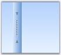

# SplitContainerAdv

The below image illustrates the components of a SplitContainerAdv control. It has two panels separated by a splitter, which has arrows and a grip for the splitter.

  

A sample which demonstrates the SplitContainerAdv control is available in the below sample installation location.

..\My Documents\Syncfusion\EssentialStudio\Version Number\Windows\Tools.Windows\Samples\2.0\Editors Package\Container controls\SplitContainerAdv

## Panel Settings

This section discusses about various properties available for the SplitContainerAdv to control the behavior of the panels. The panels has properties and events similar to Window's Panel control, to change its appearance.

### Panel Orientation

The SplitContainerAdv Panels can be oriented horizontally or vertically using the Orientation property. Default value is horizontal.



this.splitContainerAdv1.Orientation = System.Windows.Forms.Orientation.Vertical;




Me.splitContainerAdv1.Orientation = System.Windows.Forms.Orientation.Vertical


  

### Resizing the Panels

While resizing the control at design time or at run time, we can make one panel as fixed and resize the other panel alone. Select the panel which needs to be fixed, in FixedPanel property. 



this.SplitContainerAdv1.FixedPanel = Syncfusion.Windows.Forms.Tools.Enums.FixedPanel.Panel1




Me.SplitContainerAdv1.FixedPanel = Syncfusion.Windows.Forms.Tools.Enums.FixedPanel.Panel1


### Collapsing a Panel

We can make any of the panels to be collapsed at run time. The below properties helps you to do that.

Table 243: Property Table

<table>
<tr>
<th>
SplitContainerAdv Properties</th><th>
Description</th></tr>
<tr>
<td>
Panel1</td><td>
Gives properties of the panel1 which represents the first panel to the left of the Splitter.</td></tr>
<tr>
<td>
Panel1Collapsed</td><td>
Indicates if the Panel1 is collapsed or not.</td></tr>
<tr>
<td>
Panel2</td><td>
Gives properties of the panel2 which represents the last or the second panel to the right of the Splitter.</td></tr>
<tr>
<td>
Panel2Collapsed</td><td>
Indicates if the Panel2 is collapsed or not.</td></tr>
<tr>
<td>
PanelToBeCollapsed</td><td>
Sets the panel to be collapsed when a predefined event occurs on it.</td></tr>
<tr>
<td>
TogglePanelOn</td><td>
A predefined event, which leads to collapsing of the panel specified in PanelToBeCollapsed property. Using TogglePanelOn property, we can decide whether, the panel needs to be collapsed on a single click or a double click.</td></tr>
</table>



this.splitContainerAdv1.Panel1Collapsed = true;

this.splitContainerAdv1.Panel2Collapsed = false;

this.splitContainerAdv1.PanelToBeCollapsed = Syncfusion.Windows.Forms.Tools.CollapsedPanel.Panel1;

this.splitContainerAdv1.TogglePanelOn = Syncfusion.Windows.Forms.Tools.TogglePanelOn.DoubleClick;





Me.SplitContainerAdv1.Panel1Collapsed = True

Me.SplitContainerAdv1.Panel2Collapsed = False

Me.splitContainerAdv1.PanelToBeCollapsed = Syncfusion.Windows.Forms.Tools.CollapsedPanel.Panel1

Me.splitContainerAdv1.TogglePanelOn = Syncfusion.Windows.Forms.Tools.TogglePanelOn.DoubleClick


### Panel Size 

We can specify the minimum size for the Panel1 and Panel2 in Panel1MinSize and Panel2MinSize properties. Default value for both the properties is 25.



this.splitContainerAdv1.Panel1MinSize = 50;

this.splitContainerAdv1.Panel2MinSize = 50;





Me.splitContainerAdv1.Panel1MinSize = 50

Me.splitContainerAdv1.Panel2MinSize = 50


## Splitter Settings

The properties which changes the behavior of the Splitter in a SplitContainerAdv control are discussed in this section.

### Splitter Settings

The below table describes the properties to control the behavior of the splitter. 

Table 244: Property Table

<table>
<tr>
<th>
SplitContainerAdv Properties</th><th>
Description</th></tr>
<tr>
<td>
IsSplitterFixed</td><td>
Gets / sets whether the user is allowed to move the splitter or not. Default value is false.</td></tr>
<tr>
<td>
SplitterDistance</td><td>
Indicates the distance from the left top border.</td></tr>
<tr>
<td>
SplitterIncrement</td><td>
Determines the number of pixels the splitter moves in each increment.</td></tr>
<tr>
<td>
SplitterWidth</td><td>
Indicates the width of the splitter.</td></tr>
</table>



this.SplitContainerAdv1.IsSplitterFixed = true;

this.splitContainerAdv1.SplitterDistance = 25

this.splitContainerAdv1.SplitterIncrement = 5

this.splitContainerAdv1.SplitterWidth = 20




Me.SplitContainerAdv1.IsSplitterFixed = True

Me.splitContainerAdv1.SplitterDistance = 25

Me.splitContainerAdv1.SplitterIncrement = 5

Me.splitContainerAdv1.SplitterWidth = 20



  
 
 
### Thumbnail Arrow and Grip Settings

SplitContainerAdv control supports various appearance settings for the ThumbnailArrow in the control which are discussed in detail below. The properties which control the appearance of the splitter components are as follows.

Table 245: Property Table

<table>
<tr>
<th>
SplitContainerAdv Properties</th><th>
Description</th></tr>
<tr>
<td>
ExpandFill</td><td>
Sets the color for the arrows.</td></tr>
<tr>
<td>
ExpandLine</td><td>
Sets the outline color for the arrows.</td></tr>
<tr>
<td>
GripDark</td><td>
Sets color for the grip.</td></tr>
<tr>
<td>
GridLight</td><td>
Sets the shadow around the grip.</td></tr>
</table>



this.splitContainerAdv2.ExpandFill = new Syncfusion.Drawing.BrushInfo(System.Drawing.Color.AliceBlue);

this.splitContainerAdv2.ExpandLine = System.Drawing.Color.Red;

this.splitContainerAdv2.GripDark = new Syncfusion.Drawing.BrushInfo(System.Drawing.Color.Wheat);

this.splitContainerAdv2.GripLight = new Syncfusion.Drawing.BrushInfo(System.Drawing.Color.Crimson);




Me.splitContainerAdv2.ExpandFill = New Syncfusion.Drawing.BrushInfo(System.Drawing.Color.AliceBlue)

Me.splitContainerAdv2.ExpandLine = System.Drawing.Color.Red

Me.splitContainerAdv2.GripDark = New Syncfusion.Drawing.BrushInfo(System.Drawing.Color.Wheat)

Me.splitContainerAdv2.GripLight = New Syncfusion.Drawing.BrushInfo(System.Drawing.Color.Crimson)


 

#### RunTime Appearance

The properties to control the appearance of the thumbnail arrows, and grip, while mouse hovering at runtime, are as follows.

Table 246: Property Table

<table>
<tr>
<th>
SplitContainerAdv Properties</th><th>
Description</th></tr>
<tr>
<td>
HotBackgroundColor</td><td>
Sets the background color of the Thumbnail while under mouse cursor.</td></tr>
<tr>
<td>
HotExpandFill</td><td>
Sets the color for the arrows while under mouse cursor.</td></tr>
<tr>
<td>
HotExpandLine</td><td>
Sets the outline color for the arrows while under mouse cursor.</td></tr>
<tr>
<td>
HotGripDark</td><td>
Sets color for the grip while under mouse cursor.</td></tr>
<tr>
<td>
HotGridLight</td><td>
Sets the shadow around the grip while under mouse cursor.</td></tr>
</table>



this.splitContainerAdv2.HotBackgroundColor = new Syncfusion.Drawing.BrushInfo(Syncfusion.Drawing.GradientStyle.Horizontal, System.Drawing.Color.SandyBrown, System.Drawing.Color.AntiqueWhite);

this.splitContainerAdv2.HotExpandFill = new Syncfusion.Drawing.BrushInfo(System.Drawing.Color.Red);

this.splitContainerAdv2.HotExpandLine = System.Drawing.Color.DeepPink;

this.splitContainerAdv2.HotGripDark = new Syncfusion.Drawing.BrushInfo(System.Drawing.Color.MistyRose);

this.splitContainerAdv2.HotGripLight = new Syncfusion.Drawing.BrushInfo(System.Drawing.Color.Purple);





Me.splitContainerAdv2.HotBackgroundColor = New Syncfusion.Drawing.BrushInfo(Syncfusion.Drawing.GradientStyle.Horizontal, System.Drawing.Color.SandyBrown, System.Drawing.Color.AntiqueWhite) 

Me.splitContainerAdv2.HotExpandFill = New Syncfusion.Drawing.BrushInfo(System.Drawing.Color.Red) 

Me.splitContainerAdv2.HotExpandLine = System.Drawing.Color.DeepPink 

Me.splitContainerAdv2.HotGripDark = New Syncfusion.Drawing.BrushInfo(System.Drawing.Color.MistyRose) 

Me.splitContainerAdv2.HotGripLight = New Syncfusion.Drawing.BrushInfo(System.Drawing.Color.Purple)


 

## Appearance Settings

This section discusses the properties which controls the appearance of the SplitContainerAdv control.

### Background Settings

The below table describes the background settings.

Table 247: Property Table

<table>
<tr>
<th>
SplitContainerAdv Properties</th><th>
Description</th></tr>
<tr>
<td>
BackgroundImage</td><td>
Sets the background image for the control.</td></tr>
<tr>
<td>
BackgroundImageLayout</td><td>
Specifies the background image layout.</td></tr>
<tr>
<td>
BackColor</td><td>
Sets the background color for the control.</td></tr>
<tr>
<td>
BackgroundColor</td><td>
Sets the solid, gradient or pattern style background for the control. </td></tr>
</table>

> Note: The above properties can be overridden by SplitContainerAdv.Panel properties.



this.splitContainerAdv1.BackColor = System.Drawing.Color.LightSteelBlue;

this.splitContainerAdv1.Panel1.BackgroundColor = new Syncfusion.Drawing.BrushInfo(Syncfusion.Drawing.GradientStyle.BackwardDiagonal, System.Drawing.Color.AliceBlue, System.Drawing.Color.LightSteelBlue);

this.splitContainerAdv1.Panel2.BackColor = System.Drawing.Color.AliceBlue;





Me.splitContainerAdv1.BackColor = System.Drawing.Color.LightSteelBlue 

Me.splitContainerAdv1.Panel1.BackgroundColor = New Syncfusion.Drawing.BrushInfo(Syncfusion.Drawing.GradientStyle.BackwardDiagonal, System.Drawing.Color.AliceBlue, System.Drawing.Color.LightSteelBlue) 

Me.splitContainerAdv1.Panel2.BackColor = System.Drawing.Color.AliceBlue


### Foreground Settings

The below table describes the foreground settings.

Table 248: Property Table

<table>
<tr>
<th>
SplitContainerAdv Properties</th><th>
Description</th></tr>
<tr>
<td>
Font</td><td>
Sets the font style for the display text in the control.</td></tr>
<tr>
<td>
ForeColor</td><td>
Sets the color for the display text in the control.</td></tr>
</table>



this.splitContainerAdv1.Panel2.Font = new System.Drawing.Font("Arial", 8.25F, System.Drawing.FontStyle.Bold);

this.splitContainerAdv1.Panel1.ForeColor = System.Drawing.Color.Black;





Me.splitContainerAdv1.Panel2.Font = New System.Drawing.Font("Arial", 8.25F, System.Drawing.FontStyle.Bold) 

Me.splitContainerAdv1.Panel1.ForeColor = System.Drawing.Color.Black



  

## Border Settings

BorderStyle property sets 2D or 3D border for the SplitContainerAdv control. The options are FixedSingle or Fixed3D.



this.splitContainerAdv1.BorderStyle = System.Windows.Forms.BorderStyle.FixedSingle;





Me.splitContainerAdv1.BorderStyle = System.Windows.Forms.BorderStyle.FixedSingle


## Styles

Visual Styles for the SplitContainerAdv control is set through Style property. The available styles are, 

* Office2007Black,
* Office2007Blue, 
* Office2007Silver, 
* OfficeXP, 
* Office2003,
* VS2005, 
* Mozilla and 
* Default.
* Metro



//Sets Office2007 Black color scheme for the control.

this.splitContainerAdv1.Style = Syncfusion.Windows.Forms.Tools.Style.Office2007Black;





'Sets Office2007 Black color scheme for the control.

Me.splitContainerAdv1.Style = Syncfusion.Windows.Forms.Tools.Style.Office2007Black



  

> See Also
> [Thumbnail Arrow Settings](/windowsforms/Tools/EditorsPackage/SplitContainerAdv/Thumbnail-Arrow-and-Grip-Settings)

