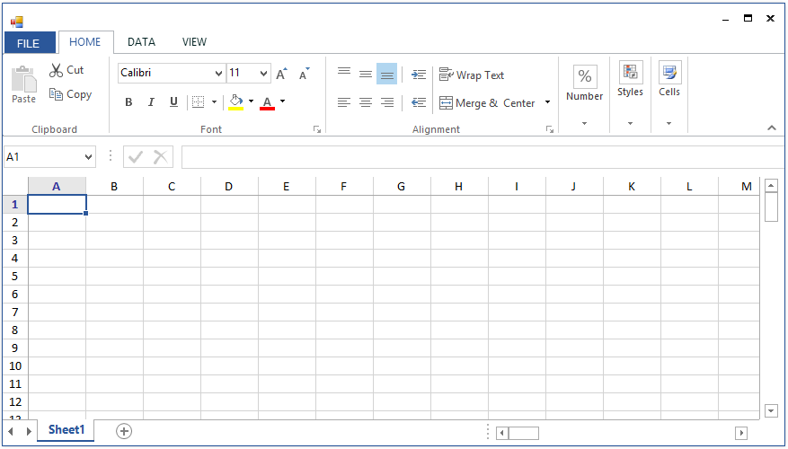

----
layout: post
title: Getting Started with Spreadsheet
description: How to create, open and save the workbook in Spreadsheet
platform: windowsforms
control: Spreadsheet
documentation: ug
---

# Getting Started

This section helps you to get started with the Spreadsheet

## Assemblies Deployment

Below table describes, list of assemblies required to be added in project when the Spreadsheet control is used in your application.

<table>
<tr>
<th>
Assembly</th><th>
Description</th></tr>
<tr>
<td>
Syncfusion.Spreadsheet.Windows.dll</td><td>
Contains the classes  that handles all the UI Operations of Spreadsheet such as importing of sheets, applying formulas/styles etc.</td></tr>
<tr>
<td>
Syncfusion.Shared.Base.dll</td><td>
Contains the classes which holds the controls like TabBarPage, TabBarSplitterControl etc.</td></tr>
<tr>
<td>
Syncfusion.Tools.Windows.dll</td><td>
Contains the classes which holds the controls like ToolStripPanelItem,MaskedEditBox,ToolStripGallery,BackStageButton  etc which are used in Spreadsheet.</td></tr>
<tr>
<td>
Syncfusion.XlsIO.Base.dll</td><td>
Contains the base classes which is responsible for read and write in Excel files, Worksheet Manipulations, Formula calculations etc.</td></tr>
</table>
Below are the assemblies list that can be added when you want to enable certain features in Spreadsheet control. 

<table>
<tr>
<th>
Optional Assemblies</th><th>
Description</th></tr>
<tr>
<td>
Syncfusion.SpreadsheetHelper.Windows.dll</td><td>
Contains the classes which is responsible for importing charts and sparklines into Spreadsheet</td></tr>
<tr>
<td>
Syncfusion.ExcelChartToImageConverter.WPF.dll</td><td>
Contains the classes which is responsible for converting charts as image</td></tr>
<tr>
<td>
Syncfusion.Chart.Base.dll</td><td>
Contains the base classes which is responsible for importing charts like Line charts, Pie charts, Sparklines etc.</td></tr>
<tr>
<td>
Syncfusion.Chart.Windows.dll</td><td>
Contains the classes which is responsible for creating charts that holds axes, series, legends etc.</td></tr>
<tr>
<td>
Syncfusion.ExcelToPDFConverter.Base.dll</td><td>
Contains the base and fundamental classes which is responsible for converting excel to PDF.</td></tr>
<tr>
<td>
Syncfusion.Pdf.Base.dll</td><td>
Contains the base and fundamental classes for creating PDF.</td></tr>
</table>

## Create a Simple Application with Spreadsheet

Spreadsheet control can be added into the application either via designer or via coding. 

### Adding a Control via Designer

1.Create new Windows Forms application in Visual Studio.

2.Open the Visual Studio **Tool** **box**. Navigate to Syncfusion Controls tab, and find the  Spreadsheet/SpreadsheetRibbon toolbox items 

3.Drag **Spreadsheet** and drop in the Designer area from the Toolbox

4.Ribbon can be added to the application by dragging **SpreadsheetRibbon** to the Designer area.

5.To make an interaction between Ribbon items and Spreadsheet, bind the Spreadsheet as DataContext to the SpreadsheetRibbon.

### Adding Control via Coding

Spreadsheet is available in the following namespace Syncfusion.Windows.Forms.Spreadsheet and it can be created programmatically by using below code. 

_For_ _Spreadsheet_





private Spreadsheet spreadsheet;

spreadsheet = new Spreadsheet();
            
SpreadsheetRibbon ribbon = new SpreadsheetRibbon() { Spreadsheet = spreadsheet };

spreadsheet.Dock = DockStyle.Fill;

spreadsheet.Anchor = AnchorStyles.Left | AnchorStyles.Top;
          
this.Controls.Add(spreadsheet);
            
this.Controls.Add(ribbon);





_You_ _can_ _get_ _the_ _following_ _output_ _when_ _execute_ _the_ _application_.

## Creating a new Excel Workbook

A new workbook can be created by using a `Create` method of Spreadsheet. By default, a workbook will be created with single worksheet but a new workbook can also be created with specified number of worksheets.




    spreadsheet.Create(2);




## Opening the Existing Excel Workbook

The Excel Workbook can be opened in Spreadsheet using the `Open` method in various ways,




//Using Stream,

 spreadsheet.Open (Stream file);

//Using String,

 spreadsheet.Open (string file);

//Using Workbook,

 spreadsheet.Open(IWorkbook workbook);
      






    spreadsheet.Open (@"..\..\Data\Outline.xlsx");




Opening Excel File in Spreadsheet
   {:.caption}

## Saving the Excel Workbook

The Excel workbook can be saved in Spreadsheet using `Save` method. If the workbook already exists in the system drive, it will be saved in the same location, otherwise Save Dialog box opens to save the workbook in user specified location. 




    spreadsheet.Save();




You can also use `SaveAs` method directly to save the existing excel file with modifications.

The SaveAs method in Spreadsheet can be used in various ways,




//Using Stream,

 spreadsheet.SaveAs (Stream file);

//Using String,

 spreadsheet.SaveAs (string file);

//For Dialog box,

 spreadsheet.SaveAs();
      


