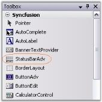
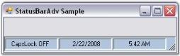
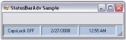

# Getting Started with Windows Forms Status Bar (StatusBarAdv)

* [Assembly deployment](#assembly-deployment)
* [Through designer](#through-designer)
* [Through code](#through-code)

This section explains the step-by-step procedure to create the StatusBarAdv control through the designer and programmatically.

## Assembly deployment

Refer to the [control dependencies](https://help.syncfusion.com/windowsforms/control-dependencies#statusbar) section to get the list of assemblies or NuGet packages that need to be added as references to use the control in any application.

You can find more details about installing the NuGet packages in a Windows Forms application at the following link:

[How to install NuGet packages](https://help.syncfusion.com/windowsforms/installation/install-nuget-packages)

To install via the NuGet Package Manager Console, run:

```powershell
Install-Package Syncfusion.Tools.Windows
```

## Through designer

The StatusBarAdv control provides full support for the Windows Forms designer. Dragging the control from the toolbox onto the form automatically adds the following required assembly references to the project:

* Syncfusion.Grid.Base.dll
* Syncfusion.Grid.Windows.dll
* Syncfusion.Shared.Base.dll
* Syncfusion.Shared.Windows.dll
* Syncfusion.Tools.Base.dll
* Syncfusion.Tools.Windows.dll

To create the StatusBarAdv control through the designer,

1. Drag and drop the StatusBarAdv control from the toolbox onto the form.

    

2. Set the desired background for the StatusBarAdv control using the background-related properties in the properties window.
3. Drag and drop the StatusBarAdvPanel control onto the StatusBarAdv control. Set the PanelType property to the desired value for each StatusBarAdvPanel.
4. Build and run the application.

    
   
N> In .NET (Core), the StatusBarAdv control’s Collection Editor displays the title “ControlProxy`1 CollectionEditor” instead of “StatusBarAdvPanel CollectionEditor.”
This is a known issue and does not affect functionality.
For more details, see GitHub Issue [#14049](https://github.com/dotnet/winforms/issues/14049)
   
## Through code

To create the StatusBarAdv control programmatically,

1. Create a new Visual C# or Visual Basic .NET application in Visual Studio.
2. Add the following required assembly references to the project:

   * Syncfusion.Grid.Base.dll
   * Syncfusion.Grid.Windows.dll
   * Syncfusion.Shared.Base.dll
   * Syncfusion.Shared.Windows.dll
   * Syncfusion.Tools.Base.dll
   * Syncfusion.Tools.Windows.dll

   Refer to the [Assembly deployment](#assembly-deployment) section for details.
   
3. Add the namespace shown below to your form.





using Syncfusion.Windows.Forms.Tools;




Imports Syncfusion.Windows.Forms.Tools




{{ codesnippet1 | OrderList_Indent_Level_1 }}

4. Declare the StatusBarAdv and StatusBarAdvPanel.

​



private StatusBarAdv statusBarAdv1;
private StatusBarAdvPanel statusBarAdvPanel1;
private StatusBarAdvPanel statusBarAdvPanel2;
private StatusBarAdvPanel statusBarAdvPanel3;





Private statusBarAdv1 As StatusBarAdv
Private statusBarAdvPanel1 As StatusBarAdvPanel
Private statusBarAdvPanel2 As StatusBarAdvPanel
Private statusBarAdvPanel3 As StatusBarAdvPanel




{{ codesnippet2 | OrderList_Indent_Level_1 }}

5. Initialize the controls.





this.statusBarAdv1 = new StatusBarAdv();
this.statusBarAdvPanel1 = new StatusBarAdvPanel();
this.statusBarAdvPanel2 = new StatusBarAdvPanel();
this.statusBarAdvPanel3 = new StatusBarAdvPanel();





Me.statusBarAdv1 = New StatusBarAdv() 
Me.statusBarAdvPanel1 = New StatusBarAdvPanel() 
Me.statusBarAdvPanel2 = New StatusBarAdvPanel() 
Me.statusBarAdvPanel3 = New StatusBarAdvPanel() 




{{ codesnippet3 | OrderList_Indent_Level_1 }}

6. Customize the control's appearance by setting its properties, and add it to the form.





this.statusBarAdv1.BackColor = System.Drawing.Color.LightSteelBlue;
this.statusBarAdv1.BorderColor = System.Drawing.Color.Black;
this.statusBarAdv1.Dock = System.Windows.Forms.DockStyle.Bottom;
this.statusBarAdv1.Name = "statusBarAdv1";

this.statusBarAdv1.Controls.Add(this.statusBarAdvPanel1);
this.statusBarAdv1.Controls.Add(this.statusBarAdvPanel2);
this.statusBarAdv1.Controls.Add(this.statusBarAdvPanel3);

this.statusBarAdvPanel1.PanelType = StatusBarAdvPanelType.CurrentCulture;
this.statusBarAdvPanel2.PanelType = StatusBarAdvPanelType.ShortDate;
this.statusBarAdvPanel3.PanelType = StatusBarAdvPanelType.ShortTime;

this.statusBarAdvPanel1.Size = new System.Drawing.Size(100, 27);
this.statusBarAdvPanel2.Size = new System.Drawing.Size(100, 27);
this.statusBarAdvPanel3.Size = new System.Drawing.Size(100, 27);
this.Controls.Add(this.statusBarAdv1);




   
Me.statusBarAdv1.BackColor = System.Drawing.Color.LightSteelBlue
Me.statusBarAdv1.BorderColor = System.Drawing.Color.Black
Me.statusBarAdv1.Dock = System.Windows.Forms.DockStyle.Bottom
Me.statusBarAdv1.Name = "statusBarAdv1"

Me.statusBarAdv1.Controls.Add(Me.statusBarAdvPanel1)
Me.statusBarAdv1.Controls.Add(Me.statusBarAdvPanel2)
Me.statusBarAdv1.Controls.Add(Me.statusBarAdvPanel3)

Me.statusBarAdvPanel1.PanelType = StatusBarAdvPanelType.CurrentCulture
Me.statusBarAdvPanel2.PanelType = StatusBarAdvPanelType.ShortDate
Me.statusBarAdvPanel3.PanelType = StatusBarAdvPanelType.ShortTime

Me.statusBarAdvPanel1.Size = New System.Drawing.Size(100, 27)
Me.statusBarAdvPanel2.Size = New System.Drawing.Size(100, 27)
Me.statusBarAdvPanel3.Size = New System.Drawing.Size(100, 27)
Me.Controls.Add(Me.statusBarAdv1)




{{ codesnippet4 | OrderList_Indent_Level_1 }}  

7. Run the application. The StatusBarAdv control is docked to the bottom of the form by default.

    