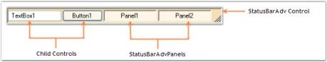

# Windows Forms Status Bar (StatusBarAdv) Overview

The various sections of StatusBarAdv and their descriptions are given below.

 

## StatusBarAdv control

This represents the advanced StatusBar with different border and background styles.

## StatusBarAdvPanels

This includes the StatusBarAdvPanel controls that are added onto the StatusBarAdv Control.

The StatusBarAdvPanel is a panel derived class that can display status bar information such as the time or key state with several appearance enhancements. It can be displayed either within a StatusBarAdv control or on a form.

## Child controls

This includes other user interface controls that are added onto the StatusBarAdv Control.

