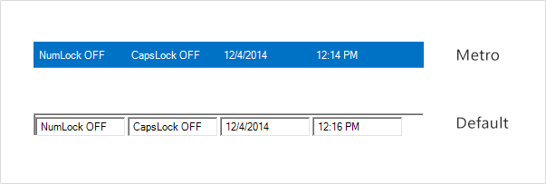

# Style in Windows Forms Status Bar

Status Bar supports visual styles such as Default, Metro. The style can be set using Style property. 

* Default
* Metro

The following code example allows you to set the style for the Status Bar.




this.statusBarAdv1.Style = Syncfusion.Windows.Forms.Tools.StatusbarStyle.Metro;





Me.statusBarAdv1.Style = Syncfusion.Windows.Forms.Tools.StatusbarStyle.Metro




 
