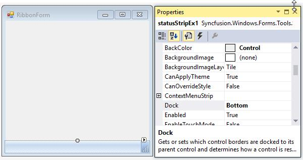
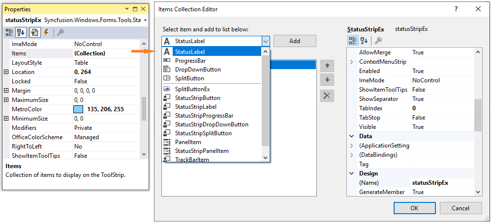
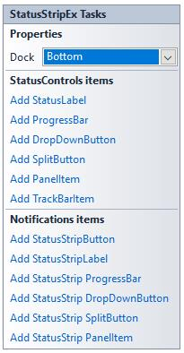

# StatusStripEx in Windows Forms StatusStrip (StatusStripEx)

Essential Tools has come up with StatusStripEx control which can be added to the bottom of the Ribbon. It can hold controls like TrackBarEx, ProgressBar, StatusStripButtons, and so on.

## Creating a StatusStripEx

### Through designer

The StatusStripEx can be added to the form by dragging a StatusStripEx control from the Toolbox. It can be docked to the bottom of the RibbonControlAdv. 

Dock the StatusStripEx control to the bottom using Dock property.

### Adding items to the StatusStripEx

Access the Items property of the control, to open the Items Collection Editor. Use this editor to add customized StatusControl items. The Editor will let you modify the look and feel of the items using the properties provided on it right side.

 

N> A shortcut to add the ToolStripStatus Items is through Tasks Window. See Smart Tag options to know more.

### Through code

StatusStripEx can be created programmatically using the code below. This code snippet adds a ToolStripStatus Label to the StatusStripEx control.




using Syncfusion.Windows.Forms.Tools;

//Declaring the StatusStripEx and ToolStripStatusLabel
private Syncfusion.Windows.Forms.Tools.StatusStripEx statusStripEx1;
private System.Windows.Forms.ToolStripStatusLabel toolStripStatusLabel1;

//Initializing the StatusStripEx and ToolStripStatusLabel
this.statusStripEx1 = new Syncfusion.Windows.Forms.Tools.StatusStripEx();
this.toolStripStatusLabel1 = new System.Windows.Forms.ToolStripStatusLabel();

//Adding ToolStripStatusLabel to StatusStripEx
this.statusStripEx1.Items.AddRange(new System.Windows.Forms.ToolStripItem[] {
this.toolStripStatusLabel1});
this.Controls.Add(this.statusStripEx1);

//Docking the StatusStripEx to Bottom
this.statusStripEx1.Dock = Syncfusion.Windows.Forms.Tools.DockStyleEx.Bottom;





Imports Syncfusion.Windows.Forms.Tools

'Declaring the StatusStripEx and ToolStripStatusLabel 
Private statusStripEx1 As Syncfusion.Windows.Forms.Tools.StatusStripEx
Private toolStripStatusLabel1 As System.Windows.Forms.ToolStripStatusLabel

'Initializing the StatusStripEx and ToolStripStatusLabel 
Me.statusStripEx1 = New Syncfusion.Windows.Forms.Tools.StatusStripEx() 
Me.toolStripStatusLabel1 = New System.Windows.Forms.ToolStripStatusLabel() 

'Adding ToolStripStatusLabel to StatusStripEx 
Me.statusStripEx1.Items.AddRange(New System.Windows.Forms.ToolStripItem() {Me.toolStripStatusLabel1}) 
Me.Controls.Add(Me.statusStripEx1)

'Docking the StatusStripEx to Bottom'
Me.statusStripEx1.Dock = Syncfusion.Windows.Forms.Tools.DockStyleEx.Bottom




## StatusStripEx Items

The `StatusStripEx` control has two types of items.

* StatusControl items

* Notification items

### StatusControl items

The StatusControl items is placed to right side of the StatusStripEX when added. The StatusControl items are listed below,
	
* StatusLabel
* ProgressBar
* DropDownButton
* SplitButton

### Notification items 

The Notification items is placed to left side of the StatusStripEx when added. The Notification items are listed below,

* StatusStripLabel
* StatusStripProgressBar
* StatusStripDropDownButton
* StatusStripSplitButton

N> StatusControl items and Notification items are same type of items. For example, If you select StatusStripLabel, it will be added to the left side of StatusStripEx. Similarly, if you select StatusLabel, it will be added to the right side of StatusStripEx.

## Smart tag options

Clicking the Smart Tag of the StatusStripEx, displays the below Tasks window. This window lets you add ToolStripStatus Items.

The options are,

* Dock - Provides docking options for StatusStripEx control.

### StatusControl items

<table>
<th>Methods</th>
<th>Description</th>
<tr><td>Add StatusLabel</td><td>Represents that adds a status label item.</td></tr>
<tr><td>Add ProgressBar</td><td>Represents that adds a ProgressBar item.</td></tr>
<tr><td>Add DropDownButton</td><td>Represents that adds a dropdown button item.</td></tr>
<tr><td>Add SplitButton</td><td>Represents that adds a split button item.</td></tr>
<tr><td>Add PanelItem</td><td>Represents that adds a Panel item.</td></tr>
<tr><td>Add TrackBarItem</td><td>Represents that adds a TrackBar item.</td></tr>
</table>

### Notifications items

<table>
<th>Methods</th>
<th>Description</th>
<tr><td>Add StatusStripButton</td><td>Represents that adds a Button item.</td></tr>
<tr><td>Add StatusStripLabel</td><td>Represents that adds status strip label item.</td></tr>
<tr><td>Add StatusStrip ProgressBar</td><td>Represents that adds progressbar to the status bar</td></tr>
<tr><td>Add StatusStrip DropDownButton</td><td>Represents that adds dropdown button to the status bar.</td></tr>
<tr><td>Add StatusStrip SplitButton</td><td>Represents that adds split button to the status bar.</td></tr>
<tr><td>Add StatusStrip PanelItem</td><td>Represents that adds panel item to the status bar.</td></tr>
</table>

## SizingGrip settings

The StatusStripEx control has a sizing grip at its bottom right corner. This sizing grip can be shown or hidden using SizingGrip property. The below properties controls the appearance of the sizing grip.

<table>
<tr>
<th>
Property</th><th>
Description</th></tr>
<tr>
<td>
GripStyle</td><td>
Specifies the style of the sizing grip.</td></tr>
<tr>
<td>
GripMargin</td><td>
Gets or sets the margin for the sizing grip.</td></tr>
</table>




this.statusStripEx1.SizingGrip = true;
this.statusStripEx1.GripStyle = ToolStripGripStyle.Visible;
this.statusStripEx1.GripMargin = new Padding(5);





Me.statusStripEx1.SizingGrip = True
Me.statusStripEx1.GripStyle = ToolStripGripStyle.Visible
Me.statusStripEx1.GripMargin = New Padding(5)




## ColorSchemes for StatusStripEx

StatusStripEx supports all the three color schemes, i.e., Silver, Blue and Black schemes of Office2007. It can be changed using OfficeColorScheme property.

Tooltips




this.statusStripEx1.OfficeColorScheme = Syncfusion.Windows.Forms.Tools.ToolStripEx.ColorScheme.Silver;





Me.statusStripEx1.OfficeColorScheme = Syncfusion.Windows.Forms.Tools.ToolStripEx.ColorScheme.Silver




### Visual style

StatusStripEx control supports Office2016 Visual styles such as Office2016Colorful,Office2016White,Office2016Black and Office2016DarkGray.

//Sample code for setting "Office2016 Colorful" style for StatusStripEx




this.statusStripEx1.VisualStyle = Syncfusion.Windows.Forms.Tools.StatusStripExStyle.Office2016Colorful;





Me.statusStripEx1.VisualStyle = Syncfusion.Windows.Forms.Tools.StatusStripExStyle.Office2016Colorful;




### Custom colors

We can also apply custom colors to the StatusStripEx by setting OfficeColorScheme to "Managed" and specifying the custom color through the ApplyManagedColors method as follows.




this.statusStripEx1.OfficeColorScheme = Syncfusion.Windows.Forms.Tools.ToolStripEx.ColorScheme.Managed;
Office2007Colors.ApplyManagedColors(this, Color.DarkGreen);





Me.statusStripEx1.OfficeColorScheme = Syncfusion.Windows.Forms.Tools.ToolStripEx.ColorScheme.Managed
Office2007Colors.ApplyManagedColors(Me, Color.DarkGreen)




## Custom context Menu

It is possible to customize the status bar context menu that displays in StatusStripEx, to look like Word2007. This can be done by setting StatusString property of NotificationItems like StatusStrip Button, StatusStripLabel, so on.




this.statusStripLabel1.Text = "Pages";
this.statusStripLabel1.StatusString = "1/1";





Me.statusStripLabel1.Text = "Pages"
Me.statusStripLabel1.StatusString = "1/1"



