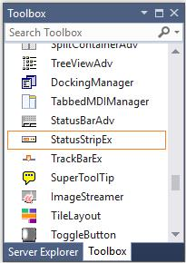
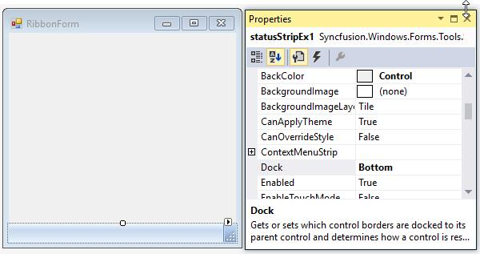
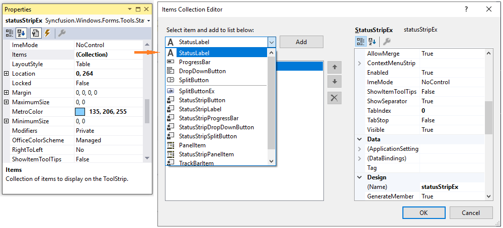
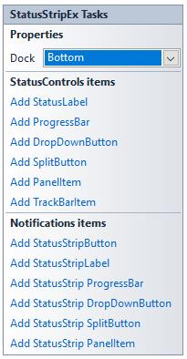

# Getting Started with Windows Forms StatusStripEx

Essential Tools provides the StatusStripEx control, which can be added to the bottom of the Ribbon. It can host controls such as TrackBarEx, ProgressBar, StatusStripButton, and so on.


## Assembly deployment

Refer to the [control dependencies](https://help.syncfusion.com/windowsforms/control-dependencies#statusstripex) section to get the list of assemblies or the details of NuGet package that need to be added as reference to use the control in any application.

Refer to this [documentation](https://help.syncfusion.com/windowsforms/installation/install-nuget-packages) to find more details about installing NuGet packages in a Windows Forms application.

You can also add the required assemblies as references from the Package Manager Console using the following PowerShell command:

```powershell
Install-Package Syncfusion.Tools.Windows
```

## Creating a StatusStripEx

### Through designer

1. Create a new Windows Forms application in Visual Studio.

2. Add the **StatusStripEx** control to an application by dragging it from the toolbox to the design view. The following dependent assemblies will be added automatically:

    * Syncfusion.Grid.Base
    * Syncfusion.Grid.Windows
    * Syncfusion.Shared.Base
    * Syncfusion.Shared.Windows
    * Syncfusion.Tools.Base
    * Syncfusion.Tools.Windows

The StatusStripEx can be docked to the bottom of the RibbonControlAdv.



Dock the StatusStripEx control to the bottom using Dock property.



### Adding items to the StatusStripEx

Access the **Items** property of the control to open the Items Collection Editor. Use this editor to add customized StatusControl items. The editor lets you modify the look and feel of the items using the properties provided on its right side.



N> A shortcut to add the ToolStripStatus items is through the Tasks window. See [Smart Tag options](#smart-tag-options) to know more.

### Through code

The following steps describe how to create a StatusStripEx control programmatically:

1. Create a C# or VB application via Visual Studio.

2. Add the following assembly references to the project:

    * Syncfusion.Grid.Base
    * Syncfusion.Grid.Windows
    * Syncfusion.Shared.Base
    * Syncfusion.Shared.Windows
    * Syncfusion.Tools.Base
    * Syncfusion.Tools.Windows

3. Include the required namespace.




using Syncfusion.Windows.Forms.Tools;





Imports Syncfusion.Windows.Forms.Tools




4. Create an instance of the StatusStripEx control and add it to **Form1**. This code snippet adds a ToolStripStatusLabel to the StatusStripEx control.




//Declaring the StatusStripEx and ToolStripStatusLabel
private Syncfusion.Windows.Forms.Tools.StatusStripEx statusStripEx1;
private System.Windows.Forms.ToolStripStatusLabel toolStripStatusLabel1;

//Initializing the StatusStripEx and ToolStripStatusLabel
this.statusStripEx1 = new Syncfusion.Windows.Forms.Tools.StatusStripEx();
this.toolStripStatusLabel1 = new System.Windows.Forms.ToolStripStatusLabel();

//Adding ToolStripStatusLabel to StatusStripEx
this.statusStripEx1.Items.AddRange(new System.Windows.Forms.ToolStripItem[] {
this.toolStripStatusLabel1});
this.Controls.Add(this.statusStripEx1);

//Docking the StatusStripEx to Bottom
this.statusStripEx1.Dock = Syncfusion.Windows.Forms.Tools.DockStyleEx.Bottom;





Imports Syncfusion.Windows.Forms.Tools

'Declaring the StatusStripEx and ToolStripStatusLabel 
Private statusStripEx1 As Syncfusion.Windows.Forms.Tools.StatusStripEx
Private toolStripStatusLabel1 As System.Windows.Forms.ToolStripStatusLabel

'Initializing the StatusStripEx and ToolStripStatusLabel 
Me.statusStripEx1 = New Syncfusion.Windows.Forms.Tools.StatusStripEx() 
Me.toolStripStatusLabel1 = New System.Windows.Forms.ToolStripStatusLabel() 

'Adding ToolStripStatusLabel to StatusStripEx 
Me.statusStripEx1.Items.AddRange(New System.Windows.Forms.ToolStripItem() {Me.toolStripStatusLabel1}) 
Me.Controls.Add(Me.statusStripEx1)

'Docking the StatusStripEx to Bottom
Me.statusStripEx1.Dock = Syncfusion.Windows.Forms.Tools.DockStyleEx.Bottom




## StatusStripEx Items

The `StatusStripEx` control has two types of items:

* StatusControl items
* Notification items

### StatusControl items

StatusControl items are placed on the right side of the StatusStripEx when added. The available StatusControl items are listed below:

* StatusLabel
* ProgressBar
* DropDownButton
* SplitButton

### Notification items

Notification items are placed on the left side of the StatusStripEx when added. The available Notification items are listed below:

* StatusStripLabel
* StatusStripProgressBar
* StatusStripDropDownButton
* StatusStripSplitButton

N> StatusControl items and Notification items are the same types of items. For example, if you select **StatusStripLabel**, it is added to the left side of the StatusStripEx. Similarly, if you select **StatusLabel**, it is added to the right side of the StatusStripEx.

## Smart tag options

Clicking the Smart Tag of the StatusStripEx displays the following Tasks window. This window lets you add ToolStripStatus items.



The available options are:

* **Dock** - Provides docking options for the StatusStripEx control.

### StatusControl items

<table>
<tr>
<th>Methods</th>
<th>Description</th>
</tr>
<tr>
<td>Add StatusLabel</td>
<td>Adds a status label item.</td>
</tr>
<tr>
<td>Add ProgressBar</td>
<td>Adds a ProgressBar item.</td>
</tr>
<tr>
<td>Add DropDownButton</td>
<td>Adds a DropDownButton item.</td>
</tr>
<tr>
<td>Add SplitButton</td>
<td>Adds a SplitButton item.</td>
</tr>
<tr>
<td>Add PanelItem</td>
<td>Adds a Panel item.</td>
</tr>
<tr>
<td>Add TrackBarItem</td>
<td>Adds a TrackBar item.</td>
</tr>
</table>

### Notification items

<table>
<tr>
<th>Methods</th>
<th>Description</th>
</tr>
<tr>
<td>Add StatusStripButton</td>
<td>Adds a StatusStripButton item.</td>
</tr>
<tr>
<td>Add StatusStripLabel</td>
<td>Adds a StatusStripLabel item.</td>
</tr>
<tr>
<td>Add StatusStripProgressBar</td>
<td>Adds a ProgressBar item to the status bar.</td>
</tr>
<tr>
<td>Add StatusStripDropDownButton</td>
<td>Adds a DropDownButton item to the status bar.</td>
</tr>
<tr>
<td>Add StatusStripSplitButton</td>
<td>Adds a SplitButton item to the status bar.</td>
</tr>
<tr>
<td>Add StatusStripPanelItem</td>
<td>Adds a Panel item to the status bar.</td>
</tr>
</table>

## SizingGrip settings

The StatusStripEx control has a sizing grip at its bottom-right corner. This sizing grip can be shown or hidden using the **SizingGrip** property. The following properties control the appearance of the sizing grip.

<table>
<tr>
<th>Property</th>
<th>Description</th>
</tr>
<tr>
<td>GripStyle</td>
<td>Specifies the style of the sizing grip.</td>
</tr>
<tr>
<td>GripMargin</td>
<td>Gets or sets the margin for the sizing grip.</td>
</tr>
</table>




this.statusStripEx1.SizingGrip = true;
this.statusStripEx1.GripStyle = ToolStripGripStyle.Visible;
this.statusStripEx1.GripMargin = new Padding(5);





Me.statusStripEx1.SizingGrip = True
Me.statusStripEx1.GripStyle = ToolStripGripStyle.Visible
Me.statusStripEx1.GripMargin = New Padding(5)




## ColorSchemes for StatusStripEx

StatusStripEx supports all three color schemes of Office2007: Silver, Blue, and Black. The scheme can be changed using the **OfficeColorScheme** property.




this.statusStripEx1.OfficeColorScheme = Syncfusion.Windows.Forms.Tools.ToolStripEx.ColorScheme.Silver;





Me.statusStripEx1.OfficeColorScheme = Syncfusion.Windows.Forms.Tools.ToolStripEx.ColorScheme.Silver





### Visual style

StatusStripEx control supports Office2016 visual styles such as `Office2016Colorful`, `Office2016White`, `Office2016Black`, and `Office2016DarkGray`.

The following code sample demonstrates how to set the "Office2016 Colorful" style for StatusStripEx.




this.statusStripEx1.VisualStyle = Syncfusion.Windows.Forms.Tools.StatusStripExStyle.Office2016Colorful;





Me.statusStripEx1.VisualStyle = Syncfusion.Windows.Forms.Tools.StatusStripExStyle.Office2016Colorful;





### Custom colors

You can also apply custom colors to the StatusStripEx by setting **OfficeColorScheme** to "Managed" and specifying the custom color through the **ApplyManagedColors** method as follows.




this.statusStripEx1.OfficeColorScheme = Syncfusion.Windows.Forms.Tools.ToolStripEx.ColorScheme.Managed;
Office2007Colors.ApplyManagedColors(this, Color.DarkGreen);





Me.statusStripEx1.OfficeColorScheme = Syncfusion.Windows.Forms.Tools.ToolStripEx.ColorScheme.Managed
Office2007Colors.ApplyManagedColors(Me, Color.DarkGreen)





## Custom context menu

It is possible to customize the status bar context menu that displays in StatusStripEx to look like Word2007. This can be done by setting the **StatusString** property of Notification items such as StatusStripButton, StatusStripLabel, and so on.




this.statusStripLabel1.Text = "Pages";
this.statusStripLabel1.StatusString = "1/1";





Me.statusStripLabel1.Text = "Pages"
Me.statusStripLabel1.StatusString = "1/1"



