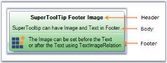
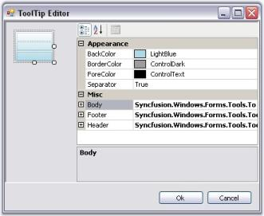
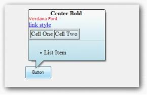

# SuperToolTip

In Office 2007, Microsoft has introduced a SuperToolTip control to display the tooltip. Essential Tools has also come up with a new control known as the SuperToolTip which, enables the user to give tooltip information.

* Header - The Header is used to display text which is used as a header for the tooltip.
* Body - This is the description part. 
* Footer - If additional information is needed, it can be entered in the footer part.

### Creating SuperToolTip Through Designer

1. Drag and drop the SuperToolTip on your form.
2. When the SuperToolTip component is added to a form, an extended property will be added to the properties of every item in the toolstrip or tabitem in the RibbonControlAdv.

   

   N> You can also get or set a tooltip programmatically. It is discussed here.

3. Clicking the … ellipse button will show the ToolTip Editor Dialog Box. This editor lets you customize the ToolTip items.

   

### Through Code



using Syncfusion.Windows.Forms.Tools;

private SuperToolTip superToolTip1;

this.superToolTip1 = new Syncfusion.Windows.Forms.Tools.SuperToolTip(this);

//Adding ToolTip Header Item

Syncfusion.Windows.Forms.Tools.ToolTipInfo toolTipInfo1 = new Syncfusion.Windows.Forms.Tools.ToolTipInfo();

toolTipInfo1.Header.Text = "Cut";

toolTipInfo1.Header.TextAlign = System.Drawing.ContentAlignment.TopCenter;

//Associating SuperToolTip for ToolStripTabItem

this.superToolTip1.SetToolTip(this.toolStripTabItem1, toolTipInfo1);





Imports Syncfusion.Windows.Forms.Tools

Private superToolTip1 As SuperToolTip

Me.superToolTip1 = New Syncfusion.Windows.Forms.Tools.SuperToolTip(Me) 

'Adding ToolTip Header Item

Dim toolTipInfo1 As New Syncfusion.Windows.Forms.Tools.ToolTipInfo()

toolTipInfo1.Header.Text = "Cut" 

toolTipInfo1.Header.TextAlign = System.Drawing.ContentAlignment.TopCenter

//Associating SuperToolTip for ToolStripTabItem

Me.superToolTip1.SetToolTip(this.toolStripTabItem1, toolTipInfo1)



## Appearance Settings 

The appearance of the Super ToolTip can be customized using the below properties. This properties can be edited during design time using ToolTip Editor.

<table>
<tr>
<th>
Property</th><th>
Description</th></tr>
<tr>
<td>
BackColor</td><td>
Sets the background gradient color.</td></tr>
<tr>
<td>
BorderColor</td><td>
Sets the border color for the control.</td></tr>
<tr>
<td>
ForeColor</td><td>
Sets the fore color for the control.</td></tr>
<tr>
<td>
Separator</td><td>
Shows or hides a separator between the Body and the Footer tooltip items.</td></tr>
</table>



toolTipInfo2.BackColor = System.Drawing.SystemColors.LightBlue;

toolTipInfo1.BorderColor = System.Drawing.Color.CadetBlue;

toolTipInfo1.ForeColor = System.Drawing.SystemColors.ControlText;

toolTipInfo2.Separator = true;





toolTipInfo2.BackColor = System.Drawing.SystemColors.LightBlue

toolTipInfo1.BorderColor = System.Drawing.Color.CadetBlue

toolTipInfo1.ForeColor = System.Drawing.SystemColors.ControlText

toolTipInfo2.Separator = True



### Behavior Settings

The following properties control the behavior of the SuperToolTip control.

<table>
<tr>
<th>
Property</th><th>
Description</th></tr>
<tr>
<td>
InitialDelay</td><td>
Indicates the time (ms) before the tooltip is displayed.</td></tr>
<tr>
<td>
MaxWidth</td><td>
Sets the maximum width for the tooltip to be displayed. When the text of the tooltip exceeds the maxwidth, the text wraps to the next line.</td></tr>
<tr>
<td>
ToolTipDuration</td><td>
Indicates the duration of the ToolTip (in sec) when the mouse hovers over a control.</td></tr>
<tr>
<td>
UseFading</td><td>
Specifies the fading effect for the SuperToolTip. The options are System and Blend.</td></tr>
<tr>
<td>
RightToLeft</td><td>
When set to true, displays the tooltip in RightToLeft fashion. Default value is false.</td></tr>
<tr>
<td>
ShowToolTip</td><td>
Gets/Sets whether the ToolTip should be visible or not. Default value is true.DelayToolTip property should be disabled before disabling the ShowToolTip property</td></tr>
</table>



this.superToolTip1.InitialDelay = 750;

this.superToolTip1.MaxWidth = 500;

this.superToolTip1.ToolTipDuration = 3;

this.superToolTip1.UseFading = Syncfusion.Windows.Forms.Tools.SuperToolTip.FadingType.System;

this.superToolTip1.RightToLeft = RightToLeft.Yes;

this.treeViewAdv1.ShowToolTip = true;





Me.superToolTip1.InitialDelay = 750

Me.superToolTip1.MaxWidth = 500

Me.superToolTip1.ToolTipDuration = 3

Me.superToolTip1.UseFading = Syncfusion.Windows.Forms.Tools.SuperToolTip.FadingType.System

this.superToolTip1.RightToLeft = RightToLeft.Yes

Me.treeViewAdv1.ShowToolTip = True



### Balloon Style Appearance in SuperToolTip

Style property is added to set Balloon style for SuperTooltip.  SuperToolTipStyle enumeration contains Balloon and Normal value. 

Set Style property to Balloon to change the SuperToolTip appearance as balloon.

The following code illustrates how to set SuperToolTipStyle.



this.superToolTip1.Style = Syncfusion.Windows.Forms.Tools.SuperToolTip.SuperToolTipStyle.Balloon;





Me.superToolTip1.Style = Syncfusion.Windows.Forms.Tools.SuperToolTip.SuperToolTipStyle.Balloon



## ToolTip Items Customization

This section discusses the customization properties for the ToolTipItems.

N> All these properties are applicable to all the three ToolTipItems.

### Image Settings

<table>
<tr>
<th>
Property</th><th>
Description</th></tr>
<tr>
<td>
Image</td><td>
Sets the image to be shown on the Tooltip.</td></tr>
<tr>
<td>
ImageAlign</td><td>
Indicates the alignment of the image.</td></tr>
<tr>
<td>
ImageScalingSize</td><td>
Sets the size of the image.</td></tr>
<tr>
<td>
ImageTransparentColor</td><td>
Sets the transparent color for the image.</td></tr>
</table>

Images can be associated with the header, body and footer of the super tooltip using this property.



toolTipInfo1.Footer.Image = ((System.Drawing.Image)(resources.GetObject("resource.Image")));

toolTipInfo1.Footer.ImageAlign = System.Drawing.ContentAlignment.MiddleCenter;

toolTipInfo1.Footer.ImageScalingSize = new System.Drawing.Size(16, 16);





toolTipInfo1.Footer.Image = DirectCast((resources.GetObject("resource.Image")), System.Drawing.Image) 

toolTipInfo1.Footer.ImageAlign = System.Drawing.ContentAlignment.MiddleCenter 

toolTipInfo1.Footer.ImageScalingSize = New System.Drawing.Size(16, 16)



### Foreground Settings

<table>
<tr>
<th>
Property</th><th>
Description</th></tr>
<tr>
<td>
Font</td><td>
Sets the FontStyle for the item's text.</td></tr>
<tr>
<td>
ForeColor</td><td>
Sets the ForeColor for the item's text.</td></tr>
</table>



toolTipInfo1.Header.Font = new System.Drawing.Font("Microsoft Sans Serif", 8.25F, System.Drawing.FontStyle.Bold);

toolTipInfo1.Header.ForeColor = System.Drawing.Color.Black;





toolTipInfo1.Header.Font = New System.Drawing.Font("Microsoft Sans Serif", 8.25F, System.Drawing.FontStyle.Bold) 

toolTipInfo1.Header.ForeColor = System.Drawing.Color.Black 



### Appearance and Text Settings

<table>
<tr>
<th>
Property</th><th>
Description</th></tr>
<tr>
<td>
Hidden</td><td>
Shows or hides a tooltip item. Default is false.</td></tr>
<tr>
<td>
Text</td><td>
Sets the text to be displayed in the ToolTip Item. Its supports multiline text also.</td></tr>
<tr>
<td>
TextAlign</td><td>
Indicates the alignment of the tooltip text.</td></tr>
<tr>
<td>
TextImageRelation</td><td>
Sets the location of the text in relation to the image. The options are,ImageBeforeText and TextBeforeImage.</td></tr>
<tr>
<td>
TextMargin</td><td>
Sets the text margin for the Tooltip item.</td></tr>
</table>



toolTipInfo1.Header.Hidden = true;

toolTipInfo1.Header.Text = "Cut";

toolTipInfo1.Header.TextAlign = System.Drawing.ContentAlignment.MiddleLeft;

toolTipInfo1.Header.TextImageRelation = Syncfusion.Windows.Forms.Tools.ToolTipTextImageRelation.ImageBeforeText;

toolTipInfo1.Header.TextMargin = new System.Windows.Forms.Padding(1, 1, 1, 1);





toolTipInfo1.Header.Hidden = True

toolTipInfo1.Header.Text = "Cut" 

toolTipInfo1.Header.TextAlign = System.Drawing.ContentAlignment.MiddleLeft 

toolTipInfo1.Header.TextImageRelation = Syncfusion.Windows.Forms.Tools.ToolTipTextImageRelation.ImageBeforeText 

toolTipInfo1.Header.TextMargin = New System.Windows.Forms.Padding(1, 1, 1, 1)



N> A SuperToolTip (Body, Header and Footer) can be hidden by calling the SuperToolTip.Hide() method.

### Adding  RenderHtml and Size Property to the SuperToolTip.

Text given in the Text property will be considered as HTML strings and displayed as HTML, when the RenderHtml property is set to true.

Size property sets the size of header, body and footer Item. Size property will be enabled when the RenderHtml is set to true.

CSS properties and all the text formatting HTML tags are supported.

The following code illustrates setting RenderHtml, Text, Size properties.



toolTipInfo2.Footer.Size = new System.Drawing.Size(200, 50);

 toolTipInfo2.Footer.RenderHtml = true;

 toolTipInfo2.Footer.Text = "<ul><li>List Item</li></ul>";





Me. toolTipInfo2.Footer.Size= New System.Drawing.Size(200,50)

Me.toolTipInfo2.Footer.RenderHtml = true

Me.toolTipInfo2.Footer.Text = "<ul><li>List Item</li></ul>"



## SuperToolTip Events

Below are the events for the SuperToolTip control.

### Popup ToolTip

PopupToolTip event of the SuperToolTip control can be handled to set the tooltip at any desired position.

Here, the parameter "rc" will pass the (x, y) coordinates for each single object that has been specified through the parameter "component".

<table>
<tr>
<th>
Member</th><th>
Description</th></tr>
<tr>
<td>
Rectangle</td><td>
Stores a set of four integers that represents the location and size of a rectangle.</td></tr>
</table>



private void superToolTip1_PopupToolTip(Component component, ref Rectangle rc) 

{ 

   if (component == this.buttonAdv1 ) 

   { 

       rc.X = 10; 

       rc.Y = 20; 

   } 

   if (component == this.gradientLabel1) 

   { 

       rc.X = 100; 

       rc.Y = 200; 

   } 

} 





Private Sub superToolTip1_PopupToolTip(ByVal component As Component, ByRef rc As Rectangle)  

    If component = Me.buttonAdv1 Then  

       rc.X = 10  

       rc.Y = 20  

    End If  

    If component = Me.gradientLabel1 Then  

       rc.X = 100  

       rc.Y = 200  

    End If  

End Sub 



N> You can also use show method to display a SuperToolTip at a specified location.

### UpdateToolTip

UpdateToolTip event of the SuperToolTip control can be handled, to update the tooltip text.



private void superToolTip1_UpdateToolTip(Component component, ref ToolTipInfo info)

{

    if (component == this.boldToolStripBtn)

        info.Body.Text = "This is a updated Super ToolTip";

}





Private Sub superToolTip1_UpdateToolTip(ByVal component As Component, ByRef info As ToolTipInfo)

    If component = Me.boldToolStripBtn Then

        info.Body.Text = "This is a updated Super ToolTip"

    End If

End Sub



N> You also set tooltip using SetToolTip Method.

## Supporting SuperTooltip for .NET Controls Embedded in MFC Containers

SupperTooltip can be displayed in the User Control embedded in the MFC Dialog.

N> Support has been given in source level.

