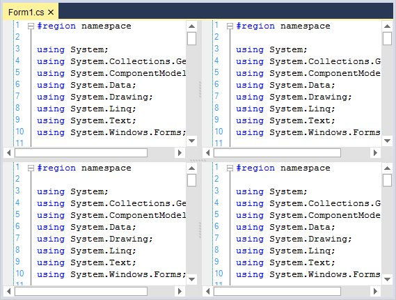
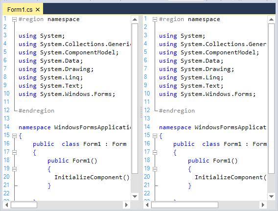
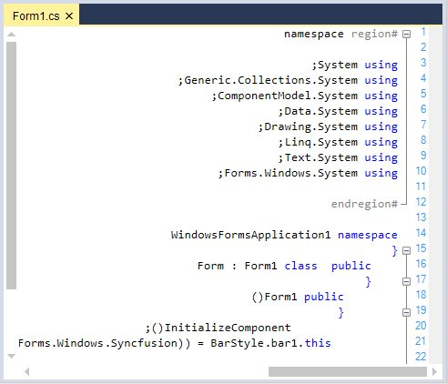
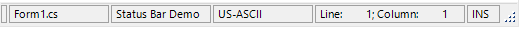
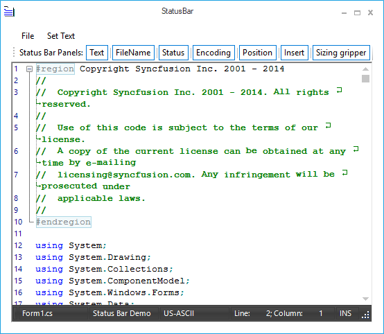
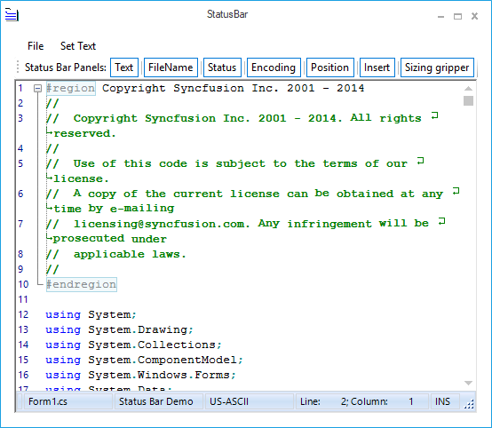
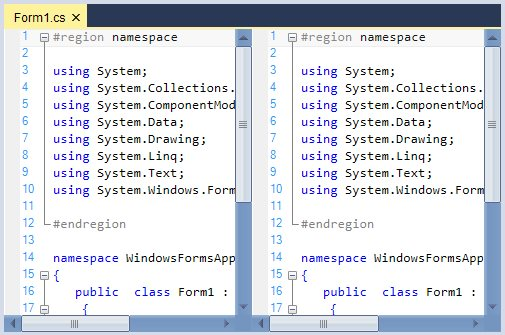

# Appearance in Windows Forms Syntax Editor

Provides exclusive support to customize the background color, text, margin, split views, scrollbar, etc. User can change the background color of the control. It also supports gradient effects by using the [BackgroundColor](https://help.syncfusion.com/cr/windowsforms/Syncfusion.Windows.Forms.Edit.EditControl.html#Syncfusion_Windows_Forms_Edit_EditControl_BackgroundColor) property.





this.editControl1.BackgroundColor = new Syncfusion.Drawing.BrushInfo(Syncfusion.Drawing.GradientStyle.ForwardDiagonal, new System.Drawing.Color[] { System.Drawing.Color.LavenderBlush, System.Drawing.Color.AliceBlue, System.Drawing.Color.BlanchedAlmond });





Me.editControl1.BackgroundColor = New Syncfusion.Drawing.BrushInfo(Syncfusion.Drawing.GradientStyle.ForwardDiagonal, new System.Drawing.Color[] { System.Drawing.Color.LavenderBlush, System.Drawing.Color.AliceBlue, System.Drawing.Color.BlanchedAlmond })





The customization features of the [EditControl](https://help.syncfusion.com/cr/windowsforms/Syncfusion.Windows.Forms.Edit.EditControl.html) are discussed in the following topics.

## Split views

Provides built-in support for horizontal and vertical splitters which display a single document in several views with horizontal and vertical orientations. It allows users to work in different areas of a document at the same time. 

A maximum of four split views are supported. The [SplitFourQuadrants](https://help.syncfusion.com/cr/windowsforms/Syncfusion.Windows.Forms.Edit.EditControl.html#Syncfusion_Windows_Forms_Edit_EditControl_SplitFourQuadrants) function is used to split the EditControl into four equal parts. However, you can also limit the user to perform either a horizontal or vertical split, only if you wish to support two views instead of four.





this.editControl1.SplitFourQuadrants();





Me.editControl1.SplitFourQuadrants()





### Orientation

Split view can be oriented in both horizontal and vertical directions by using the [SplitHorizontally](https://help.syncfusion.com/cr/windowsforms/Syncfusion.Windows.Forms.Edit.EditControl.html#Syncfusion_Windows_Forms_Edit_EditControl_SplitHorizontally) and [SplitVertically](https://help.syncfusion.com/cr/windowsforms/Syncfusion.Windows.Forms.Edit.EditControl.html#Syncfusion_Windows_Forms_Edit_EditControl_SplitVertically) functions of the EditControl.





this.editControl1.SplitHorizontally();





Me.editControl1.SplitHorizontally()









this.editControl1.SplitVertically();





Me.editControl1.SplitVertically()





## Customize split views

In the EditControl, user can customize the splitter background color and disables the splitter. 

### Show horizontal splitter

The horizontal splitters can be enabled or disabled by setting the [ShowHorizontalSplitters](https://help.syncfusion.com/cr/windowsforms/Syncfusion.Windows.Forms.Edit.EditControl.html#Syncfusion_Windows_Forms_Edit_EditControl_ShowHorizontalSplitters) property in the EditControl.





// To enable the Splitters

this.editControl1.ShowHorizontalSplitters = false;





// To enable the Splitters

Me.editControl1.ShowHorizontalSplitters = False





### Show vertical splitter

The vertical splitters can be enabled or disabled by setting the [ShowVerticalSplitters](https://help.syncfusion.com/cr/windowsforms/Syncfusion.Windows.Forms.Edit.EditControl.html#Syncfusion_Windows_Forms_Edit_EditControl_ShowVerticalSplitters) property in the EditControl.





// To enable the Splitters

this.editControl1.ShowVerticalSplitters = false;





// To enable the Splitters

Me.editControl1.ShowVerticalSplitters = False





### Splitter background color 

The [SplitterBackgroundBrush](https://help.syncfusion.com/cr/windowsforms/Syncfusion.Windows.Forms.Edit.EditControl.html#Syncfusion_Windows_Forms_Edit_EditControl_SplitterBackgroundBrush) property helps to customize the background color of horizontal or vertical splitter in the EditControl.





// To customize Splitter Background

this.editControl1.SplitterBackgroundBrush = Brushes.Red;





// To customize Splitter Background

Me.editControl1.SplitterBackgroundBrush = Brushes.Red





### Splitter position

In the EditControl, horizontal and vertical splitters positions can be set by using the following properties.

<table>
<tr>
<th>
Properties</th><th>
Description</th></tr>
<tr>
<td>
{{ '[HorizontalSplitterPosition](https://help.syncfusion.com/cr/windowsforms/Syncfusion.Windows.Forms.Edit.EditControl.html#Syncfusion_Windows_Forms_Edit_EditControl_HorizontalSplitterPosition)' | markdownify }}</td><td>
Specifies position of the horizontal splitter.</td></tr>
<tr>
<td>
{{ '[TopVerticalSplitterPosition](https://help.syncfusion.com/cr/windowsforms/Syncfusion.Windows.Forms.Edit.EditControl.html#Syncfusion_Windows_Forms_Edit_EditControl_TopVerticalSplitterPosition)' | markdownify }}</td><td>
Specifies position of the top vertical splitter.</td></tr>
<tr>
<td>
{{ '[BottomVerticalSplitterPosition](https://help.syncfusion.com/cr/windowsforms/Syncfusion.Windows.Forms.Edit.EditControl.html#Syncfusion_Windows_Forms_Edit_EditControl_BottomVerticalSplitterPosition)' | markdownify }}</td><td>
Specifies position of the bottom vertical splitter.</td></tr>
</table>





this.editControl1.HorizontalSplitterPosition = 220;

this.editControl1.TopVerticalSplitterPosition = 260;

this.editControl1.BottomVerticalSplitterPosition = 260;





Me.editControl1.HorizontalSplitterPosition = 220

Me.editControl1.TopVerticalSplitterPosition = 260

Me.editControl1.BottomVerticalSplitterPosition = 260





N> Refer to the following sample link that demonstrates the `SplitView` functionalities of EditControl:
C:\Users\&lt;User&gt;\AppData\Local\Syncfusion\EssentialStudio\Version Number\Windows\Edit.Windows\Samples\Styles\Split Views

## Single line mode

Supports single line mode that renders like regular TextBox. The EditControl can be operated in a simple text box with syntax highlighting, editing, clipboard operations, etc. by setting the [SingleLineMode](https://help.syncfusion.com/cr/windowsforms/Syncfusion.Windows.Forms.Edit.EditControl.html#Syncfusion_Windows_Forms_Edit_EditControl_SingleLineMode) property to `true`. The default value is `false`.





this.editControl1.SingleLineMode = true;





Me.editControl1.SingleLineMode = True





N> The SingleLineMode is intended to use when the EditControl contains small amount of text data in it. Using it in a scenario where the EditControl has huge file loaded into it, may lead to poor performance.

N> Refer to the following sample link that demonstrates the `SingleLineMode` behavior of EditControl:
C:\Users\&lt;User&gt;\AppData\Local\Syncfusion\EssentialStudio\Version Number\Windows\Edit.Windows\Samples\Styles\Single Line Mode

## Right-to-left (RTL) support 

The `EditControl` elements can be aligned in right-to-left layout. It is laid out from right to left when the [RenderRightToLeft](https://help.syncfusion.com/cr/windowsforms/Syncfusion.Windows.Forms.Edit.EditControl.html#Syncfusion_Windows_Forms_Edit_EditControl_RenderRightToLeft) property is set to `true`. The default value is `false`.  





this.editControl1.RenderRightToLeft = true;





Me.editControl1.RenderRightToLeft = True





**Use case scenarios**

With RTL support, you can use the EditControl to render the content in Right-To-left layout for languages such as Arabic.

### Change Right-to-Left layout by keyboard

Supports rendering the content in Right-To-Left (RTL) layout by pressing <kbd>RShift + ctrl</kbd> and <kbd>LShift + ctrl</kbd> for render back Left-To-Right (LTR).

## Customize text appearance

In the EditControl, you can customize the text color and its border. 

### Text color

The [SetTextColor](https://help.syncfusion.com/cr/windowsforms/Syncfusion.Windows.Forms.Edit.EditControl.html#Syncfusion_Windows_Forms_Edit_EditControl_SetTextColor_Syncfusion_Windows_Forms_Edit_Utils_CoordinatePoint_Syncfusion_Windows_Forms_Edit_Utils_CoordinatePoint_System_Drawing_Color_) function helps to customize the appearance of text color in a specific range of lines. 





// Set the color of the text for the EditControl.

this.editControl1.SetTextColor(new Point(1, 1), new Point(8, 8), Color.Orange);





' Set the color of the text for the EditControl.

Me.editControl1.SetTextColor(New Point(1, 1), New Point(8, 8), Color.Orange)





### Text border

The [SetTextBorder](https://help.syncfusion.com/cr/windowsforms/Syncfusion.Windows.Forms.Edit.EditControl.html#Syncfusion_Windows_Forms_Edit_EditControl_SetTextBorder_Syncfusion_Windows_Forms_Edit_Utils_CoordinatePoint_Syncfusion_Windows_Forms_Edit_Utils_CoordinatePoint_System_Drawing_Color_Syncfusion_Windows_Forms_Edit_Enums_FrameBorderStyle_Syncfusion_Windows_Forms_Edit_Enums_BorderWeight_) function in the EditControl helps to set the border. Simultaneously, you can remove border of the text by using the [RemoveTextBorder](https://help.syncfusion.com/cr/windowsforms/Syncfusion.Windows.Forms.Edit.EditControl.html#Syncfusion_Windows_Forms_Edit_EditControl_RemoveTextBorder_Syncfusion_Windows_Forms_Edit_Utils_CoordinatePoint_Syncfusion_Windows_Forms_Edit_Utils_CoordinatePoint_) function. The following table explains regarding the parameter values used in these functions.

<table>
<tr>
<th>
EditControl border enumerator</th><th>
Description</th></tr>
<tr>
<td>
{{ '[FrameBorderStyle](https://help.syncfusion.com/cr/windowsforms/Syncfusion.Windows.Forms.Edit.Enums.FrameBorderStyle.html)' | markdownify }}</td><td>
Specifies style of the border line. The options are Dash, DashDot, Dot, None, Solid, and Wave.</td></tr>
<tr>
<td>
{{ '[BorderWeight](https://help.syncfusion.com/cr/windowsforms/Syncfusion.Windows.Forms.Edit.Enums.BorderWeight.html)' | markdownify }}</td><td>
Specifies weight of the border line. The options are Bold, Double, and Thin.</td></tr>
</table>





// Set borders for the specified text range.

this.editControl1.SetTextBorder(new Point(1, 1), new Point(8, 8), Color.Red, FrameBorderStyle.Wave, BorderWeight.Double);





' Set borders for the specified text range.

Me.editControl1.SetTextBorder(New Point(1, 1), New Point(3, 3), Color.Red, FrameBorderStyle.Wave, BorderWeight.Double)





## User margin

Displays additional information regarding the contents in the EditControl. Information can also be displayed in line-by-line basis. 

### User margin visibility

The user margin feature can be turned on by setting the [ShowUserMargin](https://help.syncfusion.com/cr/windowsforms/Syncfusion.Windows.Forms.Edit.EditControl.html#Syncfusion_Windows_Forms_Edit_EditControl_ShowUserMargin) property to `true`. The default value is `false`. 





this.editControl1.ShowUserMargin = true;





Me.editControl1.ShowUserMargin = True





### Customize appearance of user margin

User margin width and position can be customized by using the following properties.

<table>
<tr>
<th>
Properties</th><th>
Description</th></tr>
<tr>
<td>
{{ '[UserMarginWidth](https://help.syncfusion.com/cr/windowsforms/Syncfusion.Windows.Forms.Edit.EditControl.html#Syncfusion_Windows_Forms_Edit_EditControl_UserMarginWidth)' | markdownify }}</td><td>
Get or sets width of the user margin.</td></tr>
<tr>
<td>
{{ '[UserMarginPlacement](https://help.syncfusion.com/cr/windowsforms/Syncfusion.Windows.Forms.Edit.EditControl.html#Syncfusion_Windows_Forms_Edit_EditControl_UserMarginPlacement)' | markdownify }}</td><td>
Specifies position of the user margin.</td></tr>
</table>





this.editControl1.UserMarginWidth = 100;

// Sets the User Margin to the Left.

this.editControl1.UserMarginPlacement = Syncfusion.Windows.Forms.Edit.Enums.MarginPlacement.Left;





Me.editControl1.UserMarginWidth = 100

// Sets the User Margin to the Left.

Me.editControl1.UserMarginPlacement = Syncfusion.Windows.Forms.Edit.Enums.MarginPlacement.Left





The following properties can be used to set the background color, text color, and border color of the user margin in the EditControl.

<table>
<tr>
<th>
Properties</th><th>
Description</th></tr>
<tr>
<td>
{{ '[UserMarginBackgroundColor](https://help.syncfusion.com/cr/windowsforms/Syncfusion.Windows.Forms.Edit.EditControl.html#Syncfusion_Windows_Forms_Edit_EditControl_UserMarginBackgroundColor)' | markdownify }}</td><td>
Specifies BrushInfo object that is used when the user margin is being drawn.</td></tr>
<tr>
<td>
{{ '[UserMarginTextColor](https://help.syncfusion.com/cr/windowsforms/Syncfusion.Windows.Forms.Edit.EditControl.html#Syncfusion_Windows_Forms_Edit_EditControl_UserMarginTextColor)' | markdownify }}</td><td>
Specifies default color of the user margin text.</td></tr>
<tr>
<td>
{{ '[UserMarginBorderColor](https://help.syncfusion.com/cr/windowsforms/Syncfusion.Windows.Forms.Edit.EditControl.html#Syncfusion_Windows_Forms_Edit_EditControl_UserMarginBorderColor)' | markdownify }}</td><td>
Specifies color of the user margin border.</td></tr>
</table>





this.editControl1.UserMarginBackgroundColor = new Syncfusion.Drawing.BrushInfo(Syncfusion.Drawing.GradientStyle.BackwardDiagonal, System.Drawing.Color.Brown, System.Drawing.Color.MistyRose);

this.editControl1.UserMarginBorderColor = Color.IndianRed;

this.editControl1.UserMarginTextColor = Color.Green;





Me.editControl1.UserMarginBackgroundColor = New Syncfusion.Drawing.BrushInfo(Syncfusion.Drawing.GradientStyle.BackwardDiagonal, System.Drawing.Color.Brown, System.Drawing.Color.MistyRose)

Me.editControl1.UserMarginBorderColor = Color.IndianRed

Me.editControl1.UserMarginTextColor = Color.Green





#### How to add custom text in user margin

It is possible to set custom text in the user margin in line-by-line basis by handling the [DrawUserMarginText](https://help.syncfusion.com/cr/windowsforms/Syncfusion.Windows.Forms.Edit.EditControl.html) event of the EditControl. Moreover, it is also possible to customize the font settings for the text of the user margin.





private void editControl1_DrawUserMarginText(object sender, Syncfusion.Windows.Forms.Edit.DrawUserMarginTextEventArgs e)
{
    // Set text to be rendered at the user margin area.

    e.Text = "Line " + e.Line.LineIndex.ToString() + " contains " + e.Line.LineLength.ToString() + " characters";

    // Set text font.

    e.Font = new Font("Garamond", 11);

    if(e.Line.LineIndex % 2 == 0)

    {

       // Set color of the text.

       e.Color = Color.Blue;

    }
}





Private Sub editControl1_DrawUserMarginText(ByVal sender As Object, ByVal e As Syncfusion.Windows.Forms.Edit.DrawUserMarginTextEventArgs) Handles EditControl1.DrawUserMarginText

' Set text to be rendered at the user margin area.

e.Text = "Line " + e.Line.LineIndex.ToString() + " contains " + e.Line.LineLength.ToString() + " characters"

' Set text font.

e.Font = New Font("Garamond", 11)

If e.Line.LineIndex Mod 2 = 0 Then

   ' Set color of the text.

   e.Color = Color.Blue

End If

End Sub





## Selection margin

Selection margin is a thin vertical strip along the left side of the EditControl to select the content of the entire line in the EditControl by simply clicking on the corresponding selection margin area of the line. 

### Selection margin visibility

The [ShowSelectionMargin](https://help.syncfusion.com/cr/windowsforms/Syncfusion.Windows.Forms.Edit.EditControl.html#Syncfusion_Windows_Forms_Edit_EditControl_ShowSelectionMargin) property allows you to show or hide this selection margin. The default value is `true`. 





this.editControl1.ShowSelectionMargin = true;





Me.editControl1.ShowSelectionMargin = True





### Customize appearance of selection margin

Selection margin background, foreground, and width can be customized by using the following properties.

<table>
<tr>
<th>
Properties</th><th>
Description</th></tr>
<tr>
<td>
{{ '[SelectionMarginForegroundColor](https://help.syncfusion.com/cr/windowsforms/Syncfusion.Windows.Forms.Edit.EditControl.html#Syncfusion_Windows_Forms_Edit_EditControl_SelectionMarginForegroundColor)' | markdownify }}</td><td>
Specifies foreground color of the selection margin.</td></tr>
<tr>
<td>
{{ '[SelectionMarginBackgroundColor](https://help.syncfusion.com/cr/windowsforms/Syncfusion.Windows.Forms.Edit.EditControl.html#Syncfusion_Windows_Forms_Edit_EditControl_SelectionMarginBackgroundColor)' | markdownify }}
</td><td>
Specifies background color of the selection margin.</td></tr>
<tr>
<td>
{{ '[SelectionMarginWidth](https://help.syncfusion.com/cr/windowsforms/Syncfusion.Windows.Forms.Edit.EditControl.html#Syncfusion_Windows_Forms_Edit_EditControl_SelectionMarginWidth)' | markdownify }}</td><td>
Sets width of the selection margin.</td></tr>
</table>





this.editControl1.SelectionMarginForegroundColor = Color.Gray;

this.editControl1.SelectionMarginBackgroundColor = Color.IndianRed;

this.editControl1.SelectionMarginWidth = 100;





Me.editControl1.SelectionMarginForegroundColor = Color.Gray

Me.editControl1.SelectionMarginBackgroundColor = Color.IndianRed

Me.editControl1.SelectionMarginWidth = 100





## Indicator margin

Provides an extensive support of indicator margin for the purpose of displaying the custom indicators or bookmarks. 

### Indicator margin visibility

Indicator margin can be enabled or disabled by using the [ShowIndicatorMargin](https://help.syncfusion.com/cr/windowsforms/Syncfusion.Windows.Forms.Edit.EditControl.html#Syncfusion_Windows_Forms_Edit_EditControl_ShowIndicatorMargin) property. The default value is `true`. To hide the indicator margin, turn on its value to `false`. The [MarkerAreaWidth](https://help.syncfusion.com/cr/windowsforms/Syncfusion.Windows.Forms.Edit.EditControl.html#Syncfusion_Windows_Forms_Edit_EditControl_MarkerAreaWidth) property in the EditControl sets width of the marker area.





// Displays the Indicator margin.

this.editControl1.ShowIndicatorMargin = true;

// Sets the width of the Indicator margin.

this.editControl1.MarkerAreaWidth = 50;





' Displays the Indicator margin.

Me.editControl1.ShowIndicatorMargin = True

' Sets the width of the Indicator margin.

Me.editControl1.MarkerAreaWidth = 50





### Customize the appearance of indicator margin

The [IndicatorMarginBackColor](https://help.syncfusion.com/cr/windowsforms/Syncfusion.Windows.Forms.Edit.EditControl.html#Syncfusion_Windows_Forms_Edit_EditControl_IndicatorMarginBackColor) property helps to customize the background color of indicator margin in the EditControl.





this.editControl1.IndicatorMarginBackColor = Color.Red;





Me.editControl1.IndicatorMarginBackColor = Color.Red





## Selection color customization

The EditControl provides an option to change the back color of the selected range of text. The [SetBackgroundColor](https://help.syncfusion.com/cr/windowsforms/Syncfusion.Windows.Forms.Edit.EditControl.html#Syncfusion_Windows_Forms_Edit_EditControl_SetBackgroundColor_Syncfusion_Windows_Forms_Edit_Utils_CoordinatePoint_Syncfusion_Windows_Forms_Edit_Utils_CoordinatePoint_System_Drawing_Color_) function in the EditControl is used to set the background color for a specified range of text.





this.editControl1.SetBackgroundColor(new Point(1, 1), new Point(9, 9), Color.AliceBlue);





Me.editControl1.SetBackgroundColor(New Point(1, 1), New Point(9, 9), Color.AliceBlue)





### Set up background for individual line or selected block of text

The EditControl also allows setting custom background color for individual lines as well as for selected block of text. You can set any desired background to a particular line or block of selection as explained as follows:

* Register a back color format with the EditControl by using its [RegisterBackColorFormat](https://help.syncfusion.com/cr/windowsforms/Syncfusion.Windows.Forms.Edit.EditControl.html#Syncfusion_Windows_Forms_Edit_EditControl_RegisterBackColorFormat_System_Drawing_Color_System_Drawing_Color_) function with appropriate values for BackgroundColor, ForegroundColor, and HatchStyle parameters.
* Set the background color to the entire line or the selected text by using the [SetLineBackColor](https://help.syncfusion.com/cr/windowsforms/Syncfusion.Windows.Forms.Edit.EditControl.html#Syncfusion_Windows_Forms_Edit_EditControl_SetLineBackColor_System_Int32_System_Boolean_Syncfusion_Windows_Forms_Edit_Interfaces_IBackgroundFormat_) or [SetSelectionBackColor](https://help.syncfusion.com/cr/windowsforms/Syncfusion.Windows.Forms.Edit.EditControl.html#Syncfusion_Windows_Forms_Edit_EditControl_SetSelectionBackColor_Syncfusion_Windows_Forms_Edit_Interfaces_IBackgroundFormat_) functions respectively.





// Register a backcolor format with EditControl.

IBackgroundFormat format = this.editControl1.RegisterBackColorFormat(Color.Aquamarine, Color.Beige, System.Drawing.Drawing2D.HatchStyle.Cross, true);

// Set the background for the entire line of text.

this.editControl1.SetLineBackColor(editControl1.CurrentLine, true, format);

// Set the background for the selected block of text.        

this.editControl1.SetSelectionBackColor(format);





' Register a backcolor format with EditControl.

Dim IBackgroundFormat As format = Me.editControl1.RegisterBackColorFormat(Color.Aquamarine, Color.Beige, System.Drawing.Drawing2D.HatchStyle.Cross, True)

' Set the background for the entire line of text. 

Me.editControl1.SetLineBackColor(editControl1.CurrentLine, True, format)

' Set the background for the selected block of text.        

Me.editControl1.SetSelectionBackColor(format)





#### Remove applied background for individual line or selected block of text

By using the [RemoveLineBackColor](https://help.syncfusion.com/cr/windowsforms/Syncfusion.Windows.Forms.Edit.EditControl.html#Syncfusion_Windows_Forms_Edit_EditControl_RemoveLineBackColor_System_Int32_) and [RemoveSelectionBackColor](https://help.syncfusion.com/cr/windowsforms/Syncfusion.Windows.Forms.Edit.EditControl.html#Syncfusion_Windows_Forms_Edit_EditControl_RemoveSelectionBackColor) functions in the EditControl, you can remove the background color for individual lines or selected blocks of text. 





// Removes line back color.

this.editControl1.RemoveLineBackColor(4);

// Removes background coloring from the selected text.

this.editControl1.RemoveSelectionBackColor();





' Removes line back color.

Me.editControl1.RemoveLineBackColor(4)

' Removes background coloring from the selected text.

Me.editControl1.RemoveSelectionBackColor()





## StatusBar

Provides `StatusBar` support to display the information about current state of the control such as current file name, line number, and column number. The built-in panels are:

* TextPanel
* StatusPanel
* EncodingPanel
* FileNamePanel
* CoordinatePanel
* InsertPanel

### Status bar settings

The [StatusBarSettings](https://help.syncfusion.com/cr/windowsforms/Syncfusion.Windows.Forms.Edit.EditControl.html#Syncfusion_Windows_Forms_Edit_EditControl_StatusBarSettings) property contains many sub properties to customize the appearance and visibility of the status bar and its panels. The following table represents some of the sub properties in StatusBarSettings.

<table>
<tr>
<th>
StatusBarSettings property</th><th>
Description</th></tr>
<tr>
<td>
{{ '[TextPanel](https://help.syncfusion.com/cr/windowsforms/Syncfusion.Windows.Forms.Edit.Utils.StatusBarSettings.html#Syncfusion_Windows_Forms_Edit_Utils_StatusBarSettings_TextPanel)' | markdownify }}
</td><td>
Specifies StatusBarPanelSettings object for the text panel.</td></tr>
<tr>
<td>
{{ '[StatusPanel](https://help.syncfusion.com/cr/windowsforms/Syncfusion.Windows.Forms.Edit.Utils.StatusBarSettings.html#Syncfusion_Windows_Forms_Edit_Utils_StatusBarSettings_StatusPanel)' | markdownify }}</td><td>
Specifies StatusBarPanelSettings object for the status panel.</td></tr>
<tr>
<td>
{{ '[EncodingPanel](https://help.syncfusion.com/cr/windowsforms/Syncfusion.Windows.Forms.Edit.Utils.StatusBarSettings.html#Syncfusion_Windows_Forms_Edit_Utils_StatusBarSettings_EncodingPanel)' | markdownify }}</td><td>
Specifies StatusBarPanelSettings object for the encoding panel.</td></tr>
<tr>
<td>
{{ '[FileNamePanel](https://help.syncfusion.com/cr/windowsforms/Syncfusion.Windows.Forms.Edit.Utils.StatusBarSettings.html#Syncfusion_Windows_Forms_Edit_Utils_StatusBarSettings_FileNamePanel)' | markdownify }}</td><td>
Specifies StatusBarPanelSettings object for the fileName panel.</td></tr>
<tr>
<td>
{{ '[CoordinatePanel](https://help.syncfusion.com/cr/windowsforms/Syncfusion.Windows.Forms.Edit.Utils.StatusBarSettings.html#Syncfusion_Windows_Forms_Edit_Utils_StatusBarSettings_CoordsPanel)' | markdownify }}</td><td>
Specifies StatusBarPanelSettings object for the coordinate panel.</td></tr>
<tr>
<td>
{{ '[InsertPanel](https://help.syncfusion.com/cr/windowsforms/Syncfusion.Windows.Forms.Edit.Utils.StatusBarSettings.html#Syncfusion_Windows_Forms_Edit_Utils_StatusBarSettings_InsertPanel)' | markdownify }}</td><td>
Specifies StatusBarPanelSettings object for the insert panel.</td></tr>
<tr>
<td>
{{ '[Panels](https://help.syncfusion.com/cr/windowsforms/Syncfusion.Windows.Forms.Edit.Utils.StatusBarSettings.html#Syncfusion_Windows_Forms_Edit_Utils_StatusBarSettings_Panels)' | markdownify }}</td><td>
Gets the list of status bar panel settings.</td></tr>
<tr>
<td>
{{ '[StatusBar](https://help.syncfusion.com/cr/windowsforms/Syncfusion.Windows.Forms.Edit.Utils.StatusBarSettings.html#Syncfusion_Windows_Forms_Edit_Utils_StatusBarSettings__ctor_Syncfusion_Windows_Forms_Tools_Controls_StatusBar_StatusBarExt_)' | markdownify }}</td><td>
Gets the underlying status bar.</td></tr>
<tr>
<td>
{{ '[GripVisibility](https://help.syncfusion.com/cr/windowsforms/Syncfusion.Windows.Forms.Edit.Utils.StatusBarSettings.html#Syncfusion_Windows_Forms_Edit_Utils_StatusBarSettings_GripVisibility)' | markdownify }}</td><td>
Gets or sets the visibility of the status bar sizing grip. The options are Visible and Hidden.</td></tr>
</table>





// Set the visibility of the status bar sizing grip.

this.editControl1.StatusBarSettings.GripVisibility = Syncfusion.Windows.Forms.Edit.Enums.SizingGripVisibility.Visible;





' Set the visibility of the status bar sizing grip.

Me.editControl1.StatusBarSettings.GripVisibility = Syncfusion.Windows.Forms.Edit.Enums.SizingGripVisibility.Visible





#### Visibility settings

Status bar can be enabled or hidden by setting the [StatusBarSettings.Visible](https://help.syncfusion.com/cr/windowsforms/Syncfusion.Windows.Forms.Edit.Utils.StatusBarSettings.html#Syncfusion_Windows_Forms_Edit_Utils_StatusBarSettings_Visible) property. The default value is `false`. The individual StatusBar panels can also be optionally shown or hidden by using the `Visible` property corresponding to the respective panel.





 // Shows the built-in status bar.

this.editControl1.StatusBarSettings.Visible = true;

 // Enable the TextPanel in the StatusBar.

this.editControl1.StatusBarSettings.TextPanel.Visible = true;

// Set the visibility of the status bar sizing grip.

this.editControl1.StatusBarSettings.GripVisibility = Syncfusion.Windows.Forms.Edit.Enums.SizingGripVisibility.Visible;





// Shows the built-in status bar.

Me.editControl1.StatusBarSettings.Visible = True

' Enable the TextPanel in the status bar.

Me.editControl1.StatusBarSettings.TextPanel.Visible = True

' Set the visibility of the status bar sizing grip.

Me.editControl1.StatusBarSettings.GripVisibility = Syncfusion.Windows.Forms.Edit.Enums.SizingGripVisibility.Visible





#### Visual styles

The EditControl status bar supports different visual styles for its appearance. Some of the available visual styles are:

* Default
* Metro
* Office2007
* Office2010

The visual style can be applied for the StatusBar by using the [VisualStyle](https://help.syncfusion.com/cr/windowsforms/Syncfusion.Windows.Forms.Edit.Utils.StatusBarSettings.html#Syncfusion_Windows_Forms_Edit_Utils_StatusBarSettings_VisualStyle) property. 

##### Default

This option helps to set the Default style.





// Default

this.editControl1.StatusBarSettings.VisualStyle= Syncfusion.Windows.Forms.Tools.Controls.StatusBar.VisualStyle.Default; 





'Default

Me.editControl1.StatusBarSettings.VisualStyle = Syncfusion.Windows.Forms.Tools.Controls.StatusBar.VisualStyle.Default





##### Metro

This option helps to set the Metro style.





// Metro

this.editControl1.StatusBarSettings.VisualStyle= Syncfusion.Windows.Forms.Tools.Controls.StatusBar.VisualStyle.Metro; 





'Metro

Me.editControl1.StatusBarSettings.VisualStyle = Syncfusion.Windows.Forms.Tools.Controls.StatusBar.VisualStyle.Metro





##### Office2007Blue

This option helps to set the Office2007Blue style.





// Office2007Blue

this.editControl1.StatusBarSettings.VisualStyle= Syncfusion.Windows.Forms.Tools.Controls.StatusBar.VisualStyle.Office2007; 

this.editControl1.StatusBarSettings.Offcie2007ColorScheme = Office2007Theme.Blue;





'Office2007Blue

Me.editControl1.StatusBarSettings.VisualStyle = Syncfusion.Windows.Forms.Tools.Controls.StatusBar.VisualStyle.Office2007

Me.editControl1.StatusBarSettings.Offcie2007ColorScheme = Office2007Theme.Blue





##### Office2007Black

This option helps to set the Office2007Black style.





// Office2007Black

this.editControl1.StatusBarSettings.VisualStyle= Syncfusion.Windows.Forms.Tools.Controls.StatusBar.VisualStyle.Office2007; 

this.editControl1.StatusBarSettings.Offcie2007ColorScheme = Office2007Theme.Black;





'Office2007Black

Me.editControl1.StatusBarSettings.VisualStyle = Syncfusion.Windows.Forms.Tools.Controls.StatusBar.VisualStyle.Office2007

Me.editControl1.StatusBarSettings.Offcie2007ColorScheme = Office2007Theme.Black





##### Office2007Silver

This option helps to set the Office2007Silver style.





// Office2007Silver

this.editControl1.StatusBarSettings.VisualStyle= Syncfusion.Windows.Forms.Tools.Controls.StatusBar.VisualStyle.Office2007; 

this.editControl1.StatusBarSettings.Offcie2007ColorScheme = Office2007Theme.Silver;





'Office2007Silver

Me.editControl1.StatusBarSettings.VisualStyle = Syncfusion.Windows.Forms.Tools.Controls.StatusBar.VisualStyle.Office2007

Me.editControl1.StatusBarSettings.Offcie2007ColorScheme = Office2007Theme.Silver





##### Office2007Managed

This option helps to set the Office2007Managed style.





// Office2007Managed

this.editControl1.StatusBarSettings.VisualStyle= Syncfusion.Windows.Forms.Tools.Controls.StatusBar.VisualStyle.Office2007; 

this.editControl1.StatusBarSettings.Offcie2007ColorScheme = Office2007Theme.Managed;





'Office2007Managed

Me.editControl1.StatusBarSettings.VisualStyle = Syncfusion.Windows.Forms.Tools.Controls.StatusBar.VisualStyle.Office2007

Me.editControl1.StatusBarSettings.Offcie2007ColorScheme = Office2007Theme.Managed





##### Office2010Blue

This option helps to set the Office2010Blue style.





// Office2010Blue

this.editControl1.StatusBarSettings.VisualStyle= Syncfusion.Windows.Forms.Tools.Controls.StatusBar.VisualStyle.Office2010; 

this.editControl1.StatusBarSettings.Offcie2010ColorScheme = Office2010Theme.Blue;





'Office2010Blue

Me.editControl1.StatusBarSettings.VisualStyle = Syncfusion.Windows.Forms.Tools.Controls.StatusBar.VisualStyle.Office2010

Me.editControl1.StatusBarSettings.Offcie2010ColorScheme = Office2010Theme.Blue





##### Office2010Black

This option helps to set the Office2010Black style.





// Office2010Black

this.editControl1.StatusBarSettings.VisualStyle= Syncfusion.Windows.Forms.Tools.Controls.StatusBar.VisualStyle.Office2010; 

this.editControl1.StatusBarSettings.Offcie2010ColorScheme = Office2010Theme.Black;





'Office2010Black

Me.editControl1.StatusBarSettings.VisualStyle = Syncfusion.Windows.Forms.Tools.Controls.StatusBar.VisualStyle.Office2010

Me.editControl1.StatusBarSettings.Offcie2010ColorScheme = Office2010Theme.Black





##### Office2010Silver

This option helps to set the Office2010Silver style.





// Office2010Silver

this.editControl1.StatusBarSettings.VisualStyle= Syncfusion.Windows.Forms.Tools.Controls.StatusBar.VisualStyle.Office2010; 

this.editControl1.StatusBarSettings.Offcie2010ColorScheme = Office2010Theme.Silver;





'Office2010Silver

Me.editControl1.StatusBarSettings.VisualStyle = Syncfusion.Windows.Forms.Tools.Controls.StatusBar.VisualStyle.Office2010

Me.editControl1.StatusBarSettings.Offcie2010ColorScheme = Office2010Theme.Silver





##### Office2010Managed

This option helps to set the Office2010Managed style.





// Office2010Managed

this.editControl1.StatusBarSettings.VisualStyle= Syncfusion.Windows.Forms.Tools.Controls.StatusBar.VisualStyle.Office2010; 

this.editControl1.StatusBarSettings.Offcie2010ColorScheme = Office2010Theme.Managed;





'Office2010Managed

Me.editControl1.StatusBarSettings.VisualStyle = Syncfusion.Windows.Forms.Tools.Controls.StatusBar.VisualStyle.Office2010

Me.editControl1.StatusBarSettings.Offcie2010ColorScheme = Office2010Theme.Managed





N> Refer to the following sample link that demonstrates the `StatusBar` functionalities of EditControl:
C:\Users\&lt;User&gt;\AppData\Local\Syncfusion\EssentialStudio\Version Number\Windows\Edit.Windows\Samples\Interactive Features\StatusBar

## ScrollBar 

The `EditControl` can display a data object as a document or a bitmap that is larger than the window's client area. With the help of scroll bar, the user can scroll a data object in the client area to bring into view the portions of the object that extend beyond the borders of the window.

Buttons can be displayed on the top, bottom, left, or right of the scroll bars by using the following properties.

<table>
<tr>
<th>
Properties</th><th>
Description</th></tr>
<tr>
<td>
{{ '[ScrollbarBottomButtons](https://help.syncfusion.com/cr/windowsforms/Syncfusion.Windows.Forms.Edit.EditControl.html#Syncfusion_Windows_Forms_Edit_EditControl_ScrollbarBottomButtons)' | markdownify }}</td><td>
Gets buttons on bottom of the vertical scrollbar.</td></tr>
<tr>
<td>
{{ '[ScrollbarLeftButtons](https://help.syncfusion.com/cr/windowsforms/Syncfusion.Windows.Forms.Edit.EditControl.html#Syncfusion_Windows_Forms_Edit_EditControl_ScrollbarLeftButtons)' | markdownify }}</td><td>
Gets buttons on left of the vertical scrollbar.</td></tr>
<tr>
<td>
{{ '[ScrollbarRightButtons](https://help.syncfusion.com/cr/windowsforms/Syncfusion.Windows.Forms.Edit.EditControl.html#Syncfusion_Windows_Forms_Edit_EditControl_ScrollbarRightButtons)' | markdownify }}</td><td>
Gets buttons on right of the vertical scrollbar.</td></tr>
<tr>
<td>
{{ '[ScrollbarTopButtons](https://help.syncfusion.com/cr/windowsforms/Syncfusion.Windows.Forms.Edit.EditControl.html#Syncfusion_Windows_Forms_Edit_EditControl_ScrollbarTopButtons)' | markdownify }}</td><td>
Gets buttons on top of the vertical scrollbar.</td></tr>
</table>





this.editControl1.ScrollbarBottomButtons.AddRange(new System.Windows.Forms.Control[] { this.scrollbarButton1 });

this.editControl1.ScrollbarLeftButtons.AddRange(new System.Windows.Forms.Control[] { this.scrollbarButton2 });

this.editControl1.ScrollbarRightButtons.AddRange(new System.Windows.Forms.Control[] { this.scrollbarButton3 });

this.editControl1.ScrollbarTopButtons.AddRange(new System.Windows.Forms.Control[] { this.scrollbarButton4 });





Me.editControl1.ScrollbarBottomButtons.AddRange(New System.Windows.Forms.Control() {Me.scrollbarButton1}) 

Me.editControl1.ScrollbarLeftButtons.AddRange(New System.Windows.Forms.Control() {Me.scrollbarButton2}) 

Me.editControl1.ScrollbarRightButtons.AddRange(New System.Windows.Forms.Control() {Me.scrollbarButton3}) 

Me.editControl1.ScrollbarTopButtons.AddRange(New System.Windows.Forms.Control() {Me.scrollbarButton4}) 





### Customize the scrollbar visibility

By using the [AlwaysShowScrollers](https://help.syncfusion.com/cr/windowsforms/Syncfusion.Windows.Forms.Edit.EditControl.html#Syncfusion_Windows_Forms_Edit_EditControl_AlwaysShowScrollers) property in the EditControl, you can enable or disable the scroll bar.





this.editControl1.AlwaysShowScrollers = false;





Me.editControl1.AlwaysShowScrollers = False





### Types of scrolling mode

Various types of scrolling modes in the EditControl are as follows:

* Immediate: Scrolls the control to the new value immediately.
* Deferred: Scrolls the control when thumb track is completed.
* Pixel: Scrolls line by line.

The [VScrollMode](https://help.syncfusion.com/cr/windowsforms/Syncfusion.Windows.Forms.Edit.EditControl.html#Syncfusion_Windows_Forms_Edit_EditControl_VScrollMode) property helps to set various types of scrolling modes in the EditControl by using the [ScrollMode](https://help.syncfusion.com/cr/windowsforms/Syncfusion.Windows.Forms.Edit.ScrollMode.html) enumerator.





// Scrolls the vertical scroll bar line by line.

this.editControl1.VScrollMode = Syncfusion.Windows.Forms.Edit.ScrollMode.Pixel;





' Scrolls the vertical scroll bar line by line.

Me.editControl1.VScrollMode = Syncfusion.Windows.Forms.Edit.ScrollMode.Pixel





### Customize the appearance of scrollbar

Provides Office 2007 appearance to scroll bars by setting the [ScrollVisualStyle](https://help.syncfusion.com/cr/windowsforms/Syncfusion.Windows.Forms.Edit.EditControl.html#Syncfusion_Windows_Forms_Edit_EditControl_ScrollVisualStyle) property to Office2007. It supports all the three Office 2007 color schemes (Black, Blue, and Silver) by using the [ScrollColorScheme](https://help.syncfusion.com/cr/windowsforms/Syncfusion.Windows.Forms.Edit.EditControl.html#Syncfusion_Windows_Forms_Edit_EditControl_ScrollColorScheme) property. Custom colors can also be applied to the scroll bars of the EditControl by setting the ScrollColorScheme property to Managed.





this.editControl1.ScrollVisualStyle = ScrollBarCustomDrawStyles.Office2007;

this.editControl1.ScrollColorScheme = Office2007ColorScheme.Blue;

// Set custom color for the scroll bar.

this.editControl1.ScrollColorScheme = Office2007ColorScheme.Managed;

Syncfusion.Windows.Forms.Office2007Colors.ApplyManagedColors(this, Color.Green);





Me.editControl1.ScrollVisualStyle = ScrollBarCustomDrawStyles.Office2007

Me.editControl1.ScrollColorScheme = Office2007ColorScheme.Blue

' Set custom color for the scroll bar.

Me.editControl1.ScrollColorScheme = Office2007ColorScheme.Managed

Syncfusion.Windows.Forms.Office2007Colors.ApplyManagedColors(Me, Color.Green)





The following illustration shows the EditControl with custom color (green) set for the scroll bars.

## Append code snippets

Supports an advanced feature of VS 2005 like Code Snippets. It is also used to load or save VS.NET 2005-compatible XML snippets. Code Snippets are inserted into the EditControl by the following procedure:

1. Type the snippet name. For example, "do".
2. Press the CTRL + ' combination.
3. Select an item from the list.

The code snippets allows you to input the data to the highlighted fields.

Code Snippets can also be inserted into the EditControl by using the static `Extract` function of the `CodeSnippetsExtractor` class implemented in the demo sample. Extract function takes the following two parameters:

1. Path of the folder containing the code snippets.
2. Instance of the EditControl into which the extracted code snippet should be inserted.





CodeSnippetsExtractor.Extract(Path, editControl1);





CodeSnippetsExtractor.Extract(Path, editControl1)




{{ codesnippet1 | OrderList_Indent_Level_1 }} 

Code Snippets are added to the current language of the EditControl by using the following function.

<table>
<tr>
<th>
Function</th><th>
Description</th></tr>
<tr>
<td>
{{ '[AddCodeSnippet](https://help.syncfusion.com/cr/windowsforms/Syncfusion.Windows.Forms.Edit.EditControl.html#Syncfusion_Windows_Forms_Edit_EditControl_AddCodeSnippet_System_String_System_Collections_ArrayList_System_String_)' | markdownify }}</td><td>
Adds new code snippet to the current language.</td></tr>
</table>





this.editControl1.AddCodeSnippet(string title, ArrayList literals, string code);





Me.editControl1.AddCodeSnippet(String title, ArrayList literals, String code)





The code snippets can also be contained in containers and displayed in the pop-up of the snippets. The static `Extract` function of the `CodeSnippetsExtractor` class is used to extract and fill the container object. The container object can be added to the [SnippetsContainer](https://help.syncfusion.com/cr/windowsforms/Syncfusion.Windows.Forms.Edit.Interfaces.IConfigLanguage.html#Syncfusion_Windows_Forms_Edit_Interfaces_IConfigLanguage_SnippetsContainer) of the EditControl by using the [AddContainer](https://help.syncfusion.com/cr/windowsforms/Syncfusion.Windows.Forms.Edit.Utils.CodeSnippets.CodeSnippetsContainer.html#Syncfusion_Windows_Forms_Edit_Utils_CodeSnippets_CodeSnippetsContainer_AddContainer_Syncfusion_Windows_Forms_Edit_Utils_CodeSnippets_CodeSnippetsContainer_) function. 





private CodeSnippetsContainer container = new Syncfusion.Windows.Forms.Edit.Utils.CodeSnippets.CodeSnippetsContainer(); 

container = CodeSnippetsExtractor.Extract(Path@"\Loops");

container.Name = "Loops";

this.editControl1.Language.SnippetsContainer.AddContainer(container);





container As CodeSnippetsContainer = New Syncfusion.Windows.Forms.Edit.Utils.CodeSnippets.CodeSnippetsContainer()

container = CodeSnippetsExtractor.Extract(Path "\Loops")

container.Name = "Loops"

Me.editControl1.Language.SnippetsContainer.AddContainer(container)





Code snippets can also be created by using the `configuration` file. For example, the code snippet for a structure in C# can be created as shown as follows.



<CodeSnippetsContainer Name ="Container 2">

<CodeSnippet Format ="1.0.0">

       <Header>

        <Title>struct</Title>

         <Shortcut>struct</Shortcut>

 <Description>Code snippet for Struct</Description>

     </Header>

     <Snippet>

          <Declarations>

        <Literal>

         <ID>name</ID>

         <ToolTip>Struct name</ToolTip>

        <Default>Struct</Default>

      </Literal>

         </Declarations>

       <Code Language ="csharp"><![CDATA[struct $name$

       {

       }]]>

       </Code>

</Snippet>

</CodeSnippet>

</CodeSnippetsContainer>



The Literal element is used to identify a replacement for a piece of code in the snippet. But, one that will likely be customized after it is inserted into the code. 

**Showing code snippets**

You can also programmatically show the choice list of code snippets by calling the [ShowCodeSnippets](https://help.syncfusion.com/cr/windowsforms/Syncfusion.Windows.Forms.Edit.EditControl.html#Syncfusion_Windows_Forms_Edit_EditControl_ShowCodeSnippets) function as follows.





// Shows the code snippets choice list.
this.editControl1.ShowCodeSnippets();





' Shows the code snippets choice list.
Me.editControl1.ShowCodeSnippets()





**Border settings**

Border can be set for the active code snippets by using the [DrawCodeSnippetBorder](https://help.syncfusion.com/cr/windowsforms/Syncfusion.Windows.Forms.Edit.EditControl.html#Syncfusion_Windows_Forms_Edit_EditControl_DrawCodeSnippetBorder) property in the EditControl. You can set the size of CodeSnippet pop-up window by using the [CodeSnipptSize](https://help.syncfusion.com/cr/windowsforms/Syncfusion.Windows.Forms.Edit.EditControl.html#Syncfusion_Windows_Forms_Edit_EditControl_CodeSnipptSize) property in the EditControl.





this.editControl1.DrawCodeSnippetBorder = true;





Me.editControl1.DrawCodeSnippetBorder = True





N> Refer to the following sample link that demonstrates the `CodeSnippets` functionalities of EditControl:
C:\Users\&lt;User&gt;\AppData\Local\Syncfusion\EssentialStudio\Version Number\Windows\Edit.Windows\Samples\Intellisense Functions\Code Snippets

## Customize cursor appearance

Cursor appearance can be customized by using the [Cursor](https://help.syncfusion.com/cr/windowsforms/Syncfusion.Windows.Forms.Edit.EditControl.html#Syncfusion_Windows_Forms_Edit_EditControl_Cursor) property. The cursor appearance can be modified to arrow, cross, hand, and more.





private Cursor currentCursor = Cursors.Arrow;

this.editControl1.Cursor = this.currentCursor;





currentCursor as Cursor = Cursors.Arrow

Me.editControl1.Cursor = Me.currentCursor





## Suspend and resume painting

Painting of the EditControl can be suspended by using the [Suspend](https://help.syncfusion.com/cr/windowsforms/Syncfusion.Windows.Forms.Edit.EditControl.html#Syncfusion_Windows_Forms_Edit_EditControl_SuspendPainting) function call. Painting can be resumed by using the [Resume](https://help.syncfusion.com/cr/windowsforms/Syncfusion.Windows.Forms.Edit.EditControl.html#Syncfusion_Windows_Forms_Edit_EditControl_ResumePainting) function call. Suspend and Resume functions internally call the `Interop` and `LockWindowUpdate` functions to suspend and resume painting of the EditControl.





this.editControl1.SuspendPainting();

this.editControl1.ResumePainting();





Me.editControl1.SuspendPainting()

Me.editControl1.ResumePainting()




