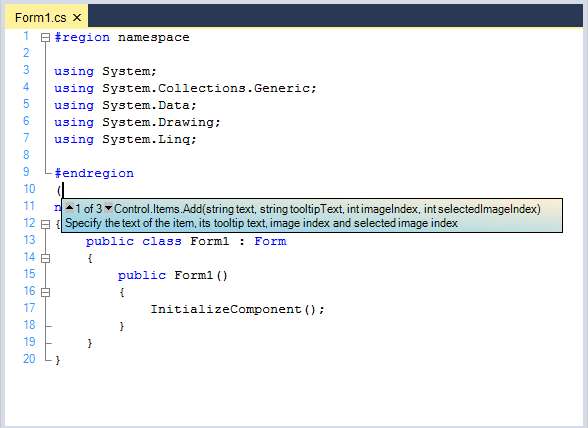
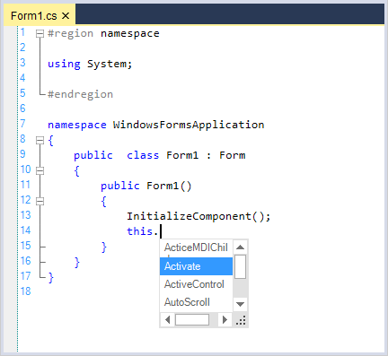
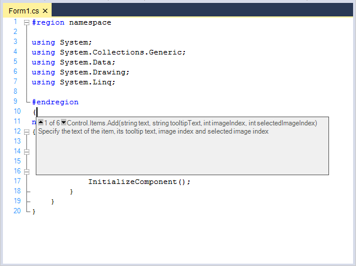
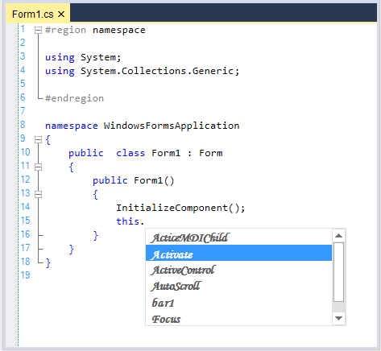
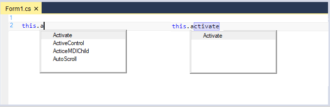
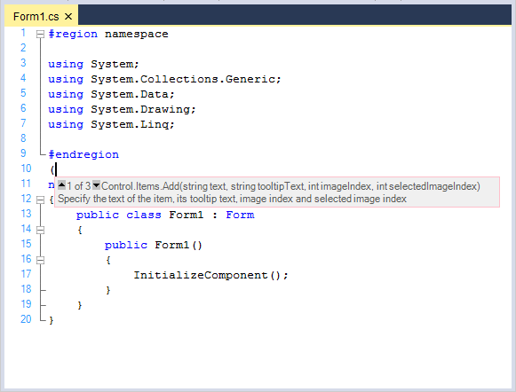
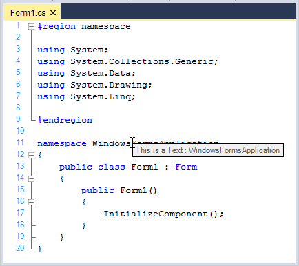
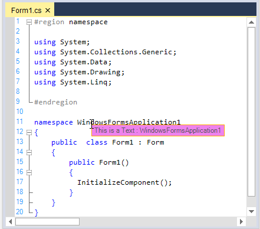

# Intellisense in Windows Forms Syntax Editor

The EditControl provides Intellisense pop-up capabilities to add content easily as in Microsoft Visual Studio text editor.

## Configure intellisense pop-up

The [ContextChoiceController](https://help.syncfusion.com/cr/windowsforms/Syncfusion.Windows.Forms.Edit.Interfaces.IContextChoiceController.html) helps to display intellisense pop-up in the EditControl. You can also autocomplete the word by using the UP or DOWN arrow key to choose the Context Choice item and pressing the <kbd>Tab</kbd> key. The ContextChoice pop-up can be dismissed by pressing the <kbd>ESC</kbd> key.

The ContextChoice displaying characters are specified in the configuration file by using the `DropContextChoiceList` field in the lexem for the corresponding character. To display the ContextChoice drop-down in response to the period (".") or comma (",") being typed, use the following XML code.



<lexem BeginBlock="." Type="Operator" DropContextChoiceList="true"/>

<lexem BeginBlock="," Type="Operator" DropContextChoiceList="true"/>



The preceding code has to be placed within the <lexems> section of the configuration file.

The [AutoCompleteSingleLexem](https://help.syncfusion.com/cr/windowsforms/Syncfusion.Windows.Forms.Edit.EditControl.html#Syncfusion_Windows_Forms_Edit_EditControl_AutoCompleteSingleLexem) property indicates whether the ContextChoice list gets auto completed when a single lexem remains in the list or not.





this.editControl1.AutoCompleteSingleLexem = true;





Me.editControl1.AutoCompleteSingleLexem = True





### Populate intellisense pop-up

ContextChoice list is populated by handling the [ContextChoiceOpen](https://help.syncfusion.com/cr/windowsforms/Syncfusion.Windows.Forms.Edit.EditControl.html) event in the EditControl, and adding items to the items collection associated with the [IContextChoiceController](https://help.syncfusion.com/cr/windowsforms/Syncfusion.Windows.Forms.Edit.Interfaces.IContextChoiceController.html) object.





private void editControl1_ContextChoiceOpen(Syncfusion.Windows.Forms.Edit.Interfaces.IContextChoiceController controller)
{

// Add items to the Items collection associated with the IContextChoiceController object.

controller.Items.Add("Activate", "Activate the form and give it focus", this.editControl1.ContextChoiceController.Images["Image0"]);
controller.Items.Add("ActiveControl", "Gets or sets the Active Control", this.editControl1.ContextChoiceController.Images["Image1"]);
controller.Items.Add("ActiveMDIChild", "Activates the MDIChild of form", this.editControl1.ContextChoiceController.Images["Image2"]);
controller.Items.Add("AutoScroll", "Gets or sets the value indicating Autoscroll", this.editControl1.ContextChoiceController.Images["Image3"]);
controller.Items.Add("bar1", "Gets or sets the button on the form that is clicked when the user presses the ENTER key", this.editControl1.ContextChoiceController.Images["Image4"]);controller.Items.Add("Focus", "Specifies the back color of the form.", this.editControl1.ContextChoiceController.Images["Image5"]);
                           
}





Private Sub editControl1_ContextChoiceOpen(ByVal controller As Syncfusion.Windows.Forms.Edit.Interfaces.IContextChoiceController) Handles EditControl1.ContextChoiceOpen

' Add items to the Items collection associated with the IContextChoiceController object.

controller.Items.Add("Activate", "Activate the form and give it focus", this.editControl1.ContextChoiceController.Images["Image0"]);
controller.Items.Add("ActiveControl", "Gets or sets the Active Control", this.editControl1.ContextChoiceController.Images["Image1"]);
controller.Items.Add("ActiveMDIChild", "Activates the MDIChild of form", this.editControl1.ContextChoiceController.Images["Image2"]);
controller.Items.Add("AutoScroll", "Gets or sets the value indicating Autoscroll", this.editControl1.ContextChoiceController.Images["Image3"]);
controller.Items.Add("bar1", "Gets or sets the button on the form that is clicked when the user presses the ENTER key", this.editControl1.ContextChoiceController.Images["Image4"]);controller.Items.Add("Focus", "Specifies the back color of the form.", this.editControl1.ContextChoiceController.Images["Image5"]);
                           
End Sub





**Adding custom images to list items**

Custom images can also be added to the ContextChoice list items by indexing them into the images collection of the [IContextChoiceController](https://help.syncfusion.com/cr/windowsforms/Syncfusion.Windows.Forms.Edit.Interfaces.IContextChoiceController.html) object associated with the EditControl. 





int index = 0;

foreach (Image img in this.imageList1.Images)
{

// Populating images using an external ImageList.

this.editControl1.ContextChoiceController.AddImage("Image" + index.ToString(), img);

index++;

}     





Dim index As Integer = 0

Dim img As Image

For Each img In  Me.imageList1.Images

' Populating images using an external ImageList.

Me.editControl1.ContextChoiceController.AddImage("Image" + index.ToString(), img)

index += 1

Next img





**List item tooltip**

The tooltip text is specified for each Context Choice list item while adding the items to the [IContextChoiceController](https://help.syncfusion.com/cr/windowsforms/Syncfusion.Windows.Forms.Edit.Interfaces.IContextChoiceController.html).





// Specify tooltip text for each Context Choice list item.

controller.Items.Add("LoadFile", "Use this function to open a file in EditControl.", this.editControl1.ContextChoiceController.Images["Image3"]);





' Specify tooltip text for each Context Choice list item.

controller.Items.Add("LoadFile", "Use this function to open a file in EditControl.", Me.editControl1.ContextChoiceController.Images["Image3"])





**ContextChoice operations**

The EditControl provides the following set of events for performing Context Choice operations:
    
* ContextChoiceBeforeOpen
* ContextChoiceClose
* ContextChoiceItemSelected
* ContextChoiceSelectedTextInsert

The events are explained as follows:

<table>
<tr>
<th>
Event</th><th>
Description</th></tr>
<tr>
<td>
{{ '[ContextChoiceBeforeOpen](https://help.syncfusion.com/cr/windowsforms/Syncfusion.Windows.Forms.Edit.EditControl.html)' | markdownify }}</td><td>
Occurs when the Context Choice window is about to open.</td></tr>
<tr>
<td>
{{ '[ContextChoiceClose](https://help.syncfusion.com/cr/windowsforms/Syncfusion.Windows.Forms.Edit.EditControl.html)' | markdownify }}</td><td>
Occurs when the ContextChoice window has been closed.</td></tr>
<tr>
<td>
{{ '[ContextChoiceItemSelected](https://help.syncfusion.com/cr/windowsforms/Syncfusion.Windows.Forms.Edit.EditControl.html)' | markdownify }}</td><td>
Occurs when a ContextChoice list item is selected.</td></tr>
<tr>
<td>
{{ '[ContextChoiceSelectedTextInsert](https://help.syncfusion.com/cr/windowsforms/Syncfusion.Windows.Forms.Edit.EditControl.html)' | markdownify }}</td><td>
Occurs when the editor is about to insert the selected ContextChoice item to the text. Action can be canceled.</td></tr>
</table>

**ContextChoiceBeforeOpen event**





private void editControl1_ContextChoiceBeforeOpen(object sender, System.ComponentModel.CancelEventArgs e)
{                        

// Display Context Choice popup if the lexem used to invoke ContextChoice is "this" or "me" only

int ind = GetContextChoiceCharIndex(lexemLine);

ILexem lex = lexemLine.LineLexems[ind-1] as ILexem;

if ((lex.Text == "this") || (lex.Text == "me"))

e.Cancel = false;

else

// Cancels the display of the ContextChoice list.

e.Cancel = true;

}





Private Sub editControl1_ContextChoiceBeforeOpen(ByVal sender As Object, ByVal e As System.ComponentModel.CancelEventArgs) Handles EditControl1.ContextChoiceBeforeOpen

' Display Context Choice popup if the lexem used to invoke the ContextChoice is "this" or "me" only

Dim ind As Integer = GetContextChoiceCharIndex(lexemLine)

 Dim lex As ILexem = lexemLine.LineLexems(ind - 1)

If lex.Text = "this" OrElse lex.Text = "me" Then

e.Cancel = False

Else

' Cancel the display of the ContextChoice list.

e.Cancel = True

End If

End Sub





**ContextChoiceClose event**





private void editControl1_ContextChoiceClose(Syncfusion.Windows.Forms.Edit.Interfaces.IContextChoiceController controller, System.Windows.Forms.DialogResult result)
{
    // Clear the ContextChoice items. 
    this.editControl1.ContextChoiceController.Items.Clear();
}





Private Sub editControl1_ContextChoiceClose(ByVal controller As Syncfusion.Windows.Forms.Edit.Interfaces.IContextChoiceController, ByVal result As System.Windows.Forms.DialogResult) Handles EditControl1.ContextChoiceClose

    ' Clear the ContextChoice items.
    Me.editControl1.ContextChoiceController.Items.Clear()

End Sub





**ContextChoiceItemSelected event**





private void editControl1_ContextChoiceItemSelected(Syncfusion.Windows.Forms.Edit.Interfaces.IContextChoiceController sender, Syncfusion.Windows.Forms.Edit.ContextChoiceItemSelectedEventArgs e)
{
   // Gets the selected item.

   IContextChoiceController controller = sender as IContextChoiceController;

    string selectedItemText = e.SelectedItem.Text;
}





Private Sub editControl1_ContextChoiceItemSelected(ByVal sender As Syncfusion.Windows.Forms.Edit.Interfaces.IContextChoiceController, ByVal e As Syncfusion.Windows.Forms.Edit.ContextChoiceItemSelectedEventArgs) Handles EditControl1.ContextChoiceItemSelected

   ' Gets the selected item.

   Dim controller As IContextChoiceController = sender

   Dim selectedItemText As String = e.SelectedItem.Text

End Sub





**ContextChoiceSelectedTextInsert event**





private void editControl1_ContextChoiceSelectedTextInsert(Syncfusion.Windows.Forms.Edit.Interfaces.IContextChoiceController sender, Syncfusion.Windows.Forms.Edit.ContextChoiceTextInsertEventArgs e)
{
     IContextChoiceController controller = sender as IContextChoiceController;

     // Gets the displayed text.
     string displayText = e.DisplayText;

     // Gets the text to be inserted.
     string insertText = e.InsertText;

     // Gets the item selected.
     string selectedItemText = e.SelectedItem.Text;
}





Private Sub editControl1_ContextChoiceSelectedTextInsert(ByVal sender As Syncfusion.Windows.Forms.Edit.Interfaces.IContextChoiceController, ByVal e As Syncfusion.Windows.Forms.Edit.ContextChoiceTextInsertEventArgs) Handles EditControl1.ContextChoiceSelectedTextInsert

      Dim controller As IContextChoiceController = sender

      ' Gets the displayed text.
      Dim displayText As String = e.DisplayText

      ' Gets the text to be inserted.
      Dim insertText As String = e.InsertText

      ' Gets the item selected.
      Dim selectedItemText As String = e.SelectedItem.Text

End Sub 





**Filtering AutoComplete items**

The EditControl provides an option to filter context choice items while typing by using the [FilterAutoCompleteItems](https://help.syncfusion.com/cr/windowsforms/Syncfusion.Windows.Forms.Edit.EditControl.html#Syncfusion_Windows_Forms_Edit_EditControl_FilterAutoCompleteItems) property.

When the FilterAutoCompleteItems property is set to `true`, it filters the item in the AutoComplete Context Choice and the filtered item alone will be visible. When set to `false`, all the items will be visible and the selection will be navigated to the item.

**Showing or hiding ContextChoice pop-up**

You can also programmatically show or hide the Context Choice pop-up by calling the [ShowContextChoice](https://help.syncfusion.com/cr/windowsforms/Syncfusion.Windows.Forms.Edit.EditControl.html#Syncfusion_Windows_Forms_Edit_EditControl_ShowContextChoice) and [CloseContextChoice](https://help.syncfusion.com/cr/windowsforms/Syncfusion.Windows.Forms.Edit.EditControl.html#Syncfusion_Windows_Forms_Edit_EditControl_CloseContextChoice) functions.





// Shows the ContextChoice pop-up window.
this.editControl1.ShowContextChoice();

// Closes the ContextChoice pop-up window.
this.editControl1.CloseContextChoice();





' Shows the ContextChoice pop-up window.
Me.editControl1.ShowContextChoice()

' Closes the ContextChoice pop-up window.
Me.editControl1.CloseContextChoice()

End Sub





## Display intellisense by custom key combination

Configure Key combination to display intellisense pop-up.  





// Displays the context choice when Ctrl+L keys are pressed.

this.editControl1.KeyBinder.BindToCommand(Keys.Control | Keys.L, "Editor.ContextChoice");





' Displays the context choice when Ctrl+L keys are pressed.

this.editControl1.KeyBinder.BindToCommand(Keys.Control | Keys.L, "Editor.ContextChoice")





## Customize intellisense pop-up appearance

Support provided to customize the size, border, background, font, and foreground color of the `ContextChoice` pop-up window.

### Border color

The [ContextChoiceBorderColor](https://help.syncfusion.com/cr/windowsforms/Syncfusion.Windows.Forms.Edit.EditControl.html#Syncfusion_Windows_Forms_Edit_EditControl_ContextChoiceBorderColor) property helps to customize the border color of intellisense pop-up.





this.editControl1.ContextChoiceBorderColor = System.Drawing.Color.Red;





Me.editControl1.ContextChoiceBorderColor = System.Drawing.Color.Red





### Size

The [ContextChoiceSize](https://help.syncfusion.com/cr/windowsforms/Syncfusion.Windows.Forms.Edit.EditControl.html#Syncfusion_Windows_Forms_Edit_EditControl_ContextChoiceSize) property helps to customize the size of intellisense pop-up.





this.editControl1.ContextChoiceSize = new System.Drawing.Size(100, 100);





Me.editControl1.ContextChoiceSize = New System.Drawing.Size(100, 100)





### Background

The [ContextChoiceBackColor](https://help.syncfusion.com/cr/windowsforms/Syncfusion.Windows.Forms.Edit.EditControl.html#Syncfusion_Windows_Forms_Edit_EditControl_ContextChoiceBackColor) property helps to customize the background color of intellisense pop-up.





 // To set the ContextChoice back color.
 
 this.editControl1.ContextChoiceBackColor = Color.DodgerBlue;
 




 ' To set the ContextChoice back color.
 
 Me.editControl1.ContextChoiceBackColor = Color.DodgerBlue
 




### Foreground

The [ContextChoiceForeColor](https://help.syncfusion.com/cr/windowsforms/Syncfusion.Windows.Forms.Edit.EditControl.html#Syncfusion_Windows_Forms_Edit_EditControl_ContextChoiceForeColor) property helps to customize the foreground color of intellisense pop-up.





 // To set the Context Choice fore color.
 
 this.editControl1.ContextChoiceForeColor = Color.Green;





 ' To set the ContextChoice fore color.
 
 Me.editControl1.ContextChoiceForeColor = Color.Green





### Font

The [ContextChoiceFont](https://help.syncfusion.com/cr/windowsforms/Syncfusion.Windows.Forms.Edit.EditControl.html#Syncfusion_Windows_Forms_Edit_EditControl_ContextChoiceFont) property helps to customize the font in intellisense pop-up.





// To set the context choice font.

 this.editControl1.ContextChoiceFont = new Font("Monotype Corsiva", 12F, FontStyle.Bold);
 




' To set the context choice font.

 Me.editControl1.ContextChoiceFont = New Font("Monotype Corsiva", 12F, FontStyle.Bold)
 




N> Refer to the following sample link that demonstrates the `Intellisense` functionalities of EditControl:
C:\Users\&lt;User&gt;\AppData\Local\Syncfusion\EssentialStudio\Version Number\Windows\Edit.Windows\Samples\Intellisense Functions\Context Choices

## Configure context prompt pop-up

Support provided for displaying function overloading the information as in Microsoft Visual Studio text editor. It also allows user to navigate between defined functions by using <kbd>UP</kbd> or <kbd>DOWN</kbd> arrow key.

The following code snippet demonstrates the context prompt displaying characters specified in the configuration file by using the DropContextPrompt field in the lexem for the corresponding character. To display the ContextPrompt pop-up in response to the opening brace - "(" or opening curly brace -"{" being typed, use the following XML code.



<lexem BeginBlock="(" Type="Operator" IsComplex="true" DropContextPrompt="true" />

<lexem BeginBlock="{" Type="Operator" IsComplex="true" DropContextPrompt="true"/>



The preceding code has to be placed within the <lexems> section of the configuration file. 

### Populate context prompt 

Context Prompt is populated by handling the [ContextPromptOpen](https://help.syncfusion.com/cr/windowsforms/Syncfusion.Windows.Forms.Edit.EditControl.html) event in EditControl, and adding new prompts by using the AddPrompt function.





private void editControl1_ContextPromptOpen(object sender, Syncfusion.Windows.Forms.Edit.ContextPromptUpdateEventArgs e)
{

// Populate the Context Prompt.

e.AddPrompt( "Control.Items.Add(string text, string tooltipText, int imageIndex, int selectedImageIndex)", "Specify the text of the item, its tooltip text, image index and selected image index" );

e.AddPrompt( "Control.Items.Add(string text, string tooltipText, int imageIndex)", "Specify the text of the item, its tooltip text, and image index" );

e.AddPrompt( "Control.Items.Add(string text, string tooltipText)", "Specify the text of the item, and its tooltip text" );

}





Private Sub editControl1_ContextPromptOpen(ByVal sender As Object, ByVal e As Syncfusion.Windows.Forms.Edit.ContextPromptUpdateEventArgs) Handles EditControl1.ContextPromptOpen

' Populate the Context Prompt.

e.AddPrompt("Control.Items.Add(string text, string tooltipText, int imageIndex, int selectedImageIndex)", "Specify the text of the item, its tooltip text, image index and selected image index")

e.AddPrompt("Control.Items.Add(string text, string tooltipText, int imageIndex)", "Specify the text of the item, its tooltip text, and image index")

e.AddPrompt("Control.Items.Add(string text, string tooltipText)", "Specify the text of the item, and its tooltip text")

End Sub





**ContextPrompt operations**

The EditControl provides the following set of events for performing Context Prompt operations.

<table>
<tr>
<th>
Events</th><th>
Description</th></tr>
<tr>
<td>
{{ '[ContextPromptBeforeOpen](https://help.syncfusion.com/cr/windowsforms/Syncfusion.Windows.Forms.Edit.EditControl.html)' | markdownify }}</td><td>
Occurs when the Context Prompt window is about to open. User can cancel it.</td></tr>
<tr>
<td>
{{ '[ContextPromptClose](https://help.syncfusion.com/cr/windowsforms/Syncfusion.Windows.Forms.Edit.EditControl.html)' | markdownify }}</td><td>
Occurs when the Context Prompt window has been closed.</td></tr>
<tr>
<td>
{{ '[ContextPromptSelectionChanged](https://help.syncfusion.com/cr/windowsforms/Syncfusion.Windows.Forms.Edit.EditControl.html)' | markdownify }}</td><td>
Occurs when a Context Prompt item has been selected.</td></tr>
</table>





// Store the lexem name invoking the ContextPrompt popup.

string contextPromptLexem = "";

private void editControl1_ContextPromptBeforeOpen(object sender, System.ComponentModel.CancelEventArgs e)
{

ILexem lex;

ILexemLine lexemLine = this.editControl1.GetLine(this.editControl1.CurrentLine);

// Gets the index of the current word in that line.

int ind = GetContextPromptCharIndex(lexemLine);

if (ind<=0)
{

e.Cancel = true;

return;

}

lex = lexemLine.LineLexems[ind-1] as ILexem;

// If the count is less than '2', do not show the Context Prompt popup.

if (lexemLine.LineLexems.Count<2)

e.Cancel = true;

else

{

// Display Context Choice popup if the lexem used to invoke them is "this" or "me" only.

if ((lex.Text == "Chat") || (lex.Text == "Database") || (lex.Text == "NewFile") || (lex.Text == "Find") || (lex.Text == "Home") || (lex.Text == "PieChart") || (lex.Text == "Tools"))

{

this.contextPromptLexem = lex.Text;

e.Cancel = false;

}

else

e.Cancel = true;

}

}





' Store the lexem name invoking the Context Prompt popup.

Dim contextPromptLexem As String = ""

Private Sub editControl1_ContextPromptBeforeOpen(ByVal sender As Object, ByVal e As System.ComponentModel.CancelEventArgs) Handles editControl1.ContextPromptBeforeOpen

Dim lex As ILexem

Dim lexemLine As ILexemLine = Me.editControl1.GetLine(Me.editControl1.CurrentLine)

' Gets the index of the current word in that line.

Dim ind As Integer = GetContextPromptCharIndex(lexemLine)

If ind <= 0 Then

e.Cancel = True

Return

End If

lex = lexemLine.LineLexems(ind - 1) 

' If the count is less than '2', do not show the Context Prompt popup.

If lexemLine.LineLexems.Count < 2 Then

e.Cancel = True

Else

' Display Context Choice popup if the lexem used to invoke them is "this" or "me" only.

If lex.Text = "Chat" OrElse lex.Text = "Database" OrElse lex.Text = "NewFile" OrElse lex.Text = "Find" OrElse lex.Text = "Home" OrElse lex.Text = "PieChart" OrElse lex.Text = "Tools" Then

Me.contextPromptLexem = lex.Text

e.Cancel = False

Else

e.Cancel = True

End If

End If

End Sub









// Clear the Context Prompt lexem name on close.

private void editControl1_ContextPromptClose(object sender, Syncfusion.Windows.Forms.Edit.ContextPromptCloseEventArgs e)

{

this.contextPromptLexem = "";

}





' Clear the Context Prompt lexem name on close.

Private Sub editControl1_ContextPromptClose(ByVal sender As Object, ByVal e As Syncfusion.Windows.Forms.Edit.ContextPromptCloseEventArgs)

Me.contextPromptLexem = ""

End Sub









// Display the selected Context Prompt item's index.

private void editControl1_ContextPromptSelectionChanged(Syncfusion.Windows.Forms.Edit.Forms.Popup.ContextPrompt sender, Syncfusion.Windows.Forms.Edit.ContextPromptSelectionChangedEventArgs e)
{

Console.WriteLine("SelectedIndex : " + e.SelectedIndex.ToString());

Console.WriteLine("ContextPromptSelectionChanged");

}





' Display the selected Context Prompt item's index.

Private Sub editControl1_ContextPromptSelectionChanged(ByVal sender As Syncfusion.Windows.Forms.Edit.Forms.Popup.ContextPrompt, ByVal e As Syncfusion.Windows.Forms.Edit.ContextPromptSelectionChangedEventArgs)

Console.WriteLine("SelectedIndex : " + e.SelectedIndex.ToString())

Console.WriteLine("ContextPromptSelectionChanged")

End Sub





**Showing or hiding ContextPrompt pop-up**

You can also programmatically show / hide the Context Prompt pop-up using the [ShowContextPrompt](https://help.syncfusion.com/cr/windowsforms/Syncfusion.Windows.Forms.Edit.EditControl.html#Syncfusion_Windows_Forms_Edit_EditControl_ShowContextPrompt) and [CloseContextPrompt](https://help.syncfusion.com/cr/windowsforms/Syncfusion.Windows.Forms.Edit.EditControl.html#Syncfusion_Windows_Forms_Edit_EditControl_CloseContextPrompt) functions.





// Shows the Context Prompt pop-up window.
this.editControl1.ShowContextPrompt();

// Closes the Context Prompt pop-up window.
this.editControl1.CloseContextPrompt();





' Shows the Context Prompt pop-up window.
Me.editControl1.ShowContextPrompt()

' Closes the Context Prompt pop-up window.
Me.editControl1.CloseContextPrompt();





## Customize context prompt appearance

Support provided to customize the size, background, font, and border color of `ContextPrompt` pop-up window.

### Background

The [ContextPromptBackgroundBrush](https://help.syncfusion.com/cr/windowsforms/Syncfusion.Windows.Forms.Edit.EditControl.html#Syncfusion_Windows_Forms_Edit_EditControl_ContextPromptBackgroundBrush) property helps to customize the background color of `ContextPrompt` pop-up window.





this.editControl1.ContextPromptBackgroundBrush = new Syncfusion.Drawing.BrushInfo(Syncfusion.Drawing.GradientStyle.BackwardDiagonal, System.Drawing.Color.PapayaWhip, System.Drawing.Color.SkyBlue);





Me.editControl1.ContextPromptBackgroundBrush = New Syncfusion.Drawing.BrushInfo(Syncfusion.Drawing.GradientStyle.BackwardDiagonal, System.Drawing.Color.PapayaWhip, System.Drawing.Color.SkyBlue)





### Border

The [ContextPromptBorderColor](https://help.syncfusion.com/cr/windowsforms/Syncfusion.Windows.Forms.Edit.EditControl.html#Syncfusion_Windows_Forms_Edit_EditControl_ContextPromptBorderColor) property helps to customize the border color of `ContextPrompt` pop-up window.





this.editControl1.ContextPromptBorderColor = System.Drawing.Color.Pink;





Me.editControl1.ContextPromptBorderColor = System.Drawing.Color.Pink





### Size

The [ContextPromptCustomSize](https://help.syncfusion.com/cr/windowsforms/Syncfusion.Windows.Forms.Edit.EditControl.html#Syncfusion_Windows_Forms_Edit_EditControl_ContextPromptCustomSize) helps to customize the size of `ContextPrompt` pop-up window. This behavior can be enabled or hidden by using the [UseCustomSizeContextPrompt](https://help.syncfusion.com/cr/windowsforms/Syncfusion.Windows.Forms.Edit.EditControl.html#Syncfusion_Windows_Forms_Edit_EditControl_UseCustomSizeContextPrompt) property in the EditControl.





this.editControl1.ContextPromptCustomSize = new System.Drawing.Size(125, 75);

this.editControl1.UseCustomSizeContextPrompt = true;





Me.editControl1.ContextPromptCustomSize = New System.Drawing.Size(125, 75)

Me.editControl1.UseCustomSizeContextPrompt = True





### Advanced customizations

To do some advanced customizations in the Context Prompt feature like highlighting the current parameter to be input in bold, you can use the [ContextPromptOpen](https://help.syncfusion.com/cr/windowsforms/Syncfusion.Windows.Forms.Edit.EditControl.html) and [ContextPromptUpdate](https://help.syncfusion.com/cr/windowsforms/Syncfusion.Windows.Forms.Edit.EditControl.html) events.

For example, add the bold items in the ContextPromptOpen event handler. The indices for the exact position of the text should be manually calculated as bold and specified along with some text information associated with that particular argument.





// To display some text in bold within the prompt.

private void editControl1_ContextPromptOpen(object sender, Syncfusion.Windows.Forms.Edit.ContextPromptUpdateEventArgs e)
{

Console.WriteLine("ContextPromptOpen");

// Bolded Items should be added in this handler.

ContextPromptItem item = null;      

item = e.AddPrompt( "Control.Items.Add(string text, string tooltipText, int imageIndex, int selectedImageIndex)", "Specify the text of the item, its tooltip text, image index and selected image index" );

// Specify the text to be displayed in bold in the Context Prompt.

item.BoldedItems.Add( 18, 11, "Text to be added" );

item.BoldedItems.Add( 31, 18, "Text of the tooltip" );

item.BoldedItems.Add( 51, 14, "Zero-based index of the image or -1 if no image should be used." );

item.BoldedItems.Add( 67, 14, "Zero-based index of the image for selection or -1 if no image should be used." );

item = e.AddPrompt( "Control.Items.Add(string text, string tooltipText, int imageIndex)", "Specify the text of the item, its tooltip text, and image index" );

item.BoldedItems.Add( 18, 11, "Text to be added" );

item.BoldedItems.Add( 31, 18, "Text of the tooltip" );

item.BoldedItems.Add( 51, 14, "Zero-based index of the image or -1 if no image should be used." );

item = e.AddPrompt( "Control.Items.Add(string text, string tooltipText)", "Specify the text of the item, and its tooltip text" );

item.BoldedItems.Add( 18, 11, "Text to be added" );

item.BoldedItems.Add( 31, 18, "Text of the tooltip" );

}





' To display some text in bold within the prompt.

Private Sub editControl1_ContextPromptOpen(ByVal sender As Object, ByVal e As Syncfusion.Windows.Forms.Edit.ContextPromptUpdateEventArgs) Handles EditControl1.ContextPromptOpen

Console.WriteLine("ContextPromptOpen")

' Bolded Items should be added in this handler.

Dim item As ContextPromptItem

item = e.AddPrompt("Control.Items.Add(string text, string tooltipText, int imageIndex, int selectedImageIndex)", "Specify the text of the item, its tooltip text, image index and selected image index")

' Specify the text to be displayed in bold in the Context Prompt.

item.BoldedItems.Add(18, 11, "Text to be added")

item.BoldedItems.Add(31, 18, "Text of the tooltip")

item.BoldedItems.Add(51, 14, "Zero-based index of the image or -1 if no image should be used.")

item.BoldedItems.Add(67, 14, "Zero-based index of the image for selection or -1 if no image should be used.")

item = e.AddPrompt("Control.Items.Add(string text, string tooltipText, int imageIndex)", "Specify the text of the item, its tooltip text, and image index")

item.BoldedItems.Add(18, 11, "Text to be added")

item.BoldedItems.Add(31, 18, "Text of the tooltip")

item.BoldedItems.Add(51, 14, "Zero-based index of the image or -1 if no image should be used.")

item = e.AddPrompt("Control.Items.Add(string text, string tooltipText)", "Specify the•_





Select the items that should be bold in the `ContextPromptUpdate` event handler.





private void editControl1_ContextPromptUpdate(object sender, Syncfusion.Windows.Forms.Edit.ContextPromptUpdateEventArgs e)
{

// Select the items that should be bolded.

if( e.List.SelectedItem != null )
{

// Get list of the lexems that are inside the current stack.

IList list = editControl1.GetLexemsInsideCurrentStack( false );

if( list == null ) return;

int iBoldedIndex = 0;

foreach( ILexem lexem in list )

{

if( lexem.Text == "," )

iBoldedIndex++;

}

if( iBoldedIndex >= e.List.SelectedItem.BoldedItems.Count )

e.List.SelectedItem.BoldedItems.SelectedItem = null;

else

// Gets or sets selected item.

e.List.SelectedItem.BoldedItems.SelectedItem = e.List.SelectedItem.BoldedItems[iBoldedIndex];

}

}         





Private Sub editControl1_ContextPromptUpdate(ByVal sender As Object, ByVal e As Syncfusion.Windows.Forms.Edit.ContextPromptUpdateEventArgs) Handles EditControl1.ContextPromptUpdate

' Select the items that should be bolded.

If Not (e.List.SelectedItem Is Nothing) Then

' Get list of the lexems that are inside the current stack.

Dim list As IList = editControl1.GetLexemsInsideCurrentStack(False)

If list Is Nothing Then

Return

End If

Dim iBoldedIndex As Integer = 0

Dim lexem As ILexem

For Each lexem In list

If lexem.Text = "," Then

iBoldedIndex += 1

End If

Next lexem

If iBoldedIndex >= e.List.SelectedItem.BoldedItems.Count Then

e.List.SelectedItem.BoldedItems.SelectedItem = Nothing

Else

' Gets or sets selected item.

e.List.SelectedItem.BoldedItems.SelectedItem = e.List.SelectedItem.BoldedItems(iBoldedIndex)

End If

End If

End Sub





N> Refer to the following sample link that demonstrates the `ContextPrompt` functionalities of the EditControl:
C:\Users\&lt;User&gt;\AppData\Local\Syncfusion\EssentialStudio\Version Number\Windows\Edit.Windows\Samples\Intellisense Functions\Advanced Intellisense

## Configure context tooltip

Supports built-in tooltip that appears when the mouse pointer is placed over text information.  

Context tooltip can be populated with additional information on the corresponding lexem by handling the [UpdateContextTooltip](https://help.syncfusion.com/cr/windowsforms/Syncfusion.Windows.Forms.Edit.EditControl.html) event in the EditControl.





private void editControl1_UpdateContextToolTip(object sender, Syncfusion.Windows.Forms.Edit.Dialogs.UpdateTooltipEventArgs e)
{
   if( e.Text == string.Empty )
   {

     Point pointVirtual = editControl1.PointToVirtualPosition( new Point( e.X, e.Y ) );

     if( pointVirtual.Y > 0 )
     {
        // Get the current line
        ILexemLine line = editControl1.GetLine( pointVirtual.Y );

        if( line != null )
        {
            // Get tokens from the current line
            ILexem lexem = line.FindLexemByColumn( pointVirtual.X );
            if( lexem != null )
            {
                // Set the desired information tooltip
                e.Text = "This is additional information on " + lexem.Text;
            }
         }
      }

    }
}





Private Sub editControl1_UpdateContextToolTip(ByVal sender As Object, ByVal e As Syncfusion.Windows.Forms.Edit.Dialogs.UpdateTooltipEventArgs) Handles EditControl1.UpdateContextToolTip

   If e.Text = String.Empty Then

      Dim pointVirtual As Point = editControl1.PointToVirtualPosition(New Point(e.X, e.Y))

      If pointVirtual.Y > 0 Then

         ' Get the current line

          Dim line As ILexemLine = editControl1.GetLine(pointVirtual.Y)

          If Not (line Is Nothing) Then

             ' Get tokens from the current line

              Dim lexem As ILexem = line.FindLexemByColumn(pointVirtual.X)

              If Not (lexem Is Nothing) Then

                ' Set the desired information tooltip

                 e.Text = "This is additional information on " + lexem.Text;

              End If

          End If

        End If

   End If

End Sub





### Customization

The brush for the context tooltip background can be set by using the [ContextTooltipBackgroundBrush](https://help.syncfusion.com/cr/windowsforms/Syncfusion.Windows.Forms.Edit.EditControl.html#Syncfusion_Windows_Forms_Edit_EditControl_ContextTooltipBackgroundBrush) property. The border color of the ContextToolTip form can be customized by using the [ContextTooltipBorderColor](https://help.syncfusion.com/cr/windowsforms/Syncfusion.Windows.Forms.Edit.EditControl.html#Syncfusion_Windows_Forms_Edit_EditControl_ContextTooltipBorderColor) property. The `ContextToolTip` window can be shown or hidden by setting the [ShowContextTooltip](https://help.syncfusion.com/cr/windowsforms/Syncfusion.Windows.Forms.Edit.EditControl.html#Syncfusion_Windows_Forms_Edit_EditControl_ShowContextTooltip) property to `true`.





this.editControl1.ShowContextTooltip = true;

this.editControl1.ContextTooltipBackgroundBrush = new Syncfusion.Drawing.BrushInfo(Syncfusion.Drawing.PatternStyle.Percent05, System.Drawing.Color.Violet, System.Drawing.Color.Violet);

this.editControl1.ContextTooltipBorderColor = System.Drawing.Color.Orange;





Me.editControl1.ShowContextTooltip = True

Me.editControl1.ContextTooltipBackgroundBrush = New Syncfusion.Drawing.BrushInfo(Syncfusion.Drawing.PatternStyle.Percent05, System.Drawing.Color.Violet, System.Drawing.Color.Violet)

Me.editControl1.ContextTooltipBorderColor = System.Drawing.Color.Orange





It is also possible to specify the time delay after which the tooltip should be displayed by using the [ToolTipDelay](https://help.syncfusion.com/cr/windowsforms/Syncfusion.Windows.Forms.Edit.EditControl.html#Syncfusion_Windows_Forms_Edit_EditControl_ToolTipDelay) property.





// Displays the tooltip pop-up after 1000 milliseconds( 1 sec )

this.editControl1.ToolTipDelay = 1000;





' Displays the tooltip pop-up after 1000 milliseconds( 1 sec )

Me.edtiControl1.ToolTipDelay = 1000





The Context ToolTip window is also closed by using the [CloseContextTooltip](https://help.syncfusion.com/cr/windowsforms/Syncfusion.Windows.Forms.Edit.EditControl.html#Syncfusion_Windows_Forms_Edit_EditControl_CloseContextTooltip) function.





// Closes the Context ToolTip pop-up window.

this.editControl1.CloseContextTooltip();





' Closes the Context ToolTip pop-up window.

Me.editControl1.CloseContextTooltip();





N> Refer to the following sample link that demonstrates the `ContextTooltip` behavior in the EditControl:
C:\Users\&lt;User&gt;\AppData\Local\Syncfusion\EssentialStudio\Version Number\Windows\Edit.Windows\Samples\Intellisense Functions\Context Tooltip

## Auto complete

Provides auto complete option to predict the user input and appends with predefined data when the typing information matches it.

Set the [UseAutocomplete](https://help.syncfusion.com/cr/windowsforms/Syncfusion.Windows.Forms.Edit.Interfaces.IContextChoiceController.html#Syncfusion_Windows_Forms_Edit_Interfaces_IContextChoiceController_UseAutocomplete) property associated with the [IContextChoiceController](https://help.syncfusion.com/cr/windowsforms/Syncfusion.Windows.Forms.Edit.Interfaces.IContextChoiceController.html) to `true` to enable this functionality while using Context Choice.





private void editControl1_ContextChoiceOpen(Syncfusion.Windows.Forms.Edit.Interfaces.IContextChoiceController controller)

{

   controller.UseAutocomplete = true;

}





Private Sub editControl1_ContextChoiceOpen(ByVal controller As Syncfusion.Windows.Forms.Edit.Interfaces.IContextChoiceController) Handles editControl1.ContextChoiceOpen

   controller.UseAutocomplete = True

End Sub





## Auto correct

Provides `AutoReplaceTriggers` option to automatically auto correct the predefined typo errors. Auto Replace Triggers can be enabled or disabled by using the [UseAutoreplaceTriggers](https://help.syncfusion.com/cr/windowsforms/Syncfusion.Windows.Forms.Edit.EditControl.html#Syncfusion_Windows_Forms_Edit_EditControl_UseAutoreplaceTriggers) property.





// Enables AutoReplace Triggers.

this.editControl1.UseAutoreplaceTriggers = true;





' Enables AutoReplace Triggers.

Me.editControl1.UseAutoreplaceTriggers = True





The keys used as AutoReplace Triggers are defined by using the `TriggersActivators` attribute of the language in the configuration file.



<ConfigLanguage name ="C#" Known ="Csharp" StartComment ="//" TriggersActivators =" ;.=()">

</ConfigLanguage>



`Triggers` can be flagged as valid only in the specific lexical states. For example, you can set a trigger not to fire if it is in a comment within a language by using the `AllowTriggers` attribute.



<lexem BeginBlock="/* EndBlock="*/" Type="Comment" OnlyLocalSublexems="true" IsComplex="true" IsCollapsable="true" CollapseName="/*...*/" AllowTriggers="false">

</lexem>



The words to be replaced when the `AutoReplace` Triggers key (`.`,`(`) is pressed can be defined by using the code given below.





this.editControl1.Language.AutoReplaceTriggers.AddRange(new AutoReplaceTrigger[]{new AutoReplaceTrigger("tis","this"),new AutoReplaceTrigger("fro","for")});





Me.editControl1.Language.AutoReplaceTriggers.AddRange(New AutoReplaceTrigger(){New AutoReplaceTrigger("tis","this"),New AutoReplaceTrigger("fro","for")})





The words to be replaced can also be defined within the language definition in the configuration file.



<AutoReplaceTriggers>

   <AutoReplaceTrigger From ="tis" To ="this" />

   <AutoReplaceTrigger From ="itn" To ="int" />

</AutoReplaceTriggers>
 

