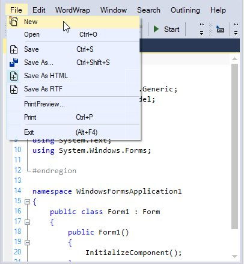

# File Operation in Windows Forms Syntax Editor

Supports all file operations like create new, open, or save.

## Load file

The [LoadFile](https://help.syncfusion.com/cr/windowsforms/Syncfusion.Windows.Forms.Edit.EditControl.html#Syncfusion_Windows_Forms_Edit_EditControl_LoadFile) function loads the content of any desired file into the EditControl. The function is explained as follows.

<table>
<tr>
<th>
Function</th><th>
Description</th></tr>
<tr>
<td>
LoadFile</td><td>
Shows the Open File dialog to the user and opens the selected file.</td></tr>
</table>

N> The character encoding for the text can also be specified while loading the file.





// Displays the Open File dialog.

this.editControl1.LoadFile();

// Loads the content of the specified file.

this.editControl1.LoadFile("Temp.txt", Encoding.ASCII);





' Displays the Open File dialog.

Me.editControl1.LoadFile()

' Loads the content of the specified file. 

Me.editControl1.LoadFile("Temp.txt", Encoding.ASCII)





### Retrieve loaded file path

The name of the currently loaded stream in the Edit Control can be get or set by using the [FileOpened](https://help.syncfusion.com/cr/windowsforms/Syncfusion.Windows.Forms.Edit.EditControl.html#Syncfusion_Windows_Forms_Edit_EditControl_FileOpened) property.





// Gets or sets the name of the stream that is currently loaded in the EditControl.

this.editControl1.FileOpened = new FileStream("Temp.txt", FileMode.Create);





' Gets or sets the name of the stream that is currently loaded in the EditControl.

Me.editControl1.FileOpened = New FileStream("Temp.txt", FileMode.Create)





### Retrieve loaded file name

By using the [FileName](https://help.syncfusion.com/cr/windowsforms/Syncfusion.Windows.Forms.Edit.EditControl.html#Syncfusion_Windows_Forms_Edit_EditControl_FileName) property, you can get or set the name of the currently loaded file in the EditControl.





// Specifies the name of the file loaded in the EditControl.

this.editControl1.FileName = "Temp.txt";





' Specifies the name of the file loaded in the EditControl.

Me.editControl1.FileName = "Temp.txt"





## Load from stream

Content of the EditControl can also be loaded to a particular stream by using the specified encoding and line end style by using the [LoadStream](https://help.syncfusion.com/cr/windowsforms/Syncfusion.Windows.Forms.Edit.EditControl.html#Syncfusion_Windows_Forms_Edit_EditControl_LoadStream_System_IO_Stream_) function.





// Loads the content of the specified stream into the EditControl.

this.editControl1.LoadStream(streamName);

// Loads the specified stream and configuration.

this.editControl1.LoadStream(streamName, config);





' Loads the content of the specified stream into the EditControl.

Me.editControl1.LoadStream(streamName)

' Loads the specified stream and configuration.

Me.editControl1.LoadStream(streamName, config)





## Drop file to load contents

The EditControl provides a complete support for dropped the dragged files by using the `DropAllFiles` and `FileExtension` properties. The properties are explained as follows.

<table>
<tr>
<th>
Properties</th><th>
Description</th></tr>
<tr>
<td>
{{ '[DropAllFiles](https://help.syncfusion.com/cr/windowsforms/Syncfusion.Windows.Forms.Edit.EditControl.html#Syncfusion_Windows_Forms_Edit_EditControl_DropAllFiles)' | markdownify }}
</td><td>
Specifies whether all files can be dropped onto EditControl or not. If set to `false`, files with extensions contained in FileExtensions can only be dropped.</td></tr>
<tr>
<td>
{{ '[FileExtensions](https://help.syncfusion.com/cr/windowsforms/Syncfusion.Windows.Forms.Edit.EditControl.html#Syncfusion_Windows_Forms_Edit_EditControl_FileExtensions)' | markdownify }}</td><td>
Specifies the extensions of files that can be dropped to the EditControl.</td></tr>
</table>





// Drops all files onto EditControl.

this.editControl1.DropAllFiles = true;

// Specifies the file extensions of files that can be dropped onto EditControl. 

this.editControl1.FileExtensions = new string[] {".cs", ".sql", ".vb", ".xml"};





' Drops all files onto EditControl.

Me.editControl1.DropAllFiles = True

' Specifies the file extensions of files that can be dropped onto EditControl.

Me.editControl1.FileExtensions = New String() {".cs", ".sql", ".vb", ".xml"} 





The following properties can be used to insert the text based on conditions described as follows.

<table>
<tr>
<th>
Properties</th><th>
Description</th></tr>
<tr>
<td>
{{ '[AllowDrop](https://help.syncfusion.com/cr/windowsforms/Syncfusion.Windows.Forms.Edit.EditControl.html#Syncfusion_Windows_Forms_Edit_EditControl_AllowDrop)' | markdownify }}</td><td>
Specifies whether the drag and drop operations are allowed for the control or not.</td></tr>
<tr>
<td>
{{ '[InsertDroppedFileIntoText](https://help.syncfusion.com/cr/windowsforms/Syncfusion.Windows.Forms.Edit.EditControl.html#Syncfusion_Windows_Forms_Edit_EditControl_InsertDroppedFileIntoText)' | markdownify }}</td><td>
Specifies whether the outer file dragged and dropped onto the EditControl should be inserted into the current content. When this property is set to `false`, the current file is closed and the dropped outer file is opened.</td></tr>
<tr>
<td>
{{ '[ShowFileDropNotification](https://help.syncfusion.com/cr/windowsforms/Syncfusion.Windows.Forms.Edit.EditControl.html#Syncfusion_Windows_Forms_Edit_EditControl_ShowFileDropNotification)' | markdownify }}</td><td>
Specifies whether the notification message is to be displayed when the outer file is dragged and dropped onto the EditControl.</td></tr>
</table>





//To set the EditControl that allows to Drag and Dropping files

this.editControl1.AllowDrop = true; 

// Specifies whether the outer file dragged and dropped onto the EditControl should be inserted into the current content.

this.editControl1.InsertDroppedFileIntoText = true;

// To hide the notification message displayed when the outer file is dragged and dropped onto the EditControl.

this.editControl1.ShowFileDropNotification = false;





'To set the EditControl that allows to Drag and Dropping files

Me.editControl1.AllowDrop = True

‘Specifies whether the outer file dragged and dropped onto the EditControl should be inserted into the current content.

Me.editControl1.InsertDroppedFileIntoText = True

' To hide the notification message displayed when the outer file is dragged and dropped onto the EditControl.

Me.editControl1.ShowFileDropNotification = False





## File modification

By using the [FileModified](https://help.syncfusion.com/cr/windowsforms/Syncfusion.Windows.Forms.Edit.EditControl.html#Syncfusion_Windows_Forms_Edit_EditControl_FileModified) and [IsModified](https://help.syncfusion.com/cr/windowsforms/Syncfusion.Windows.Forms.Edit.EditControl.html#Syncfusion_Windows_Forms_Edit_EditControl_IsModified) properties of the EditControl, you can ensure whether the content of the file was modified or not.





Console.WriteLine(this.editControl1.IsModified);





Console.WriteLine(Me.editControl1.IsModified)





## Create file

The [New](https://help.syncfusion.com/cr/windowsforms/Syncfusion.Windows.Forms.Edit.EditControl.html#Syncfusion_Windows_Forms_Edit_EditControl_New) and [NewFile](https://help.syncfusion.com/cr/windowsforms/Syncfusion.Windows.Forms.Edit.EditControl.html#Syncfusion_Windows_Forms_Edit_EditControl_NewFile) functions helps to create a new stream or file. It optionally allows you to set the language to be used by specifying the appropriate configuration settings.





// Creates a new stream with default configuration settings.

this.editControl.New();

// Creates a new file with default configuration settings.

this.editControl.NewFile();

// Creates a new stream with specified configuration settings.

this.editControl.New(ConfigLanguage language);

// Creates a new file with specified configuration settings.

this.editControl.NewFile(IConfigLanguage language);





' Creates a new file.

Me.editControl1.NewFile()

Me.editControl1.[New]()

' **config** is Configuration Settings file of type IConfigLanguage.

Me.editControl1.NewFile(config)

Me.editControl1.[New](config)





## Discard changes

The changes made to the content of the EditControl can be discarded by using the [FlushChanges](https://help.syncfusion.com/cr/windowsforms/Syncfusion.Windows.Forms.Edit.EditControl.html#Syncfusion_Windows_Forms_Edit_EditControl_FlushChanges) function.





// Saves changes made to the contents of the EditControl into the current stream.

this.editControl1.FlushChanges();





' Saves changes made to the contents of the EditControl into the current stream.

Me.editControl1.FlushChanges()





## Save file

The following functions helps to save a file in the EditControl.

<table>
<tr>
<th>
Functions</th><th>
Description</th></tr>
<tr>
<td>
{{ '[SaveFile](https://help.syncfusion.com/cr/windowsforms/Syncfusion.Windows.Forms.Edit.EditControl.html#Syncfusion_Windows_Forms_Edit_EditControl_SaveFile_System_String_)' | markdownify }}
</td><td>
Saves the content of the EditControl to a specified file.</td></tr>
<tr>
<td>
{{ '[Save](https://help.syncfusion.com/cr/windowsforms/Syncfusion.Windows.Forms.Edit.EditControl.html#Syncfusion_Windows_Forms_Edit_EditControl_Save)' | markdownify }}</td><td>
Invokes the Save File dialog box and lets you save the contents of the EditControl to the specified file.</td></tr>
<tr>
<td>
{{ '[SaveAs](https://help.syncfusion.com/cr/windowsforms/Syncfusion.Windows.Forms.Edit.EditControl.html#Syncfusion_Windows_Forms_Edit_EditControl_SaveAs)' | markdownify }}</td><td>
Opens SaveAs dialog and prompts you to enter the name of the file.</td></tr>
<tr>
<td>
{{ '[SaveModified](https://help.syncfusion.com/cr/windowsforms/Syncfusion.Windows.Forms.Edit.EditControl.html#Syncfusion_Windows_Forms_Edit_EditControl_SaveModified)' | markdownify }}</td><td>
Saves the file only if it was modified and prompts for the filename if needed. This is especially useful when the application is about to be closed or a new file is being loaded into the EditControl.</td></tr>
</table>





// Saves the contents of the file.

this.editControl1.SaveFile("Temp.txt", Encoding.Unicode, Syncfusion.IO.NewLineStyle.Control);

// Displays the Save File dialog.

this.editControl1.Save();

// Displays the SaveAs dialog. 

this.editControl1.SaveAs();

// Saves the contents of the file after modification, when a new file is loaded, or when a file is closed.

this.editControl1.SaveModified();





' Saves the contents of the file.

Me.editControl1.SaveFile("Temp.txt", Encoding.Unicode, Syncfusion.IO.NewLineStyle.Control)

' Displays the Save File dialog.

Me.editControl1.Save()

' Displays the SaveAs dialog. 

Me.editControl1.SaveAs()

' Saves the contents of the file after modification, when a new file is loaded, or when a file is closed.

Me.editControl1.SaveModified()





### Save as stream

Content of the EditControl can also be saved to a particular stream by using the specified encoding and line end style by using the [SaveStream](https://help.syncfusion.com/cr/windowsforms/Syncfusion.Windows.Forms.Edit.EditControl.html#Syncfusion_Windows_Forms_Edit_EditControl_SaveStream_System_IO_Stream_System_Text_Encoding_Syncfusion_IO_NewLineStyle_) function.





// Saves content to the specified stream using specified encoding and line end style.

this.editControl1.SaveStream(System.IO.Stream.Null , Encoding.BigEndianUnicode, Syncfusion.IO.NewLineStyle.Mac);





' Saves content to the specified stream using specified encoding and line end style.

Me.editControl1.SaveStream(System.IO.Stream.Null , Encoding.BigEndianUnicode, Syncfusion.IO.NewLineStyle.Mac)





The changes made to the content of the EditControl can be saved or discarded. The [SaveOnClose](https://help.syncfusion.com/cr/windowsforms/Syncfusion.Windows.Forms.Edit.EditControl.html#Syncfusion_Windows_Forms_Edit_EditControl_SaveOnClose) property specifies whether the default Save Changes prompt should be displayed on closing the EditControl or not.





// Disables the default Save Changes prompt that appears when the form hosting EditControl containing unsaved contents is closed.

this.editControl1.SaveOnClose = false; 





' Disables the default Save Changes prompt that appears when the form hosting EditControl containing unsaved contents is closed.

Me.editControl1.SaveOnClose = False 





### Auto Save file on close

When the `SaveOnClose` property is set to `false`, the default Save Changes prompt does not appear. The user should perform some custom Save routine in the Closing event handler of the host form to save the unsaved contents in the EditControl. If not, they will be lost.





private void Form1_Closing(object sender, System.ComponentModel.CancelEventArgs e)
{

   if (this.editControl1.SaveOnClose == false)
   {

      if (this.editControl1.SaveModified() == true)

          // Perform custom Save routine or show custom Save Changes dialog or set Cancel to False.                       
          e.Cancel = false;

      else

          e.Cancel = true;

    }

}
 




Private Sub Form1_Closing(ByVal sender As Object, ByVal e As System.ComponentModel.CancelEventArgs) Handles MyBase.Closing

If Me.editControl1.SaveOnClose = False Then

If Me.editControl1.SaveModified() = True Then

       ' Perform custom Save routine or show custom Save Changes dialog or set Cancel to False.

       e.Cancel = False

       Else

       e.Cancel = True

       End If

End If

End Sub





When the SaveOnClose property is set to `true`, the default Save Changes prompt appears on closing the EditControl without saving the contents. Click Yes to save the changes, No to discard the changes, or Cancel to close the Save Changes prompt.

The above task can be further customized by handling the Closing event of EditControl. The Closing event is triggered just before a file or stream is closed in the EditControl.





private void editControl1_Closing(object sender, Syncfusion.Windows.Forms.Edit.StreamCloseEventArgs e)
{

// Cancel the file or stream closing action.

e.Action = SaveChangesAction.Cancel;

// Close the file or stream without saving the unsaved contents, the changes will be lost forever.

e.Action = SaveChangesAction.Discard;

// Silently saves the unsaved contents to the currently open file or stream.

// If the contents have not been saved to a file or stream as yet, the Save Changes prompt is displayed.

e.Action = SaveChangesAction.Save;

// Displays the default Save Changes prompt if there are unsaved contents when the file or stream is closed.

e.Action = SaveChangesAction.ShowDialog;

}





Private Sub editControl1_Closing(ByVal sender As Object, ByVal e As Syncfusion.Windows.Forms.Edit.StreamCloseEventArgs) Handles EditControl1.StreamClose

' Cancel the file or stream closing action.

e.Action = SaveChangesAction.Cancel

' Close the file or stream without saving the unsaved contents, the changes will be lost forever.

e.Action = SaveChangesAction.Discard

' Silently saves the unsaved contents to the currently open file or stream.

' If the contents have not been saved to a file or stream as yet, the Save Changes prompt is displayed

e.Action = SaveChangesAction.Save

' Displays the default Save Changes prompt if there are unsaved contents when the file or stream is closed.

e.Action = SaveChangesAction.ShowDialog

End Sub





N> The default value of e.Action is SaveChangesAction.ShowDialog.

## Insert file

The following functions helps to insert a file in the EditControl.

<table>
<tr>
<th>
Functions</th><th>
Parameters</th><th>
Description</th></tr>
<tr>
<td>
{{ '[InsertFile](https://help.syncfusion.com/cr/windowsforms/Syncfusion.Windows.Forms.Edit.EditControl.html#Syncfusion_Windows_Forms_Edit_EditControl_InsertFile)' | markdownify }}</td><td>
-</td><td>
Shows Insert file dialog and inserts the selected file.</td></tr>
<tr>
<td>
{{ '[InsertFile](https://help.syncfusion.com/cr/windowsforms/Syncfusion.Windows.Forms.Edit.EditControl.html#Syncfusion_Windows_Forms_Edit_EditControl_InsertFile)' | markdownify }}</td><td>
 public void InsertFile(string filePath)</td><td>
Inserts a file by using file path.</td></tr>
</table>





//Displays the Insert dialog box

this.editControl1.InsertFile();

//Insert a file using file path

this.editControl1.InsertFile(@"..\\..\\Form2.cs");





'Displays the Insert dialog box

Me.editControl1.InsertFile

'Insert a file using file path

Me.editControl1.InsertFile(@"..\\..\\Form2.cs")





## Close file

The [Close](https://help.syncfusion.com/cr/windowsforms/Syncfusion.Windows.Forms.Edit.EditControl.html#Syncfusion_Windows_Forms_Edit_EditControl_Close) function helps to close the currently opened file or stream and displays the EditControl in the read-only mode until a new file or stream is opened. The function is explained as follows.

<table>
<tr>
<th>
Function</th><th>
Description</th></tr>
<tr>
<td>
Close</td><td>
Closes the stream and makes the control readonly.</td></tr>
</table>





// Closes the currently open file or stream in the EditControl. 

this.editControl1.Close(); 





' Closes the currently open file or stream in the EditControl. 

Me.editControl1.Close()




