# Syntax Highlighting in Windows Forms Syntax Editor

Provides built-in syntax highlighting support for popular languages like C#, VB.NET, XML, HTML, Java, SQL, PowerShell, C, JavaScript, VBScript, and Delphi.

## Configure built-in language

Syntax highlighting built-in languages can be applied by using [KnownLanguages](https://help.syncfusion.com/cr/windowsforms/Syncfusion.Windows.Forms.Edit.Enums.KnownLanguages.html) enumerator and [ApplyConfiguration](https://help.syncfusion.com/cr/windowsforms/Syncfusion.Windows.Forms.Edit.EditControl.html#Syncfusion_Windows_Forms_Edit_EditControl_ApplyConfiguration_Syncfusion_Windows_Forms_Edit_Enums_KnownLanguages_) function. 

**CSharp** 





// Considering configuration settings for C# as an example. Using the KnownLanguages enumerator.

this.editControl1.ApplyConfiguration(Syncfusion.Windows.Forms.Edit.Enums.KnownLanguages.CSharp);





' Considering configuration settings for C# as an example. Using the KnownLanguages enumerator.

Me.editControl1.ApplyConfiguration(Syncfusion.Windows.Forms.Edit.Enums.KnownLanguages.CSharp)





The [LoadFile](https://help.syncfusion.com/cr/windowsforms/Syncfusion.Windows.Forms.Edit.EditControl.html#Syncfusion_Windows_Forms_Edit_EditControl_LoadFile) function in the EditControl helps to load the content of any desired file into the EditControl instead of typing the code in it.





// Loading the files into EditControl by passing the file name as parameter to the LoadFile function.

this.editControl1.LoadFile(Path.GetDirectoryName(Application.ExecutablePath) + @"\..\..\FileName.cs");





` Loading the files into EditControl by passing the file name as parameter to the LoadFile function.

Me.editControl1.LoadFile(Path.GetDirectoryName(Application.ExecutablePath) + @"\..\..\FileName.cs")





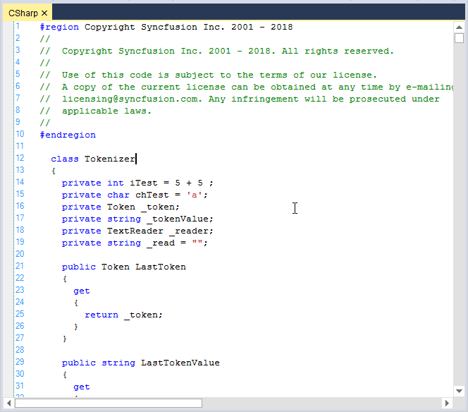

**Delphi** 





// Considering configuration settings for Delphi as an example. Using the KnownLanguages enumerator.

this.editControl1.ApplyConfiguration(Syncfusion.Windows.Forms.Edit.Enums.KnownLanguages.Delphi);

// Loading the files into EditControl by passing the file name as parameter to the LoadFile function.

this.editControl1.LoadFile(Path.GetDirectoryName(Application.ExecutablePath) + @"\..\..\DelphiSource.pas");





' Considering configuration settings for Delphi as an example. Using the KnownLanguages enumerator.

Me.editControl1.ApplyConfiguration(Syncfusion.Windows.Forms.Edit.Enums.KnownLanguages.Delphi)

` Loading the files into EditControl by passing the file name as parameter to the LoadFile function.

Me.editControl1.LoadFile(Path.GetDirectoryName(Application.ExecutablePath) + @"\..\..\DelphiSource.pas")





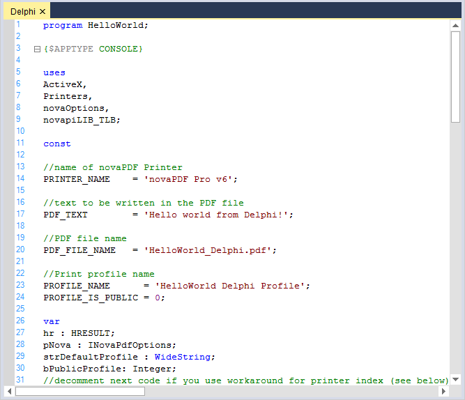

**XML** 





// Considering configuration settings for XML as an example. Using the KnownLanguages enumerator.

this.editControl1.ApplyConfiguration(Syncfusion.Windows.Forms.Edit.Enums.KnownLanguages.XML);

// Loading the files into EditControl by passing the file name as parameter to the LoadFile function.

this.editControl1.LoadFile(Path.GetDirectoryName(Application.ExecutablePath) + @"\..\..\XMLSource.xml");





' Considering configuration settings for XML as an example. Using the KnownLanguages enumerator.

Me.editControl1.ApplyConfiguration(Syncfusion.Windows.Forms.Edit.Enums.KnownLanguages.XML)

` Loading the files into EditControl by passing the file name as parameter to the LoadFile function.

Me.editControl1.LoadFile(Path.GetDirectoryName(Application.ExecutablePath) + @"\..\..\XMLSource.xml")





**HTML** 





// Considering configuration settings for HTML as an example. Using the KnownLanguages enumerator.

this.editControl1.ApplyConfiguration(Syncfusion.Windows.Forms.Edit.Enums.KnownLanguages.HTML);

// Loading the files into EditControl by passing the file name as parameter to the LoadFile function.

this.editControl1.LoadFile(Path.GetDirectoryName(Application.ExecutablePath) + @"\..\..\HTMLSource.html");





' Considering configuration settings for HTML as an example. Using the KnownLanguages enumerator.

Me.editControl1.ApplyConfiguration(Syncfusion.Windows.Forms.Edit.Enums.KnownLanguages.HTML)

` Loading the files into EditControl by passing the file name as parameter to the LoadFile function.

Me.editControl1.LoadFile(Path.GetDirectoryName(Application.ExecutablePath) + @"\..\..\HTMLSource.html")





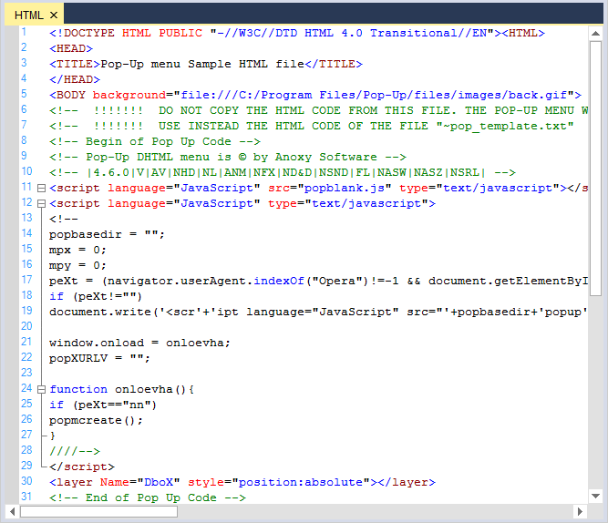

**VB.NET** 





// Considering configuration settings for VB.NET as an example. Using the KnownLanguages enumerator.

this.editControl1.ApplyConfiguration(Syncfusion.Windows.Forms.Edit.Enums.KnownLanguages.VBNET);

// Loading the files into EditControl by passing the file name as parameter to the LoadFile function.

this.editControl1.LoadFile(Path.GetDirectoryName(Application.ExecutablePath) + @"\..\..\VBSource.vb");





' Considering configuration settings for VB.NET as an example. Using the KnownLanguages enumerator.

Me.editControl1.ApplyConfiguration(Syncfusion.Windows.Forms.Edit.Enums.KnownLanguages.VBNET)

` Loading the files into EditControl by passing the file name as parameter to the LoadFile function.

Me.editControl1.LoadFile(Path.GetDirectoryName(Application.ExecutablePath) + @"\..\..\VBSource.vb")





**SQL** 





// Considering configuration settings for SQL as an example. Using the KnownLanguages enumerator.

this.editControl1.ApplyConfiguration(Syncfusion.Windows.Forms.Edit.Enums.KnownLanguages.SQL);

// Loading the files into EditControl by passing the file name as parameter to the LoadFile function.

this.editControl1.LoadFile(Path.GetDirectoryName(Application.ExecutablePath) + @"\..\..\SQLSource.sql");





' Considering configuration settings for SQL as an example. Using the KnownLanguages enumerator.

Me.editControl1.ApplyConfiguration(Syncfusion.Windows.Forms.Edit.Enums.KnownLanguages.SQL)

` Loading the files into EditControl by passing the file name as parameter to the LoadFile function.

Me.editControl1.LoadFile(Path.GetDirectoryName(Application.ExecutablePath) + @"\..\..\SQLSource.sql")





**Java** 





// Considering configuration settings for Java as an example. Using the KnownLanguages enumerator.

this.editControl1.ApplyConfiguration(Syncfusion.Windows.Forms.Edit.Enums.KnownLanguages.Java);

// Loading the files into EditControl by passing the file name as parameter to the LoadFile function.

this.editControl1.LoadFile(Path.GetDirectoryName(Application.ExecutablePath) + @"\..\..\JavaSource.Java");





' Considering configuration settings for Java as an example. Using the KnownLanguages enumerator.

Me.editControl1.ApplyConfiguration(Syncfusion.Windows.Forms.Edit.Enums.KnownLanguages.Java)

` Loading the files into EditControl by passing the file name as parameter to the LoadFile function.

Me.editControl1.LoadFile(Path.GetDirectoryName(Application.ExecutablePath) + @"\..\..\JavaSource.Java")





**VBScript** 





// Considering configuration settings for VBScript as an example. Using the KnownLanguages enumerator.

this.editControl1.ApplyConfiguration(Syncfusion.Windows.Forms.Edit.Enums.KnownLanguages.VBScript);

// Loading the files into EditControl by passing the file name as parameter to the LoadFile function.

this.editControl1.LoadFile(Path.GetDirectoryName(Application.ExecutablePath) + @"\..\..\VBScriptSource.vb");





' Considering configuration settings for VBScript as an example. Using the KnownLanguages enumerator.

Me.editControl1.ApplyConfiguration(Syncfusion.Windows.Forms.Edit.Enums.KnownLanguages.VBScript)

` Loading the files into EditControl by passing the file name as parameter to the LoadFile function.

Me.editControl1.LoadFile(Path.GetDirectoryName(Application.ExecutablePath) + @"\..\..\VBScriptSource.vb")





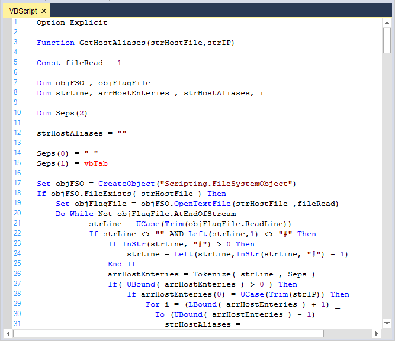

**JScript** 





// Considering configuration settings for JScript as an example. Using the KnownLanguages enumerator.

this.editControl1.ApplyConfiguration(Syncfusion.Windows.Forms.Edit.Enums.KnownLanguages.JScript);

// Loading the files into EditControl by passing the file name as parameter to the LoadFile function.

this.editControl1.LoadFile(Path.GetDirectoryName(Application.ExecutablePath) + @"\..\..\JScriptSource.js");





' Considering configuration settings for JScript as an example. Using the KnownLanguages enumerator.

Me.editControl1.ApplyConfiguration(Syncfusion.Windows.Forms.Edit.Enums.KnownLanguages.JScript)

` Loading the files into EditControl by passing the file name as parameter to the LoadFile function.

Me.editControl1.LoadFile(Path.GetDirectoryName(Application.ExecutablePath) + @"\..\..\JScriptSource.js")





**PowerShell** 





// Considering configuration settings for PowerShell as an example. Using the KnownLanguages enumerator.

this.editControl1.ApplyConfiguration(Syncfusion.Windows.Forms.Edit.Enums.KnownLanguages.PowerShell);

// Loading the files into EditControl by passing the file name as parameter to the LoadFile function.

this.editControl1.LoadFile(Path.GetDirectoryName(Application.ExecutablePath) + @"\..\..\PowerShell.ps1");





' Considering configuration settings for PowerShell as an example. Using the KnownLanguages enumerator.

Me.editControl1.ApplyConfiguration(Syncfusion.Windows.Forms.Edit.Enums.KnownLanguages.PowerShell)

` Loading the files into EditControl by passing the file name as parameter to the LoadFile function.

Me.editControl1.LoadFile(Path.GetDirectoryName(Application.ExecutablePath) + @"\..\..\PowerShell.ps1")





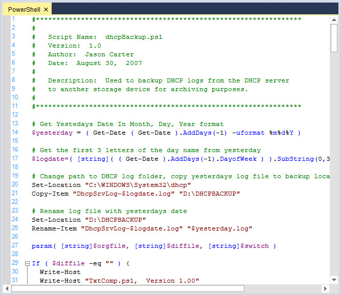

N> Refer to the following sample link that demonstrates the `SyntaxHighlighting` functionalities of the EditControl:
C:\Users\&lt;User&gt;\AppData\Syncfusion\EssentialStudio\Version Number\\Windows\Edit.Windows\Samples\Syntax Highlighting\Syntax Coloring

## Customize built-in language settings

The EditControl provides support to customize the built-in language configuration settings.

### Initialize the configuration language

In the EditControl, languages should be configured in XML file named Config.xml. 

Name of the language must be set by using the name attribute of the `ConfigLanguage` tag attribute. When the language is case insensitive, you should set the `CaseInsensitive` attribute to `true`.



<ConfigLanguage name="C#">

    <formats>
    </formats>
    
    <extensions>
    </extensions>
    
    <lexems>
    </lexems>
    
    <splits>
    </splits>
  
</ConfigLanguage>



### Format 

It contains a list of definitions of the formats that can be used later in lexem configuration. Every format contains the attributes such as name, font,foreground color, font color, background color, style, weight, underline, and line color.



  <formats>
      <format name="Text" Font="Consolas, 12pt"/>
  </formats>



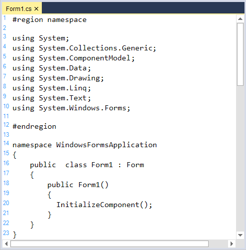

### Font color

Font color of any format in the specified language can be customized by using the `FontColor` property of Format tag. 



  <ConfigLanguage name="C#">
    <formats>
      <format name="Text" Font="Consolas, 10pt" FontColor="Red" />
    </formats>
  </ConfigLanguage>



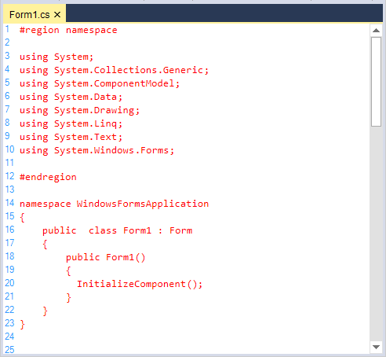

### Lexem

Lexem contains rules for parsing the text. `Type` and `FormatName` attributes of lexems helps to specify the format of the lexem. 

* Type: Used for standard predefined types of the lexems. 
* FormatName: Used when the type is Custom.



   <lexem BeginBlock="public" Type="KeyWord" />
   <lexem BeginBlock="class" Type="KeyWord" />
   <lexem BeginBlock="+" Type="Operator" />
   <lexem BeginBlock="-" Type="Operator" />



For non-complex lexems, you can specify `ContinueBlock` and `EndBlock` attributes.

* If you specify ContinueBlock, the parser will read words (tokens) and set the specified formatting for them until it encounters a ContinueBlock.
* If you specify EndBlock, specified formatting will be set only if first token matches ContinueBlock and is followed by EndBlock.

All matched text will be treated later as one word, and won’t be broken into parts in WordWrap mode.

#### SubLexems

Sublexems must be skipped if they are found after BeginBlock string and before EndBlock string. 



  <SubLexems>
     <lexem BeginBlock="\" EndBlock="&quot;" Type="String" />
  </SubLexems>



#### Collapsable region

Collapsable region can be customized by adding the desired lexem with attributes such as `IsCollapsable` and `CollapseName`. 



<lexems>

     <lexem BeginBlock="{" EndBlock="}" Type="KeyWord" IsComplex="true" IsCollapsable="true" Indent="true" DropContextPrompt="true" CollapseName="{...}">
        <SubLexems>
          <lexem BeginBlock="\n" IsBeginRegex="true" />
        </SubLexems>
     </lexem>

</lexems>



This code example works only when the [ShowOutliningCollapsers](https://help.syncfusion.com/cr/windowsforms/Syncfusion.Windows.Forms.Edit.EditControl.html#Syncfusion_Windows_Forms_Edit_EditControl_ShowOutliningCollapsers) property in EditControl is `true`.

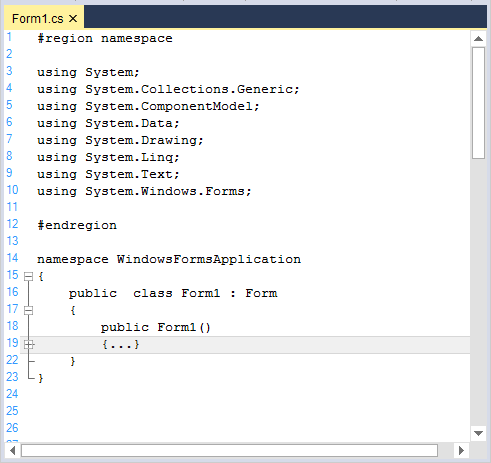

### Keyword 

Custom keywords can be added or existing keywords can be customized in built-in languages. 



  <formats>
      <format name="KeyWord" Font="Consolas, 10pt" FontColor="Green" />
  </formats>
  <lexems>
    <lexem BeginBlock="int" Type="KeyWord" />
    <lexem BeginBlock="using" Type="KeyWord" />
  </lexems>
 


### Operator

Custom operators can be added or existing operators can be customized in built-in languages by using `Lexem` configuration. 



 <formats>
      <format name="Operator" Font="Consolas, 10pt" FontColor="Brown" />
  </formats>
 <lexems>
   <lexem BeginBlock="++" Type="Operator" />
   <lexem BeginBlock="+" Type="Operator" />
 </lexems>



 
### Regex

A regular expression is a pattern that could be matched against any input text. 

For example, to customize the strings ends with !, set the regex property of `IsBeginRegex` and `IsEndRegex` to `true` based on the expression given in the lexem.



  <formats>
    <format name="String" Font="Courier New, 13pt, style=Bold" FontColor="Brown" />
  </formats>

  <lexems>
    <lexem BeginBlock="[A-z\s]+\!" IsBeginRegex="true"  Type="String"/>
  </lexems>
 
  // we have to mention the same Regex expression in the Split tag.  

	<splits>
      <split IsRegex="true">[A-z\s]+\!</split>	 
	</splits>



#### Error words highlighting

Error lexems can be added to the language by declaring a format names Error. It can be highlighted using underlines. Following code is an example of declaring "#endregion" as error. If #region is not BeginBlock, priority values will be assigned to order the interrupt.



<formats>
  <format name="Error" Font="Courier New, 10pt" FontColor="Black" underline="Wave" LineColor="Red" />
</formats>

<lexems>
<lexem BeginBlock="pubblic" Type="Error" Priority="-10" />
<lexem BeginBlock="#else" Type="Error" Priority="-10" />
</lexems>

 <splits>
      <split>#else</split>	 
  </splits> 



### Splits

Splits helps to configure two different words as single. For example, consider # and region that can be treated as single word by using `Split` configuration.



<formats>
  <format name="KeyWord" Font="Courier New, 14pt" FontColor="Orange" />
</formats>

<lexems>
   <lexem BeginBlock="#region" Type="KeyWord" />
   <lexem BeginBlock="#endregion" Type="KeyWord" />
</lexems>

<splits>
  <split>#region</split>
  <split>#endregion</split>
</splits>



### Auto replace triggers

`AutoReplaceTriggers` attribute helps to auto corrects the incorrect spelling of lexems.



<ConfigLanguage name="C#" TriggersActivators=".">

<AutoReplaceTriggers>

   <AutoReplaceTrigger From="teh" To="the" />
	 <AutoReplaceTrigger From="itn" To="int" />

</AutoReplaceTriggers>

 </ConfigLanguage>







this.editControl1.UseAutoreplaceTriggers = true;





Me.editControl1.UseAutoreplaceTriggers = True





N> To enable this feature, set the `TriggersActivators` property of ConfigLanguage tag attribute and the `UseAutoreplaceTriggers` property of EditControl should be set to `true`.

### File extension

Extensions contain a list of extensions associated with that particular language.


<extensions>
	<extension>csi</extension>
</extensions>


### Apply custom configuration in EditControl

The following code examples helps you to configure the configuration file in the EditControl.





private string configFile = Path.GetDirectoryName(Application.ExecutablePath) + @"\..\..\config.xml";

// Plug-in an external configuration file.

this.editControl1.Configurator.Open(configFile);

// Apply the configuration defined in the configuration file.

this.editControl1.ApplyConfiguration("C#");





private string configFile = Path.GetDirectoryName(Application.ExecutablePath) + @"\..\..\config.xml";

' Plug-in an external configuration file.

Me.editControl1.Configurator.Open(configFile)

' Apply the configuration defined in the configuration file.

Me.editControl1.ApplyConfiguration("C#")





## Custom language using XML

The EditControl provides supports for custom language configuration. You can plug-in an external configuration file that defines a custom language to the EditControl by using the [Configurator.Open](https://help.syncfusion.com/cr/windowsforms/Syncfusion.Windows.Forms.Edit.EditControl.html#Syncfusion_Windows_Forms_Edit_EditControl_Configurator) and [ApplyConfiguration](https://help.syncfusion.com/cr/windowsforms/Syncfusion.Windows.Forms.Edit.EditControl.html#Syncfusion_Windows_Forms_Edit_EditControl_ApplyConfiguration_Syncfusion_Windows_Forms_Edit_Enums_KnownLanguages_) functions.

### Initialize the configuration language.

In the EditControl, languages should be configured in XML file named Config.xml. 

Name of the language must be set by using the name attribute of the `ConfigLanguage` tag attribute. When the language is case insensitive, you should set the `CaseInsensitive` attribute to `true`.



<ConfigLanguage name="C++">

    <formats>
    </formats>
    
    <extensions>
    </extensions>
    
    <lexems>
    </lexems>
    
    <splits>
    </splits>
  
</ConfigLanguage>



### Format 

It contains a list of definitions of the formats that can be used later in lexem configuration. Every format is specified by a tag <format>.



<formats>
      <format name="Text" Font="Consolas, 12pt"/>
</formats>



### Font color

Font color of any format in the specified language can be customized by using the `FontColor` property of Format tag. 



<formats>
  <format name="Text" Font="Courier New, 10pt style=Bold"  FontColor="Red" />
</formats>



### Lexem

Lexem contains rules for parsing the text. `Type` and `FormatName` attributes of lexems helps to specify the format of the lexem. 

* Type: Used for standard predefined types of the lexems. 
* FormatName: Used when the type is Custom.



<lexems>
  <!--Adds the Keywords in the lexem-->.
  <lexem BeginBlock="int" Type="KeyWord" />
  <lexem BeginBlock="while" Type="KeyWord" />
  <!--Adds the operator in the Lexem-->.
   <lexem BeginBlock="&lt;" Type="Operator" />
   <lexem BeginBlock="&gt;" Type="Operator" />
</lexems>



For non-complex lexems, you can specify `ContinueBlock` and `EndBlock` attributes.

* If you specify ContinueBlock, the parser will read words (tokens) and set the specified formatting for them until it encounters a ContinueBlock.
* If you specify EndBlock, specified formatting will be set only if first token matches ContinueBlock and is followed by EndBlock.

All matched text will be treated later as one word, and won’t be broken into parts in WordWrap mode.

#### SubLexems

Sublexems must be skipped if they are found after BeginBlock string and before EndBlock string. 



  <SubLexems>
     <lexem BeginBlock="\" EndBlock="&quot;" Type="String" />
  </SubLexems>



#### Collapsable region

Collapsable region can be customized by adding the desired lexem with attributes such as `IsCollapsable` and `CollapseName`.



<lexems>

     <lexem BeginBlock="{" EndBlock="}" Type="KeyWord" IsComplex="true" IsCollapsable="true" Indent="true" DropContextPrompt="true" CollapseName="{...}">
        <SubLexems>
          <lexem BeginBlock="\n" IsBeginRegex="true" />
        </SubLexems>
      </lexem>

</lexems>



This code example works only when the [ShowOutliningCollapsers](https://help.syncfusion.com/cr/windowsforms/Syncfusion.Windows.Forms.Edit.EditControl.html#Syncfusion_Windows_Forms_Edit_EditControl_ShowOutliningCollapsers) property in the EditControl is `true`.

### Keyword 

Custom keywords can be added or existing keywords can be customized in built-in languages by using `Lexem` configuration. 



  <formats>
      <format name="KeyWord" Font="Consolas, 10pt" FontColor="White" />
  </formats>
  <lexems>
    <lexem BeginBlock="int" Type="KeyWord" />
    <lexem BeginBlock="using" Type="KeyWord" />
  </lexems>
 


### Operator

Custom operators can be added or existing operators can be customized in built-in languages. 



 <formats>
      <format name="Operator" Font="Consolas, 10pt" FontColor="Brown" />
  </formats>
 <lexems>
   <lexem BeginBlock="&lt;" Type="Operator" />
   <lexem BeginBlock="&gt;" Type="Operator" />
 </lexem>



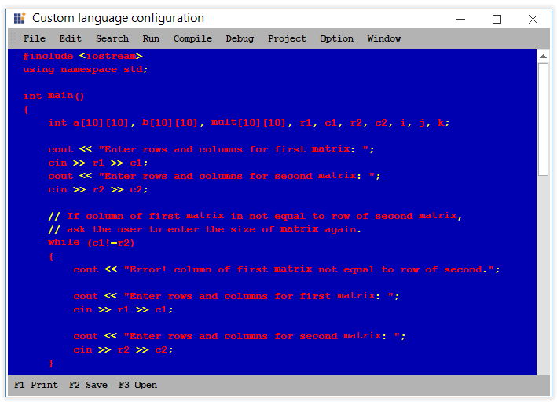
 
### Regex

A regular expression is a pattern that could be matched against any input text. 

For example, to customize the strings that ends with !, set the regex property of `IsBeginRegex` and `IsEndRegex` to true based on the expression given in the lexem.



  <formats>
    <format name="String" Font="Courier New, 13pt, style=Bold" FontColor="Brown" />
  </formats>

  <lexems>
    <lexem BeginBlock="[A-z\s]+\!" IsBeginRegex="true"  Type="String"/>
  </lexems>
 
  // we have to mention the same Regex expression in the Split tag.  

	<splits>
      <split IsRegex="true">[A-z\s]+\!</split>	 
	</splits>



#### Error words highlighting

Error lexems can be added to the language by declaring a format names Error and it can be highlighted using underlines.



<formats>
  <format name="Error" Font="Courier New, 10pt" FontColor="Black" underline="Wave" LineColor="Red" />
</formats>

<lexems>
<lexem BeginBlock="#endregion" Type="Error" Priority="-10" />
<lexem BeginBlock="#endif" Type="Error" Priority="-10" />
<lexem BeginBlock="#else" Type="Error" Priority="-10" />
</lexems>



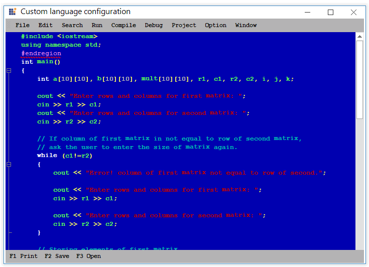

### Splits

Splits helps to configure two different words as a single. For example, consider # and include that can be treated as single word by using `Split` configuration.



<formats>
  <format name="KeyWord" Font="Courier New, 14pt" FontColor="Orange" />
</formats>

<lexems>
   <lexem BeginBlock="#include" Type="KeyWord" />
</lexems>

<splits>
  <split>#include</split>
</splits>



### Auto replace triggers

`AutoReplaceTriggers` attribute helps to auto corrects the incorrect spelling of lexems.



<ConfigLanguage name="C#" TriggersActivators=".">

 <AutoReplaceTriggers>
			<AutoReplaceTrigger From="teh" To="the" />
			<AutoReplaceTrigger From="itn" To="int" />
 </AutoReplaceTriggers>

 </ConfigLanguage>







this.editControl1.UseAutoreplaceTriggers = true;





Me.editControl1.UseAutoreplaceTriggers = True





N> To enable this feature, set the `TriggersActivators` property of ConfigLanguage tag attribute and the `UseAutoreplaceTriggers` property of the EditControl should be set to `true`.

### File extension

Extensions contain a list of extensions associated with that particular language.



 <extensions>
    <extension>cpp</extension>
  </extensions>



### Multiple language configuration

The EditControl supports multiple language configuration helps to configure one or more languages in single language configuration.



 <ConfigLanguage name="HTML (Light)" CaseInsensitive="true" Known="HTML" StartComment="&lt;!--" EndComment="--&gt;">
  <formats>
      <format name="Text" Font="Courier New, 10pt" FontColor="Black" />
      <format name="TagName" Font="Courier New, 10pt" FontColor="Green" />
      <format name="AttributeName" Font="Courier New, 10pt" FontColor="Red" />
      <format name="KeyWord" Font="Courier New, 10pt" FontColor="Blue" />
      <format name="Operator" Font="Courier New, 10pt" FontColor="Blue" />
    </formats>

    <extensions>
      <extension>html</extension>
      <extension>htm</extension>
    </extensions>

    <!--JavaScript and HTML-->
    <lexems>
      <lexem BeginBlock="&lt;" Type="Operator" />
      <lexem BeginBlock="&gt;" Type="Operator" />
      <lexem BeginBlock="if" Type="KeyWord" />
      <lexem BeginBlock="var" Type="KeyWord" />
      <lexem BeginBlock="escape" Type="KeyWord" />
      <lexem BeginBlock="head" Type="AttributeName" />
      <lexem BeginBlock="body" Type="AttributeName" />
      <lexem BeginBlock="meta" Type="AttributeName" />
      <lexem BeginBlock="title" Type="AttributeName" />
      <lexem BeginBlock="HTML" Type="AttributeName" />
      <lexem BeginBlock="PUBLIC" Type="AttributeName" />
      <lexem BeginBlock="script" EndBlock="(&gt;)|(/&gt;)" IsEndRegex="true" IsPseudoEnd="true" IsComplex="true" Type="Custom" FormatName="TagName"/>
    </lexems>

</ConfigLanguage>



N> Refer to the following sample link that demonstrates the Custom language configuration in the EditControl:
C:\Users\&lt;User&gt;\AppData\Syncfusion\EssentialStudio\Version Number\\Windows\Edit.Windows\Samples\Syntax Highlighting\Syntax Coloring

### Apply custom configuration in EditControl





private string configFile = Path.GetDirectoryName(Application.ExecutablePath) + @"\..\..\config.xml";

// Plug-in an external configuration file.

this.editControl1.Configurator.Open(configFile);

// Apply the configuration defined in the configuration file.

this.editControl1.ApplyConfiguration("C++");





private string configFile = Path.GetDirectoryName(Application.ExecutablePath) + @"\..\..\config.xml";

' Plug-in an external configuration file.

Me.editControl1.Configurator.Open(configFile)

' Apply the configuration defined in the configuration file.

Me.editControl1.ApplyConfiguration("C++")





N> Refer to the following sample link that demonstrates the Custom language configuration in the EditControl:
C:\Users\&lt;User&gt;\AppData\Syncfusion\EssentialStudio\Version Number\\Windows\Edit.Windows\Samples\Syntax Highlighting\Custom Config

## Configure custom language using code

The EditControl also offers extensive support to create configuration settings programmatically. This provides greater flexibility so that users can dynamically modify configuration settings of the currently loaded configuration. The following procedure will walks through the entire process of creating configuration settings programmatically.

### Add new configuration language to EditControl

A new configuration language can be added to the EditControl by using the [CreateLanguageConfiguration](https://help.syncfusion.com/cr/windowsforms/Syncfusion.Windows.Forms.Edit.Implementation.Config.Config.html#Syncfusion_Windows_Forms_Edit_Implementation_Config_Config_CreateLanguageConfiguration_System_String_) function of [Config](https://help.syncfusion.com/cr/windowsforms/Syncfusion.Windows.Forms.Edit.Implementation.Config.Config.html) class. Once the new configuration language is created, apply it to the contents of EditControl by using the [ApplyConfiguration](https://help.syncfusion.com/cr/windowsforms/Syncfusion.Windows.Forms.Edit.EditControl.html#Syncfusion_Windows_Forms_Edit_EditControl_ApplyConfiguration_Syncfusion_Windows_Forms_Edit_Enums_KnownLanguages_) function.





// Create a new configuration language and apply the same to the contents of the EditControl.

IConfigLanguage currentConfigLanguage = this.editControl1.Configurator.CreateLanguageConfiguration("New");

this.editControl1.ApplyConfiguration(currentConfigLanguage);





' Create a new configuration language and apply the same to the contents of the EditControl.

Dim currentConfigLanguage As IConfigLanguage = Me.editControl1.Configurator.CreateLanguageConfiguration("New")

Me.editControl1.ApplyConfiguration(currentConfigLanguage)





### Format configuration

Create a custom format object by using the [Language.Add](https://help.syncfusion.com/cr/windowsforms/Syncfusion.Windows.Forms.Edit.Interfaces.IFormatManager.html#Syncfusion_Windows_Forms_Edit_Interfaces_IFormatManager_Add_System_String_) function in the EditControl and defines its attributes.





// Creating a custom format object.

ISnippetFormat formatMethod = this.editControl1.Language.Add("CodeBehind");

// Defining its attributes.

formatMethod.Font = new Font("Garamond", 12);

formatMethod.BackColor = Color.Yellow;





' Creating a custom format object.

Dim formatMethod As ISnippetFormat = Me.EditControl1.Language.Add("CodeBehind")

' Defining its attributes.

formatMethod.Font = New Font("Garamond", 12)

formatMethod.BackColor = Color.Yellow





### Font configuration

Font color of newly created format in the specified language can be customized by using its [FontColor](https://help.syncfusion.com/cr/windowsforms/Syncfusion.Windows.Forms.Edit.Interfaces.ISnippetFormat.html#Syncfusion_Windows_Forms_Edit_Interfaces_ISnippetFormat_FontColor) property of [ISnippetFormat](https://help.syncfusion.com/cr/windowsforms/Syncfusion.Windows.Forms.Edit.Interfaces.ISnippetFormat.html) interface.





 formatMethod.Font = new Font("Garamond", 17);

 formatMethod.FontColor = Color.Red;





formatMethod.Font = new Font("Garamond", 17)

 formatMethod.FontColor = Color.Red





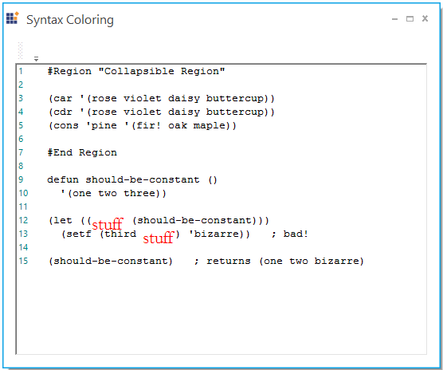

### Lexem configuration

Create a [ConfigLexem](https://help.syncfusion.com/cr/windowsforms/Syncfusion.Windows.Forms.Edit.Implementation.Config.ConfigLexem.html) object belongs to the above defined format and define its attributes. Add the ConfigLexem object to the Lexems collection of the current language.





ConfigLexem stuff = new ConfigLexem("stuff", "", FormatType.Custom, false);

stuff.FormatName = "CodeBehind";

this.editControl1.Language.Lexems.Add(stuff);





Dim stuff As ConfigLexem  = new ConfigLexem("stuff", "", FormatType.Custom, False)

stuff.FormatName = "CodeBehind"

Me.editControl1.Language.Lexems.Add(stuff)





### Keywords configuration

Create a custom format object named `keyword` by using the [Language.Add](https://help.syncfusion.com/cr/windowsforms/Syncfusion.Windows.Forms.Edit.Interfaces.IFormatManager.html#Syncfusion_Windows_Forms_Edit_Interfaces_IFormatManager_Add_System_String_) function in the EditControl.





ISnippetFormat keyword = this.editControl1.Language.Add("keyword");

keyword.FontColor = Color.Blue;

keyword.Font = new Font("Garamond", 12);

 ConfigLexem car = new ConfigLexem("car", "", FormatType.Custom, false);
            
car.FormatName = "keyword";

 this.editControl1.Language.Lexems.Add(car);

 ConfigLexem cdr = new ConfigLexem("cdr", "", FormatType.Custom, false);

cdr.FormatName = "keyword";

this.editControl1.Language.Lexems.Add(cdr);

ConfigLexem cons = new ConfigLexem("cons", "", FormatType.Custom, false);

cons.FormatName = "keyword";

this.editControl1.Language.Lexems.Add(cons);





Dim keyword As ISnippetFormat = Me.editControl1.Language.Add("keyword")

keyword.FontColor = Color.Blue

keyword.Font = new Font("Garamond", 12)

Dim car As ConfigLexem  = new ConfigLexem("car", "",FormatType.Custom, False)

car.FormatName = "keyword"

Me.editControl1.Language.Lexems.Add(car)

Dim cdr As ConfigLexem  = new ConfigLexem("cdr", "",FormatType.Custom, False)

cdr.FormatName = "keyword"

Me.editControl1.Language.Lexems.Add(cdr)

Dim cons As ConfigLexem  = new ConfigLexem("cons", "",FormatType.Custom, False)

cons.FormatName = "keyword"

Me.editControl1.Language.Lexems.Add(cons)





### Operators configuration

Create a custom format object named `Operators` by using the [Language.Add](https://help.syncfusion.com/cr/windowsforms/Syncfusion.Windows.Forms.Edit.Interfaces.IFormatManager.html#Syncfusion_Windows_Forms_Edit_Interfaces_IFormatManager_Add_System_String_) function in the EditControl.





ISnippetFormat Operators = this.editControl1.Language.Add("Operators");

Operators.FontColor = Color.Red;

ConfigLexem open = new ConfigLexem("(","",FormatType.Custom,false);

open.FormatName = "Operators";

this.editControl1.Language.Lexems.Add(open);

ConfigLexem close = new ConfigLexem(")", "", FormatType.Custom, false);

close.FormatName = "Operators";

this.editControl1.Language.Lexems.Add(close);

ConfigLexem Symbol = new ConfigLexem("#", "", FormatType.Custom, false);

Symbol.FormatName = "Operators";

this.editControl1.Language.Lexems.Add(Symbol);





Dim Operators As ISnippetFormat  = this.editControl1.Language.Add("Operators")

Operators.FontColor = Color.Red

Dim open As ConfigLexem  = new ConfigLexem("(","",FormatType.Custom, False)

open.FormatName = "Operators"

Me.editControl1.Language.Lexems.Add(open)

Dim close As ConfigLexem  = new ConfigLexem(")", "", FormatType.Custom, False)

close.FormatName = "Operators"

Me.editControl1.Language.Lexems.Add(close)

Dim Symbol As ConfigLexem  = new ConfigLexem("$", "", FormatType.Custom, False)

Symbol.FormatName = "Operators"

Me.editControl1.Language.Lexems.Add(Symbol)





### Regex configuration

A regular expression is a pattern that could be matched against any input text. 

#### Color configuration

Color configuration for custom formats can be defined by using its built-in color properties such as FontColor, BackColor, ForeColor, LineColor, and BorderColor properties.





formatMethod.Font = new Font("Garamond", 10);

formatMethod.FontColor = Color.Red;

formatMethod.BorderStyle = FrameBorderStyle.Solid;

formatMethod.BackColor = Color.Yellow;

formatMethod.BorderColor = Color.Green;





formatMethod.Font = new Font("Garamond", 10)

formatMethod.FontColor = Color.Red

formatMethod.BorderStyle = FrameBorderStyle.Solid

formatMethod.BackColor = Color.Yellow

formatMethod.BorderColor = Color.Green





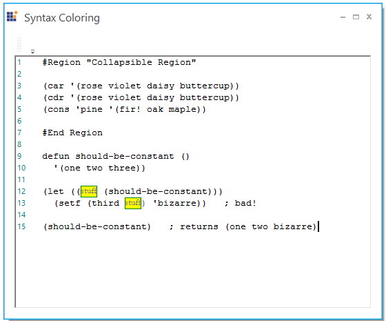

#### Error words highlighting

Error lexems can be added to the language by declaring a format names `Error`. It can be highlighted by using underlines.





ISnippetFormat Error = this.editControl1.Language.Add("Error");

 Error.FontColor = Color.Black;

 Error.UnderlineStyle = UnderlineStyle.Wave;

 Error.UnderlineWeight = UnderlineWeight.Thin;

 Error.LineColor = Color.Red;

 ConfigLexem err = new ConfigLexem("pubblic", "", FormatType.Custom, false);

 err.FormatName = "Error";

 this.editControl1.Language.Lexems.Add(err);





Dim Error As ISnippetFormat = Me.editControl1.Language.Add("Error")

 Error.FontColor = Color.Black

 Error.UnderlineStyle = UnderlineStyle.Wave

 Error.UnderlineWeight = UnderlineWeight.Thin

 Error.LineColor = Color.Red

 Dim err As ConfigLexem = new ConfigLexem("pubblic", "", FormatType.Custom, False)

 err.FormatName = "Error"

 Me.editControl1.Language.Lexems.Add(err)





### Splits configuration

Splits helps to configure two different words as single. For example, consider # and region that can be treated as single word by using `Split` configuration. This can be done by adding the appropriate splits to the [Language.Splits](https://help.syncfusion.com/cr/windowsforms/Syncfusion.Windows.Forms.Edit.Interfaces.IConfigLanguage.html#Syncfusion_Windows_Forms_Edit_Interfaces_IConfigLanguage_Splits) collections.





// Adding the necessary split definitions to the current language's Splits collection. Split configuration should be initialized before applying new language configuration to EditControl.

Split split = new Split();

split.Text = "#region";

currentConfigLanguage.Splits.Add(split);

this.editControl1.ApplyConfiguration(currentConfigLanguage);

ISnippetFormat keyword = this.editControl1.Language.Add("keyword");

keyword.FontColor = Color.Orange;

keyword.Font = new Font("Garamond", 14);

ConfigLexem region = new ConfigLexem("#region", "", FormatType.Custom, false);

region.FormatName = "keyword";

this.editControl1.Language.Lexems.Add(region);





' Adding the necessary split definitions to the current language's Splits collection. Split configuration should be initialized before applying new language configuration to EditControl.

Dim split As  Split  = new Split()

split.Text = "#region"

currentConfigLanguage.Splits.Add(split)

Me.editControl1.ApplyConfiguration(currentConfigLanguage)

Dim keyword As ISnippetFormat = Me.editControl1.Language.Add("keyword")

keyword.FontColor = Color.Orange

keyword.Font = new Font("Garamond", 14)

Dim region As ConfigLexem  = new ConfigLexem("#region", "",FormatType.Custom, False)

region.FormatName = "keyword"

Me.editControl1.Language.Lexems.Add(region)





### Auto replace triggers

Create a AutoReplaceTrigger object using `AutoReplaceTrigger` class where those "from" and "to" can be passed while initializing. Add it to the [Language.AutoReplaceTriggers](https://help.syncfusion.com/cr/windowsforms/Syncfusion.Windows.Forms.Edit.Interfaces.IConfigLanguage.html#Syncfusion_Windows_Forms_Edit_Interfaces_IConfigLanguage_AutoReplaceTriggers) collections.





this.editControl1.UseAutoreplaceTriggers = true;

ConfigLanguage language = currentConfigLanguage as ConfigLanguage;

language.TriggersActivators = new char[] { '.' };

 AutoReplaceTrigger trigger1 = new AutoReplaceTrigger("teh","the");

 this.editControl1.Language.AutoReplaceTriggers.Add(trigger1);





Me.editControl1.UseAutoreplaceTriggers = True

Dim language As ConfigLanguage = TryCast(currentConfigLanguage, ConfigLanguage)

language.TriggersActivators = New Char() { "."c }

 Dim trigger1 As AutoReplaceTrigger = new AutoReplaceTrigger("teh","the")

 Me.editControl1.Language.AutoReplaceTriggers.Add(trigger1)





N> To enable this feature, we must set the `TriggersActivators` property of ConfigLanguage tag attribute and `UseAutoreplaceTriggers` property of EditControl should be set to `true`.

### File extension

Add appropriate extensions to the [Language.Extensions](https://help.syncfusion.com/cr/windowsforms/Syncfusion.Windows.Forms.Edit.Interfaces.IConfigLanguage.html#Syncfusion_Windows_Forms_Edit_Interfaces_IConfigLanguage_Extensions) collections.





// Adding the necessary extension definitions to the current language's Extensions collection.

this.editControl1.Language.Extensions.Add("lisp");





' Adding the necessary extension definitions to the current language's Extensions collection.

Me.editControl1.Language.Extensions.Add("lisp")





### Multiple language configuration

The EditControl supports multiple language configuration helps to configure one or more languages in single language configuration.





 IConfigLanguage currentConfigLanguage = this.editControl1.Configurator.CreateLanguageConfiguration("HTML_JScript");

 this.editControl1.ApplyConfiguration(currentConfigLanguage);

 ISnippetFormat keyword = this.editControl1.Language.Add("keyword");

 keyword.FontColor = Color.Blue;

 keyword.Font = new Font("Courier New", 10);

 ISnippetFormat attributeName = this.editControl1.Language.Add("AttributeName");

 attributeName.FontColor = Color.Red;

 attributeName.Font = new Font("Courier New", 10);

 ISnippetFormat operators = this.editControl1.Language.Add("Operators");

 operators.FontColor = Color.Blue;

 operators.Font = new Font("Courier New", 10);

 ISnippetFormat tagName = this.editControl1.Language.Add("TagName");

 tagName.FontColor = Color.Green;

 tagName.Font = new Font("Courier New", 10);

 ConfigLexem operator1 = new ConfigLexem("&lt", "", FormatType.Custom, false);

 operator1.FormatName = "Operators";

 this.editControl1.Language.Lexems.Add(operator1);

 ConfigLexem operator2 = new ConfigLexem("", "&gt", FormatType.Custom, false);

 operator2.FormatName = "Operators";

 this.editControl1.Language.Lexems.Add(operator2);

 ConfigLexem keyword1 = new ConfigLexem("if", "", FormatType.Custom, false);

 keyword1.FormatName = "keyword";

 this.editControl1.Language.Lexems.Add(keyword1);

 ConfigLexem keyword2 = new ConfigLexem("var", "", FormatType.Custom, false);

 keyword2.FormatName = "keyword";

 this.editControl1.Language.Lexems.Add(keyword2);

 ConfigLexem keyword3 = new ConfigLexem("escape", "", FormatType.Custom, false);

 keyword3.FormatName = "keyword";

 this.editControl1.Language.Lexems.Add(keyword3);

 ConfigLexem html = new ConfigLexem("html", "", FormatType.Custom, false);

 html.FormatName = "AttributeName";

 this.editControl1.Language.Lexems.Add(html);

 ConfigLexem head = new ConfigLexem("head", "", FormatType.Custom, false);

 head.FormatName = "AttributeName";

 this.editControl1.Language.Lexems.Add(head);

 ConfigLexem body = new ConfigLexem("body", "", FormatType.Custom, false);

 body.FormatName = "AttributeName";

 this.editControl1.Language.Lexems.Add(body);

 ConfigLexem meta = new ConfigLexem("meta", "", FormatType.Custom, false);

 meta.FormatName = "AttributeName";

 this.editControl1.Language.Lexems.Add(meta);

 ConfigLexem title = new ConfigLexem("title", "", FormatType.Custom, false);

 title.FormatName = "AttributeName";

 this.editControl1.Language.Lexems.Add(title);

 ConfigLexem pub = new ConfigLexem("public", "", FormatType.Custom, false);

 pub.FormatName = "AttributeName";

 this.editControl1.Language.Lexems.Add(pub);

 ConfigLexem script = new ConfigLexem("script", "(&gt;)|(/&gt;)", FormatType.Custom, false);

 script.IsBeginRegex = true;

 script.IsPseudoEnd = true;

 script.IsComplex = true;

 script.FormatName = "TagName";

 this.editControl1.Language.Lexems.Add(script);

 this.editControl1.Language.Extensions.Add("htm");





 Dim currentConfigLanguage As IConfigLanguage = Me.editControl1.Configurator.CreateLanguageConfiguration("HTML_JScript")

 Me.editControl1.ApplyConfiguration(currentConfigLanguage)

 Dim keyword As ISnippetFormat = Me.editControl1.Language.Add("keyword")

 keyword.FontColor = Color.Blue

 keyword.Font = New Font("Courier New", 10)

 Dim attributeName As ISnippetFormat = Me.editControl1.Language.Add("AttributeName")

 attributeName.FontColor = Color.Red

 attributeName.Font = New Font("Courier New", 10)

 Dim operators As ISnippetFormat = Me.editControl1.Language.Add("Operators")

 operators.FontColor = Color.Blue

 operators.Font = New Font("Courier New", 10)

 Dim tagName As ISnippetFormat = Me.editControl1.Language.Add("TagName")

 tagName.FontColor = Color.Green

 tagName.Font = New Font("Courier New", 10)

 Dim operator1 As New ConfigLexem("&lt", "", FormatType.Custom, False)

 operator1.FormatName = "Operators"

 Me.editControl1.Language.Lexems.Add(operator1)

 Dim operator2 As New ConfigLexem("", "&gt", FormatType.Custom, False)

 operator2.FormatName = "Operators"

 Me.editControl1.Language.Lexems.Add(operator2)

 Dim keyword1 As New ConfigLexem("if", "", FormatType.Custom, False)

 keyword1.FormatName = "keyword"

 Me.editControl1.Language.Lexems.Add(keyword1)

 Dim keyword2 As New ConfigLexem("var", "", FormatType.Custom, False)

 keyword2.FormatName = "keyword"

 Me.editControl1.Language.Lexems.Add(keyword2)

 Dim keyword3 As New ConfigLexem("escape", "", FormatType.Custom, False)

 keyword3.FormatName = "keyword"

 Me.editControl1.Language.Lexems.Add(keyword3)

 Dim html As New ConfigLexem("html", "", FormatType.Custom, False)

 html.FormatName = "AttributeName"

 Me.editControl1.Language.Lexems.Add(html)

 Dim head As New ConfigLexem("head", "", FormatType.Custom, False)

 head.FormatName = "AttributeName"

 Me.editControl1.Language.Lexems.Add(head)

 Dim body As New ConfigLexem("body", "", FormatType.Custom, False)

 body.FormatName = "AttributeName"

 Me.editControl1.Language.Lexems.Add(body)

 Dim meta As New ConfigLexem("meta", "", FormatType.Custom, False)

 meta.FormatName = "AttributeName"

 Me.editControl1.Language.Lexems.Add(meta)

 Dim title As New ConfigLexem("title", "", FormatType.Custom, False)

 title.FormatName = "AttributeName"

 Me.editControl1.Language.Lexems.Add(title)

 Dim pub As New ConfigLexem("public", "", FormatType.Custom, False)

 pub.FormatName = "AttributeName"

 Me.editControl1.Language.Lexems.Add(pub)

 Dim script As New ConfigLexem("script", "(&gt;)|(/&gt;)", FormatType.Custom, False)

 script.IsBeginRegex = True

 script.IsPseudoEnd = True

 script.IsComplex = True

 script.FormatName = "TagName"

 Me.editControl1.Language.Lexems.Add(script)

 Me.editControl1.Language.Extensions.Add("htm")





### Invoking newly added configuration language

Invoke the [ResetCaches](https://help.syncfusion.com/cr/windowsforms/Syncfusion.Windows.Forms.Edit.Interfaces.IConfigLanguage.html#Syncfusion_Windows_Forms_Edit_Interfaces_IConfigLanguage_ResetCaches) function to apply the newly added configuration settings.





// Reset the current configuration language cache to reflect these changes.

this.editControl1.Language.ResetCaches();





' Reset the current configuration language cache to reflect these changes.

Me.editControl1.Language.ResetCaches()





## Configure syntax highlighting through dialog box

Syntax highlighting and code coloring can be implemented at runtime by using the `Language Coloring Configuration Editor`. It can be customized by using [ConfigurationDialog](https://help.syncfusion.com/cr/windowsforms/Syncfusion.Windows.Forms.Edit.Dialogs.ConfigurationDialog.html) class and [IConfig](https://help.syncfusion.com/cr/windowsforms/Syncfusion.Windows.Forms.Edit.Interfaces.IConfig.html) interface.

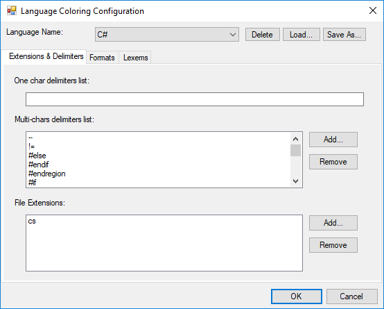





IConfigLanguage activeLang = this.editControl1.Parser.Formats as IConfigLanguage;

// Create an instance of ConfigurationDialog.

ConfigurationDialog editConfig = new ConfigurationDialog(this.editControl1.Configurator, activeLang);

if(editConfig.ShowDialog(this) == DialogResult.OK && activeLang != null)

{

    IConfigLanguage newLang = editConfig.Configurator.KnownLanguageNames.Contains(activeLang.Language) ? editConfig.Configurator[activeLang.Language] : editConfig.Configurator.DefaultLanguage;

    if(newLang != null)

    {

        // Set language configuration instance object.         

        this.editControl1.Configurator = editConfig.Configurator;

        // Applies coloring of the specified language to the text.

        this.editControl1.ApplyConfiguration(newLang);

    }

}





Dim activeLang As IConfigLanguage = Me.EditControl1.Parser.Formats

' Create an instance of ConfigurationDialog.

Dim editConfig As New frmConfigDialog(Me.editControl1.Configurator, activeLang)

If editConfig.ShowDialog(Me) = DialogResult.OK AndAlso Not (activeLang Is Nothing) Then

    Dim newLang As IConfigLanguage = If(editConfig.Configurator.KnownLanguageNames.Contains(activeLang.Language), editConfig.Configurator(activeLang.Language), editConfig.Configurator.DefaultLanguage) 

     If Not (newLang Is Nothing) Then

        ' Set language configuration instance object.

         Me.editControl1.Configurator = editConfig.Configurator

        ' Applies coloring of the specified language to the text.

         Me.editControl1.ApplyConfiguration(newLang)

     End If
     
End If





## See Also

[How to programmatically configure syntax highlighting in WinForms SyntaxEditor?](https://support.syncfusion.com/kb/article/9735/how-to-programmatically-configure-syntax-highlighting-in-winforms-syntaxeditor)
