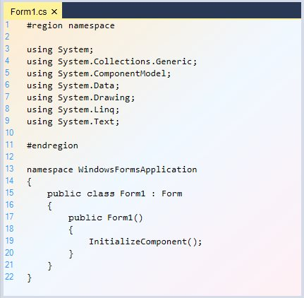
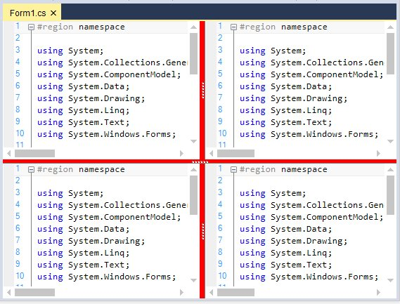
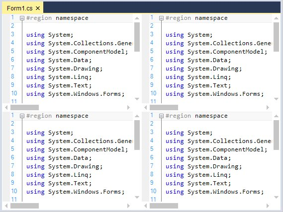
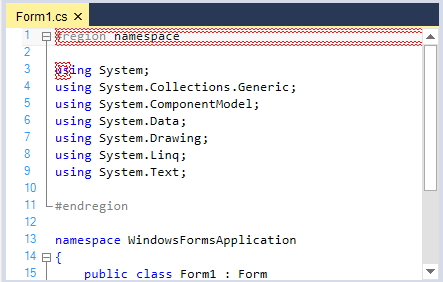
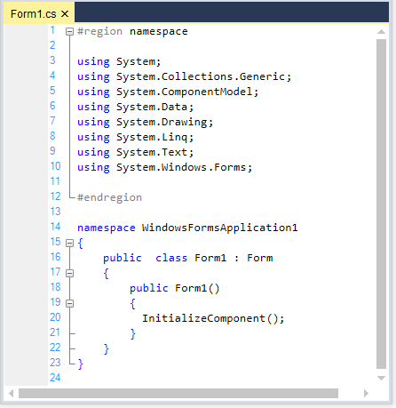
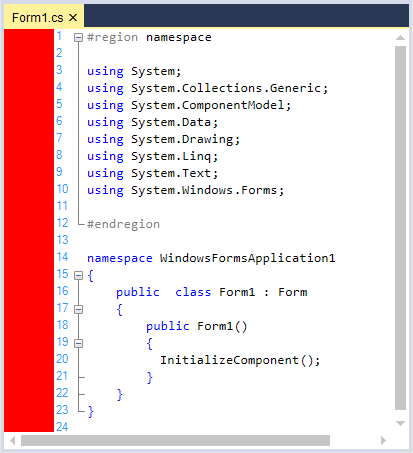
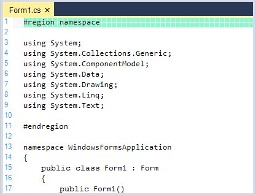
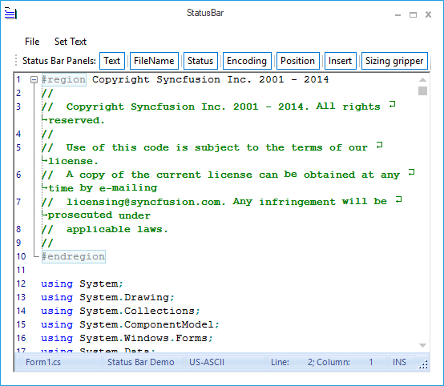
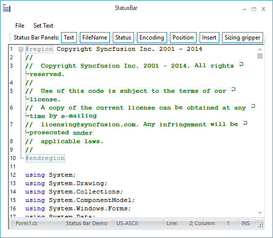

# Appearance

Provides exclusive support to customize the background color, text, margin, split views, ScrollBar etc., Users can change the background color of the control, and even supports gradient effects by using the `BackgroundColor` property.





this.editControl1.BackgroundColor = new Syncfusion.Drawing.BrushInfo(Syncfusion.Drawing.GradientStyle.ForwardDiagonal, new System.Drawing.Color[] { System.Drawing.Color.LavenderBlush, System.Drawing.Color.AliceBlue, System.Drawing.Color.BlanchedAlmond });





Me.editControl1.BackgroundColor = New Syncfusion.Drawing.BrushInfo(Syncfusion.Drawing.GradientStyle.ForwardDiagonal, new System.Drawing.Color[] { System.Drawing.Color.LavenderBlush, System.Drawing.Color.AliceBlue, System.Drawing.Color.BlanchedAlmond })





The customization features of the `EditControl` are discussed under the following topics:

## Split views

Provides in-built support for horizontal and vertical splitters, which display a single document in several views with horizontal and vertical orientations, allowing users to work on different areas of a document at the same time. 

A maximum of four split views are supported. However, you can also limit the user to perform either a horizontal or vertical split, only if you wish to support two views instead of four. The `SplitFourQuadrants` method is used to split the EditControl into four equal parts.





this.editControl1.SplitFourQuadrants();





Me.editControl1.SplitFourQuadrants()





### Orientation

Split view can be oriented in both horizontal and vertical direction by using the following methods `SplitHorizontally` and `SplitVertically` of  EditControl. The following methods can be used to split the EditControl into two equal horizontal and vertical halves.

<table>
<tr>
<th>
Method</th><th>
Description</th></tr>
<tr>
<td>
SplitHorizontally</td><td>
Splits the EditControl into two equal horizontal halves</td></tr>
<tr>
<td>
SplitVertically</td><td>
Splits the EditControl into two equal vertical halves</td></tr>
</table>





this.editControl1.SplitHorizontally();

this.editControl1.SplitVertically();





Me.editControl1.SplitHorizontally()

Me.editControl1.SplitVertically()





## Customize split views

In EditControl, user can customize the splitter background color and also disables the splitter. 

### Show horizontal splitter

The horizontal splitters can be enabled or disabled by setting `ShowHorizontalSplitters` property of EditControl.

<table>
<tr>
<th>
Property</th><th>
Description</th></tr>
<tr>
<td>
ShowHorizontalSplitters</td><td>
Specifies a value that indicates whether horizontal splitters are visible</td></tr>
</table>





// To enable the Splitters

this.editControl1.ShowHorizontalSplitters = false;





// To enable the Splitters

Me.editControl1.ShowHorizontalSplitters = False





### Show vertical splitter

The vertical splitters can be enabled or disabled by setting `ShowVerticalSplitters` property of EditControl.

<table>
<tr>
<th>
Property</th><th>
Description</th></tr>
<tr>
<td>
ShowVerticalSplitters</td><td>
Specifies a value that indicates whether vertical splitters are visible</td></tr>
</table>





// To enable the Splitters

this.editControl1.ShowVerticalSplitters = false;





// To enable the Splitters

Me.editControl1.ShowVerticalSplitters = False





### Splitter background color 

`SplitterBackgroundBrush` property helps to customize the background color of splitter in EditControl.

<table>
<tr>
<th>
Property</th><th>
Description</th></tr>
<tr>
<td>
SplitterBackgroundBrush</td><td>
Specifies the Background Brush of Horizontal / Vertical splitters</td></tr>
</table>





// To customize Splitter Background

this.editControl1.SplitterBackgroundBrush = Brushes.Red;





// To customize Splitter Background

Me.editControl1.SplitterBackgroundBrush = Brushes.Red





### Splitter position

In EditControl, Horizontal and Vertical splitters can be positioned at top, bottom and horizontal by using the following properties.

<table>
<tr>
<th>
Properties</th><th>
Description</th></tr>
<tr>
<td>
HorizontalSplitterPosition</td><td>
Specifies position of the horizontal splitter</td></tr>
<tr>
<td>
TopVerticalSplitterPosition</td><td>
Specifies position of the top vertical splitter</td></tr>
<tr>
<td>
BottomVerticalSplitterPosition</td><td>
Specifies position of the bottom vertical splitter</td></tr>
</table>





this.editControl1.HorizontalSplitterPosition = 220;

this.editControl1.TopVerticalSplitterPosition = 260;

this.editControl1.BottomVerticalSplitterPosition = 260;





Me.editControl1.HorizontalSplitterPosition = 220

Me.editControl1.TopVerticalSplitterPosition = 260

Me.editControl1.BottomVerticalSplitterPosition = 260





N> Refer to the following sample link that demonstrates the `SplitView` functionalities of EditControl.
C:\Users\&lt;User&gt;\AppData\Local\Syncfusion\Essential Studio\Version Number\Windows\Edit.Windows\Samples\Styles\Split Views

## Single line mode

Supports a single-line mode that renders just like a regular TextBox. EditControl can be operated in a simple text box with syntax highlighting, editing, and clipboard operations., by setting `Multiline` property to `false`. You can also turn on the single line mode of the EditControl by setting the `SingleLineMode` property to `true`. Its default value is `false`.





this.editControl1.Multiline = false;

this.editControl1.SingleLineMode = true;





Me.editControl1.Multiline = False

Me.editControl1.SingleLineMode = True





N> The SingleLineMode is intended for use, only when the EditControl contains small amounts of text data in it. Using it in a scenario where the EditControl has a huge file loaded into it, may lead to poor performance.

N> Refer to the following sample link that demonstrates the `SingleLineMode` behaviour of EditControl.
C:\Users\&lt;User&gt;\AppData\Local\Syncfusion\Essential Studio\Version Number\Windows\Edit.Windows\Samples\Styles\Single Line Mode

## Right-to-left (RTL) support 

`EditControl` elements can be aligned in right-to-left layout. `EditControl` is laid out from the right to left when `RenderRightToLeft` property is set to `true`. Its default value is `false`.  





this.editControl1.RenderRightToLeft = true;





Me.editControl1.RenderRightToLeft = True





**Use-case scenarios**

With RTL support, you can use EditControl, to render content in Right-To-left layout for languages such as Arabic.

### Change Right-to-Left layout by keyboard

Supports rendering content in Right-To-Left (RTL) layout by pressing <kbd>Shift + ctrl</kbd>.

## Customize Text appearance

In EditControl, we are able to customize the text color and its border. The following topics explains the same.

### Text Color

`SetTextColor` method helps to customize the appearance of the text color in a specific range of lines. 

<table>
<tr>
<th>
Method</th><th>
Description</th></tr>
<tr>
<td>
SetTextColor</td><td>
Sets the color of the text for the EditControl</td></tr>
</table>





// Set the color of the text for the EditControl.

this.editControl1.SetTextColor(new Point(1, 1), new Point(8, 8), Color.Orange);





' Set the color of the text for the EditControl.

Me.editControl1.SetTextColor(New Point(1, 1), New Point(8, 8), Color.Orange)





### Text border color

`SetTextBorder` method of EditControl helps to set the border and simultaneously we can remove the border of the text using the `RemoveTextBorder` method. The following table explain regarding this methods and also the parameter value used in these methods.

<table>
<tr>
<th>
Methods</th><th>
Description</th></tr>
<tr>
<td>
SetTextBorder</td><td>
Sets border around text</td></tr>
<tr>
<td>
RemoveTextBorder</td><td>
Removes border around text with given coordinates</td></tr>
</table>

<table>
<tr>
<th>
EditControl border enumerator</th><th>
Description</th></tr>
<tr>
<td>
FrameBorderStyle</td><td>
Specifies the style of border line. The options provided are * Dash* DashDot* Dot* None* Solid* Wave</td></tr>
<tr>
<td>
 BorderWeight</td><td>
Specifies the weight of the border line. The options provided are * Bold* Double* Thin</td></tr>
</table>





// Set borders for the specified text range.

this.editControl1.SetTextBorder(new Point(1, 1), new Point(8, 8), Color.Red, FrameBorderStyle.Wave, BorderWeight.Double);





' Set borders for the specified text range.

Me.editControl1.SetTextBorder(New Point(1, 1), New Point(3, 3), Color.Red, FrameBorderStyle.Wave, BorderWeight.Double)





## User Margin

Displays additional information regarding the contents in the EditControl. Information can also be displayed on a line-by-line basis. 

### user margin visibility

The User Margin feature can be turned on by setting the `ShowUserMargin` property to `true`. Its default value is `false`. 





this.editControl1.ShowUserMargin = true;





Me.editControl1.ShowUserMargin = True





### Customize appearance of user margin

User margin width and placement can be customized using the following properties.

<table>
<tr>
<th>
Properties</th><th>
Description</th></tr>
<tr>
<td>
UserMarginWidth</td><td>
Get / sets the width of the user margin</td></tr>
<tr>
<td>
UserMarginPlacement</td><td>
Specifies placement of user margin</td></tr>
</table>





this.editControl1.UserMarginWidth = 100;

// Sets the User Margin to the Left.

this.editControl1.UserMarginPlacement = Syncfusion.Windows.Forms.Edit.Enums.MarginPlacement.Left;





Me.editControl1.UserMarginWidth = 100

// Sets the User Margin to the Left.

Me.editControl1.UserMarginPlacement = Syncfusion.Windows.Forms.Edit.Enums.MarginPlacement.Left





The following properties can be used to set the background color, text color, and border color of the user margin in the EditControl.

<table>
<tr>
<th>
Properties</th><th>
Description</th></tr>
<tr>
<td>
UserMarginBackgroundColor</td><td>
Specifies BrushInfo object that is used when the user margin is being drawn</td></tr>
<tr>
<td>
UserMarginTextColor</td><td>
Specifies default color of user margin text</td></tr>
<tr>
<td>
UserMarginBorderColor</td><td>
Specifies color of the user margin border</td></tr>
</table>





this.editControl1.UserMarginBackgroundColor = new Syncfusion.Drawing.BrushInfo(Syncfusion.Drawing.GradientStyle.BackwardDiagonal, System.Drawing.Color.Brown, System.Drawing.Color.MistyRose);

this.editControl1.UserMarginBorderColor = Color.IndianRed;

this.editControl1.UserMarginTextColor = Color.Green;





Me.editControl1.UserMarginBackgroundColor = New Syncfusion.Drawing.BrushInfo(Syncfusion.Drawing.GradientStyle.BackwardDiagonal, System.Drawing.Color.Brown, System.Drawing.Color.MistyRose)

Me.editControl1.UserMarginBorderColor = Color.IndianRed

Me.editControl1.UserMarginTextColor = Color.Green





#### How to add custom text in user margin

It is possible to set custom text in the user margin on a line-by-line basis by handling the `DrawUserMarginText` event of the EditControl. Moreover, it is also possible to customize the font settings for the text of the user margin.





private void editControl1_DrawUserMarginText(object sender, Syncfusion.Windows.Forms.Edit.DrawUserMarginTextEventArgs e)
{
    // Set text to be rendered at the user margin area.

    e.Text = "Line " + e.Line.LineIndex.ToString() + " contains " + e.Line.LineLength.ToString() + " characters";

    // Set text font.

    e.Font = new Font("Garamond", 11);

    if(e.Line.LineIndex % 2 == 0)

    {

       // Set color of the text.

       e.Color = Color.Blue;

    }
}





Private Sub editControl1_DrawUserMarginText(ByVal sender As Object, ByVal e As Syncfusion.Windows.Forms.Edit.DrawUserMarginTextEventArgs) Handles EditControl1.DrawUserMarginText

' Set text to be rendered at the user margin area.

e.Text = "Line " + e.Line.LineIndex.ToString() + " contains " + e.Line.LineLength.ToString() + " characters"

' Set text font.

e.Font = New Font("Garamond", 11)

If e.Line.LineIndex Mod 2 = 0 Then

   ' Set color of the text.

   e.Color = Color.Blue

End If

End Sub





## Selection margin

Selection margin is a thin vertical strip along the left side of the EditControl that enables you to select the contents of the entire line in the EditControl, by simply clicking on the corresponding selection margin area of the line. 

### Selection margin visibility

`ShowSelectionMargin` property allows you to show or hide this selection margin. Its default value is `true`. 





this.editControl1.ShowSelectionMargin = true;





Me.editControl1.ShowSelectionMargin = True





### Customize appearance of selection margin

Selection margin background, foreground and width can be customized using the following properties.

<table>
<tr>
<th>
Properties</th><th>
Description</th></tr>
<tr>
<td>
SelectionMarginForegroundColor</td><td>
Specifies foreground color of the selection margin</td></tr>
<tr>
<td>
SelectionMarginBackgroundColor</td><td>
Specifies background color of the selection margin</td></tr>
<tr>
<td>
SelectionMarginWidth</td><td>
Sets the width of the selection margin</td></tr>
</table>





this.editControl1.SelectionMarginForegroundColor = Color.Gray;

this.editControl1.SelectionMarginBackgroundColor = Color.IndianRed;

this.editControl1.SelectionMarginWidth = 100;





Me.editControl1.SelectionMarginForegroundColor = Color.Gray

Me.editControl1.SelectionMarginBackgroundColor = Color.IndianRed

Me.editControl1.SelectionMarginWidth = 100





## Indicator margin

Provides an extensive support of indicator margin for the purpose of displaying the custom indicators or bookmarks. 

### Indicator margin visibility

Indicator margin can be enabled or disabled by using the `ShowIndicatorMargin` property. Its default value is `true`, to hide the indicator margin turn on its value to `false`. `MarkerAreaWidth` property of EditControl sets the width of marker area.

<table>
<tr>
<th>
Properties</th><th>
Description</th></tr>
<tr>
<td>
ShowIndicatorMargin</td><td>
Specifies a value indicating whether bookmarks and indicator margins should be visible</td></tr>
<tr>
<td>
MarkerAreaWidth</td><td>
Specifies width of marker area</td></tr>
</table>





// Displays the Indicator margin.

this.editControl1.ShowIndicatorMargin = true;

// Sets the width of the Indicator margin.

this.editControl1.MarkerAreaWidth = 50;





' Displays the Indicator margin.

Me.editControl1.ShowIndicatorMargin = True

' Sets the width of the Indicator margin.

Me.editControl1.MarkerAreaWidth = 50





### Customize the appearance of indicator margin

`IndicatorMarginBackColor` property helps to customize the background color of indicator margin in EditControl.





this.editControl1.IndicatorMarginBackColor = Color.Red;





Me.editControl1.IndicatorMarginBackColor = Color.Red





## Selection color customization

EditControl also provides an options to change the back color of selected range of text. `SetBackgroundColor` method of EditControl is used to set the background color for a specified range of text.





this.editControl1.SetBackgroundColor(new Point(1, 1), new Point(9, 9), Color.AliceBlue);





Me.editControl1.SetBackgroundColor(New Point(1, 1), New Point(9, 9), Color.AliceBlue)





### Set up background for individual line or selected block of text

EditControl also allows setting custom background color for individual lines as well as for selected block of text. You can set any desired background to a particular line or block of selection,as explained below.

* Register a back color format with the EditControl by using its `RegisterBackColorFormat` method, with appropriate values for BackgroundColor, ForegroundColor and HatchStyle parameters.
* Set the background color to the entire line or just the selected text by using the `SetLineBackColor` and `SetSelectionBackColor` methods respectively.





// Register a backcolor format with EditControl.

IBackgroundFormat format = this.editControl1.RegisterBackColorFormat(Color.Aquamarine, Color.Beige, System.Drawing.Drawing2D.HatchStyle.Cross, true);

// Set the background for the entire line of text.

this.editControl1.SetLineBackColor(editControl1.CurrentLine, true, format);

// Set the background for the selected block of text.        

this.editControl1.SetSelectionBackColor(format);





' Register a backcolor format with EditControl.

Dim IBackgroundFormat As format = Me.editControl1.RegisterBackColorFormat(Color.Aquamarine, Color.Beige, System.Drawing.Drawing2D.HatchStyle.Cross, True)

' Set the background for the entire line of text. 

Me.editControl1.SetLineBackColor(editControl1.CurrentLine, True, format)

' Set the background for the selected block of text.        

Me.editControl1.SetSelectionBackColor(format)





#### Remove applied background for individual line or selected block of text

By using `RemoveLineBackColor` and `RemoveSelectionBackColor` method of EditControl we were able to remove the background color for individual lines or selected blocks of text. 

<table>
<tr>
<th>
Methods</th><th>
Description</th></tr>
<tr>
<td>
RemoveLineBackColor</td><td>
Removes line back color</td></tr>
<tr>
<td>
RemoveSelectionBackColor</td><td>
Removes background coloring from the selected text</td></tr>
</table>





// Removes line back color.

this.editControl1.RemoveLineBackColor(4);

// Removes background coloring from the selected text.

this.editControl1.RemoveSelectionBackColor();





' Removes line back color.

Me.editControl1.RemoveLineBackColor(4)

' Removes background coloring from the selected text.

Me.editControl1.RemoveSelectionBackColor()





## StatusBar

Provides support to display information about the current state of the control such as the current file name, line number, and column number. The built-in panels are as follows:

* TextPanel
* StatusPanel
* EncodingPanel
* FileNamePanel
* CoordinatePanel
* InsertPanel

### Status bar settings

`StatusBarSettings` property contains many sub properties, which can be used to customize the appearance and visibility of the status bar and its panels. The following table represents some of sub properties in StatusBarSettings.

<table>
<tr>
<th>
StatusBarSettings property</th><th>
Description</th></tr>
<tr>
<td>
TextPanel</td><td>
Specifies StatusBarPanelSettings object for text panel</td></tr>
<tr>
<td>
StatusPanel</td><td>
Specifies StatusBarPanelSettings object for status panel</td></tr>
<tr>
<td>
EncodingPanel</td><td>
Specifies StatusBarPanelSettings object for encoding panel</td></tr>
<tr>
<td>
FileNamePanel</td><td>
Specifies StatusBarPanelSettings object for fileName panel</td></tr>
<tr>
<td>
CoordinatePanel</td><td>
Specifies StatusBarPanelSettings object for coordinate panel</td></tr>
<tr>
<td>
InsertPanel</td><td>
Specifies StatusBarPanelSettings object for insert panel</td></tr>
<tr>
<td>
Panels</td><td>
Gets the list of status bar panel settings</td></tr>
<tr>
<td>
StatusBar</td><td>
Gets underlying status bar</td></tr>
<tr>
<td>
GripVisibility</td><td>
Gets or sets the visibility of the status bar sizing grip. The options provided are as follows:* Visible* Hidden</td></tr>
</table>





// Set the visibility of the status bar sizing grip.

this.editControl1.StatusBarSettings.GripVisibility = Syncfusion.Windows.Forms.Edit.Enums.SizingGripVisibility.Visible;





' Set the visibility of the status bar sizing grip.

Me.editControl1.StatusBarSettings.GripVisibility = Syncfusion.Windows.Forms.Edit.Enums.SizingGripVisibility.Visible





#### Visibility settings

StatusBar feature can be turned on by setting the `StatusBarSettings.Visible` property to `true`. Its default value is `false`. The individual StatusBar panels can be optionally shown or hidden by using the `Visible` property corresponding to the respective panel.





 // Shows the built-in status bar.

this.editControl1.StatusBarSettings.Visible = true;

 // Enable the TextPanel in the StatusBar.

this.editControl1.StatusBarSettings.TextPanel.Visible = true;

// Set the visibility of the status bar sizing grip.

this.editControl1.StatusBarSettings.GripVisibility = Syncfusion.Windows.Forms.Edit.Enums.SizingGripVisibility.Visible;





// Shows the built-in status bar.

Me.editControl1.StatusBarSettings.Visible = True

' Enable the TextPanel in the status bar.

Me.editControl1.StatusBarSettings.TextPanel.Visible = True

' Set the visibility of the status bar sizing grip.

Me.editControl1.StatusBarSettings.GripVisibility = Syncfusion.Windows.Forms.Edit.Enums.SizingGripVisibility.Visible





#### Visual styles

EditControl status bar supports different visual styles for its appearance. Some of the available Visual styles are as follows:

* Default
* Metro
* Office2007
* Office2010

The visual style can be applied for the StatusBar using `VisualStyle` property. The following code example illustrates how to change the visual style for StatusBar in EditControl.

**Default**

This option helps to set the Default style.

##### Code sample





// Default

this.editControl1.StatusBarSettings.VisualStyle= Syncfusion.Windows.Forms.Tools.Controls.StatusBar.VisualStyle.Default; 





'Default

Me.editControl1.StatusBarSettings.VisualStyle = Syncfusion.Windows.Forms.Tools.Controls.StatusBar.VisualStyle.Default





**Metro**

This option helps to set the Metro style.

##### Code sample





// Metro

this.editControl1.StatusBarSettings.VisualStyle= Syncfusion.Windows.Forms.Tools.Controls.StatusBar.VisualStyle.Metro; 





'Metro

Me.editControl1.StatusBarSettings.VisualStyle = Syncfusion.Windows.Forms.Tools.Controls.StatusBar.VisualStyle.Metro





**Office2007Blue**

This option helps to set the Office2007Blue style.

##### Code sample





// Office2007Blue

this.editControl1.StatusBarSettings.VisualStyle= Syncfusion.Windows.Forms.Tools.Controls.StatusBar.VisualStyle.Office2007; 

this.editControl1.StatusBarSettings.Offcie2007ColorScheme = Office2007Theme.Blue;





'Office2007Blue

Me.editControl1.StatusBarSettings.VisualStyle = Syncfusion.Windows.Forms.Tools.Controls.StatusBar.VisualStyle.Office2007

Me.editControl1.StatusBarSettings.Offcie2007ColorScheme = Office2007Theme.Blue





**Office2007Black**

This option helps to set the Office2007Black style.

##### Code sample





// Office2007Black

this.editControl1.StatusBarSettings.VisualStyle= Syncfusion.Windows.Forms.Tools.Controls.StatusBar.VisualStyle.Office2007; 

this.editControl1.StatusBarSettings.Offcie2007ColorScheme = Office2007Theme.Black;





'Office2007Black

Me.editControl1.StatusBarSettings.VisualStyle = Syncfusion.Windows.Forms.Tools.Controls.StatusBar.VisualStyle.Office2007

Me.editControl1.StatusBarSettings.Offcie2007ColorScheme = Office2007Theme.Black





**Office2007Silver**

This option helps to set the Office2007Silver style.

##### Code sample





// Office2007Silver

this.editControl1.StatusBarSettings.VisualStyle= Syncfusion.Windows.Forms.Tools.Controls.StatusBar.VisualStyle.Office2007; 

this.editControl1.StatusBarSettings.Offcie2007ColorScheme = Office2007Theme.Silver;





'Office2007Silver

Me.editControl1.StatusBarSettings.VisualStyle = Syncfusion.Windows.Forms.Tools.Controls.StatusBar.VisualStyle.Office2007

Me.editControl1.StatusBarSettings.Offcie2007ColorScheme = Office2007Theme.Silver





**Office2007Managed**

This option helps to set the Office2007Managed style.

##### Code sample





// Office2007Managed

this.editControl1.StatusBarSettings.VisualStyle= Syncfusion.Windows.Forms.Tools.Controls.StatusBar.VisualStyle.Office2007; 

this.editControl1.StatusBarSettings.Offcie2007ColorScheme = Office2007Theme.Managed;





'Office2007Managed

Me.editControl1.StatusBarSettings.VisualStyle = Syncfusion.Windows.Forms.Tools.Controls.StatusBar.VisualStyle.Office2007

Me.editControl1.StatusBarSettings.Offcie2007ColorScheme = Office2007Theme.Managed





**Office2010Blue**

This option helps to set the Office2010Blue style.

##### Code sample





// Office2010Blue

this.editControl1.StatusBarSettings.VisualStyle= Syncfusion.Windows.Forms.Tools.Controls.StatusBar.VisualStyle.Office2010; 

this.editControl1.StatusBarSettings.Offcie2010ColorScheme = Office2010Theme.Blue;





'Office2010Blue

Me.editControl1.StatusBarSettings.VisualStyle = Syncfusion.Windows.Forms.Tools.Controls.StatusBar.VisualStyle.Office2010

Me.editControl1.StatusBarSettings.Offcie2010ColorScheme = Office2010Theme.Blue





**Office2010Black**

This option helps to set the Office2010Black style.

##### Code sample





// Office2010Black

this.editControl1.StatusBarSettings.VisualStyle= Syncfusion.Windows.Forms.Tools.Controls.StatusBar.VisualStyle.Office2010; 

this.editControl1.StatusBarSettings.Offcie2010ColorScheme = Office2010Theme.Black;





'Office2010Black

Me.editControl1.StatusBarSettings.VisualStyle = Syncfusion.Windows.Forms.Tools.Controls.StatusBar.VisualStyle.Office2010

Me.editControl1.StatusBarSettings.Offcie2010ColorScheme = Office2010Theme.Black





**Office2010Silver**

This option helps to set the Office2010Silver style.

##### Code sample





// Office2010Silver

this.editControl1.StatusBarSettings.VisualStyle= Syncfusion.Windows.Forms.Tools.Controls.StatusBar.VisualStyle.Office2010; 

this.editControl1.StatusBarSettings.Offcie2010ColorScheme = Office2010Theme.Silver;





'Office2010Silver

Me.editControl1.StatusBarSettings.VisualStyle = Syncfusion.Windows.Forms.Tools.Controls.StatusBar.VisualStyle.Office2010

Me.editControl1.StatusBarSettings.Offcie2010ColorScheme = Office2010Theme.Silver





**Office2010Managed**

This option helps to set the Office2010Managed style.

##### Code sample





// Office2010Managed

this.editControl1.StatusBarSettings.VisualStyle= Syncfusion.Windows.Forms.Tools.Controls.StatusBar.VisualStyle.Office2010; 

this.editControl1.StatusBarSettings.Offcie2010ColorScheme = Office2010Theme.Managed;





'Office2010Managed

Me.editControl1.StatusBarSettings.VisualStyle = Syncfusion.Windows.Forms.Tools.Controls.StatusBar.VisualStyle.Office2010

Me.editControl1.StatusBarSettings.Offcie2010ColorScheme = Office2010Theme.Managed





N> Refer to the following sample link that demonstrates the `StatusBar` functionalities of EditControl.
C:\Users\&lt;User&gt;\AppData\Local\Syncfusion\Essential Studio\Version Number\Windows\Edit.Windows\Samples\Interactive Features\StatusBar

## ScrollBar 

EditControl can display a data object, such as a document or a bitmap, that is larger than the window's client area. With the help of scroll bar, the user can scroll a data object in the client area to bring into view the portions of the object that extend beyond the borders of the window.

### Customize the scrollbar visibility

By using the `AlwaysShowScrollers` property of EditControl, we can enable or disable the scroll bar.





this.editControl1.AlwaysShowScrollers = false;





Me.editControl1.AlwaysShowScrollers = False





### Types of scrolling mode

There are various types of scrolling mode in EditControl as follows:

* Immediate - Scrolls the control to the new value immediately.
* Deferred - Scrolls the control when thumb track is completed.
* Pixel - Scrolls line by line.





// Scrolls the vertical scroll bar line by line.

this.editControl1.VScrollMode = Syncfusion.Windows.Forms.Edit.ScrollMode.Pixel;





' Scrolls the vertical scroll bar line by line.

Me.editControl1.VScrollMode = Syncfusion.Windows.Forms.Edit.ScrollMode.Pixel





### Customize the appearance of scrollbar

Provide Office 2007 appearance to scroll bars by setting the `ScrollVisualStyle` property to Office2007. It supports all the three Office 2007 Color Schemes (Black, Blue and Silver), which can be set by using the `ScrollColorScheme` property. Also, custom colors can be applied to the scroll bars of the EditControl. This can be done by setting the ScrollColorScheme property to Managed.

<table>
<tr>
<th>
Properties</th><th>
Description</th></tr>
<tr>
<td>
ScrollVisualStyle</td><td>
Specifies the visual style of the scroll bar</td></tr>
<tr>
<td>
ScrollColorScheme</td><td>
Specifies the scroll bar color scheme when Office2007 or Office2007Generic Style is set. The options provided are
<ul>
<li> Black</li>
<li> Blue</li>
<li> Silver</li>
<li> Managed</li></ul></td></tr>
</table>





this.editControl1.ScrollVisualStyle = ScrollBarCustomDrawStyles.Office2007;

this.editControl1.ScrollColorScheme = Office2007ColorScheme.Blue;

// Set custom color for the scroll bar.

this.editControl1.ScrollColorScheme = Office2007ColorScheme.Managed;

Syncfusion.Windows.Forms.Office2007Colors.ApplyManagedColors(this, Color.Green);





Me.editControl1.ScrollVisualStyle = ScrollBarCustomDrawStyles.Office2007
Me.editControl1.ScrollColorScheme = Office2007ColorScheme.Blue

' Set custom color for the scroll bar.

Me.editControl1.ScrollColorScheme = Office2007ColorScheme.Managed

Syncfusion.Windows.Forms.Office2007Colors.ApplyManagedColors(Me, Color.Green)





The following illustration shows the EditControl with custom color (green) set for the scroll bars.

## Append code snippets

Supports an advanced feature of VS 2005 like Code Snippets. It is also used to load or save VS.NET 2005-compatible XML snippets. Code Snippets are inserted into the EditControl by following the procedure given below:

1. Type the snippet name. For example "do".
2. Pressing the CTRL + ' combination.
3. Select an item from the list as shown in the image below.

The code snippets allow you to input data to the highlighted fields.

Code Snippets can also be inserted into the EditControl by using the static `Extract` method of the `CodeSnippetsExtractor` class. Extract method takes the following two parameters:

1. Path of the folder containing the code snippets.
2. Instance of the EditControl into which the extracted code snippet should be inserted.

This is illustrated in the code given below.





CodeSnippetsExtractor.Extract(Path, editControl1);





CodeSnippetsExtractor.Extract(Path, editControl1)





Code Snippets are added to the current language of the EditControl by using the below given method.

<table>
<tr>
<th>
Method</th><th>
Description</th></tr>
<tr>
<td>
AddCodeSnippet</td><td>
Adds new code snippet to current language</td></tr>
</table>





this.editControl1.AddCodeSnippet(string title, ArrayList literals, string code);





Me.editControl1.AddCodeSnippet(String title, ArrayList literals, String code)





The code snippets can also be contained in containers and displayed in the pop-up of the snippets. The static `Extract` method of the `CodeSnippetsExtractor` class is used to extract and fill the container object. The container object can be added to the SnippetsContainer of the EditControl by using the `AddContainer` method. 





private CodeSnippetsContainer container = new Syncfusion.Windows.Forms.Edit.Utils.CodeSnippets.CodeSnippetsContainer(); 

container = CodeSnippetsExtractor.Extract(Path@"\Loops");

container.Name = "Loops";

this.editControl1.Language.SnippetsContainer.AddContainer(container);





container As CodeSnippetsContainer = New Syncfusion.Windows.Forms.Edit.Utils.CodeSnippets.CodeSnippetsContainer()

container = CodeSnippetsExtractor.Extract(Path "\Loops")

container.Name = "Loops"

Me.editControl1.Language.SnippetsContainer.AddContainer(container)





Code snippets can also be created by using the `configuration` file. For example, the code snippet for a structure in C# can be created as shown below.



<CodeSnippetsContainer Name ="Container 2">

<CodeSnippet Format ="1.0.0">

       <Header>

        <Title>struct</Title>

         <Shortcut>struct</Shortcut>

 <Description>Code snippet for Struct</Description>

     </Header>

     <Snippet>

          <Declarations>

        <Literal>

         <ID>name</ID>

         <ToolTip>Struct name</ToolTip>

        <Default>Struct</Default>

      </Literal>

         </Declarations>

       <Code Language ="csharp"><![CDATA[struct $name$

       {

       }]]>

       </Code>

</Snippet>

</CodeSnippet>

</CodeSnippetsContainer>



The Literal element is used to identify a replacement for a piece of code that is entirely contained within the snippet, but one that will likely be customized after it is inserted into the code. 

**Showing code snippets**

You can also programmatically show the choice list of code snippets by calling `ShowCodeSnippets` method given below.





// Shows the code snippets choice list.
this.editControl1.ShowCodeSnippets();





' Shows the code snippets choice list.
Me.editControl1.ShowCodeSnippets()





**Border settings**

Border can be set for the active code snippets by using the `DrawCodeSnippetBorder` property of the EditControl. And also we can set the size of CodeSnippet popup window by using the `CodeSnipptSize` property of EditControl.





this.editControl1.DrawCodeSnippetBorder = true;





Me.editControl1.DrawCodeSnippetBorder = True





N> Refer to the following sample link that demonstrates the `CodeSnippets` functionalities of EditControl.
C:\Users\&lt;User&gt;\AppData\Local\Syncfusion\Essential Studio\Version Number\Windows\Edit.Windows\Samples\Intellisense Functions\Code Snippets

## Customize cursor appearance

Cursor appearance can be customized by using the `Cursor` property. The cursor appearance can be modified to arrow, cross, hand etc.





private Cursor currentCursor = Cursors.Arrow;

this.editControl1.Cursor = this.currentCursor;





currentCursor as Cursor = Cursors.Arrow

Me.editControl1.Cursor = Me.currentCursor





## Suspend and resume painting

Painting of the EditControl can be suspended using the `Suspend` method call. Painting can be resumed using `Resume` method call. Suspend and Resume methods internally call the interop method and LockWindowUpdate method to suspend and resume painting of the EditControl.





this.editControl1.SuspendPainting();

this.editControl1.ResumePainting();





Me.editControl1.SuspendPainting()

Me.editControl1.ResumePainting()



