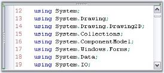
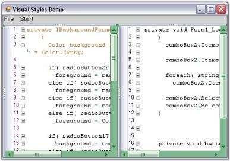

# Appearance

The customization features of the EditControl are discussed under the following topics:

## Show line numbers

Line numbers can be automatically assigned to the contents of the EditControl by enabling the `ShowLineNumbers` property. Its default value is true. The number of lines in the EditControl can be obtained by using the `PhysicalLineCount` property. This property returns the actual number of lines in the EditControl, without considering the lines that maybe hidden because of a collapsed outlining block or new lines that maybe added because of word wrap.

<table>
<tr>
<th>
Properties</th><th>
Description</th></tr>
<tr>
<td>
ShowLineNumbers</td><td>
Specifies a value indicating whether line numbers should be shown</td></tr>
<tr>
<td>
PhysicalLineCount</td><td>
Specifies the count of lines in the files</td></tr>
</table>





// Assigning Line Numbers to the contents of the EditControl.

this.editControl1.ShowLineNumbers = true;

// Specifies the number of lines in the EditControl.

int actualLineCount = this.editControl1.PhysicalLineCount;





' Assigning Line Numbers to the contents of the EditControl.

Me.editControl1.ShowLineNumbers = True

' Specifies the number of lines in the EditControl.

Dim actualLineCount As Integer = Me.editControl1.PhysicalLineCount





Line numbers can be customized by using the below given EditControl properties.

<table>
<tr>
<th>
Properties</th><th>
Description</th></tr>
<tr>
<td>
LineNumbersAlignment</td><td>
Specifies the alignment of line numbers</td></tr>
<tr>
<td>
LineNumbersColor</td><td>
Specifies the color of line numbers</td></tr>
<tr>
<td>
LineNumbersFont</td><td>
Specifies the font of line numbers</td></tr>
<tr>
<td>
SelectOnLineNumberClick </td><td>
Specifies a value indicating whether click on line numbers performs selection</td></tr>
</table>





// Specify the alignment of line numbers.

this.editControl1.LineNumbersAlignment = Syncfusion.Windows.Forms.Edit.Enums.LineNumberAlignment.Right;

// Assign any color to the line numbers.

this.editControl1.LineNumbersColor = Color.IndianRed;

// Assign any font to the line numbers.

this.editControl1.LineNumbersFont = new Font("Verdana", 9);

// Enabling SelectOnLineNumberClick property to perform selection on clicking the line numbers. 

this.editControl1.SelectOnLineNumberClick = true;





' Specify the alignment of line numbers.

Me.editControl1.LineNumbersAlignment = Syncfusion.Windows.Forms.Edit.Enums.LineNumberAlignment.Right

' Assign any color to the line numbers.

Me.editControl1.LineNumbersColor = Color.IndianRed

' Assign any font to the line numbers.

Me.editControl1.LineNumbersFont = new Font("Verdana", 9)

' Enabling SelectOnLineNumberClick property to perform selection on clicking the line numbers. 

Me.editControl1.SelectOnLineNumberClick = True





## Single line mode

EditControl can be operated in a single line mode much like a Windows Forms Text Box, by setting its `Multiline` property to False. This enables you to have a simple TextBox-like control, but with all the powerful features of EditControl like syntax highlighting, selection, underlining, and so on. You can turn on the single line mode of the EditControl by setting the `SingleLineMode` property to True. Its default value is false.





this.editControl1.Multiline = false;

this.editControl1.SingleLineMode = true;





Me.editControl1.Multiline = false

Me.editControl1.SingleLineMode = true





N> The SingleLineMode is intended for use, only when the EditControl contains small amounts of text data in it. Using it in a scenario where the EditControl has a huge file loaded into it, may lead to poor performance.

## Split views

EditControl provides in-built support for horizontal and vertical splitters, which facilitates the splitting of a single document in the EditControl into several split views so that you can work with multiple different areas of a document at the same time. A maximum of four split views are supported. However, you can also limit the user to perform either a horizontal or vertical split, only if you wish to support two views instead of four.

The vertical and horizontal splitters are always visible, by default. They can be enabled or disabled by setting `ShowHorizontalSplitters` and `ShowVerticalSplitters` properties. User can customize the Splitter Background color using `SplitterBackgroundBrush` property. The following tables explain these properties in detailed:

<table>
<tr>
<th>
Properties</th><th>
Description</th></tr>
<tr>
<td>
ShowHorizontalSplitters</td><td>
Specifies a value that indicates whether horizontal splitters are visible</td></tr>
<tr>
<td>
ShowVerticalSplitters</td><td>
Specifies a value that indicates whether vertical splitters are visible</td></tr>
<tr>
<td>
SplitterBackgroundBrush</td><td>
Specifies the Background Brush of Horizontal / Vertical splitters</td></tr>
</table>

The following methods can be used to split the EditControl into two equal horizontal or vertical halves.

<table>
<tr>
<th>
Methods</th><th>
Description</th></tr>
<tr>
<td>
SplitHorizontally</td><td>
Splits the EditControl into two equal horizontal halves</td></tr>
<tr>
<td>
SplitVertically</td><td>
Splits the EditControl into two equal vertical halves</td></tr>
</table>





// To enable the Splitters

this.editControl1.ShowHorizontalSplitters = true;

this.editControl1.ShowVerticalSplitters = true;

// To customize Splitter Background

this.editControl1.SplitterBackgroundBrush = Brushes.Red;

this.editControl1.SplitHorizontally();

this.editControl1.SplitVertically();





// To enable the Splitters

Me.editControl1.ShowHorizontalSplitters = True

Me.editControl1.ShowVerticalSplitters = True

// To customize Splitter Background

Me.editControl1.SplitterBackgroundBrush = Brushes.Red

Me.editControl1.SplitHorizontally()

Me.editControl1.SplitVertically()





**Positioning**

In EditControl, Horizontal and Vertical splitters can be positioned at top, bottom and horizontal by using the following properties.

<table>
<tr>
<th>
Properties</th><th>
Description</th></tr>
<tr>
<td>
HorizontalSplitterPosition</td><td>
Specifies position of the horizontal splitter</td></tr>
<tr>
<td>
TopVerticalSplitterPosition</td><td>
Specifies position of the top vertical splitter</td></tr>
<tr>
<td>
BottomVerticalSplitterPosition</td><td>
Specifies position of the bottom vertical splitter</td></tr>
</table>





this.editControl1.HorizontalSplitterPosition = 220;

this.editControl1.TopVerticalSplitterPosition = 260;

this.editControl1.BottomVerticalSplitterPosition = 260;





Me.editControl1.HorizontalSplitterPosition = 220

Me.editControl1.TopVerticalSplitterPosition = 260

Me.editControl1.BottomVerticalSplitterPosition = 260





The `SplitFourQuadrants` method is used to split the EditControl into four equal parts.





this.editControl1.SplitFourQuadrants();





Me.editControl1.SplitFourQuadrants()





## Right-To-Left (RTL) support 

EditControl supports rendering content in Right-To-Left (RTL) layout. The following features that are present in Left-To-Right layout are also supported in Right-To-Left layout:

* Line numbers, Book Marks and Selection margins. 
* Context Menus, ToolTips and Dialogs. 
* Printing and Print Preview. 
* Line borders, Underline and Text Range customization. 

RTL can be enabled in EditControl using `RenderRightToLeft` property. Its default value is false.  





this.editControl1.RenderRightToLeft = true;





Me.editControl1.RenderRightToLeft = True





**Use-case scenarios**

With RTL support, you can use EditControl, to render content in Right-To-left layout for languages such as Arabic. This is depicted in the screenshot below:

## Margin

Selection Margin is a thin vertical strip along the left side of the EditControl that enables you to select the contents of the entire line on the EditControl, by simply clicking on the corresponding selection margin area of the line. 

The `ShowSelectionMargin` property allows you to show or hide this selection margin. Its default value is true. The following are the properties used to customize the margin.

<table>
<tr>
<th>
Properties</th><th>
Description</th></tr>
<tr>
<td>
SelectionMarginForegroundColor</td><td>
Gets / sets foreground color of the selection margin</td></tr>
<tr>
<td>
SelectionMarginBackgroundColor</td><td>
Gets / sets background color of the selection margin</td></tr>
<tr>
<td>
SelectionMarginWidth</td><td>
Sets the width of the selection margin</td></tr>
</table>





this.editControl1.SelectionMarginForegroundColor = Color.Gray;

this.editControl1.SelectionMarginBackgroundColor = Color.IndianRed;

this.editControl1.SelectionMarginWidth = 100;





Me.editControl1.SelectionMarginForegroundColor = Color.Gray

Me.editControl1.SelectionMarginBackgroundColor = Color.IndianRed

Me.editControl1.SelectionMarginWidth = 100





**Differentiating the lines based on actions**

EditControl provides the extensive supports for marking the changed lines and the saved lines with different colors. Lines that are modified after the file load or after the last file save operations are marked in yellow color, by default. Once they are saved, they will be changed to green, by default.

The changed lines marking feature can be enabled by setting the `MarkChangedLines` property to True. To enable this functionality in the EditControl, the `SelectionMargin` property should also be enabled.





this.editControl1.MarkChangedLines = true;





Me.editControl1.MarkChangedLines = True





**User Margin**

EditControl supports the User Margin feature, which can be used to display additional information regarding the contents in the EditControl. Information can also be displayed on a line-by-line basis. The User Margin feature can be turned on by setting the `ShowUserMargin` property to True. Its default value is false. The user margin can be customized using the following properties.

<table>
<tr>
<th>
Properties</th><th>
Description</th></tr>
<tr>
<td>
UserMarginWidth</td><td>
Get / sets the width of the user margin</td></tr>
<tr>
<td>
UserMarginPlacement</td><td>
Specifies placement of user margin</td></tr>
</table>





this.editControl1.UserMarginWidth = 100;

// Sets the User Margin to the Left.

this.editControl1.UserMarginPlacement = Syncfusion.Windows.Forms.Edit.Enums.MarginPlacement.Left;





Me.editControl1.UserMarginWidth = 100

// Sets the User Margin to the Left.

Me.editControl1.UserMarginPlacement = Syncfusion.Windows.Forms.Edit.Enums.MarginPlacement.Left





The following properties can be used to set the background color, text color and border color of the user margin in the EditControl.

<table>
<tr>
<th>
Properties</th><th>
Description</th></tr>
<tr>
<td>
UserMarginBackgroundColor</td><td>
Specifies BrushInfo object that is used when the user margin is being drawn</td></tr>
<tr>
<td>
UserMarginTextColor</td><td>
Specifies default color of user margin text</td></tr>
<tr>
<td>
UserMarginBorderColor</td><td>
Specifies color of the user margin border</td></tr>
</table>





this.editControl1.UserMarginBackgroundColor = new Syncfusion.Drawing.BrushInfo(Syncfusion.Drawing.GradientStyle.BackwardDiagonal, System.Drawing.Color.Brown, System.Drawing.Color.MistyRose);

this.editControl1.UserMarginBorderColor = Color.IndianRed;

this.editControl1.UserMarginTextColor = Color.Green;





Me.editControl1.UserMarginBackgroundColor = New Syncfusion.Drawing.BrushInfo(Syncfusion.Drawing.GradientStyle.BackwardDiagonal, System.Drawing.Color.Brown, System.Drawing.Color.MistyRose)

Me.editControl1.UserMarginBorderColor = Color.IndianRed

Me.editControl1.UserMarginTextColor = Color.Green





It is also possible to set custom text in the User Margin on a line-by-line basis by handling the `DrawUserMarginText` event of the EditControl. Moreover, it is also possible to customize the font settings for the text of the User Margin.





private void editControl1_DrawUserMarginText(object sender, Syncfusion.Windows.Forms.Edit.DrawUserMarginTextEventArgs e)
{
    // Set text to be rendered at the user margin area.

    e.Text = "Line " + e.Line.LineIndex.ToString() + " contains " + e.Line.LineLength.ToString() + " characters";

    // Set text font.

    e.Font = new Font("Garamond", 11);

    if(e.Line.LineIndex % 2 == 0)

    {

       // Set color of the text.

       e.Color = Color.Blue;

    }
}





Private Sub editControl1_DrawUserMarginText(ByVal sender As Object, ByVal e As Syncfusion.Windows.Forms.Edit.DrawUserMarginTextEventArgs) Handles EditControl1.DrawUserMarginText

' Set text to be rendered at the user margin area.

e.Text = "Line " + e.Line.LineIndex.ToString() + " contains " + e.Line.LineLength.ToString() + " characters"

' Set text font.

e.Font = New Font("Garamond", 11)

If e.Line.LineIndex Mod 2 = 0 Then

   ' Set color of the text.

   e.Color = Color.Blue

End If

End Sub





## Scrolling support

EditControl offers extremely smooth scrolling behavior using idle-time processing and dynamic scroll area expansion techniques. The scrolling behavior is smooth even when large files are loaded,though the EditControl scrolls by several hundred lines for a small movement of the scroller.

The scrollers in the EditControl can be optionally shown / hidden by using the below given properties.

<table>
<tr>
<th>
Properties</th><th>
Description</th></tr>
<tr>
<td>
ShowVerticalScroller</td><td>
Specifies a value indicating whether the vertical scroller can be shown</td></tr>
<tr>
<td>
ShowHorizontalScroller</td><td>
Specifies a value indicating whether the horizontal scroller can be shown</td></tr>
<tr>
<td>
AlwaysShowScrollers</td><td>
Specifies a value indicating whether scrollers should be always visible</td></tr>
</table>





// Display the Horizontal Scroller.

this.editControl1.ShowHorizontalScroller = true;

// Display the Vertical Scroller.

this.editControl1.ShowVerticalScroller = true;

this.editControl1.AlwaysShowScrollers = true;





// Display the Horizontal Scroller.

Me.editControl1.ShowHorizontalScroller = True

// Display the Vertical Scroller.

Me.editControl1.ShowVerticalScroller = True

Me.editControl1.AlwaysShowScrollers = True





The EditControl supports scroller events that are raised when the scroll arrows are clicked. The scroller events are used to synchronize the scrolling of multiple EditControls.

### ScrollBar buttons

Buttons can be displayed at the top, bottom, left or right of the scroll bars by using the below given properties.

<table>
<tr>
<th>
Properties</th><th>
Description</th></tr>
<tr>
<td>
ScrollbarBottomButtons</td><td>
Gets buttons at the bottom of vertical scrollbar</td></tr>
<tr>
<td>
ScrollbarLeftButtons</td><td>
Gets buttons on the left of vertical scrollbar</td></tr>
<tr>
<td>
ScrollbarRightButtons</td><td>
Gets buttons on the right of vertical scrollbar</td></tr>
<tr>
<td>
ScrollbarTopButtons</td><td>
Gets buttons at the top of vertical scrollbar</td></tr>
</table>





this.editControl1.ScrollbarBottomButtons.AddRange(new System.Windows.Forms.Control[] { this.scrollbarButton1 });

this.editControl1.ScrollbarLeftButtons.AddRange(new System.Windows.Forms.Control[] { this.scrollbarButton2 });

this.editControl1.ScrollbarRightButtons.AddRange(new System.Windows.Forms.Control[] { this.scrollbarButton3 });

this.editControl1.ScrollbarTopButtons.AddRange(new System.Windows.Forms.Control[] { this.scrollbarButton4 });





Me.editControl1.ScrollbarBottomButtons.AddRange(New System.Windows.Forms.Control() {Me.scrollbarButton1}) 

Me.editControl1.ScrollbarLeftButtons.AddRange(New System.Windows.Forms.Control() {Me.scrollbarButton2}) 

Me.editControl1.ScrollbarRightButtons.AddRange(New System.Windows.Forms.Control() {Me.scrollbarButton3}) 

Me.editControl1.ScrollbarTopButtons.AddRange(New System.Windows.Forms.Control() {Me.scrollbarButton4}) 





### Scroll Position and Offsets

The scroll position and offsets of the EditControl are set by using the below given properties.

<table>
<tr>
<th>
Properties</th><th>
Description</th></tr>
<tr>
<td>
ScrollPosition</td><td>
Specifies scroll position of EditControl</td></tr>
<tr>
<td>
ScrollOffsetBottom</td><td>
Specifies the bottom scroll offset</td></tr>
<tr>
<td>
ScrollOffsetLeft</td><td>
Specifies the left scroll offset</td></tr>
<tr>
<td>
ScrollOffsetRight</td><td>
Specifies the right scroll offset.</td></tr>
<tr>
<td>
ScrollOffsetTop</td><td>
Specifies the top scroll offset.</td></tr>
</table>





this.editControl1.ScrollPosition = new Point(1, 5);

this.editControl1.ScrollOffsetBottom = 5;

this.editControl1.ScrollOffsetLeft = 10;

this.editControl1.ScrollOffsetTop = 5;

this.editControl1.ScrollOffsetTop = 10;





Me.editControl1.ScrollPosition = New Point(1, 5) 

Me.editControl1.ScrollOffsetBottom = 5 

Me.editControl1.ScrollOffsetLeft = 10 

Me.editControl1.ScrollOffsetTop = 5 

Me.editControl1.ScrollOffsetTop = 10





### ScrollBar style

EditControl enables to provide Office 2007 appearance to scroll bars by setting the ScrollVisualStyle property to Office2007. It supports all the three Office 2007 Color Schemes (Black, Blue and Silver), which can be set by using the ScrollColorScheme property. Also, custom colors can be applied to the scroll bars of the EditControl. This can be done by setting the ScrollColorScheme property to Managed.

<table>
<tr>
<th>
Properties</th><th>
Description</th></tr>
<tr>
<td>
ScrollVisualStyle</td><td>
Specifies the visual style of the scroll bar</td></tr>
<tr>
<td>
ScrollColorScheme</td><td>
Specifies the scroll bar color scheme when Office2007 or Office2007Generic Style is set. The options provided are
<ul>
<li> Black</li>
<li> Blue</li>
<li> Silver</li>
<li> Managed</li></ul></td></tr>
</table>





this.editControl1.ScrollVisualStyle = ScrollBarCustomDrawStyles.Office2007;

this.editControl1.ScrollColorScheme = Office2007ColorScheme.Blue;

// Set custom color for the scroll bar.

this.editControl1.ScrollColorScheme = Office2007ColorScheme.Managed;

Syncfusion.Windows.Forms.Office2007Colors.ApplyManagedColors(this, Color.Green);





Me.editControl1.ScrollVisualStyle = ScrollBarCustomDrawStyles.Office2007

Me.editControl1.ScrollColorScheme = Office2007ColorScheme.Blue

' Set custom color for the scroll bar.

Me.editControl1.ScrollColorScheme = Office2007ColorScheme.Managed

Syncfusion.Windows.Forms.Office2007Colors.ApplyManagedColors(Me, Color.Green)





The following illustration shows the EditControl with custom color (green) set for the scroll bars.

