# Editing

EditControl allows the end users to modify, edit text documents and source code files. This includes clipboard support, Unlimited undo and redo, binding shortcut keys to command and so on.

## Clipboard operations

EditControl provides keyboard and context menu support to cut, copy, and paste. It stores the data in the clipboard for cut and copy operations and retrieves data from the clipboard for paste operations.

### Keyboard and mouse actions

The keyboard shortcuts for the performing cut, copy or paste operations in the EditControl are done by using respective commands mentioned in the below table:

<table>
<tr>
<th>
Command</th><th>
Shortcut</th></tr>
<tr>
<td colspan = "2">
Clipboard</td></tr>
<tr>
<td>
Copy</td><td>
CTRL+C, CTRL+INSERT</td></tr>
<tr>
<td>
Paste</td><td>
CTRL+V, SHIFT+INSERT</td></tr>
<tr>
<td>
Cut</td><td>
CTRL+X, SHIFT+DEL</td></tr>
</table>

### Programmatic clipboard options

EditControl provides extensive support to cut, copy or paste the text data programmatically. The following methods in the EditControl facilitates these clipboard operations.

<table>
<tr>
<th>
Methods</th><th>
Description</th></tr>
<tr>
<td>
Copy</td><td>
Copies the selected text contents into the clipboard</td></tr>
<tr>
<td>
Cut</td><td>
Cuts the selected text contents from EditControl and maintains it in clipboard</td></tr>
<tr>
<td>
Paste</td><td>
Retrieves copied contents from the clipboard and pastes it into EditControl</td></tr>
<tr>
<td>
CanCopy</td><td>
Indicates whether it is possible to perform copy operations in EditControl</td></tr>
<tr>
<td>
CanCut</td><td>
Indicates whether it is possible to perform cut operations in EditControl</td></tr>
<tr>
<td>
CanPaste</td><td>
Indicates whether it is possible to perform copy, cut, and paste operations in EditControl</td></tr>
<tr>
<td>
ClearClipboard</td><td>
Clears all contents in the clipboard associated with Essential Edit. This is generally used immediately after the application loads, to clear any junk from previous clipboard operations</td></tr>
</table>





// Copies the selected text into the clipboard.

this.editControl1.Copy();

// Cuts the selected text contents from EditControl and maintains it in the clipboard.

this.editControl1.Cut();

// Retrieves copied contents from the clipboard and pastes it into EditControl.

this.editControl1.Paste();

// Indicates whether it is possible to perform copy operation in EditControl.

bool canCopy = this.editControl1.CanCopy;

// Indicates whether it is possible to perform cut operation in EditControl.

bool canCut = this.editControl1.CanCut;

// Indicates whether it is possible to perform paste operation in EditControl.

bool canPaste = this.editControl1.CanPaste;

// Clears all contents in the clipboard associated with Essential Edit.

this.editControl1.ClearClipboard();





' Copies the selected text into the clipboard.

Me.editControl1.Copy()

' Cuts the selected text contents from EditControl and maintains it in the clipboard. 

Me.editControl1.Cut()

' Retrieves copied contents from the clipboard and pastes it into EditControl.

Me.editControl1.Paste()

' Indicates whether it is possible to perform copy operation in EditControl.

Dim canCopy as bool = Me.editControl1.CanCopy

' Indicates whether it is possible to perform cut operation in EditControl.

Dim canCut as bool = Me.editControl1.CanCut

' Indicates whether it is possible to perform paste operation in EditControl.

Dim canPaste as bool = Me.editControl1.CanPaste

' Clears all contents in the clipboard associated with Essential Edit.

Me.editControl1.ClearClipboard()





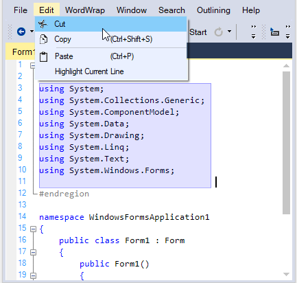

### Cryptography 

The system’s cryptography is based on the FIPS compliant algorithms for encryption, hashing and security.

#### FIPS mode enabled

 By doing the given steps, we can enable FIPS in our machine:

    1. Click Start, open Control Panel, and then click on Administrative Tools.
    2. Double-click Local Security Policy.
    3. Double-click Local Policies.
    4. Click Security Options. Under Policies listed in the right pane, double-click System cryptography: Use FIPS compliant algorithms for encryption, hashing, and signing.
    5. Select Enabled to enable FIPS on your machine.

#### Purpose of EnableMD5 in Clipboard operations

When FIPS is enabled, the Clipboard Operations of EditControl are affected due to EditControl uses the MD5 algorithm. To avoid this, before enabling FIPS, you must disable the EditControl MD5 algorithm by setting the `EnableMD5` property to `false`.

<table>
<tr>
<th>
Property</th><th>
Description</th></tr>
<tr>
<td>
EnableMD5</td><td>
Specifies whether to enable or disable MD5 algorithm</td></tr>
</table>





this.editControl1.EnableMD5 = true;





Me.editControl1.EnableMD5 = True





## Undo and redo

EditControl provides keyboard and context menu support for undo and redo operations that erase the last change in a document and reinsert it. `CanUndo` and `CanRedo` property gets a flag that determines whether the undo and redo operation can be performed in the EditControl. The keyboard shortcuts for the performing undo and redo operations in the EditControl are done by using respective commands mentioned in the below table:

<table>
<tr>
<th>
Command</th><th>
Shortcut</th></tr>
<tr>
<td>
Undo</td><td>
Performs an undo (CTRL+Z) operation.</td></tr>
<tr>
<td>
Redo</td><td>
Performs a redo (CTRL+Y) operation.</td></tr>
</table>





// Indicates whether it is possible to Undo in the EditControl. 

bool canUndo = this.editControl1.CanUndo;

// Indicates whether it is possible to Redo in the EditControl. 

bool canRedo = this.editControl1.CanRedo;





' Indicates whether it is possible to Undo in the EditControl.

Dim canUndo as bool = Me.editControl1.CanUndo

' Indicates whether it is possible to Redo in the EditControl.

Dim canRedo as bool = Me.editControl1.CanRedo





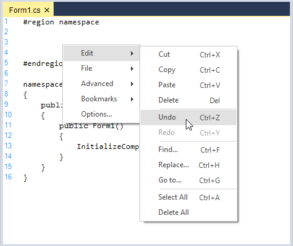

### Grouping actions

Grouping actions allows you to specify a set of actions as groups for Undo or Redo purposes. When an action group is created, and a set of actions is added to it, the entire set is considered as one entity. This implies that the set of actions can be performed or undone using the `Redo` or `Undo` method call. You can use the UndoGroupOpen, UndoGroupClose and UndoGroupCancel methods to programmatically manipulate the undo or redo action grouping. Grouping is enabled using the `GroupUndo` property of EditControl. It Specifies whether grouping should be enabled or disabled for undo/redo actions.

<table>
<tr>
<th>
Property</th><th>
Description</th></tr>
<tr>
<td>
GroupUndo</td><td>
Specifies whether grouping should be enabled for undo/redo actions</td></tr>
</table>

<table>
<tr>
<th>
Methods</th><th>
Description</th></tr>
<tr>
<td>
UndoGroupOpen</td><td>
Begins a new action group</td></tr>
<tr>
<td>
Undo</td><td>
Performs an undo operation</td></tr>
<tr>
<td>
Redo</td><td>
Performs a redo operation</td></tr>
<tr>
<td>
UndoGroupClose</td><td>
Helps to close the action group.</td></tr>
</table>





// Enable grouping for Undo or Redo actions.

this.editControl1.GroupUndo = true;

// Invoke the UndoGroupOpen method to begin a new action group.

this.editControl1.UndoGroupOpen();

// Accomplish Undo operation.

this.editControl1.Undo();

// Accomplish Redo operation. 

this.editControl1.Redo();

// Invoke the UndoGroupClose method to close the action group

this.editControl1.UndoGroupClose();





' Enable grouping for Undo or Redo actions.

Me.editControl1.GroupUndo = True

' Invoke the UndoGroupOpen method to begin a new action group.

Me.editControl1.UndoGroupOpen()

' Accomplish Undo operation.

Me.editControl1.Undo()

' Accomplish Redo operation.

Me.editControl1.Redo()

' Invoke the UndoGroupClose method to close the action group

Me.editControl1.UndoGroupClose()





### Reset undo redo buffer

We can reset the undo and redo operation by invoking the `ResetUndoInfo` method of EditControl.

<table>
<tr>
<th>
Methods</th><th>
Description</th></tr>
<tr>
<td>
ResetUndoInfo</td><td>
Clear the undo buffer. Hence undo operation is not allowed on contents/actions previously added/performed up to that point</td></tr>
</table>

N> The undo or redo buffer is cleared after the 'Save' operation.





// Clears the Undo buffer. 

this.editControl1.ResetUndoInfo();





' Clears the Undo buffer.

Me.editControl1.ResetUndoInfo()





### Discard undo redo buffer

We can discard an already open action group, by invoking `UndoGroupCancel` method of EditControl.


   

   
// Helps to cancel an already open action group.

this.editControl1.UndoGroupCancel();




   
' Helps to cancel an already open action group.

Me.editControl1.UndoGroupCancel()





A sample which demonstrates the above features is available in the below sample installation path.

Installation Location\Syncfusion\Essential Studio\Version Number\\Windows\Edit.Windows\Samples\Text Operations\Clipboard Operations

## Selection modes 

 EditControl supports rectangular block selection to select lines from specific columns like Visual Studio, plus normal selection.

### Default  

This mode enable user to select Whole line. 


   

   
//To Enable Default mode.

this.editControl1.SelectionMode = Syncfusion.Windows.Forms.Edit.SelectionModes.Default;




   
'To Enable Default mode.

Me.editControl1.SelectionMode = Syncfusion.Windows.Forms.Edit.SelectionModes.Default



   
   

### Programmatic selection

We can also select the text in EditControl programmatically by using the `SelectAll`, `SetSelectionStart` and `SetSelectionEnd` method.

The following code snippet demonstrates how to select all the text in EditControl.


   


// Selects all text in EditControl.

this.editControl1.SelectAll();





' Selects all text in EditControl.

Me.editControl1.SelectAll()





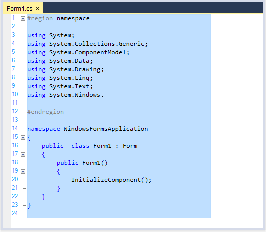
     
### Block   

This mode enable user to select, certain rectangle portion instead of whole line. The selection includes all characters captured within the rectangle defined by the first and last character in the selection. Anything typed or pasted into the selected area is inserted at the same point on each line. 


   


//To Enable Block selection mode.

this.editControl1.SelectionMode = Syncfusion.Windows.Forms.Edit.SelectionModes.Block;





'To Enable Block selection mode.

Me.editControl1.SelectionMode = Syncfusion.Windows.Forms.Edit.SelectionModes.Block





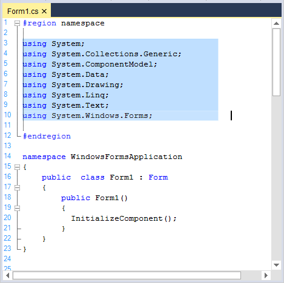

## Text handling

EditControl offers support for text manipulation operations like append, delete and insertion of multiple lines of text, which is elaborated in the below topic:

### Total number of lines

EditControl has the built in functionality to find the total number of lines by using `PhysicalLineCount` property. 





Console.WriteLine(this.editControl1.PhysicalLineCount);





Console.WriteLine(Me.editControl1.PhysicalLineCount)





### Visible number of lines 

EditControl has the built in functionality to find the visible number of lines by using `VisibleLineCount` property. 





Console.WriteLine(this.editControl1.VisibleLineCount);





Console.WriteLine(Me.editControl1.VisibleLineCount)





### Append text

Text can be appended to the EditControl by using the following method.

<table>
<tr>
<th>
Methods</th><th>
Description</th></tr>
<tr>
<td>
AppendText</td><td>
Appends the specified text to the end of the existing contents of the EditControl</td></tr>
</table>





// Appends the given string to the end of the text in EditControl.

this.editControl1.AppendText(" text to be appended ");





' Appends the given string to the end of the text in the EditControl.

Me.editControl1.AppendText(" text to be appended ")





### Insert text

The Insert mode can be enabled in the EditControl by setting the `InsertMode` property. Its default value is `true`. Text can be inserted anywhere inside the EditControl by using the `InsertText` method as follows. The mode of the INSERT key can also be toggled by using the ToggleInsertMode method of the EditControl.

<table>
<tr>
<th>
Method</th><th>
Description</th></tr>
<tr>
<td>
InsertText</td><td>
Inserts a piece of text at any desired position in the EditControl</td></tr>
</table>





this.editControl1.InsertMode = true;

this.editControl1.InsertText(7, 5, "Inserting Text");

// Toggle the insert mode.

this.editControl1.ToggleInsertMode();





Me.editControl1.InsertMode = True

Me.editControl1.InsertText(7, 5, "Inserting Text")

' Toggle the insert mode.

Me.editControl1.ToggleInsertMode()





**Insert multiple lines**

Collection of text lines can be inserted by using the `Lines` property.

<table>
<tr>
<th>
Property</th><th>
Description</th></tr>
<tr>
<td>
Lines</td><td>
Lets you to specify multiple lines of text to the EditControl in the form of a string array. This feature is similar to the one in .NET RichTextBox control</td></tr>
</table>





// Specifies multiple lines of text to the EditControl in the form of a string array.

this.editControl1.Lines = new string[] {" first line ", " second line ", " third line "};





// Specifies multiple lines of text to the EditControl in the form of a string array.

Me.editControl1.Lines = new string[] {" first line ", " second line ", " third line "}





**Insert text based on conditions**

Text can also be inserted based on condition. The following properties can be used to insert text based on conditions that are described as follows.

<table>
<tr>
<th>
Properties</th><th>
Description</th></tr>
<tr>
<td>
AllowDrop</td><td>
Specifies whether drag and drop operations are allowed for control</td></tr>
<tr>
<td>
AllowInsertBeforeReadOnlyNewLine</td><td>
Specifies whether inserting text should be allowed at the beginning of readonly region at the start of new line</td></tr>
<tr>
<td>
InsertDroppedFileIntoText</td><td>
Specifies whether the outer file dragged and dropped onto the EditControl should be inserted into the current content.When this property is set to `false`, the current file is closed, and the dropped outer file is opened</td></tr>
<tr>
<td>
RespectTabStopsOnInsertingText</td><td>
Specifies whether the tab stops should be valued on inserting blocks of text</td></tr>
<tr>
<td>
ShowFileDropNotification</td><td>
Specifies whether the Notification message is to be displayed when the outer file is dragged and dropped onto the EditControl</td></tr>
</table>





// Allows text insertion only at the beginning of the ReadOnly region at the start of a new line.

this.editControl1.AllowInsertBeforeReadonlyNewLine = true;

//To set the EditControl that allows to Drag and Dropping files

this.editControl1.AllowDrop = true; 

// Specifies whether the outer file dragged and dropped onto the EditControl should be inserted into the current content.

this.editControl1.InsertDroppedFileIntoText = true;

// To hide the notification message displayed when the outer file is dragged and dropped onto the EditControl.

this.editControl1.ShowFileDropNotification = false;





' Allows text insertion only at the beginning of the ReadOnly region at the start of a new line.

Me.editControl1.AllowInsertBeforeReadonlyNewLine = True

'To set the EditControl that allows to Drag and Dropping files

Me.editControl1.AllowDrop = True

‘Specifies whether the outer file dragged and dropped onto the EditControl should be inserted into the current content.

Me.editControl1.InsertDroppedFileIntoText = True

' To hide the notification message displayed when the outer file is dragged and dropped onto the EditControl.

Me.editControl1.ShowFileDropNotification = False





### Delete text

Text can be deleted in the EditControl by using the below given methods.

<table>
<tr>
<th>
Methods</th><th>
Description</th></tr>
<tr>
<td>
DeleteChar</td><td>
Deletes a character to the right of the current cursor position</td></tr>
<tr>
<td>
DeleteCharLeft</td><td>
Deletes a character to the left of the current cursor position</td></tr>
<tr>
<td>
DeleteWord</td><td>
Deletes a word to the right of the current cursor position</td></tr>
<tr>
<td>
DeleteWordLeft</td><td>
Deletes a word to the left of the current cursor position</td></tr>
<tr>
<td>
DeleteAll</td><td>
Deletes all text in the document</td></tr>
<tr>
<td>
DeleteText</td><td>
Deletes the specified text</td></tr>
</table>





// Deletes the character to the right of the cursor.

this.editControl1.DeleteChar();

// Deletes the character to the left of the cursor.

this.editControl1.DeleteCharLeft();

// Deletes a word to the right of the current cursor position.

this.editControl1.DeleteWord();

// Deletes a word to the left of the current cursor position.

this.editControl1.DeleteWordLeft();

// To delete all the text.

this.editControl1.DeleteAll();

// To delete a selection.

this.editControl1.DeleteText(this.editControl1.Selection.Top, this.editControl1.Selection.Bottom);





' Deletes the character to the right of the cursor.

Me.editControl1.DeleteChar()

' Deletes the character to the left of the cursor.

Me.editControl1.DeleteCharLeft()

' Deletes a word to the right of the current cursor position.

Me.editControl1.DeleteWord()

' Deletes a word to the left of the current cursor position.

Me.editControl1.DeleteWordLeft()

' Deletes all the text.

Me.editControl1.DeleteAll()

' Deletes a selection.

Me.editControl1.DeleteText(Me.editControl1.Selection.Top, Me.editControl1.Selection.Bottom)





A sample which demonstrates the above features is available in the below sample installation path.

Installation Location\Syncfusion\Essential Studio\Version Number\Windows\Edit.Windows\Samples\Interactive Features\TextInteractions

## Indent or outdent

Indentation support helps format source code to improve readability. By pressing `TAB` or `SPACE` keys, appropriate number of tabs or spaces are added to the beginning of each line in the selected block. Similarly, when the <kbd>SHIFT+TAB</kbd> keys combination is pressed, the tabs or spaces added gets removed.

You can also set the tab size to the desired number of spaces using the `TabSize` property of the EditControl as shown below. By default, the TabSize property value is set to 2.





// "n" is the integer value specifying the number of spaces.

this.editControl1.TabSize = n;





' "n" is the integer value specifying the number of spaces.

Me.editControl1.TabSize = n





The following methods are used to indent and outdent text in the EditControl.

<table>
<tr>
<th>
Methods</th><th>
Description</th></tr>
<tr>
<td>
IndentText</td><td>
Indents text in the specified range</td></tr>
<tr>
<td>
IndentSelection</td><td>
Indents selected text</td></tr>
<tr>
<td>
OutdentText</td><td>
Outdent text in the specified range</td></tr>
<tr>
<td>
OutdentSelection</td><td>
Outdent selected text</td></tr>
</table>





// Indents text in the specified range.

this.editControl1.IndentText(new Point(5, 5), new Point(10, 10));

// Indents selected text.

this.editControl1.IndentSelection();

// Outdent text in the specified range.

this.editControl1.OutdentText(new Point(5, 5), new Point(10, 10));

// Outdent selected text.

this.editControl1.OutdentSelection();





' Indents text in the specified range.

Me.editControl1.IndentText(New Point(5, 5), New Point(10, 10))

' Indents selected text.

Me.editControl1.IndentSelection()

' Outdent text in the specified range.

Me.editControl1.OutdentText(New Point(5, 5), New Point(10, 10))

' Outdent selected text.

Me.editControl1.OutdentSelection()





### Default indentation

The indentation guidelines are vertical lines that is used to connect the matching brackets. This feature enhances the readability of code. The indentation guidelines can be enabled or disabled  by setting the `ShowIndentationGuidelines` property. Its default value is `true`, to hide the indentation guidelines in EditControl turned off it value to `false`, or by invoking the `HideIndentGuideline` method. Also, the indent guideline for the current region can be set by using the `ShowIndentGuideline` method.





// Indentation Guidelines are displayed.

this.editControl1.ShowIndentationGuidelines = true;

// Hide Indentation Guideline.

this.editControl1.HideIndentGuideline();

// Show Indentation Guideline.

this.editControl1.ShowIndentGuideline();





' Indentation Guidelines are displayed.

Me.editControl1.ShowIndentationGuidelines = True

' Hide Indentation Guideline.

Me.editControl1.HideIndentGuideline()

' Show Indentation Guideline.

Me.editControl1.ShowIndentGuideline()





**Positioning**

It is also possible to position the caret to the beginning or end of the indentation block by using the JumpToIndentBlockStart and JumpToIndentBlockEnd methods respectively.

<table>
<tr>
<th>
Methods</th><th>
Description</th></tr>
<tr>
<td>
JumpToIndentBlockStart</td><td>
Jumps to the start of the block</td></tr>
<tr>
<td>
JumpToIndentBlockEnd</td><td>
Jumps to the end of the block</td></tr>
</table>





this.editControl1.JumpToIndentBlockStart();

this.editControl1.JumpToIndentBlockEnd();





Me.editControl1.JumpToIndentBlockStart()

Me.editControl1.JumpToIndentBlockEnd()





### Auto Indentation

The EditControl offers advanced text indentation support to suit the requirements of the user. The properties given in the following table can be used to customize the auto indentation settings of the EditControl.

<table>
<tr>
<th>
Properties</th><th>
Description</th></tr>
<tr>
<td>
AutoIndentMode</td><td>
Specifies mode of auto indentation. The options provided are None, Block and Smart</td></tr>
<tr>
<td>
 AutoIndentGuideline</td><td>
Specifies a value that specifies whether indent guideline should be shown automatically after cursor repositioning</td></tr>
</table>





// Sets the AutoIntentMode.

this.editControl1.AutoIndentMode = Syncfusion.Windows.Forms.Edit.Enums.AutoIndentMode.None;





' Sets the AutoIntentMode.

Me.editControl1.AutoIndentMode = Syncfusion.Windows.Forms.Edit.Enums.AutoIndentMode.None





If Enter is pressed when the AutoIndentMode is set to None, the text is not indented.

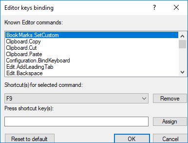

When the AutoIndentMode is set to Smart, the next line is indented by one TabSize from the first column of the previous line on pressing Enter.

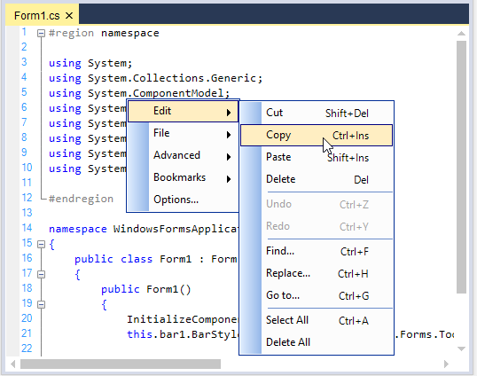

When the AutoIndentMode is set to Block, the next line begins at the same column as the previous line on pressing the ENTER key.

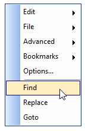

**Lexem support for AutoIndent block mode**

In the EditControl, the `EnableSmartInBlockIndent` property ensures the AutoIndent Block mode with respect to the lexem’s config.indent. With this property, the Block mode will work like Smart mode for conditional statements.

When this property is enabled, the lines will be aligned to the position of the previous indented line. The lines will begin at the original start position if disabled.

<table>
<tr>
<th>
Property</th><th>
Description</th></tr>
<tr>
<td>
EnableSmartInBlockIndent</td><td>
Specifies a value to make the Block mode work like Smart mode for conditional statements</td></tr>
</table>





// Specifies a value to make the Block mode work like Smart mode for conditional statements.

this.editcontrol1.EnableSmartInBlockIndent = true;





// Specifies a value to make the Block mode work like Smart mode for conditional statements.

Me.editcontrol1.EnableSmartInBlockIndent = True





The Auto Indentation characters can also be specified by setting the Indent field to True in the lexem definition of the configuration file, as shown below.



<lexem BeginBlock="{" EndBlock="}" Type="Operator" IsComplex="true" IsCollapsable="true" Indent="true"  CollapseName="{...}" IndentationGuideline="true">



### Customize indent appearence

Indentation guidelines and bracket highlighting blocks can be customized by using the below given properties.

<table>
<tr>
<th>
Properties</th><th>
Description</th></tr>
<tr>
<td>
IndentLineColor</td><td>
Specifies color of the indent line</td></tr>
<tr>
<td>
IndentBlockHighlightingColor</td><td>
Specifies color of the indent block start and end</td></tr>
<tr>
<td>
IndentationBlockBackgroundBrush</td><td>
Specifies brush for indentation block background</td></tr>
<tr>
<td>
IndentationBlockBorderColor</td><td>
Specifies color of indentation block border line</td></tr>
<tr>
<td>
IndentationBlockBorderStyle</td><td>
Specifies style of indentation block border line</td></tr>
<tr>
<td>
ShowIndentationBlockBorders</td><td>
Specifies whether indentation block borders should be drawn</td></tr>
</table>





this.editControl1.IndentLineColor = Color.OrangeRed;

this.editControl1.IndentBlockHighlightingColor = Color.IndianRed;

this.editControl1.IndentationBlockBackgroundBrush = new Syncfusion.Drawing.BrushInfo(Syncfusion.Drawing.GradientStyle.BackwardDiagonal, System.Drawing.SystemColors.Info, System.Drawing.Color.Khaki);

this.editControl1.IndentationBlockBorderColor = System.Drawing.Color.Crimson;

this.editControl1.IndentationBlockBorderStyle = Syncfusion.Windows.Forms.Edit.Enums.FrameBorderStyle.DashDot;

this.editControl1.ShowIndentationBlockBorders = true;





Me.editControl1.IndentLineColor = Color.OrangeRed

Me.editControl1.IndentBlockHighlightingColor = Color.IndianRed

Me.editControl1.IndentationBlockBackgroundBrush = New Syncfusion.Drawing.BrushInfo(Syncfusion.Drawing.GradientStyle.BackwardDiagonal, System.Drawing.SystemColors.Info, System.Drawing.Color.Khaki)

Me.editControl1.IndentationBlockBorderColor = System.Drawing.Color.Crimson

Me.editControl1.IndentationBlockBorderStyle = Syncfusion.Windows.Forms.Edit.Enums.FrameBorderStyle.DashDot

Me.editControl1.ShowIndentationBlockBorders = True





## Commands

EditControl provides extensive support for various commands same as like Visual Studio Code Editor.

### Default Key commands

The keyboard shortcuts for the commands in the EditControl are listed below.

<table>
<tr>
<th>
Command</th><th>
Shortcut</th></tr>
<tr>
<td colspan = "2">
Clipboard</td></tr>
<tr>
<td>
Copy</td><td>
CTRL+C, CTRL+INSERT</td></tr>
<tr>
<td>
Paste</td><td>
CTRL+V, SHIFT+INSERT</td></tr>
<tr>
<td>
Cut</td><td>
CTRL+X, SHIFT+DEL</td></tr>
<tr>
<td>
SelectAll</td><td>
CTRL+A</td></tr>
<tr>
<th colspan = "2">
File Operation</th></tr>
<tr>
<td>
Save</td><td>
CTRL+S</td></tr>
<tr>
<td>
SaveAs</td><td>
CTRL+SHIFT+S</td></tr>
<tr>
<td>
New</td><td>
CTRL+N</td></tr>
<tr>
<td>
Open</td><td>
CTRL+O</td></tr>
<tr>
<th colspan = "2">
Printing</th></tr>
<tr>
<td>
Print</td><td>
CTRL+P</td></tr>
<tr>
<th colspan = "2">
Positioning</th></tr>
<tr>
<td>
Go to line</td><td>
CTRL+G</td></tr>
<tr>
<td>
Go to start</td><td>
CTRL+HOME</td></tr>
<tr>
<td>
Go to end</td><td>
CTRL+END</td></tr>
<tr>
<th colspan = "2">
Search and Replace</th></tr>
<tr>
<td>
Find</td><td>
CTRL+F</td></tr>
<tr>
<td>
FindNext</td><td>
F3</td></tr>
<tr>
<td>
FindSelected</td><td>
CTRL+F3</td></tr>
<tr>
<td>
Replace</td><td>
CTRL+H</td></tr>
<tr>
<th colspan = "2">
Undo and Redo</th></tr>
<tr>
<td>
Undo </td><td>
CTRL+Z</td></tr>
<tr>
<td>
Redo</td><td>
CTRL+Y</td></tr>
<tr>
<th colspan = "2">
Bookmark</th></tr>
<tr>
<td>
Toggle unnamed bookmark</td><td>
CTRL+F2, CTRL+K->CTRL+K</td></tr>
<tr>
<td>
Go to next bookmark</td><td>
F2, CTRL+K->CTRL+N</td></tr>
<tr>
<td>
Go to previous bookmark</td><td>
F3, CTRL+K->CTRL+P</td></tr>
<tr>
<td>
Toggle named bookmark</td><td>
CTRL+[index of bookmark]</td></tr>
<tr>
<td>
Go to named bookmark</td><td>
CTRL+SHIFT+[index of bookmark]</td></tr>
<tr>
<th colspan = "2">
Tab</th></tr>
<tr>
<td>
Add leading tab</td><td>
TAB with multiple line selection</td></tr>
<tr>
<td>
Remove leading tab</td><td>
SHIFT+TAB</td></tr>
<tr>
<th colspan = "2">
Outlining</th></tr>
<tr>
<td>
Switch on outlining and collapse all</td><td>
CTRL+M->CTRL+O</td></tr>
<tr>
<td>
Switch off outlining</td><td>
CTRL+M->CTRL+P</td></tr>
<tr>
<td>
Toggle outlining</td><td>
CTRL+M->CTRL+M</td></tr>
<tr>
<th colspan = "2">
WhiteSpace</th></tr>
<tr>
<td>
Show white space</td><td>
CTRL+SHIFT+W</td></tr>
<tr>
<th colspan = "2">
Intellisense</th></tr>
<tr>
<td>
Show context prompt</td><td>
CTRL+SHIFT+SPACEBAR</td></tr>
<tr>
<td>
Show context choice</td><td>
CTRL+SPACEBAR</td></tr>
</table>

The parent form of EditControl can be closed while pressing escape key when setting the `AcceptsEscape` property as `false`. Its default is `true`. This operation is performed only when parent form contains `Cancel` button.

### Custom command binding

By using the `RegisteringKeyCommands` and `RegisteringDefaultKeyBindings` events we can add the user-defined commands and bind the desired custom keystroke combinations to them.

This following code example registers the "File.Open" command and binds a <kbd>Ctrl+O</kbd> keystroke combination to it.





// Invoke the Editor Keys Binding dialog.

this.editControl1.ShowKeysBindingEditor();

// Bind the action name to the action using the RegisteringKeyCommands and ProcessCommandEventHandler events.

private void this.editControl1_RegisteringKeyCommands(object sender, EventArgs e)
{

     this.editControl1.Commands.Add( "File.Open" ).ProcessCommand += new ProcessCommandEventHandler( Command_Open );

}

// Bind key combinations to the action name using the RegisteringDefaultKeyBindings event.

private void this.editControl1_RegisteringDefaultKeyBindings(object sender, EventArgs e)
{

      this.editControl1.KeyBinder.BindToCommand( Keys.Control | Keys.O, "File.Open" );

}

// Define the action that needs to be performed.

private void Command_Open()
{

      /* Do the desired task. */

}





' Invoke the Editor Keys Binding dialog.

Me.editControl1.ShowKeysBindingEditor()

' Bind the action name to the action using the RegisteringKeyCommands and ProcessCommandEventHandler events.

Private  Sub Me.editControl1_RegisteringKeyCommands(ByVal sender As Object, ByVal e As EventArgs)

     Me.editControl1.Commands.Add("File.Open").ProcessCommand += New ProcessCommandEventHandler(Command_Open)

End Sub

' Bind key combinations to the action name using the RegisteringDefaultKeyBindings event. 

Private  Sub Me.editControl1_RegisteringDefaultKeyBindings(ByVal sender As Object, ByVal e As EventArgs)

     Me.editControl1.KeyBinder.BindToCommand(Keys.Control | Keys.O, "File.Open")

End Sub

' Define the action that needs to be performed.

Private Sub Command_Open()

     ' Do the desired task.

End Sub





## Accept tab 

EditControl supports text operations with tabs Keys. Essential Edit controls the insertion of tabs using the `UseTabs` property, which lets you specify whether a tab (or an equivalent number of spaces) needs to be inserted, when the TAB key is pressed in the EditControl. Similarly, tab stops can also be inserted. 

<table>
<tr>
<th>
Properties</th><th>
Description</th></tr>
<tr>
<td>
UseTabs</td><td>
Specifies whether tab symbol is allowed or spaces should be used instead. Setting this property to `true`, allows you to insert tabs, whereas setting it to `false`, allows you to insert spaces</td></tr>
<tr>
<td>
UseTabStops</td><td>
Specifies a value that indicates whether tab stops should be used</td></tr>
<tr>
<td>
TabStopsArray</td><td>
Specifies an array of tab stops</td></tr>
</table>





this.editControl1.UseTabs = true;

this.editControl1.UseTabStops = true;

this.editControl1.TabStopsArray = new int[] { 8, 16, 24, 32, 40};





Me.editControl1.UseTabs = True

Me.editControl1.UseTabStops = True

Me.EditControl1.TabStopsArray = New Integer() {8, 16, 24, 32, 40}





## Insert space/ keep tabs

The following methods can be used convert the spaces in a selected region into tabs and vice versa. Tab symbols can also be added, inserted or removed from selected text.

<table>
<tr>
<th>
Methods</th><th>
Description</th></tr>
<tr>
<td>
AddTabsToSelection</td><td>
Adds leading tab symbol to the selected lines, or just inserts the tab symbol</td></tr>
<tr>
<td>
RemoveTabsFromSelection</td><td>
Removes leading tab symbol (or its spaces equivalent) from selected lines</td></tr>
</table>





// Add or insert leading tab symbol to selected lines.

this.editControl1.AddTabsToSelection();

// Remove leading tab symbol from selected lines.

this.editControl1.RemoveTabsFromSelection();





' Add or insert leading tab symbol to selected lines.

Me.editControl1.AddTabsToSelection()

' Remove leading tab symbol from selected lines.

Me.editControl1.RemoveTabsFromSelection()





### Keep tab character

The `TransferFocusOnTab` property allows you to specify, whether the EditControl should process the TAB key as a text input, or transfer the focus to the next control (by the order of TabIndex property value) on the Form or the User Control hosting the EditControl.





// Insert tabs into the EditControl as text input. 

this.editControl1.TransferFocusOnTab = false;

// Transfer focus to the next control.

this.editControl1.TransferFocusOnTab = true;





' Insert tabs into the EditControl as text input.

this.editControl1.TransferFocusOnTab = False

' Transfer focus to the next control.

this.editControl1.TransferFocusOnTab = True





### Change tab character size

The size of the tab can be specified by using the below given property.

<table>
<tr>
<th>
Property</th><th>
Description</th></tr>
<tr>
<td>
TabSize</td><td>
Specifies tab size in spaces</td></tr>
</table>





// Size of the tab in terms of space.

this.editControl1.TabSize = 8;





' Size of the tab in terms of space.

Me.editControl1.TabSize = 8





## Context menu options

EditControl has a built-in context menu which is enabled, by default. This context menu allows you to edit the contents, and open or create a new file. It includes some advanced features like indent selection, comment selection, adding bookmarks and much more. 

### Default context menu options 

Context menu is enabled by using the `editControl1.ContextMenuManager.Enabled` property. ContextMenu can be enabled or disabled by using the `ContextMenuEnabled` property of EditControl. Its default value is `true`. 

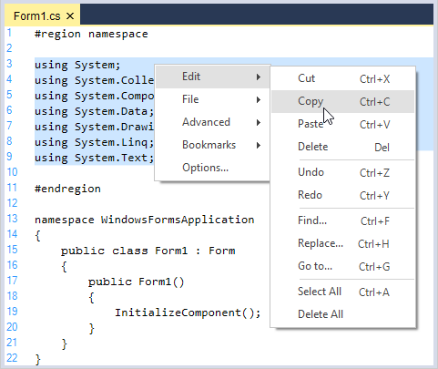

Set the appearance of the context menu by specifying the desired ContextMenuProvider.





// Show Office2003 style context menu.

this.editControl1.ContextMenuManager.ContextMenuProvider = new Syncfusion.Windows.Forms.Tools.XPMenus.XPMenusProvider();

// Show Standard style context menu.

this.editControl1.ContextMenuManager.ContextMenuProvider = new Syncfusion.Windows.Forms.StandardMenusProvider();





' Show Office2003 style context menu

Me.editControl1.ContextMenuManager.ContextMenuProvider = New Syncfusion.Windows.Forms.Tools.XPMenus.XPMenusProvider()

' Show Standard style context menu

Me.editControl1.ContextMenuManager.ContextMenuProvider = New Syncfusion.Windows.Forms.StandardMenusProvider()





### Remove default context menu

By using `MenuFill` event of EditControl, we can remove the default context menu items. 





// Handle the MenuFill event which is called each time the context menu is displayed.

this.editControl1.MenuFill += new EventHandler(cm_FillMenu);

private void cm_FillMenu(object sender, EventArgs e)
{

ContextMenuManager cm = (ContextMenuManager) sender;

// To clear default context menu items.

cm.ClearMenu();

}





' Handle the MenuFill event which is called each time the context menu is displayed.

AddHandler Me.editControl1.MenuFill, AddressOf cm_FillMenu

Private Sub cm_FillMenu(ByVal sender As Object, ByVal e As EventArgs)

Dim cm As ContextMenuManager = CType(sender, ContextMenuManager)

' To clear default context menu items.

cm.ClearMenu();





## Disable particular item from context menu

Context menu item can be set as disabled using `SetContextMenuItemEnabled` method by setting the bool value to be false.





  private void EditControl1_MenuFill(object sender, EventArgs e)
  {
      ContextMenuManager contextMenu = (ContextMenuManager)sender;
            
      contextMenu.ContextMenuProvider.SetContextMenuItemEnabled("&Edit", false);
      
  }     





    Private Sub EditControl1_MenuFill(ByVal sender As Object, ByVal e As EventArgs)
    {
         Dim contextMenu As ContextMenuManager = CType(sender, ContextMenuManager)
            
         contextMenu.ContextMenuProvider.SetContextMenuItemEnabled("&Edit", False)
        
     }





## Change shortcut key for context menu options

You can use the KeyBinder and assign a new key to the `ContextMenu` string command.





// Displays the context choice when Ctrl+L keys are pressed.

this.editControl1.KeyBinder.BindToCommand(Keys.Control | Keys.L, "Editor.ContextChoice");





' Displays the context choice when Ctrl+L keys are pressed.

this.editControl1.KeyBinder.BindToCommand(Keys.Control | Keys.L, "Editor.ContextChoice")





### Add custom context menu item

EditControl also provide an extensive support to add the custom context menu items. You can handle the `MenuFill` event to add Menu Items to the context menu. This is illustrated in the below code snippet. 





// Handle the MenuFill event which is called each time the context menu is displayed.

this.editControl1.MenuFill += new EventHandler(cm_FillMenu);

private void cm_FillMenu(object sender, EventArgs e)
{

ContextMenuManager cm = (ContextMenuManager) sender;

// Add a separator.

cm.AddSeparator();

// Add custom context menu items and their Click event handlers.

cm.AddMenuItem("&Find", new EventHandler(ShowFindDialog));
cm.AddMenuItem("&Replace", new EventHandler(ShowReplaceDialog));
cm.AddMenuItem("&Goto", new EventHandler(ShowGoToDialog));

// If you need to get access to the underlying menu provider you can access it using the below given code.

Syncfusion.Windows.Forms.IContextMenuProvider contextMenuProvider = this.editControl1.ContextMenuManager.ContextMenuProvider;

}

// Calling the in-built dialogs.
void ShowFindDialog(object sender, EventArgs e)
{
   this.editControl1.ShowFindDialog();
}

void ShowReplaceDialog(object sender, EventArgs e)
{
   this.editControl1.ShowReplaceDialog();
}

void ShowGoToDialog(object sender, EventArgs e)
{
   this.editControl1.ShowGoToDialog();
}





' Handle the MenuFill event which is called each time the context menu is displayed.

AddHandler Me.editControl1.MenuFill, AddressOf cm_FillMenu

Private Sub cm_FillMenu(ByVal sender As Object, ByVal e As EventArgs)

Dim cm As ContextMenuManager = CType(sender, ContextMenuManager)

' Add a separator.

cm.AddSeparator()

' Add custom context menu items and their Click eventhandlers.

cm.AddMenuItem("&Find", New EventHandler(AddressOf ShowFindDialog))
cm.AddMenuItem("&Replace", New EventHandler(AddressOf ShowReplaceDialog))
cm.AddMenuItem("&Goto", New EventHandler(AddressOf ShowGoToDialog))

' If you need to get access to the underlying menu provider you can access it using the below given code.

Dim contextMenuProvider As Syncfusion.Windows.Forms.IContextMenuProvider = Me.editControl1.ContextMenuManager.ContextMenuProvider

End Sub 'cm_FillMenu

' Calling the in-built dialogs.

Sub ShowFindDialog(ByVal sender As Object, ByVal e As EventArgs)

Me.editControl1.FindDialog()

End Sub 

Sub ShowReplaceDialog(ByVal sender As Object, ByVal e As EventArgs)

Me.editControl1.ReplaceDialog()

End Sub

Sub ShowGoToDialog(ByVal sender As Object, ByVal e As EventArgs)

Me.editControl1.GoToDialog()

End Sub





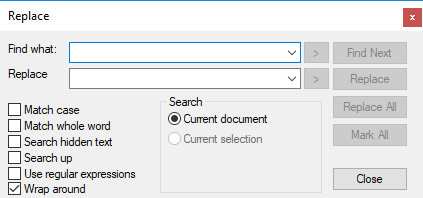

## Line modification marker

EditControl tracks changed lines by displaying markers at the start of lines that have been modified after the file has been loaded or after the last file save operation. Changed lines marking feature can be enabled by setting the `MarkChangedLines` property to `true`. To enable this functionality in the EditControl, the `SelectionMargin` property should also be enabled.





this.editControl1.MarkChangedLines = true;

this.editControl1.ShowSelectionMargin = true;





Me.editControl1.MarkChangedLines = True

Me.editControl1.ShowSelectionMargin = true





### Modified line marker color

We can also set the color for the changing lines by using `ChangedLinesMarkingLineColor` property of EditControl.





this.editControl1.ChangedLinesMarkingLineColor = Color.Red;





Me.editControl1.ChangedLinesMarkingLineColor = Color.Red





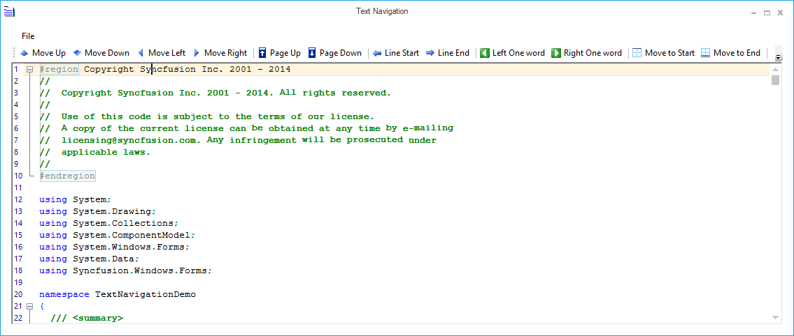

### Saved line marker color

We can also set the color for the changing lines by using `SavedLinesMarkingLineColor` property of EditControl.





this.editControl1.SavedLinesMarkingLineColor = Color.Orange;





Me.editControl1.SavedLinesMarkingLineColor = Color.Orange





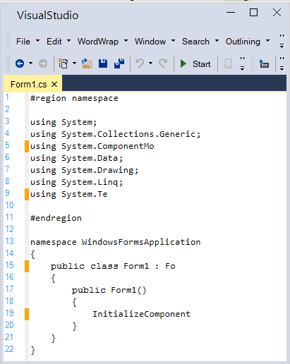

## Comment out lines

EditControl provides support for commenting and uncommenting the particular or group of lines. Comments can be set for a single line, selected text and for text within a specified range by using the below given methods.

<table>
<tr>
<th>
Methods</th><th>
Description</th></tr>
<tr>
<td>
CommentLine</td><td>
Comments single line</td></tr>
<tr>
<td>
CommentSelection</td><td>
Comments selected text</td></tr>
<tr>
<td>
CommentText</td><td>
Comments text in the specified range</td></tr>
</table>





this.editControl1.CommentLine(1);

this.editControl1.CommentSelection();

this.editControl1.CommentText(new Point(1, 1), new Point(7, 7));





Me.editControl1.CommentLine(1)

Me.editControl1.CommentSelection()

Me.editControl1.CommentText(New Point(1, 1), New Point(7, 7))





Comments can be removed by using the below given methods.

<table>
<tr>
<th>
Methods</th><th>
Description</th></tr>
<tr>
<td>
UnCommentLine</td><td>
UnComments single line</td></tr>
<tr>
<td>
UnCommentSelection</td><td>
UnComments selected text</td></tr>
<tr>
<td>
UnCommentText</td><td>
UnComments text in the specified range</td></tr>
</table>





this.editControl1.UnCommentLine();

this.editControl1.UncommentSelection();

this.editControl1.UncommentText(new Point(1, 1), new Point(7, 7));





Me.editControl1.UnCommentLine()

Me.editControl1.UncommentSelection()

Me.editControl1.UncommentText(New Point(1, 1), New Point(7, 7))))





## New line styles

EditControl allows you to specify a new line style, or get the currently used new line style in the text. `SetNewLineStyle` method sets the current new line style in the EditControl. SetNewLineStyle method accepts values from the NewLineStyle enumerator which has values like Windows, Mac, Unix and Control. Similarly, the `GetNewLineStyle` method returns a NewLineStyle enumerator value which indicates the currently used new line style in the EditControl.

The default new line style value is set to 'Control'. This value can be changed according to the needs of the user using the DefaultNewLineStyle property.





// Change the current new line style in the EditControl.

this.editControl1.SetNewLineStyle(Syncfusion.IO.NewLineStyle.Control);

this.editControl1.GetNewLineStyle();

// Specify the default new line style.

this.editControl1.DefaultNewLineStyle = Syncfusion.IO.NewLineStyle.Windows;





' Change the current new line style in the EditControl.

Me.editControl1.SetNewLineStyle(Syncfusion.IO.NewLineStyle.Control)

Me.editControl1.GetNewLineStyle()

' Specify the default new line style.

Me.editControl1.DefaultNewLineStyle = Syncfusion.IO.NewLineStyle.Windows





## Space indicators

EditControl has the ability to indicate whitespace in its contents with default indicators, explained as follows.

1. Single Spaces are indicated by using Dots.
2. Tabs are indicated by using Right Arrows.
3. Line Feeds are indicated by using a special Line Feed Symbol.

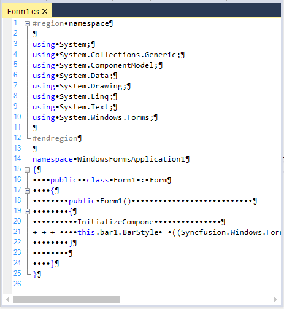

### Configure the space indicator

We can configure the whitespace indicators by setting the `ShowWhiteSpaces` property to `true`. By default, this property is set to `false`.

<table>
<tr>
<th>Property</th>
<th>Description</th>
</tr>
<tr>
<td>ShowWhiteSpaces</td>
<td>Specifies value indicating whether whitespace should be shown as special symbols</td>
</tr>
</table>

You can also toggle the visibility of the whitespace indicators by using the `ToggleShowingWhiteSpaces` method.

<table>
<tr>
<th>Method</th>
<th>Description</th>
</tr>
<tr>
<td>ToggleShowingWhiteSpaces</td>
<td>Toggles showing of whitespace</td>
</tr>
</table>





// Enabling white space indicators.

this.editControl1.ShowWhitespaces = true;

// Toggle the visibility of the white space indicators.

this.editControl1.ToggleShowingWhiteSpaces();





' Enabling white space indicators.

Me.editControl1.ShowWhitespaces = True

' Toggle the visibility of the white space indicators.

Me.editControl1.ToggleShowingWhiteSpaces()





**Showing or hiding indicators**

You can selectively show or hide the whitespace indicators by using the following sub properties of the WhiteSpaceIndicators property - ShowSpaces, ShowTabs and ShowNewLines.

<table>
<tr>
<th>
Properties</th><th>
Description</th></tr>
<tr>
<td>
ShowSpaces</td><td>
Indicates whether spaces should be replaced with symbols</td></tr>
<tr>
<td>
ShowTabs</td><td>
Indicates whether tabs should be replaced with symbols</td></tr>
<tr>
<td>
ShowNewLines</td><td>
Indicates whether new lines should be replaced with symbols</td></tr>
</table>





// Custom indicator for Line Feed.

this.editControl1.WhiteSpaceIndicators.ShowSpaces = true;

// Custom indicator for Tab.

this.editControl1.WhiteSpaceIndicators.ShowTabs = true;

// Custom indicator for Space Character.

this.editControl1.WhiteSpaceIndicators.SpaceNewLines = true;





' Custom indicator for Line Feed. 

Me.editControl1.WhiteSpaceIndicators.ShowSpaces = True 

' Custom indicator for Tab.

Me.editControl1.WhiteSpaceIndicators.ShowTabs = True 

' Custom indicator for Space Character. 

Me.editControl1.WhiteSpaceIndicators.SpaceNewLines = True





### Space indicator character

You can also set the indicators to indicate single spaces, tabs and line feeds by using the NewLineString, TabString and SpaceChar sub properties of the WhiteSpaceIndicators property, as shown below.

<table>
<tr>
<th>
Properties</th><th>
Description</th></tr>
<tr>
<td>
NewLineString</td><td>
Specifies the string that represents line feed in WhiteSpace mode</td></tr>
<tr>
<td>
TabString</td><td>
Specifies the string that represents Tab in WhiteSpace mode</td></tr>
<tr>
<td>
SpaceChar</td><td>
Specifies the character that represents line feed in WhiteSpace mode</td></tr>
</table>





// Custom indicator for Line Feed.

this.editControl1.WhiteSpaceIndicators.NewLineString = "LF";

// Custom indicator for Tab.

this.editControl1.WhiteSpaceIndicators.TabString = "TAB";

// Custom indicator for Space Character.

this.editControl1.WhiteSpaceIndicators.SpaceChar = "s";





' Custom indicator for Line Feed.

Me.editControl1.WhiteSpaceIndicators.NewLineString = "LF"

' Custom indicator for Tab.

Me.editControl1.WhiteSpaceIndicators.TabString = "TAB"

' Custom indicator for Space Character.

Me.editControl1.WhiteSpaceIndicators.SpaceChar = "s"





## Unicode

Unicode is a standard used to encode all the languages of the world in computers. EditControl fully supports serializing and displaying Unicode characters. All Unicode text is saved in UTF-8 format, by default. Moving Unicode text between EditControl and other Word Processing software programs is also straightforward through Copy or Paste clipboard functions. Essential Edit also supports handling of all other text encoding formats specified in the System.Text.Encoding class like ASCII, UTF7, UTF8 and BigEndianUnicode.

The following screenshot illustrates the use of Chinese, Arabic, Hindi, Russian and Greek text in the EditControl.

A sample which demonstrates the above features is available in the below sample installation path.

Installation Location\Syncfusion\Essential Studio\Version Number\Windows\Edit.Windows\Samples\Text Operations\Unicode