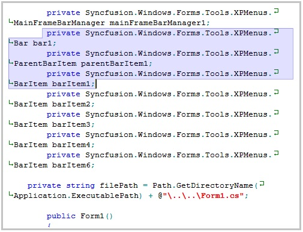
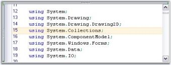
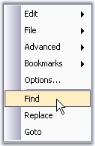
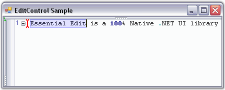
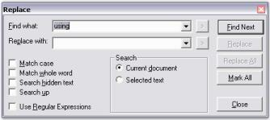
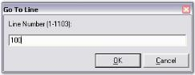

# Editing

EditControl allows the end users to modify, edit text documents and source code files. This includes clipboard support, Unlimited undo and redo, highlighting current line, binding shortcut keys to command and so on.

## Clipboard options

EditControl uses the clipboard to cut, copy or paste the text data. It stores the data in the clipboard for cut and copy operations and retrieves data from the clipboard for paste operations. The following APIs in the EditControl facilitates these clipboard operations.

<table>
<tr>
<th>
Methods</th><th>
Description</th></tr>
<tr>
<td>
Copy</td><td>
Copies the selected text contents into the clipboard</td></tr>
<tr>
<td>
Cut</td><td>
Cuts the selected text contents from EditControl and maintains it in clipboard</td></tr>
<tr>
<td>
Paste</td><td>
Retrieves copied contents from the clipboard and pastes it into EditControl</td></tr>
<tr>
<td>
CanCopy</td><td>
Indicates whether it is possible to perform copy operations in EditControl</td></tr>
<tr>
<td>
CanCut</td><td>
Indicates whether it is possible to perform cut operations in EditControl</td></tr>
<tr>
<td>
CanPaste</td><td>
Indicates whether it is possible to perform copy, cut and paste operations in EditControl</td></tr>
<tr>
<td>
ClearClipboard</td><td>
Clears all contents in the clipboard associated with Essential Edit. This is generally used immediately after the application loads, to clear any junk from previous clipboard operations</td></tr>
</table>





// Copies the selected text into the clipboard.

this.editControl1.Copy();

// Cuts the selected text contents from EditControl and maintains it in the clipboard.

this.editControl1.Cut();

// Retrieves copied contents from the clipboard and pastes it into EditControl.

this.editControl1.Paste();

// Indicates whether it is possible to perform copy operation in EditControl.

bool canCopy = this.editControl1.CanCopy;

// Indicates whether it is possible to perform cut operation in EditControl.

bool canCut = this.editControl1.CanCut;

// Indicates whether it is possible to perform paste operation in EditControl.

bool canPaste = this.editControl1.CanPaste;

// Clears all contents in the clipboard associated with Essential Edit.

this.editControl1.ClearClipboard();





' Copies the selected text into the clipboard.

Me.editControl1.Copy()

' Cuts the selected text contents from EditControl and maintains it in the clipboard. 

Me.editControl1.Cut()

' Retrieves copied contents from the clipboard and pastes it into EditControl.

Me.editControl1.Paste()

' Indicates whether it is possible to perform copy operation in EditControl.

Dim canCopy as bool = Me.editControl1.CanCopy

' Indicates whether it is possible to perform cut operation in EditControl.

Dim canCut as bool = Me.editControl1.CanCut

' Indicates whether it is possible to perform paste operation in EditControl.

Dim canPaste as bool = Me.editControl1.CanPaste

' Clears all contents in the clipboard associated with Essential Edit.

Me.editControl1.ClearClipboard()





**FIPS**

The system’s cryptography is based on the FIPS compliant algorithms for encryption, hashing and security. By doing the following steps, we can enable FIPS in our machine:

    1. Click Start, click Control Panel, and the click on Administrative Tools.
    2. Double-click Local Security Policy.
    3. Double-click Local Policies.
    4. Click Security Options. Under Policies listed in the right pane, double-click System cryptography: Use FIPS compliant algorithms for encryption, hashing, and signing.
    5. Select Enabled to enable FIPS on your machine.

When FIPS is enabled, the Clipboard Operations of EditControl are affected due to EditControl uses the MD5 algorithm. To avoid this, before enabling FIPS, you must disable the EditControl MD5 algorithm by setting the `EnableMD5` property to false.

<table>
<tr>
<th>
Property</th><th>
Description</th></tr>
<tr>
<td>
EnableMD5</td><td>
Specifies whether to enable or disable MD5 algorithm</td></tr>
</table>





this.editControl1.EnableMD5 = true;





Me.editControl1.EnableMD5 = True





**Undo or Redo operation**

Action Grouping allows you to specify a set of actions as groups for Undo or Redo purposes. When an action group is created, and a set of actions is added to it, the entire set is considered as one entity. This implies that the set of actions can be performed or undone using the `Redo` or `Undo` method call. You can use the UndoGroupOpen, UndoGroupClose and UndoGroupCancel methods to programmatically manipulate the undo or redo action grouping.

To undo/redo an action group, do the following steps:

  1. Invoke the `UndoGroupOpen` method to begin a new action group.
  2. Perform any desired set of actions, and invoke the `UndoGroupClose` method to close the action group. All the actions performed between the UndoGroupOpen() and UndoGroupClose() method calls get grouped as one entity.
  3. Now, when the Undo / Redo methods are invoked, the newly created group (or set of actions) gets undone / redone appropriately.
  4. To cancel an already open action group, you have to invoke the `UndoGroupCancel` method.
  5. The `CanUndo` property gets a flag that determines whether the undo operation can be performed in the EditControl.
  6. The `CanRedo` property gets a flag that determines whether the redo operation can be performed in the EditControl.

Essential Edit allows the following methods to be invoked any number of times.

<table>
<tr>
<th>
Methods</th><th>
Description</th></tr>
<tr>
<td>
Undo</td><td>
Performs an undo (CTRL+Z) operation.</td></tr>
<tr>
<td>
Redo</td><td>
Performs a redo (CTRL+Y) operation.</td></tr>
<tr>
<td>
CanUndo</td><td>
Indicates whether it is possible to undo the actions in the EditControl</td></tr>
<tr>
<td>
CanRedo</td><td>
Indicates whether it is possible to redo the actions in the EditControl</td></tr>
<tr>
<td>
ResetUndoInfo</td><td>
Clear the undo buffer. Hence undo operation is not allowed on contents/actions previously added/performed up to that point</td></tr>
</table>

N> The undo or redo buffer is cleared after the 'Save' operation.

Grouping is enabled using the `GroupUndo` property of EditControl. It Specifies whether grouping should be enabled or disabled for undo/redo actions.

<table>
<tr>
<th>
Property</th><th>
Description</th></tr>
<tr>
<td>
GroupUndo</td><td>
Specifies whether grouping should be enabled for undo/redo actions</td></tr>
</table>





// Accomplish Undo operation.

this.editControl1.Undo();

// Accomplish Redo operation. 

this.editControl1.Redo();

// Indicates whether it is possible to Undo in the EditControl. 

bool canUndo = this.editControl1.CanUndo;

// Indicates whether it is possible to Redo in the EditControl. 

bool canRedo = this.editControl1.CanRedo;

// Clears the Undo buffer. 

this.editControl1.ResetUndoInfo();

// Enable grouping for Undo or Redo actions.

this.editControl1.GroupUndo = true;





' Accomplish Undo operation.

Me.editControl1.Undo()

' Accomplish Redo operation.

Me.editControl1.Redo()

' Indicates whether it is possible to Undo in the EditControl.

Dim canUndo as bool = Me.editControl1.CanUndo

' Indicates whether it is possible to Redo in the EditControl.

Dim canRedo as bool = Me.editControl1.CanRedo

' Clears the Undo buffer.

Me.editControl1.ResetUndoInfo()

' Enable grouping for Undo or Redo actions.

Me.editControl1.GroupUndo = True





The following screenshot shows action grouping in EditControl. 

**Comments**

EditControl provides support for commenting and uncommitting the particular or group of lines. Comments can be set for a single line, selected text and for text within a specified range by using the below given methods.

<table>
<tr>
<th>
Methods</th><th>
Description</th></tr>
<tr>
<td>
CommentLine</td><td>
Comments single line</td></tr>
<tr>
<td>
CommentSelection</td><td>
Comments selected text</td></tr>
<tr>
<td>
CommentText</td><td>
Comments text in the specified range</td></tr>
</table>





this.editControl1.CommentLine(1);

this.editControl1.CommentSelection();

this.editControl1.CommentText(new Point(1, 1), new Point(7, 7));





Me.editControl1.CommentLine(1)

Me.editControl1.CommentSelection()

Me.editControl1.CommentText(New Point(1, 1), New Point(7, 7))





Comments can be removed by using the below given methods.

<table>
<tr>
<th>
Methods</th><th>
Description</th></tr>
<tr>
<td>
UnCommentLine</td><td>
UnComments single line</td></tr>
<tr>
<td>
UnCommentSelection</td><td>
UnComments selected text</td></tr>
<tr>
<td>
UnCommentText</td><td>
UnComments text in the specified range</td></tr>
</table>





this.editControl1.UnCommentLine();

this.editControl1.UncommentSelection();

this.editControl1.UncommentText(new Point(1, 1), new Point(7, 7));





Me.editControl1.UnCommentLine()

Me.editControl1.UncommentSelection()

Me.editControl1.UncommentText(New Point(1, 1), New Point(7, 7))))





## Keep tabs

EditControl supports text operations with tabs Keys. Essential Edit controls the insertion of tabs using the `UseTabs` property, which lets you specify whether a tab (or an equivalent number of spaces) needs to be inserted, when the TAB key is pressed in the EditControl. Similarly, tab stops can also be inserted. 

<table>
<tr>
<th>
Properties</th><th>
Description</th></tr>
<tr>
<td>
UseTabs</td><td>
Specifies whether tab symbol is allowed or spaces should be used instead. Setting this property to True, allows you to insert tabs, whereas setting it to False, allows you to insert spaces</td></tr>
<tr>
<td>
UseTabStops</td><td>
Specifies a value that indicates whether tab stops should be used</td></tr>
<tr>
<td>
TabStopsArray</td><td>
Specifies an array of tab stops</td></tr>
</table>





this.editControl1.UseTabs = true;

this.editControl1.UseTabStops = true;

this.editControl1.TabStopsArray = new int[] { 8, 16, 24, 32, 40};





Me.editControl1.UseTabs = True

Me.editControl1.UseTabStops = True;

Me.EditControl1.TabStopsArray = New Integer() {8, 16, 24, 32, 40}





### Specifying tab size

The size of the tab can be specified by using the below given property.

<table>
<tr>
<th>
Property</th><th>
Description</th></tr>
<tr>
<td>
TabSize</td><td>
Specifies tab size in spaces</td></tr>
</table>





// Size of the tab in terms of space.

this.editControl1.TabSize = 8;





' Size of the tab in terms of space.

Me.editControl1.TabSize = 8





### TAB key functionality

The `TransferFocusOnTab` property allows you to specify, whether the EditControl should process the TAB key as a text input, or transfer the focus to the next control (by the order of TabIndex property value) on the Form or the User Control hosting the EditControl.





// Insert tabs into the EditControl as text input. 

this.editControl1.TransferFocusOnTab = false;

// Transfer focus to the next control.

this.editControl1.TransferFocusOnTab = true;





' Insert tabs into the EditControl as text input.

this.editControl1.TransferFocusOnTab = False

' Transfer focus to the next control.

this.editControl1.TransferFocusOnTab = True





### TAB key functionality on selected text

The following methods can be used convert the spaces in a selected region into tabs and vice versa. Tab symbols can also be added, inserted or removed from selected text.

<table>
<tr>
<th>
Methods</th><th>
Description</th></tr>
<tr>
<td>
AddTabsToSelection</td><td>
Adds leading tab symbol to the selected lines, or just inserts the tab symbol</td></tr>
<tr>
<td>
RemoveTabsFromSelection</td><td>
Removes leading tab symbol (or its spaces equivalent) from selected lines</td></tr>
</table>





// Add or insert leading tab symbol to selected lines.

this.editControl1.AddTabsToSelection();

// Remove leading tab symbol from selected lines.

this.editControl1.RemoveTabsFromSelection();





' Add or insert leading tab symbol to selected lines.

Me.editControl1.AddTabsToSelection()

' Remove leading tab symbol from selected lines.

Me.editControl1.RemoveTabsFromSelection()





## Selection mode

 EditControl has two type of selection modes as like Visual Studio Code Editor.

* Default  

   This mode enable user to select Whole line. 

   
   
   
   
   //To Enable Default mode.

   this.editControl1.SelectionMode = Syncfusion.Windows.Forms.Edit.SelectionModes.Default;

   

   
   
   'To Enable Default mode.

   Me.editControl1.SelectionMode = Syncfusion.Windows.Forms.Edit.SelectionModes.Default

   

   
   
   
     
* Block   

   This mode enable user to select, certain rectangle portion instead of whole line. The selection includes all characters captured within the rectangle defined by the first and last character in the selection. Anything typed or pasted into the selected area is inserted at the same point on each line. 

   
   
   

   //To Enable Block selection mode.

   this.editControl1.SelectionMode = Syncfusion.Windows.Forms.Edit.SelectionModes.Block;

   

   

   'To Enable Block selection mode.

    Me.editControl1.SelectionMode = Syncfusion.Windows.Forms.Edit.SelectionModes.Block

   

   

   

## Highlighting current line 

You can highlight the current line where the mouse pointer is present by setting the `HighlightCurrentLine` property of the EditControl to True. Its default value is false. By using the `CurrentLineHighlightColor` property, we can set the color for the highlighted line. 

<table>
<tr>
<th>
Properties</th><th>
Description</th></tr>
<tr>
<td>
HighlightCurrentLine</td><td>
Specifies a value indicating whether current line should be highlighted</td></tr>
<tr>
<td>
CurrentLineHighlightColor</td><td>
Specifies color of current line highlight</td></tr>
</table>





this.editControl1.HighlightCurrentLine = true;

this.editControl1.CurrentLineHighlightColor = Color.Orange;





Me.editControl1.HighlightCurrentLine = true

Me.editControl1.CurrentLineHighlightColor = Color.Orange





## Binding shortcut keys to command 

The keyboard shortcuts for the commands in the EditControl are listed below.

<table>
<tr>
<th>
Command</th><th>
Shortcut</th></tr>
<tr>
<td colspan = "2">
Clipboard</td></tr>
<tr>
<td>
Copy</td><td>
CTRL+C, CTRL+INSERT</td></tr>
<tr>
<td>
Paste</td><td>
CTRL+V, SHIFT+INSERT</td></tr>
<tr>
<td>
Cut</td><td>
CTRL+X, SHIFT+DEL</td></tr>
<tr>
<td>
SelectAll</td><td>
CTRL+A</td></tr>
<tr>
<th colspan = "2">
File Operation</th></tr>
<tr>
<td>
Save</td><td>
CTRL+S</td></tr>
<tr>
<td>
SaveAs</td><td>
CTRL+SHIFT+S</td></tr>
<tr>
<td>
New</td><td>
CTRL+N</td></tr>
<tr>
<td>
Open</td><td>
CTRL+O</td></tr>
<tr>
<th colspan = "2">
Printing</th></tr>
<tr>
<td>
Print</td><td>
CTRL+P</td></tr>
<tr>
<th colspan = "2">
Positioning</th></tr>
<tr>
<td>
Go to line</td><td>
CTRL+G</td></tr>
<tr>
<td>
Go to start</td><td>
CTRL+HOME</td></tr>
<tr>
<td>
Go to end</td><td>
CTRL+END</td></tr>
<tr>
<th colspan = "2">
Search and Replace</th></tr>
<tr>
<td>
Find</td><td>
CTRL+F</td></tr>
<tr>
<td>
FindNext</td><td>
F3</td></tr>
<tr>
<td>
FindSelected</td><td>
CTRL+F3</td></tr>
<tr>
<td>
Replace</td><td>
CTRL+H</td></tr>
<tr>
<th colspan = "2">
Undo and Redo</th></tr>
<tr>
<td>
Undo </td><td>
CTRL+Z</td></tr>
<tr>
<td>
Redo</td><td>
CTRL+Y</td></tr>
<tr>
<th colspan = "2">
Bookmark</th></tr>
<tr>
<td>
Toggle unnamed bookmark</td><td>
CTRL+F2, CTRL+K->CTRL+K</td></tr>
<tr>
<td>
Go to next bookmark</td><td>
F2, CTRL+K->CTRL+N</td></tr>
<tr>
<td>
Go to previous bookmark</td><td>
F3, CTRL+K->CTRL+P</td></tr>
<tr>
<td>
Toggle named bookmark</td><td>
CTRL+[index of bookmark]</td></tr>
<tr>
<td>
Go to named bookmark</td><td>
CTRL+SHIFT+[index of bookmark]</td></tr>
<tr>
<th colspan = "2">
Tab</th></tr>
<tr>
<td>
Add leading tab</td><td>
TAB with multiple line selection</td></tr>
<tr>
<td>
Remove leading tab</td><td>
SHIFT+TAB</td></tr>
<tr>
<th colspan = "2">
Outlining</th></tr>
<tr>
<td>
Switch on outlining and collapse all</td><td>
CTRL+M->CTRL+O</td></tr>
<tr>
<td>
Switch off outlining</td><td>
CTRL+M->CTRL+P</td></tr>
<tr>
<td>
Toggle outlining</td><td>
CTRL+M->CTRL+M</td></tr>
<tr>
<th colspan = "2">
WhiteSpace</th></tr>
<tr>
<td>
Show white space</td><td>
CTRL+SHIFT+W</td></tr>
<tr>
<th colspan = "2">
Intellisense</th></tr>
<tr>
<td>
Show context prompt</td><td>
CTRL+SHIFT+SPACEBAR</td></tr>
<tr>
<td>
Show context choice</td><td>
CTRL+SPACEBAR</td></tr>
</table>

EditControl offers support for the action-keystroke binding functionality, providing you the ability to perform advanced customization of action-keystroke bindings to suit your preferences. You can bind any desired keystroke combination to a standard (or custom) command like Copy, Cut, Paste or Find in the designer using the Keys Binding dialog as illustrated in the following procedure:

   1. In the Editor Keys Binding dialog box, select the desired standard command. The default shortcuts assigned for a particular command are listed in the combobox under the Shortcut(s) for selected command: label.
   2. Set the focus to the Edit Box. Press TAB to navigate to the shortcuts drop-down list.
   3. Press the desired key or key combination.
   4. Now, click the Assign button, to assign this keystroke combination as the shortcut for that particular standard command. Click OK.

The `KeyBinder` property is used to get the key binder, and the `KeyBindingProcessor` property is used to get or set the key binding processor. The Editor Keys Binding dialog is invoked using the `ShowKeysBindingEditor` method of the EditControl.

The following illustration shows the Keys Binding dialog box.

You can also make use the `RegisteringKeyCommands` and `RegisteringDefaultKeyBindings` events to specify user-defined commands and bind the desired custom keystroke combinations to them.

This following code example registers the "File.Open" command and binds a Ctrl+O keystroke combination to it.





// Invoke the Editor Keys Binding dialog.

this.editControl1.ShowKeysBindingEditor();

// Bind the action name to the action using the RegisteringKeyCommands and ProcessCommandEventHandler events.

private void this.editControl1_RegisteringKeyCommands(object sender, EventArgs e)
{

     this.editControl1.Commands.Add( "File.Open" ).ProcessCommand += new ProcessCommandEventHandler( Command_Open );

}

// Bind key combinations to the action name using the RegisteringDefaultKeyBindings event.

private void this.editControl1_RegisteringDefaultKeyBindings(object sender, EventArgs e)
{

      this.editControl1.KeyBinder.BindToCommand( Keys.Control | Keys.O, "File.Open" );

}

// Define the action that needs to be performed.

private void Command_Open()
{

      /* Do the desired task. */

}





' Invoke the Editor Keys Binding dialog.

Me.editControl1.ShowKeysBindingEditor()

' Bind the action name to the action using the RegisteringKeyCommands and ProcessCommandEventHandler events.

Private  Sub Me.editControl1_RegisteringKeyCommands(ByVal sender As Object, ByVal e As EventArgs)

     Me.editControl1.Commands.Add("File.Open").ProcessCommand += New ProcessCommandEventHandler(Command_Open)

End Sub

' Bind key combinations to the action name using the RegisteringDefaultKeyBindings event. 

Private  Sub Me.editControl1_RegisteringDefaultKeyBindings(ByVal sender As Object, ByVal e As EventArgs)

     Me.editControl1.KeyBinder.BindToCommand(Keys.Control | Keys.O, "File.Open")

End Sub

' Define the action that needs to be performed.

Private Sub Command_Open()

     ' Do the desired task.

End Sub





## Context menu options

EditControl has a built-in context menu which is enabled, by default. This context menu allows you to edit the contents, and open or create a new file. It includes some advanced features like indent selection, comment selection, adding bookmarks and much more. This is enabled by using the `editControl1.ContextMenuManager.Enabled` property.

The context menu has the standard VS.NET-like appearance, and can optionally be provided with the Office 2003 appearance.

Set the appearance of the context menu by specifying the desired ContextMenuProvider.





// Show Office2003 style context menu.

this.editControl1.ContextMenuManager.ContextMenuProvider = new Syncfusion.Windows.Forms.Tools.XPMenus.XPMenusProvider();

// Show Standard style context menu.

this.editControl1.ContextMenuManager.ContextMenuProvider = new Syncfusion.Windows.Forms.StandardMenusProvider();





' Show Office2003 style context menu

Me.editControl1.ContextMenuManager.ContextMenuProvider = New Syncfusion.Windows.Forms.Tools.XPMenus.XPMenusProvider()

' Show Standard style context menu

Me.editControl1.ContextMenuManager.ContextMenuProvider = New Syncfusion.Windows.Forms.StandardMenusProvider()





### Adding customized menu items

EditControl also provide an extensive support to add the custom context menu items. You can handle the `MenuFill` event to add Menu Items to the context menu. This is illustrated in the below code snippet. 





// Handle the MenuFill event which is called each time the context menu is displayed.

this.editControl1.MenuFill += new EventHandler(cm_FillMenu);

private void cm_FillMenu(object sender, EventArgs e)
{

ContextMenuManager cm = (ContextMenuManager) sender;

// To clear default context menu items.

cm.ClearMenu();

// Add a separator.

cm.AddSeparator();

// Add custom context menu items and their Click event handlers.

cm.AddMenuItem("&Find", new EventHandler(ShowFindDialog));
cm.AddMenuItem("&Replace", new EventHandler(ShowReplaceDialog));
cm.AddMenuItem("&Goto", new EventHandler(ShowGoToDialog));

// If you need to get access to the underlying menu provider you can access it using the below given code.

Syncfusion.Windows.Forms.IContextMenuProvider contextMenuProvider = this.editControl1.ContextMenuManager.ContextMenuProvider;

}

// Calling the in-built dialogs.
void ShowFindDialog(object sender, EventArgs e)
{
   this.editControl1.ShowFindDialog();
}

void ShowReplaceDialog(object sender, EventArgs e)
{
   this.editControl1.ShowReplaceDialog();
}

void ShowGoToDialog(object sender, EventArgs e)
{
   this.editControl1.ShowGoToDialog();
}





' Handle the MenuFill event which is called each time the context menu is displayed.

AddHandler Me.editControl1.MenuFill, AddressOf cm_FillMenu

Private Sub cm_FillMenu(ByVal sender As Object, ByVal e As EventArgs)

Dim cm As ContextMenuManager = CType(sender, ContextMenuManager)

' To clear default context menu items.

cm.ClearMenu();

' Add a separator.

cm.AddSeparator()

' Add custom context menu items and their Click eventhandlers.

cm.AddMenuItem("&Find", New EventHandler(AddressOf ShowFindDialog))
cm.AddMenuItem("&Replace", New EventHandler(AddressOf ShowReplaceDialog))
cm.AddMenuItem("&Goto", New EventHandler(AddressOf ShowGoToDialog))

' If you need to get access to the underlying menu provider you can access it using the below given code.

Dim contextMenuProvider As Syncfusion.Windows.Forms.IContextMenuProvider = Me.editControl1.ContextMenuManager.ContextMenuProvider

End Sub 'cm_FillMenu

' Calling the in-built dialogs.

Sub ShowFindDialog(ByVal sender As Object, ByVal e As EventArgs)

Me.editControl1.FindDialog()

End Sub 

Sub ShowReplaceDialog(ByVal sender As Object, ByVal e As EventArgs)

Me.editControl1.ReplaceDialog()

End Sub

Sub ShowGoToDialog(ByVal sender As Object, ByVal e As EventArgs)

Me.editControl1.GoToDialog()

End Sub





## Find and replace

The EditControl supports text search and replace functionalities through the use of the FindText and ReplaceText methods. There are also other useful methods like FindCurrentText, FindNext and ReplaceAll that assist in this purpose.

<table>
<tr>
<th>
Methods</th><th>
Description</th></tr>
<tr>
<td>
FindText</td><td>
Finds the first occurrence of the specified text as per the conditions specified like match case, match whole word, search hidden text and search up</td></tr>
<tr>
<td>
FindRange</td><td>
Searches for given string in the text of control and returns text range of first found occurrence</td></tr>
<tr>
<td>
FindRegex</td><td>
Looks for specified expression in text</td></tr>
<tr>
<td>
ReplaceText</td><td>
Replaces the first occurrence of the specified text with the replacement text as per the conditions specified like match case, match whole word, search hidden text and search up</td></tr>
<tr>
<td>
FindCurrentText</td><td>
Finds the next occurrence of the word on which the cursor is presently on</td></tr>
<tr>
<td>
FindNext</td><td>
Finds the next occurrence of the current search text</td></tr>
<tr>
<td>
ReplaceAll</td><td>
Replaces all occurrences of the search text with the replacement text as per the conditions specified like match case, match whole word, search hidden text and search up</td></tr>
</table>





// Finds the first occurrence of the specified text as per the conditions specified.

this.editControl1.FindText("Essential Edit", true, true, true, true, null);

// Searches for given string in the text of control and returns text range of first found occurrence.

this.editControl1.FindRange(searchString, startLocation, endLocation, matchWholeWord, searchHiddenText, searchUp, useRegex);

// Looks for specified expression in text.

this.editControl1.FindRegex(startLine, startColumn, expression, bSearchInCollapsed, searchUp);

// Replaces the first occurrence of the specified text with the replacement text as per the conditions specified.

this.editControl1.ReplaceText("ShowVerticalScrollbar", "ShowVerticalScroller");

// Finds the next occurrence of the word on which the cursor is presently on.

this.editControl1.FindCurrentText();

// Finds the next occurrence of the current search text.

this.editControl1.FindNext();

// Replaces all occurrences of the search text with the replacement text as per the conditions specified.

this.editControl1.ReplaceAll(" Drag-and-drop", "Drag and drop");





' Finds the first occurrence of the specified text as per the conditions specified.

Me.editControl1.FindText("Essential Edit", True, True, True, True, Nothing)

' Searches for given string in the text of control and returns text range of first found occurrence.

Me.editControl1.FindRange(searchString, startLocation, endLocation, matchWholeWord, searchHiddenText, searchUp, useRegex)

' Looks for specified expression in text.

Me.editControl1.FindRegex(startLine, startColumn, expression, bSearchInCollapsed, searchUp)

' Replaces the first occurrence of the specified text with the replacement text as per the conditions specified.

Me.editControl1.ReplaceText("ShowVerticalScrollbar", "ShowVerticalScroller") 

' Finds the next occurrence of the word on which the cursor is presently on.

Me.editControl1.FindCurrentText()

' Finds the next occurrence of the current search text.

Me.editControl1.FindNext()

' Replaces all occurrences of the search text with the replacement text as per the conditions specified.

Me.editControl1.ReplaceAll(" Drag-and-drop", "Drag and drop")





**Find and Replace dialog boxes**

EditControl also supports advanced and customizable Find and Replace dialog boxes. The Find dialog box is invoked by using the ShowFindDialog method. The keyboard shortcut to this dialog box is Ctrl+F.

The Replace dialog box is invoked by using the ShowReplaceDialog method. The keyboard shortcut to this dialog box is Ctrl+H. The Replace dialog box also allows you to find and replace words 
within the selected text.





// Invoke the Find Dialog.

this.editControl1.ShowFindDialog();

// Invoke the Replace Dialog.

this.editControl1.ShowReplaceDialog();





' Invoke the Find Dialog.

Me.editControl1.ShowFindDialog()

' Invoke the Replace Dialog.

Me.editControl1.ShowReplaceDialog()





Essential Edit now enables you to create a new find dialog by inheriting Essential Edit’s find dialog. You can customize the Find Dialog by changing the properties and triggers the events of the buttons such as Find, Mark All and Close. You can also easily localize the captions of the controls in the Find dialog.

**Creating a class for own find dialog**

Create a class for own find dialog that inherits the frmFindDialog class.

The following code illustrates this.





//Inherits the frmFindDialog

public class FindDialogExt : Syncfusion.Windows.Forms.Edit.Dialogs.frmFindDialog





‘Inherits the frmFindDialog.

Public Class FindDialogExt

Inherits Syncfusion.Windows.Forms.Edit.Dialogs.frmFindDialog

End Class





This event occurs in FindNext() when search reaches the starting point of the search before the message box displays.

The event handler receives an argument of FindCompleteEventArgs . This argument class sets the text for message box. Users can localize this text.





// Handle the FindComplete event.

 this.FindComplete += new EventHandler<FindCompleteEventArgs>(FindDialogExt_FindComplete);

//Set the value for message box for when search reaches the starting point of search

Private void FindDialogExt_FindComplete(object sender, frmFindDialog.FindCompleteEventArgs e)
{
     //Arabic text as message(localize)

     if (messageString != string.Empty)

         e.Message = "انتهى";

     else

          e.Message = "Find reached the starting point of the search.";

}





' Handle the FindComplete event.

Private Me.editControl1.FindComplete += New EventHandler(Of FindCompleteEventArgs)(AddressOf FindDialogExt_FindComplete)

'Set the value for message box for when search reaches the starting point of search

Private Sub FindDialogExt_FindComplete(ByVal sender As Object, ByVal e As frmFindDialog.FindCompleteEventArgs)

     'Arabic text as message (localize)

     If messageString <> String.Empty Then

        e.Message = "انتهى"

     Else

        e.Message = "Find reached the starting point of the search."

     End If

End Sub





Default key bindings to these dialogs can be changed as explained in the Keystroke - Action Combinations Binding topic.

### History properties

The FindHistory property is used to add/remove items from the find history in the Find dialog box. The ReplaceHistory property is used to add/remove items from the replace history in the Replace dialog box. Similarly, the ReplaceSearchHistory property is used to add / remove items from the find history in the Replace dialog box.

<table>
<tr>
<th>
Properties</th><th>
Description</th></tr>
<tr>
<td>
FindHistory</td><td>
Specifies history of Find dialog</td></tr>
<tr>
<td>
ReplaceHistory</td><td>
Gets history of Replace dialog</td></tr>
<tr>
<td>
ReplaceSearchHistory</td><td>
Gets search history of Replace dialog</td></tr>
</table>

The methods associated with the FindHistory property are used to perform the following operations.

<table>
<tr>
<th>
FindHistory method</th><th>
Description</th></tr>
<tr>
<td>
Insert</td><td>
Inserts an element into the System.Collections.ArrayList at the specified index</td></tr>
<tr>
<td>
Remove</td><td>
Removes an element or the first occurrence from the System.Collections.ArrayList of the specified index</td></tr>
<tr>
<td>
Sort</td><td>
Sorts all the elements in the System.Collections.ArrayList</td></tr>
<tr>
<td>
Clear</td><td>
Clears all the items in the FindHistory</td></tr>
</table>





this.editControl1.FindHistory.Insert(0,(object)ATH.addedItem);

this.editControl1.FindHistory.Remove(o);

this.editControl1.FindHistory.Sort();

this.editControl1.FindHistory.Clear();





Me.editControl1.FindHistory.Insert(0,CType(ATH.addedItem, Object))

Me.editControl1.FindHistory.Remove(o)

Me.editControl1.FindHistory.Sort()

Me.editControl1.FindHistory.Clear()





N> The above methods can also be set for the ReplaceHistory and ReplaceSearchHistory properties.

## GoTo line

The EditControl supports the `GoTo` functionality both through the use of a run time dialog box and through programmatic APIs. The `GoTo` method is used to position the mouse pointer on any specified line that the user wish to go. The GoTo method not only positions the pointer on the appropriate line, but it also scrolls the concerned line into the view. 

The `linesAbove` argument can be used to specify the number of lines to be displayed above the pointer.





// Places the cursor at the beginning of the given line number.

this.editControl1.GoTo(lineNumber);

this.editControl1.GoTo(lineNumber, linesAbove);





' Places the cursor at the beginning of the given line number.

Me.editControl1.GoTo(lineNumber)

Me.editControl1.GoTo(lineNumber, linesAbove);





The CurrentLine property explained in the Positions and Offsets section, also does the same task as the GoTo method. The Goto dialog box is invoked using the ShowGoToDialog method. The keyboard shortcut to this dialog box is Ctrl+G.





// Invoke the GoTo Dialog.

this.editControl1.ShowGoToDialog();





' Invoke the GoTo Dialog.

Me.editControl1.ShowGoToDialog()





## Context ToolTip

EditControl provides the extensive tooltip support, it is modeled on the Quick Info intellisense feature of Visual Studio. Context ToolTip is displayed when the mouse is hovered over a content or text in the EditControl. Whenever the mouse hovers over a token, the `UpdateContextTooltip` event is fired for quick information on the lexem. If some text information is provided, it is displayed in a tooltip.

The Context ToolTip can be populated with additional information on the corresponding lexem by handling the `UpdateContextTooltip` event of EditControl.





private void editControl1_UpdateContextToolTip(object sender, Syncfusion.Windows.Forms.Edit.Dialogs.UpdateTooltipEventArgs e)
{
   if( e.Text == string.Empty )
   {

     Point pointVirtual = editControl1.PointToVirtualPosition( new Point( e.X, e.Y ) );

     if( pointVirtual.Y > 0 )
     {
        // Get the current line
        ILexemLine line = editControl1.GetLine( pointVirtual.Y );

        if( line != null )
        {
            // Get tokens from the current line
            ILexem lexem = line.FindLexemByColumn( pointVirtual.X );
            if( lexem != null )
            {
                // Set the desired information tooltip
                e.Text = "This is additional information on " + lexem.Text;
            }
         }
      }

    }
}





Private Sub editControl1_UpdateContextToolTip(ByVal sender As Object, ByVal e As Syncfusion.Windows.Forms.Edit.Dialogs.UpdateTooltipEventArgs) Handles EditControl1.UpdateContextToolTip

   If e.Text = String.Empty Then

      Dim pointVirtual As Point = editControl1.PointToVirtualPosition(New Point(e.X, e.Y))

      If pointVirtual.Y > 0 Then

         ' Get the current line

          Dim line As ILexemLine = editControl1.GetLine(pointVirtual.Y)

          If Not (line Is Nothing) Then

             ' Get tokens from the current line

              Dim lexem As ILexem = line.FindLexemByColumn(pointVirtual.X)

              If Not (lexem Is Nothing) Then

                ' Set the desired information tooltip

                 e.Text = "This is additional information on " + lexem.Text;

              End If

          End If

        End If

   End If

End Sub





### Customization

The brush for the Context ToolTip background can be set by using the `ContextTooltipBackgroundBrush` property. And also the border color of the Context ToolTip form can be customized by using the `ContextTooltipBorderColor` property.





this.editControl1.ContextTooltipBackgroundBrush = new Syncfusion.Drawing.BrushInfo(Syncfusion.Drawing.PatternStyle.Percent05, System.Drawing.Color.LavenderBlush, System.Drawing.Color.Khaki);

this.editControl1.ContextTooltipBorderColor = System.Drawing.Color.Orange;





Me.editControl1.ContextTooltipBackgroundBrush = New Syncfusion.Drawing.BrushInfo(Syncfusion.Drawing.PatternStyle.Percent05, System.Drawing.Color.LavenderBlush, System.Drawing.Color.Khaki)

Me.editControl1.ContextTooltipBorderColor = System.Drawing.Color.Orange





### Showing the ToolTip

The Context ToolTip window can be shown or hidden by setting the `ShowContextTooltip` property to True.





// Shows the Context ToolTip pop-up window.

this.editControl1.ShowContextTooltip = true;





' Shows the Context ToolTip pop-up window.

Me.editControl1.ShowContextTooltip = True





**ToolTip delay**

It is also possible to specify the time delay after which the tooltip should be displayed by using the `ToolTipDelay` property.





// Displays the tooltip pop-up after 1000 milliseconds( 1 sec )

this.editControl1.ToolTipDelay = 1000;





' Displays the tooltip pop-up after 1000 milliseconds( 1 sec )

Me.edtiControl1.ToolTipDelay = 1000





**Closing the ToolTip**

The Context ToolTip window is closed by using the CloseContextTooltip method.





// Closes the Context ToolTip pop-up window.

this.editControl1.CloseContextTooltip();





' Closes the Context ToolTip pop-up window.

Me.editControl1.CloseContextTooltip();





## AutoComplete support

Complete word feature is a user-friendly functionality that can be used in conjunction with the Context Choice, and is analogous to the Complete word feature in Visual Studio. This feature auto completes the rest of the member name once you have entered enough characters to distinguish it. Type the first few letters of the member name, and then press ALT+RIGHT ARROW or CTRL+SPACEBAR keys to see this functionality.

### Example

When the following text is typed - "this.editControl1.", it displays a Context Choice list with members in the following order

* New
* Word
* WordLeft
* WordRight

**Case 1**

If you type "w" after "this.editControl1.", such that it looks like - "this.editControl1.w", and press the ALT+RIGHT ARROW (or CTRL+SPACEBAR) keys, it will auto complete it with the first matching member name. In this case, it will be auto completed as "this.editControl1.Word".

**Case 2**

If you type "word" after "this.editControl1.", such that it looks like - "this.editControl1.word", and press the ALT+RIGHT ARROW (or CTRL+SPACEBAR) keys, it will auto complete it with the first matching member name. In this case, it will be auto completed as "this.editControl1.WordRight".

**Case 3**

If you type "move" after "this.editControl1.", such that it looks like - "this.editControl1.move", and press the ALT+RIGHT ARROW (or CTRL+SPACEBAR) keys, it will auto complete it with the first matching member name. In this case, there is no matching member name to autocomplete, and hence nothing will happen.

**Case 4**

If you type nothing after "this.editControl1.", and press the ALT+RIGHT ARROW (or CTRL+SPACEBAR) keys, it will auto complete it with the first member name in the Context Choice list. In this case, it should be auto completed as "this.editControl1.New".

Note that the searching process for the first matching member is not case sensitive. For example, "word" and "Word" will be treated in the same way.

Set the `UseAutocomplete` property associated with the IContextChoiceController to True, to enable this functionality while using Context Choice.





private void editControl1_ContextChoiceOpen(Syncfusion.Windows.Forms.Edit.Interfaces.IContextChoiceController controller)

{

   controller.UseAutocomplete = true;

}





Private Sub editControl1_ContextChoiceOpen(ByVal controller As Syncfusion.Windows.Forms.Edit.Interfaces.IContextChoiceController) Handles editControl1.ContextChoiceOpen

   controller.UseAutocomplete = True

End Sub





### AutoReplace triggers

EditControl comes with the AutoReplace triggers feature which allows the control to automatically correct some of the known predefined typing errors. AutoReplace triggers are fired when certain keys are pressed. These keys are defined within the language definition. When the AutoReplace trigger key is pressed, the editor checks the word before the AutoReplace trigger, to see if it is in the AutoReplace table. If it is present, then the word is automatically replaced with its replacement word.

The AutoReplace Trigger keys are defined within the language definitions. This means that different keys can be defined as triggers for different languages.

Auto Replace Triggers can be enabled or disabled by using the `UseAutoreplaceTriggers` property as shown below.





// Enables AutoReplace Triggers.

this.editControl1.UseAutoreplaceTriggers = true;





' Enables AutoReplace Triggers.

Me.editControl1.UseAutoreplaceTriggers = True





The keys used as AutoReplace Triggers are defined by using the TriggersActivators attribute of the language in the configuration file, as shown below.

<ConfigLanguage name ="C#" Known ="Csharp" StartComment ="//" TriggersActivators =" ;.=()">

Triggers can be flagged as valid only within the specific lexical states. For example, you can set a trigger not to fire, if it is in a comment within a language, by using the AllowTriggers attribute, as shown below.

<lexem BeginBlock="/* EndBlock="*/" Type="Comment" OnlyLocalSublexems="true" IsComplex="true" IsCollapsable="true" CollapseName="/*...*/" AllowTriggers="false">

The words to be replaced when the AutoReplace Triggers key is pressed can be defined by using the code given below.





this.editControl1.Language.AutoReplaceTriggers.AddRange(new AutoReplaceTrigger[]{new AutoReplaceTrigger("tis","this"),new AutoReplaceTrigger("fro","for")});





Me.editControl1.Language.AutoReplaceTriggers.AddRange(New AutoReplaceTrigger(){New AutoReplaceTrigger("tis","this"),New AutoReplaceTrigger("fro","for")})





The words to be replaced can also be defined within the language definition in the configuration file, as shown below.



<AutoReplaceTriggers>

   <AutoReplaceTrigger From ="tis" To ="this" />

   <AutoReplaceTrigger From ="itn" To ="int" />

</AutoReplaceTriggers>
 




[AutoComplete Support](/windowsforms/edit/code-completion#autocomplete-support)



## Text navigation

EditControl offers extensive support for text navigation. You can perform navigation at character, word, line, page or entire document levels. This section briefly explains the navigation of text in EditControl.

### Character level navigation

The following methods enable text navigation in the EditControl, in terms of characters or columns.

<table>
<tr>
<th>
Methods</th><th>
Description</th></tr>
<tr>
<td>
MoveUp</td><td>
Moves cursor up, if possible</td></tr>
<tr>
<td>
MoveDown</td><td>
Moves cursor down, if possible</td></tr>
<tr>
<td>
MoveLeft</td><td>
Moves cursor left, if possible</td></tr>
<tr>
<td>
MoveRight</td><td>
Moves cursor right, if possible</td></tr>
</table>





this.editControl1.MoveUp();

this.editControl1.MoveDown();

this.editControl1.MoveLeft();

this.editControl1.MoveRight();





Me.editControl1.MoveUp()

Me.editControl1.MoveDown()

Me.editControl1.MoveLeft()

Me.editControl1.MoveRight()





### Word level navigation

The following methods enable text navigation in the EditControl, in terms of words.

<table>
<tr>
<th>
Methods</th><th>
Description</th></tr>
<tr>
<td>
MoveLeftWord</td><td>
Moves caret to the left by one word</td></tr>
<tr>
<td>
MoveRightWord</td><td>
Moves caret to the right by one word</td></tr>
</table>





this.editControl1.MoveLeftWord();

this.editControl1.MoveRightWord();





Me.editControl1.MoveLeftWord()

Me.editControl1.MoveRightWord()





### Line level navigation

The following methods enable text navigation in the EditControl, in terms of lines.

<table>
<tr>
<th>
Methods</th><th>
Description</th></tr>
<tr>
<td>
MoveToLineStart</td><td>
Moves caret to the beginning of the line. First whitespace will be skipped</td></tr>
<tr>
<td>
MoveToLineEnd</td><td>
Moves caret to the end of the line</td></tr>
</table>





this.editControl1.MoveToLineStart();

this.editControl1.MoveToLineEnd();





Me.editControl1.MoveToLineStart()

Me.editControl1.MoveToLineEnd()





### Page level navigation

The following methods enable text navigation in the EditControl, in terms of pages.

<table>
<tr>
<th>
Methods</th><th>
Description</th></tr>
<tr>
<td>
MovePageUp</td><td>
Moves caret one page up</td></tr>
<tr>
<td>
MovePageDown</td><td>
Moves caret one page down</td></tr>
</table>





this.editControl1.MovePageUp();

this.editControl1.MovePageDown();





Me.editControl1.MovePageUp()

Me.editControl1.MovePageDown()





### Document level navigation

The following methods enable text navigation in the EditControl, in terms of documents.

<table>
<tr>
<th>
Methods</th><th>
Description</th></tr>
<tr>
<td>
MoveToBeginning</td><td>
Moves caret to the beginning of the file</td></tr>
<tr>
<td>
MoveToEnd</td><td>
Moves caret to the end of the file</td></tr>
</table>





this.editControl1.MoveToBeginning();

this.editControl1.MoveToEnd();





Me.editControl1.MoveToBeginning()

Me.editControl1.MoveToEnd()





## Text handling

EditControl offers support for text manipulation operations like append, delete and insertion of multiple lines of text.

### Appending text

Text can be appended to the EditControl by using the following method.

<table>
<tr>
<th>
Methods</th><th>
Description</th></tr>
<tr>
<td>
AppendText</td><td>
Appends the specified text to the end of the existing contents of the EditControl</td></tr>
</table>





// Appends the given string to the end of the text in EditControl.

this.editControl1.AppendText(" text to be appended ");





' Appends the given string to the end of the text in the EditControl.

Me.editControl1.AppendText(" text to be appended ")





### Inserting text

The Insert mode can be enabled in the EditControl by setting the `InsertMode` property. Its default value is true. Text can be inserted anywhere inside the EditControl by using the `InsertText` method as follows. The mode of the INSERT key can also be toggled by using the ToggleInsertMode method of the EditControl.

<table>
<tr>
<th>
Method</th><th>
Description</th></tr>
<tr>
<td>
InsertText</td><td>
Inserts a piece of text at any desired position in the EditControl</td></tr>
</table>





this.editControl1.InsertMode = true;

this.editControl1.InsertText(7, 5, "Inserting Text");

// Toggle the insert mode.

this.editControl1.ToggleInsertMode();





Me.editControl1.InsertMode = true

Me.editControl1.InsertText(7, 5, "Inserting Text")

' Toggle the insert mode.

Me.editControl1.ToggleInsertMode()





**Inserting multiple lines**

Collection of text lines can be inserted by using the `Lines` property.

<table>
<tr>
<th>
Property</th><th>
Description</th></tr>
<tr>
<td>
Lines</td><td>
Lets you to specify multiple lines of text to the EditControl in the form of a string array. This feature is similar to the one in .NET RichTextBox control</td></tr>
</table>





// Specifies multiple lines of text to the EditControl in the form of a string array.

this.editControl1.Lines = new string[] {" first line ", " second line ", " third line "};





// Specifies multiple lines of text to the EditControl in the form of a string array.

Me.editControl1.Lines = new string[] {" first line ", " second line ", " third line "}





**Inserting text based on conditions**

Text can also be inserted based on condition. The following properties can be used to insert text based on conditions that are described as follows.

<table>
<tr>
<th>
Properties</th><th>
Description</th></tr>
<tr>
<td>
AllowDrop</td><td>
Specifies whether drag and drop operations are allowed for control</td></tr>
<tr>
<td>
AllowInsertBeforeReadOnlyNewLine</td><td>
Specifies whether inserting text should be allowed at the beginning of readonly region at the start of new line</td></tr>
<tr>
<td>
InsertDroppedFileIntoText</td><td>
Specifies whether the outer file dragged and dropped onto the EditControl should be inserted into the current content.When this property is set to 'False', the current file is closed, and the dropped outer file is opened</td></tr>
<tr>
<td>
RespectTabStopsOnInsertingText</td><td>
Specifies whether the tab stops should be valued on inserting blocks of text</td></tr>
<tr>
<td>
ShowFileDropNotification</td><td>
Specifies whether the Notification message is to be displayed when the outer file is dragged and dropped onto the EditControl</td></tr>
</table>





// Allows text insertion only at the beginning of the ReadOnly region at the start of a new line.

this.editControl1.AllowInsertBeforeReadonlyNewLine = true;

//To set the EditControl that allows to Drag and Dropping files

this.editControl1.AllowDrop = true; 

// Specifies whether the outer file dragged and dropped onto the EditControl should be inserted into the current content.

this.editControl1.InsertDroppedFileIntoText = true;

// To hide the notification message displayed when the outer file is dragged and dropped onto the EditControl.

this.editControl1.ShowFileDropNotification = false;





' Allows text insertion only at the beginning of the ReadOnly region at the start of a new line.

Me.editControl1.AllowInsertBeforeReadonlyNewLine = True

'To set the EditControl that allows to Drag and Dropping files

Me.editControl1.AllowDrop = true

‘Specifies whether the outer file dragged and dropped onto the EditControl should be inserted into the current content.

Me.editControl1.InsertDroppedFileIntoText = True

' To hide the notification message displayed when the outer file is dragged and dropped onto the EditControl.

Me.editControl1.ShowFileDropNotification = false





### Deleting text

Text can be deleted in the EditControl by using the below given methods.

<table>
<tr>
<th>
Methods</th><th>
Description</th></tr>
<tr>
<td>
DeleteChar</td><td>
Deletes a character to the right of the current cursor position</td></tr>
<tr>
<td>
DeleteCharLeft</td><td>
Deletes a character to the left of the current cursor position</td></tr>
<tr>
<td>
DeleteWord</td><td>
Deletes a word to the right of the current cursor position</td></tr>
<tr>
<td>
DeleteWordLeft</td><td>
Deletes a word to the left of the current cursor position</td></tr>
<tr>
<td>
DeleteAll</td><td>
Deletes all text in the document</td></tr>
<tr>
<td>
DeleteText</td><td>
Deletes the specified text</td></tr>
</table>





// Deletes the character to the right of the cursor.

this.editControl1.DeleteChar();

// Deletes the character to the left of the cursor.

this.editControl1.DeleteCharLeft();

// Deletes a word to the right of the current cursor position.

this.editControl1.DeleteWord();

// Deletes a word to the left of the current cursor position.

this.editControl1.DeleteWordLeft();

// To delete all the text.

this.editControl1.DeleteAll();

// To delete a selection.

this.editControl1.DeleteText(this.editControl1.Selection.Top, this.editControl1.Selection.Bottom);





' Deletes the character to the right of the cursor.

Me.editControl1.DeleteChar()

' Deletes the character to the left of the cursor.

Me.editControl1.DeleteCharLeft()

' Deletes a word to the right of the current cursor position.

Me.editControl1.DeleteWord()

' Deletes a word to the left of the current cursor position.

Me.editControl1.DeleteWordLeft()

' Deletes all the text.

Me.editControl1.DeleteAll()

' Deletes a selection.

Me.editControl1.DeleteText(Me.editControl1.Selection.Top, Me.editControl1.Selection.Bottom)





