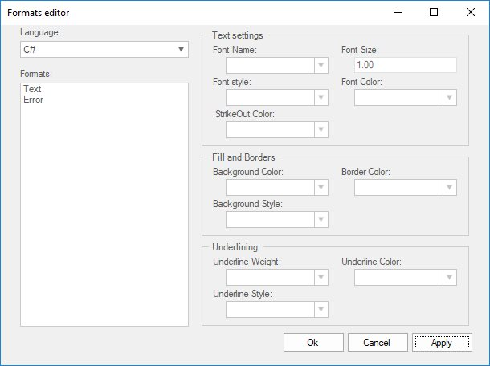

# End-user Capability

EditControl provides an extensive support like font customization, binding shortcut keys to command, find and replacing the particular words at run time with the help of dialog boxes.

## Key binding

EditControl provides shortcut key support for all editing and navigation operations. Also provides a built-in window for modifying the key mapping of shortcut operations. This can be done in the designer using the Keys Binding dialog as illustrated in the fiven procedure:

   1. In the Editor Keys Binding dialog box, select the desired standard command. The default shortcuts assigned for a particular command are listed in the combobox under the Shortcut(s) for selected command: label.
   2. Set the focus to the Edit Box. Press TAB to navigate to the shortcuts drop-down list.
   3. Press the desired key or key combination.
   4. Now, click the Assign button, to assign this keystroke combination as the shortcut for that particular standard command. Click OK.

The `KeyBinder` property is used to get the key binder, and the `KeyBindingProcessor` property is used to get or set the key binding processor. The Editor Keys Binding dialog is invoked using the `ShowKeysBindingEditor` method of the EditControl.

The following illustration shows the Keys Binding dialog box.

## Find

Find occurrences of specified text with constraints such as case matching, matching whole words, and search directions. Also allows users to search text with regular expressions. Find dialog box is invoked by using the `ShowFindDialog` method. The keyboard shortcut to this dialog box is <kbd>Ctrl+F</kbd>.





// Invoke the Find Dialog.

this.editControl1.ShowFindDialog();





' Invoke the Find Dialog.

Me.editControl1.ShowFindDialog()





Essential Edit now enables you to create a new find dialog by inheriting Essential Edit’s find dialog. You can customize the Find Dialog by changing the properties and triggers the events of the buttons such as Find, Mark All and Close. You can also easily localize the captions of the controls in the Find dialog.

**Enhanced find dialog**

Essential Edit control Find Dialog is now enhanced with an alert message box. This displays the alert message box when find reaches the starting point of the search again. In search option Current Selection, click OK in alert message box, then the search area is selected again automatically as in VS editor.

**Creating a class for own find dialog**

Create a class for own find dialog that inherits the frmFindDialog class.

The following code illustrates this.





//Inherits the frmFindDialog

public class FindDialogExt : Syncfusion.Windows.Forms.Edit.Dialogs.frmFindDialog





‘Inherits the frmFindDialog.

Public Class FindDialogExt

Inherits Syncfusion.Windows.Forms.Edit.Dialogs.frmFindDialog

End Class





This event occurs in FindNext() when search reaches the starting point of the search before the message box displays.

The event handler receives an argument of FindCompleteEventArgs . This argument class sets the text for message box. Users can localize this text.





// Handle the FindComplete event.

 this.FindComplete += new EventHandler<FindCompleteEventArgs>(FindDialogExt_FindComplete);

//Set the value for message box for when search reaches the starting point of search

Private void FindDialogExt_FindComplete(object sender, frmFindDialog.FindCompleteEventArgs e)
{
     //Arabic text as message(localize)

     if (messageString != string.Empty)

         e.Message = "انتهى";

     else

          e.Message = "Find reached the starting point of the search.";

}





' Handle the FindComplete event.

Private Me.editControl1.FindComplete += New EventHandler(Of FindCompleteEventArgs)(AddressOf FindDialogExt_FindComplete)

'Set the value for message box for when search reaches the starting point of search

Private Sub FindDialogExt_FindComplete(ByVal sender As Object, ByVal e As frmFindDialog.FindCompleteEventArgs)

     'Arabic text as message (localize)

     If messageString <> String.Empty Then

        e.Message = "انتهى"

     Else

        e.Message = "Find reached the starting point of the search."

     End If

End Sub





Default key bindings to these dialogs can be changed as explained in the Keystroke - Action Combinations Binding topic.

### Find by programmatic

The EditControl supports text search functionalities through the use of the `FindText` method. There are also other useful methods like FindCurrentText and FindNext that assist in this purpose.

<table>
<tr>
<th>
Methods</th><th>
Description</th></tr>
<tr>
<td>
FindText</td><td>
Finds the first occurrence of the specified text as per the conditions specified like match case, match whole word, search hidden text and search up</td></tr>
<tr>
<td>
FindRange</td><td>
Searches for given string in the text of control and returns text range of first found occurrence</td></tr>
<tr>
<td>
FindRegex</td><td>
Looks for specified expression in text</td></tr>
<tr>
<td>
FindCurrentText</td><td>
Finds the next occurrence of the word on which the cursor is presently on</td></tr>
<tr>
<td>
FindNext</td><td>
Finds the next occurrence of the current search text</td></tr>
</table>





// Finds the first occurrence of the specified text as per the conditions specified.

this.editControl1.FindText("Essential Edit", true, true, true, true, null);

// Searches for given string in the text of control and returns text range of first found occurrence.

this.editControl1.FindRange(searchString, startLocation, endLocation, matchWholeWord, searchHiddenText, searchUp, useRegex);

// Looks for specified expression in text.

this.editControl1.FindRegex(startLine, startColumn, expression, bSearchInCollapsed, searchUp);

// Finds the next occurrence of the word on which the cursor is presently on.

this.editControl1.FindCurrentText();

// Finds the next occurrence of the current search text.

this.editControl1.FindNext();





' Finds the first occurrence of the specified text as per the conditions specified.

Me.editControl1.FindText("Essential Edit", True, True, True, True, Nothing)

' Searches for given string in the text of control and returns text range of first found occurrence.

Me.editControl1.FindRange(searchString, startLocation, endLocation, matchWholeWord, searchHiddenText, searchUp, useRegex)

' Looks for specified expression in text.

Me.editControl1.FindRegex(startLine, startColumn, expression, bSearchInCollapsed, searchUp)

' Finds the next occurrence of the word on which the cursor is presently on.

Me.editControl1.FindCurrentText()

' Finds the next occurrence of the current search text.

Me.editControl1.FindNext()





**History properties**

The FindHistory property is used to add or remove items from the find history in the Find dialog box. 

<table>
<tr>
<th>
Properties</th><th>
Description</th></tr>
<tr>
<td>
FindHistory</td><td>
Specifies history of Find dialog</td></tr>
</table>

The methods associated with the FindHistory property are used to perform the following operations.

<table>
<tr>
<th>
FindHistory method</th><th>
Description</th></tr>
<tr>
<td>
Insert</td><td>
Inserts an element into the System.Collections.ArrayList at the specified index</td></tr>
<tr>
<td>
Remove</td><td>
Removes an element or the first occurrence from the System.Collections.ArrayList of the specified index</td></tr>
<tr>
<td>
Sort</td><td>
Sorts all the elements in the System.Collections.ArrayList</td></tr>
<tr>
<td>
Clear</td><td>
Clears all the items in the FindHistory</td></tr>
</table>





this.editControl1.FindHistory.Insert(0,(object)ATH.addedItem);

this.editControl1.FindHistory.Remove(o);

this.editControl1.FindHistory.Sort();

this.editControl1.FindHistory.Clear();





Me.editControl1.FindHistory.Insert(0,CType(ATH.addedItem, Object))

Me.editControl1.FindHistory.Remove(o)

Me.editControl1.FindHistory.Sort()

Me.editControl1.FindHistory.Clear()





## Find and replace 

EditControl supports searching and replacing specified text with replacement text as per the conditions specified. Includes options to replace the first occurrence or all occurrences of the search text. The keyboard shortcut to this dialog box is <kbd>Ctrl+H</kbd>.





// Invoke the Replace Dialog.

this.editControl1.ShowReplaceDialog();





' Invoke the Replace Dialog.

Me.editControl1.ShowReplaceDialog()





### Replace by programmatic

EditControl supports replacing the text functionalities programmatically through the use of the `ReplaceText` method. There are also other useful methods like `ReplaceAll` that assist in this purpose.

<table>
<tr>
<th>
Methods</th><th>
Description</th></tr>
<tr>
<td>
ReplaceText</td><td>
Replaces the first occurrence of the specified text with the replacement text as per the conditions specified like match case, match whole word, search hidden text and search up</td></tr>
<tr>
<td>
ReplaceAll</td><td>
Replaces all occurrences of the search text with the replacement text as per the conditions specified like match case, match whole word, search hidden text and search up</td></tr>
</table>





// Replaces the first occurrence of the specified text with the replacement text as per the conditions specified.

this.editControl1.ReplaceText("ShowVerticalScrollbar", "ShowVerticalScroller");

// Replaces all occurrences of the search text with the replacement text as per the conditions specified.

this.editControl1.ReplaceAll(" Drag-and-drop", "Drag and drop");





' Replaces the first occurrence of the specified text with the replacement text as per the conditions specified.

Me.editControl1.ReplaceText("ShowVerticalScrollbar", "ShowVerticalScroller") 

' Replaces all occurrences of the search text with the replacement text as per the conditions specified.

Me.editControl1.ReplaceAll(" Drag-and-drop", "Drag and drop")





`ReplaceHistory` property is used to add or remove items from the replace history in the Replace dialog box. Similarly, the `ReplaceSearchHistory` property is used to add or remove items from the find history in the Replace dialog box.

A sample which demonstrates the above features is available in the below sample installation path.

Installation Location\Syncfusion\Essential Studio\Version Number\Windows\Edit.Windows\Samples\Interactive Features\Find and Replace

## GoTo line

`GoTo` line dialog box allows you to move to a specific line in the active document that the user wish to go. The keyboard shortcut to this dialog box is <kbd>Ctrl+G</kbd>.





// Invoke the GoTo Dialog.

this.editControl1.ShowGoToDialog();





' Invoke the GoTo Dialog.

Me.editControl1.ShowGoToDialog()





### Go to line by programmatic

EditControl supports the `GoTo` functionality through programmatically. `GoTo` method is used to position the mouse pointer on any specified line that the user wish to go. GoTo method not only positions the pointer on the appropriate line, but it also scrolls the concerned line into the view. 

`linesAbove` argument can be used to specify the number of lines to be displayed above the pointer.





// Places the cursor at the beginning of the given line number.

this.editControl1.GoTo(lineNumber);

this.editControl1.GoTo(lineNumber, linesAbove);





' Places the cursor at the beginning of the given line number.

Me.editControl1.GoTo(lineNumber)

Me.editControl1.GoTo(lineNumber, linesAbove);





`CurrentLine` property explained in the Positions and Offsets section, also does the same task as the GoTo method. 

## Font configuration

Font customization in the EditControl works slightly different from the regular text processing the control. The font customization is done only at the formats level not at a word level or selected text level. EditControl supports customization of fonts both through the configuration file and dynamically through a run-time Formats Editor dialog.

EditControl supports customization of fonts through the configuration file, as shown in the below code snippet.



<format name="Text" Font="Courier New, 10pt" FontColor="Black" />

<format name="SelectedText" Font="Courier New, 10pt" BackColor="Highlight" FontColor="HighlightText" />

<format name="String" Font="Courier New, 10pt, style=Bold" FontColor="Red" />

<format name="Whitespace" Font="Courier New, 10pt" FontColor="Black" />

<format name="Operator" Font="Courier New, 10pt" FontColor="DarkCyan" />

<format name="Number" Font="Courier New, 10pt, style=Bold" FontColor="Navy" /> 

 

EditControl supports font customization at run time through the use of the `fromFormatsConfig` dialog box which consists of three smaller controls like the ControlFormatSettings, ControlFormatsList and the ControlLanguageSelector.

* `ControlFormatSettings` - This dialog box contains the actual controls to customize all the rendering settings of the selected Format, including font settings. 
* `ControlFormatsList` - This dialog consists of the list of currently existing formats in the configuration file. Also, it provides support to create new formats or delete existing ones. 
* `ControlLanguageSelector` - This dialog has a Combo Box containing the list of configuration languages supported by the EditControl. The list gets updated when a new configuration language is added or an existing one is removed. 





this.controlLanguageSelector1.EditControl = this.editControl1;

this.controlFormatsList1.EditControl = this.editControl1;

this.controlFormatsList1.LanguageSelector = this.controlLanguageSelector1;

this.controlFormatsSettings1.FormatsSelector = this.controlFormatsList1;

// Shows the font customization dialog.

this.editControl1.ShowFormatsCustomizationDialog();





Me.controlLanguageSelector1.EditControl = Me.editControl1

Me.controlFormatsList1.EditControl = Me.editControl1

Me.controlFormatsList1.LanguageSelector = Me.controlLanguageSelector1

Me.controlFormatsSettings1.FormatsSelector = Me.controlFormatsList1

// Shows the font customization dialog.

this.editControl1.ShowFormatsCustomizationDialog();





A sample which demonstrates the above features is available in the below sample installation path.

Installation Location\Syncfusion\Essential Studio\Version Number\Windows\Edit.Windows\Samples\Interactive Features\Font Customization
