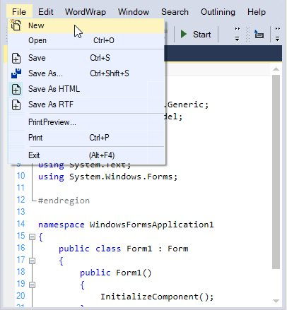
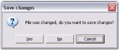
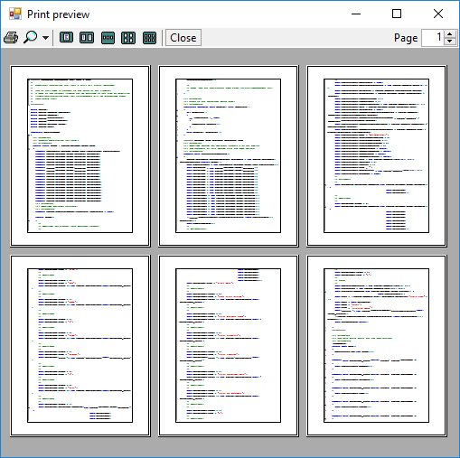

# File Operation

EditControl provides extensive support to perform file operations like create new, open or save files.

## Creating files

The `New` and `NewFile` methods are used to create a new stream or file and optionally allows you to set the language to be used by specifying the appropriate configuration settings.

<table>
<tr>
<th>
Methods</th><th>
Description</th></tr>
<tr>
<td>
New</td><td>
Creates an empty stream and allows the editor for editing</td></tr>
<tr>
<td>
NewFile</td><td>
Creates new empty file with specified coloring</td></tr>
</table>





// Creates a new stream with default configuration settings.

this.editControl.New();

// Creates a new file with default configuration settings.

this.editControl.NewFile();

// Creates a new stream with specified configuration settings.

this.editControl.New(ConfigLanguage language);

// Creates a new file with specified configuration settings.

this.editControl.NewFile(IConfigLanguage language);





' Creates a new file.

Me.editControl1.NewFile()

Me.editControl1.[New]()

' **config** is Configuration Settings file of type IConfigLanguage.

Me.editControl1.NewFile(config)

Me.editControl1.[New](config)





## Saving files

The following methods are used to save a file in the EditControl.

<table>
<tr>
<th>
Methods</th><th>
Description</th></tr>
<tr>
<td>
SaveFile</td><td>
Saves the contents of the EditControl to a specified file</td></tr>
<tr>
<td>
Save</td><td>
Invokes the save file dialog box and lets you save the contents of the EditControl to the specified file</td></tr>
<tr>
<td>
SaveAs</td><td>
Opens SaveAs dialog and prompts you to enter the name of the file</td></tr>
<tr>
<td>
SaveModified</td><td>
Saves the file only if it was modified and prompts for filename if needed. This is especially useful when the application is about to be closed or a new file is being loaded into the EditControl</td></tr>
</table>





// Saves the contents of the file.

this.editControl1.SaveFile("Temp.txt", Encoding.Unicode, Syncfusion.IO.NewLineStyle.Control);

// Displays the Save File dialog.

this.editControl1.Save();

// Displays the SaveAs dialog. 

this.editControl1.SaveAs();

// Saves the contents of the file after modification, when a new file is loaded, or when a file is closed.

this.editControl1.SaveModified();





' Saves the contents of the file.

Me.editControl1.SaveFile("Temp.txt", Encoding.Unicode, Syncfusion.IO.NewLineStyle.Control)

' Displays the Save File dialog.

Me.editControl1.Save()

' Displays the SaveAs dialog. 

Me.editControl1.SaveAs()

' Saves the contents of the file after modification, when a new file is loaded, or when a file is closed.

Me.editControl1.SaveModified()





**Saving and Canceling changes**

The changes made to the contents of the EditControl can be saved or discarded. `SaveOnClose` property specifies whether the default Save Changes prompt should be displayed on closing the EditControl.





// Disables the default Save Changes prompt that appears when the form hosting EditControl containing unsaved contents is closed.

this.editControl1.SaveOnClose = false; 





' Disables the default Save Changes prompt that appears when the form hosting EditControl containing unsaved contents is closed.

Me.editControl1.SaveOnClose = False 





When the `SaveOnClose` property is set to False, the default Save Changes prompt does not appear. The user should perform some custom Save routine in the Closing event handler of the host form, to save the unsaved contents in the EditControl. If not, they will be lost.





private void Form1_Closing(object sender, System.ComponentModel.CancelEventArgs e)
{

   if (this.editControl1.SaveOnClose == false)
   {

      if (this.editControl1.SaveModified() == true)

          // Perform custom Save routine or show custom Save Changes dialog or set Cancel to False.                       
          e.Cancel = false;

      else

          e.Cancel = true;

    }

}
 




Private Sub Form1_Closing(ByVal sender As Object, ByVal e As System.ComponentModel.CancelEventArgs) Handles MyBase.Closing

If Me.editControl1.SaveOnClose = False Then

If Me.editControl1.SaveModified() = True Then

       ' Perform custom Save routine or show custom Save Changes dialog or set Cancel to False.

       e.Cancel = False

       Else

       e.Cancel = True

       End If

End If

End Sub





**Saving changes using the save changes prompt**

When the SaveOnClose property is set to True, the default Save Changes prompt appears on closing the EditControl without saving the contents. Click Yes to save the changes, No to discard the changes, or Cancel to close the Save Changes prompt.

The above task can be further customized by handling the Closing event of EditControl. The Closing event is triggered just before a file or stream is closed in the EditControl.





private void editControl1_Closing(object sender, Syncfusion.Windows.Forms.Edit.StreamCloseEventArgs e)
{

// Cancel the file or stream closing action.

e.Action = SaveChangesAction.Cancel;

// Close the file or stream without saving the unsaved contents, the changes will be lost forever.

e.Action = SaveChangesAction.Discard;

// Silently saves the unsaved contents to the currently open file or stream.

// If the contents have not been saved to a file or stream as yet, the Save Changes prompt is displayed.

e.Action = SaveChangesAction.Save;

// Displays the default Save Changes prompt if there are unsaved contents when the file or stream is closed.

e.Action = SaveChangesAction.ShowDialog;

}





Private Sub editControl1_Closing(ByVal sender As Object, ByVal e As Syncfusion.Windows.Forms.Edit.StreamCloseEventArgs) Handles EditControl1.StreamClose

' Cancel the file or stream closing action.

e.Action = SaveChangesAction.Cancel

' Close the file or stream without saving the unsaved contents, the changes will be lost forever.

e.Action = SaveChangesAction.Discard

' Silently saves the unsaved contents to the currently open file or stream.

' If the contents have not been saved to a file or stream as yet, the Save Changes prompt is displayed

e.Action = SaveChangesAction.Save

' Displays the default Save Changes prompt if there are unsaved contents when the file or stream is closed.

e.Action = SaveChangesAction.ShowDialog

End Sub





N> The default value of e.Action is SaveChangesAction.ShowDialog.

## Load from document

The `LoadFile` method loads the content of any desired file into the EditControl.

<table>
<tr>
<th>
Method</th><th>
Description</th></tr>
<tr>
<td>
LoadFile</td><td>
Shows open file dialog to the user and opens the selected file</td></tr>
</table>

N> The character encoding for the text can also be specified while loading the file.





// Displays the Open File dialog.

this.editControl1.LoadFile();

// Loads the content of the specified file.

this.editControl1.LoadFile("Temp.txt", Encoding.ASCII);





' Displays the Open File dialog.

Me.editControl1.LoadFile()

' Loads the content of the specified file. 

Me.editControl1.LoadFile("Temp.txt", Encoding.ASCII)





The contents of the EditControl can also be loaded and saved to a particular stream using specified encoding and line end style using `LoadStream` and `SaveStream` methods.





// Loads the content of the specified stream into the EditControl.

this.editControl1.LoadStream(streamName);

// Loads the specified stream and configuration.

this.editControl1.LoadStream(streamName, config);

// Saves changes made to the contents of the EditControl into the current stream.

this.editControl1.FlushChanges();

// Saves content to the specified stream using specified encoding and line end style.

this.editControl1.SaveStream(System.IO.Stream.Null , Encoding.BigEndianUnicode, Syncfusion.IO.NewLineStyle.Mac);





' Loads the content of the specified stream into the EditControl.

Me.editControl1.LoadStream(streamName)

' Loads the specified stream and configuration.

Me.editControl1.LoadStream(streamName, config)

' Saves changes made to the contents of the EditControl into the current stream.

Me.editControl1.FlushChanges()

' Saves content to the specified stream using specified encoding and line end style.

Me.editControl1.SaveStream(System.IO.Stream.Null , Encoding.BigEndianUnicode, Syncfusion.IO.NewLineStyle.Mac)





By using the `FileName` property, we can get or set the name of the file that is currently loaded in EditControl.





// Specifies the name of the file loaded in the EditControl.

this.editControl1.FileName = "Temp.txt";





' Specifies the name of the file loaded in the EditControl.

Me.editControl1.FileName = "Temp.txt"





## Load by drop document

EditControl provides a complete support for dropping the dragged files into it by using the `DropAllFiles` properties.

<table>
<tr>
<th>
Properties</th><th>
Description</th></tr>
<tr>
<td>
DropAllFiles</td><td>
Specifies whether all files can be dropped onto EditControl. If set to False, only files with extensions contained in FileExtensions can be dropped</td></tr>
<tr>
<td>
FileExtensions</td><td>
Specifies the extensions of files that can be dropped to EditControl</td></tr>
</table>





// Drops all files onto EditControl.

this.editControl1.DropAllFiles = true;

// Specifies the file extensions of files that can be dropped onto EditControl. 

this.editControl1.FileExtensions = new string[] {".cs", ".sql", ".vb", ".xml"};





' Drops all files onto EditControl.

Me.editControl1.DropAllFiles = True

' Specifies the file extensions of files that can be dropped onto EditControl.

Me.editControl1.FileExtensions = New String() {".cs", ".sql", ".vb", ".xml"} 





The following properties can be used to insert text based on conditions that are described as follows.

<table>
<tr>
<th>
Properties</th><th>
Description</th></tr>
<tr>
<td>
AllowDrop</td><td>
Specifies whether drag and drop operations are allowed for control</td></tr>
<td>
InsertDroppedFileIntoText</td><td>
Specifies whether the outer file dragged and dropped onto the EditControl should be inserted into the current content. When this property is set to 'False', the current file is closed, and the dropped outer file is opened.</td></tr>
<tr>
<td>
ShowFileDropNotification</td><td>
Specifies whether the Notification message is to be displayed when the outer file is dragged and dropped onto the EditControl</td></tr>
</table>



//To set the EditControl that allows to Drag and Dropping files

this.editControl1.AllowDrop = true; 

// Specifies whether the outer file dragged and dropped onto the EditControl should be inserted into the current content.

this.editControl1.InsertDroppedFileIntoText = true;

// To hide the notification message displayed when the outer file is dragged and dropped onto the EditControl.

this.editControl1.ShowFileDropNotification = false;





'To set the EditControl that allows to Drag and Dropping files

Me.editControl1.AllowDrop = true

‘Specifies whether the outer file dragged and dropped onto the EditControl should be inserted into the current content.

Me.editControl1.InsertDroppedFileIntoText = True

' To hide the notification message displayed when the outer file is dragged and dropped onto the EditControl.

Me.editControl1.ShowFileDropNotification = false





## Closing files

This method closes the currently open file or stream and displays the EditControl in the read-only mode, until a new file or stream is opened.

<table>
<tr>
<th>
Method</th><th>
Description</th></tr>
<tr>
<td>
Close</td><td>
Closes stream, makes control readonly</td></tr>
</table>





// Closes the currently open file or stream in the EditControl. 

this.editControl1.Close(); 





' Closes the currently open file or stream in the EditControl. 

Me.editControl1.Close()





## Export to XML, RTF and HTML

EditControl has the ability to export its contents and its associated syntax highlighting information into XML, RTF or HTML formats and save it into any desired file by using the following methods. 

<table>
<tr>
<th>
Methods</th><th>
Description</th></tr>
<tr>
<td>
SaveAsXML</td><td>
Export the EditControl contents into XML format and save it into any desired XML file</td></tr>
<tr>
<td>
SaveAsRTF</td><td>
Export the EditControl contents into RTF format and save it into any desired RTF file</td></tr>
<tr>
<td>
SaveAsHTML</td><td>
Export the EditControl contents into HTML format and save it into any desired HTML file</td></tr>
</table>





// Export the EditControl contents into XML format and save it into a XML file.

this.editControl1.SaveAsXML("testXML.xml");

// Export the EditControl contents into RTF format and save it into a RTF file.

this.editControl1.SaveAsRTF("testRTF.rtf");

// Export the EditControl contents into HTML format and save it into a HTML file.

this.editControl1.SaveAsHTML("testHTML.html");





' Export the EditControl contents into XML format and save it into a XML file.

Me.editControl1.SaveAsXML("testXML.xml")

' Export the EditControl contents into RTF format and save it into a RTF file.

Me.editControl1.SaveAsRTF("testRTF.rtf")

' Export the EditControl contents into HTML format and save it into a HTML file.

Me.editControl1.SaveAsHTML("testHTML.html")





EditControl is also capable of providing XML, RTF and HTML source code for generating documents in the corresponding formats by using the following methods.

<table>
<tr>
<th>
Methods</th><th>
Description</th></tr>
<tr>
<td>
GetTextAsRTF</td><td>
Gets the source code to generate XML document for the text in the EditControl</td></tr>
<tr>
<td>
GetTextAsXML</td><td>
Gets the source code to generate RTF document for the text in the EditControl</td></tr>
<tr>
<td>
GetTextAsHTML</td><td>
Gets the source code to generate HTML document for the text in the EditControl</td></tr>
</table>





// Gets the source code to generate XML document.

this.editControl1.GetTextAsXML();

// Gets the source code to generate XML document for the text range specified.

this.editControl1.GetTextAsXML(coordinatePoint1, coordinatePoint2);

// Gets the source code to generate RTF document.

this.editControl1.GetTextAsRTF();

// Gets the source code to generate RTF document for the text range specified.

this.editControl1.GetTextAsRTF(coordinatePoint1, coordinatePoint2);

// Gets the source code to generate HTML document.

this.editControl1.GetTextAsHTML();

// Gets the source code to generate HTML document for the text range specified.

this.editControl1.GetTextAsHTML(coordinatePoint1, coordinatePoint2);





' Gets the source code to generate XML document.

Me.editControl1.GetTextAsXML()

' Gets the source code to generate XML document for the text range specified.

Me.editControl1.GetTextAsXML(coordinatePoint1, coordinatePoint2)

' Gets the source code to generate RTF document.

Me.editControl1.GetTextAsRTF()

' Gets the source code to generate RTF document for the text range specified.

Me.editControl1.GetTextAsRTF(coordinatePoint1, coordinatePoint2)

' Gets the source code to generate HTML document.

Me.editControl1.GetTextAsHTML()

' Gets the source code to generate HTML document for the text range specified.

Me.editControl1.GetTextAsHTML(coordinatePoint1, coordinatePoint2)





## Printing

The EditControl provides complete support for printing its contents. You can either print the entire document, current page, specific pages, or selected text. The printing implementation is very similar to the one available in standard applications such as Microsoft Office or Visual Studio.NET. A Print dialog box provides options to customize the printer settings, number of copies, the pages to be printed and so on. EditControl also includes a Print Preview feature that allows you to view the document before printing. Moreover, features like customizable header and footer are also available in Essential Edit.

In brief, the printing functionality of the EditControl supports the following features.

* Print Preview
* Custom Header and Footer Text
* Document Name
* Page Numbers
* Color Printing to preserve Syntax Highlighting
* Selected Text Printing
* Line Numbers
* Printing a Specific Page or Set of Pages
* Printing Entire Document
* Creating a Printer Document
* Current Page Printing
* Printer Dialog

### Printing functionality

You can invoke the Print dialog box by using the `Print` method of the EditControl, as shown in the below code snippet.





// Invoke the print dialog.

this.editControl1.Print();





' Invoke the print dialog.

Me.editControl1.Print()





Use the `PrintPreview` method to view the contents of the EditControl before they are printed.





// View the contents of the EditControl before printing.

this.editControl1.PrintPreview();





' View the contents of the EditControl before printing.

Me.editControl1.PrintPreview()





**Specifying printing options**

EditControl provides various printing option as like Visual Studio Code Editor. By using the `PrintCurrentPage` method, we can print the current page in the EditControl. The following methods allow you to specify the options for printing.

<table>
<tr>
<th>
Methods</th><th>
Description</th></tr>
<tr>
<td>
PrintCurrentPage</td><td>
Prints current page on default printer</td></tr>
<tr>
<td>
PrintNoDialog</td><td>
Prints entire document on default printer</td></tr>
<tr>
<td>
PrintSelection</td><td>
Prints selected area on default printer</td></tr>
<tr>
<td>
PrintPages</td><td>
Prints the pages in the specified range</td></tr>
</table>





// Print the current page.

this.editControl1.PrintCurrentPage();

// Print the entire document.

this.editControl1.PrintNoDialog();

// Print the selected area.

this.editControl1.PrintPages(1, 10);

// Print the pages in the specified range.

this.editControl1.PrintSelection();





' Print the current page.

Me.editControl1.PrintCurrentPage()

' Print the entire document.

Me.editControl1.PrintNoDialog()

' Print the selected area.

Me.editControl1.PrintPages(1, 10)

' Print the pages in the specified range.

Me.editControl1.PrintSelection()





### Customization options in printing

Header and Footer can be enabled while printing the document by using the `PageHeaderAndFooterVisible` property. Its default value is true, to hide the header and footer while printing turn on its value to false. `PrintDocumentName` and `PrintPageNumber` property is used to enable or disable the name of the document and page number while printing.

The following properties are used to print the contents of the editor, the document name as the header, and the page number as footer.

<table>
<tr>
<th>
Properties</th><th>
Description</th></tr>
<tr>
<td>
PrintDocument</td><td>
Helps to print the contents of the editor</td></tr>
<tr>
<td>
PrintDocumentName</td><td>
Specifies a value indicating whether the document name should be printed</td></tr>
<tr>
<td>
PrintPageNumber</td><td>
Specifies a value indicating whether the page number should be printed</td></tr>
</table>

Users can also specify their desired text in the header and footer by handling the `PrintHeader` and `PrintFooter` events. The default text in the header and footer is the fully qualified path of the file including the file name and page number respectively.

<table>
<tr>
<th>
Events</th><th>
Description</th></tr>
<tr>
<td>
PrintHeader</td><td>
Occurs when page header is printed</td></tr>
<tr>
<td>
PrintFooter</td><td>
Occurs when page footer is printed</td></tr>
</table>





private void editControl1_PrintHeader(object sender, Syncfusion.Windows.Forms.Edit.PrintHeadlineEventArgs e)
{

// Set the desired text in the header. The default text in the header is the full path and the name of the file.

e.Text = "This is the header";

}

private void editControl1_PrintFooter(object sender, Syncfusion.Windows.Forms.Edit.PrintHeadlineEventArgs e)
{

// Set desired text in the footer. The default text in the footer is the page number.

e.Text = "This is the footer";

}





Private Sub editControl1_PrintHeader(ByVal sender As Object, ByVal e As Syncfusion.Windows.Forms.Edit.PrintHeadlineEventArgs) Handles EditControl1.PrintHeader

' Set the desired text in the header. The default text in the header is the full path and the name of the file.

e.Text = "This is the header"

End Sub 

'editControl1_PrintHeader

Private Sub editControl1_PrintFooter(ByVal sender As Object, ByVal e As Syncfusion.Windows.Forms.Edit.PrintHeadlineEventArgs) Handles EditControl1.PrintFooter

' Set desired text in the footer. The default text in the footer is the page number.

e.Text = "This is the footer"

End Sub





The following image shows a typical page with a header and footer in Print Preview mode.

PageBorder can also be shown or removed while printing the document. `SetPageBorder` method is used to display page borders for the EditControl. And also we can remove the page borders by using `RemovePageBorder` of EditControl.

<table>
<tr>
<th>
Methods</th><th>
Description</th></tr>
<tr>
<td>
SetPageBorder</td><td>
Sets parameters of border that's drawn in page preview</td></tr>
<tr>
<td>
RemovePageBorder</td><td>
Removes border drawing in page preview</td></tr>
</table>





// Set the page border. 

this.editControl1.SetPageBorder(Syncfusion.Windows.Forms.Edit.Enums.FrameBorderStyle.DashDot, Color.Red, Syncfusion.Windows.Forms.Edit.Enums.BorderWeight.Bold);

// Remove the page border.

this.editControl1.RemovePageBorder();





' Set the page border. 

Me.editControl1.SetPageBorder(Syncfusion.Windows.Forms.Edit.Enums.FrameBorderStyle.DashDot, Color.Red, Syncfusion.Windows.Forms.Edit.Enums.BorderWeight.Bold)

' Remove the page border.

Me.editControl1.RemovePageBorder()





