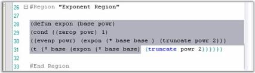
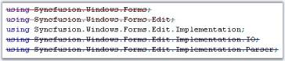
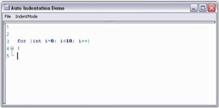
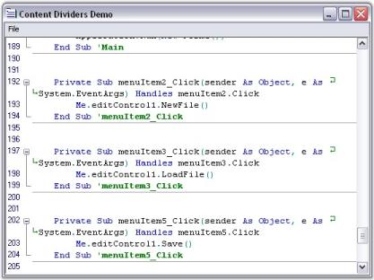
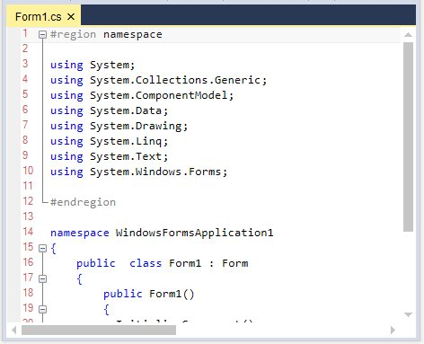
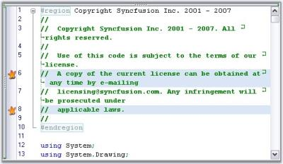

# Formatting

EditControl provides an extensive support for highlighting the text color while selecting, wrapping the word, bookmarks, collapsing and expanding blocks of code and so on.

## Selection highlight color

EditControl supports highlighting the selected text by using the `TransparentSelection` property. By Setting the `TransparentSelection` property to True, we can highlight the selected text range with a transparent blue background (which will let you view the syntax highlighting in the text within the selected region), as shown in the following screenshot.

By Setting the `TransparentSelection` property to False, will highlight the selected text range with a dark background (which will not let you view the syntax highlighting in the text within the selected region), as shown in the following screenshot.

## Selecting the text programmatically 

EditControl provides support to select text programmatically. The `StartSelection` and `StopSelection` methods are used to programmatically specify the starting and ending bounds for the text to be selected.

<table>
<tr>
<th>
Methods</th><th>
Description</th></tr>
<tr>
<td>
StartSelection</td><td>
Sets selection start at the specified position in text</td></tr>
<tr>
<td>
StopSelection</td><td>
Sets selection end at the specified position in text</td></tr>
<tr>
<td>
SetSelection</td><td>
Sets selected area of the text</td></tr>
<tr>
<td>
SelectLine</td><td>
Selects line with specified index</td></tr>
<tr>
<td>
SelectAll</td><td>
Selects all text</td></tr>
</table>

Line selection in EditControl is extended by using the `ExtendSelectionToFarRight` property.

<table>
<tr>
<th>
Property</th><th>
Description</th></tr>
<tr>
<td>
ExtendSelectionToFarRight</td><td>
Specifies a value indicating whether line selection should be extended to the far right</td></tr>
</table>





// Specifies start position for selecting text.

this.editControl1.StartSelection(1, 1);

// Specifies end position for selecting text.

this.editControl1.StopSelection(10, 1);

// Selects line with specified index.

this.editControl1.SelectLine(5);

// Extend line selection to far right.

this.editControl1.ExtendSelectionToFarRight = true;





' Specifies start position for selecting text.

Me.editControl1.StartSelection(1, 1)

' Specifies end position for selecting text.

Me.editControl1.StopSelection(5, 1)

' Selects line with specified index.

Me.editControl1.SelectLine(5)

' Extend line selection to far right.

Me.editControl1.ExtendSelectionToFarRight = True





Text can also be selected after drag or drop operations by using enabling or disabling the `SelectTextAfterDragDrop` property. Its default value is true.

<table>
<tr>
<th>
EditControl Property</th><th>
Description</th></tr>
<tr>
<td>
SelectTextAfterDragDrop</td><td>
Specifies whether text should be selected after drag or drop operations</td></tr>
</table>





this.editControl1.SelectTextAfterDragDrop = true;





Me.editControl1.SelectTextAfterDragDrop = True





`SelectedText` property of EditControl is used to get or set selected text. we can get the specified text range using the `Selection` property. The following table explain the same:

<table>
<tr>
<th>
Properties</th><th>
Description</th></tr>
<tr>
<td>
SelectedText</td><td>
Specifies the selected text</td></tr>
<tr>
<td>
Selection</td><td>
Specifies the selected text range</td></tr>
</table>





// Returns the currently selected text in the EditControl.

string editText = this.editControl1.SelectedText;





' Returns the currently selected text in the EditControl.

Dim editText as String = Me.editControl1.SelectedText





**Cancelling or Resetting selection**

Text selection can be either cancelled or reset by using the below given methods.

<table>
<tr>
<th>
Methods</th><th>
Description</th></tr>
<tr>
<td>
SelectionCancel</td><td>
Removes selection and causes invalidation of the area that was selected</td></tr>
<tr>
<td>
ResetSelection</td><td>
Resets selection</td></tr>
</table>





// Removes selection from text.

this.editControl1.SelectionCancel();

// Resets selection.

this.editControl1.ResetSelection();





' Removes selection from text.

Me.editControl1.SelectionCancel()

' Resets selection.

Me.editControl1.ResetSelection()





### Customizing the text

In EditControl, we are able to customize the text color by using the `SetTextColor` method . And also we are able to set the border for its text using the `SetTextBorder` method and simultaneously we can remove the border of the text using the `RemoveTextBorder` method. The following table explain regarding this methods and also the parameter value used in these methods.

<table>
<tr>
<th>
Methods</th><th>
Description</th></tr>
<tr>
<td>
SetTextBorder</td><td>
Sets border around text</td></tr>
<tr>
<td>
RemoveTextBorder</td><td>
Removes border around text with given coordinates</td></tr>
</table>

<table>
<tr>
<th>
EditControl border enumerator</th><th>
Description</th></tr>
<tr>
<td>
FrameBorderStyle</td><td>
Specifies the style of border line. The options provided are* Dash* DashDot* Dot* None* Solid* Wave</td></tr>
<tr>
<td>
 BorderWeight</td><td>
Specifies the weight of the border line. The options provided are* Bold* Double* Thin</td></tr>
</table>





// Set the color of the text for the EditControl.

this.editControl1.SetTextColor(new Point(1, 1), new Point(5, 5), Color.Orange);

// Set borders for the specified text range.

this.editControl1.SetTextBorder(new Point(1, 13), new Point(15, 13), Color.Red, FrameBorderStyle.Wave, BorderWeight.Double);

// Remove borders from the specified text range.

this.editControl1.RemoveTextBorder(new Point(1, 13), new Point(15, 13));





' Set the color of the text for the EditControl.

Me.editControl1.SetTextColor(New Point(1, 1), New Point(5, 5), Color.Orange)

' Set borders for the specified text range.

Me.editControl1.SetTextBorder(New Point(1, 13), New Point(15, 13), Color.Red, FrameBorderStyle.Wave, BorderWeight.Double)

' Remove borders from the specified text range.

Me.editControl1.RemoveTextBorder(New Point(1, 13), New Point(15, 13))





EditControl also provides an options to change the back color of selected range of text. The `SetBackgroundColor` method of EditControl is used to set the background color for a specified range of text.





this.editControl1.SetBackgroundColor(new Point(1, 1), new Point(9, 9), Color.AliceBlue);





Me.editControl1.SetBackgroundColor(New Point(1, 1), New Point(9, 9), Color.AliceBlue)





EditControl also allows setting custom background color for individual lines as well as for selected block of text. You can set any desired background to a particular line or block of selection,as explained below.

* Register a back color format with the EditControl by using its `RegisterBackColorFormat` method, with appropriate values for BackgroundColor, ForegroundColor and HatchStyle parameters.
* Set the background color to the entire line or just the selected text by using the `SetLineBackColor` and `SetSelectionBackColor` methods respectively.





// Register a backcolor format with EditControl.

this.editControl1.RegisterBackColorFormat(Color.Aquamarine, Color.Beige, System.Drawing.Drawing2D.HatchStyle.Cross, true);

// Set the background for the entire line of text.

this.editControl1.SetLineBackColor(editControl1.CurrentLine, true, format);

// Set the background for the selected block of text.        

this.editControl1.SetSelectionBackColor(format);





' Register a backcolor format with EditControl.

Me.editControl1.RegisterBackColorFormat(Color.Aquamarine, Color.Beige, System.Drawing.Drawing2D.HatchStyle.Cross, True)

' Set the background for the entire line of text. 

Me.editControl1.SetLineBackColor(editControl1.CurrentLine, true, format)

' Set the background for the selected block of text.        

Me.editControl1.SetSelectionBackColor(format)





By using `RemoveLineBackColor` and `RemoveSelectionBackColor` method of EditControl we were able to remove the background color for individual lines or selected blocks of text. The following table explains the same:

<table>
<tr>
<th>
Methods</th><th>
Description</th></tr>
<tr>
<td>
RemoveLineBackColor</td><td>
Removes line back color</td></tr>
<tr>
<td>
RemoveSelectionBackColor</td><td>
Removes background coloring from the selected text</td></tr>
</table>





// Removes line back color.

this.editControl1.RemoveLineBackColor(4);

// Removes background coloring from the selected text.

this.editControl1.RemoveSelectionBackColor();





' Removes line back color.

Me.editControl1.RemoveLineBackColor(4)

' Removes background coloring from the selected text.

Me.editControl1.RemoveSelectionBackColor()





## Underline

EditControl allows you to underline any desired text in its contents. The underlines can be of different styles, colors and weights, with each of them being used to convey a different meaning. You can also specify the weight of the underlines to be Single or Double.

EditControl supports underlines of the following styles: 

* Solid 
* Dot
* Dash
* Wave
* DashDot

Before the underlining can be applied to the selected text, a custom underlining format has to be defined. The RegisterUnderlineFormat method of ISnippetFormat, registers the custom underline format to be used while underlining a region. The following are the parameters which was passed in RegisterUnderlineFormat method:

The `SelectedColor` value can be set to any desired color. The `SelectedStyle` value is specified by using the UnderlineStyle enumerator. The `SelectedWeight` value is specified by using the UnderlineWeight enumerator.

<table>
<tr>
<th>
EditControl underline enumerator</th><th>
Description</th></tr>
<tr>
<td>
UnderlineStyle</td><td>
UnderlineStyle.Solid(default),UnderlineStyle.Dot, UnderlineStyle.Dash, UnderlineStyle.Wave, and UnderlineStyle.DashDot</td></tr>
<tr>
<td>
UnderlineWeight</td><td>
UnderlineWeight.Thick(default) and UnderlineWeight.Double</td></tr>
</table>





// Registers the custom underline format.

ISnippetFormat format = editControl1.RegisterUnderlineFormat (SelectedColor, SelectedStyle, SelectedWeight);





' Registers the custom underline format.

Dim format As ISnippetFormat = editControl1.RegisterUnderlineFormat(SelectedColor, SelectedStyle, SelectedWeight)





**Underlining selected text**

`SetUnderline` method is used to set underlining of the selected text region. And also we can remove the underlining which had been set by using the `RemoveUnderline` method of EditControl.

<table>
<tr>
<th>
Methods</th><th>
Description</th></tr>
<tr>
<td>
SetUnderline</td><td>
Sets underlining of the specified text region</td></tr>
<tr>
<td>
RemoveUnderline</td><td>
Removes underlining in the specified region</td></tr>
</table>





this.editControl1.SetUnderline(this.editControl1.Selection.Top, this.editControl1.Selection.Bottom, format);

this.editControl1.RemoveUnderline(this.editControl1.Selection.Top, this.editControl1.Selection.Bottom);





Me.editControl1.SetUnderline(Me.editControl1.Selection.Top, Me.editControl1.Selection.Bottom, format)

Me.editControl1.RemoveUnderline(Me.editControl1.Selection.Top, Me.editControl1.Selection.Bottom)





**Underlining using configuration file**

You can also set the underlining from the configuration file, as shown in the below example.



<format name="Comment" Font="Courier New, 10pt, style=Bold" FontColor="Green" LineColor="Red" Weight="Thick" Underline="DashDot" />



LineColor, Weight and Underline parameters are used to specify the type of underlining to be used.

The `StrikeThrough` method allows you to perform strikethrough operation on the text contained in the EditControl. This is a very useful feature in denoting text that was deleted from the original document or highlighting offending code. You can also specify any custom color for the strikethrough line.





// Strikeout the current line.

this.editControl1.StrikeThrough(this.editControl1.CurrentLine, Color.IndianRed);

// Strikeout the selected text.

this.editControl1.StrikeThrough(this.editControl1.Selection.Top, this.editControl1.Selection.Bottom, Color.Navy);

// Strikeout the text in the specified text range.

this.editControl1.StrikeThrough(startCoordinatePoint, endCoordinatePoint, Color.Aqua);





' Strikeout the current line.

Me.editControl1.StrikeThrough(Me.editControl1.CurrentLine, Color.IndianRed)

' Strikeout the selected text.

Me.editControl1.StrikeThrough(Me.editControl1.Selection.Top, Me.editControl1.Selection.Bottom, Color.Navy)

' Strikeout the text in the specified text range.

Me.editControl1.StrikeThrough(startCoordinatePoint, endCoordinatePoint, Color.Aqua)





To remove the strikethrough line, just call one of the above mentioned methods and specify the Color parameter as Color.Empty.

## Font customization

The font customization in the EditControl works slightly different from the regular text processing the control. The font customization is done only at the Formats level not at a word level or selected text level. EditControl is more of a text parsing / syntax highlighting control, and less of a text editing control. EditControl supports customization of fonts both through the configuration file and dynamically through a run-time Formats Editor dialog.

The EditControl supports customization of fonts through the configuration file, as shown in the below code snippet.



<format name="Text" Font="Courier New, 10pt" FontColor="Black" />

<format name="SelectedText" Font="Courier New, 10pt" BackColor="Highlight" FontColor="HighlightText" />

<format name="String" Font="Courier New, 10pt, style=Bold" FontColor="Red" />

<format name="Whitespace" Font="Courier New, 10pt" FontColor="Black" />

<format name="Operator" Font="Courier New, 10pt" FontColor="DarkCyan" />

<format name="Number" Font="Courier New, 10pt, style=Bold" FontColor="Navy" /> 



## Word wrap

`WordWrap` allows users to view the entire contents of a line, by wrapping text at the edge of the control (or text area) into one or more lines, that normally would have been outside the view in the EditControl. EditControl allows advanced customization by using the Wordwrap functionality. WordWrap functionality in EditControl can be enabled or disabled by using `WordWrap` property. Its default value is false, to enable the wrapping functionality in EditControl turn on its value to true.

### WordWrap types

By using the `WordWrapType` property we can set different types for wrapping the word in the EditControl. There are two types of Word wrapping in EditControl. 

* Wrapping by character
* Wrapping by word

Its default value is `WrapByWord`. The following table explains the same:

<table>
<tr>
<th>
Properties</th><th>
Description</th></tr>
<tr>
<td>
WordWrap</td><td>
Specifies the state of word wrapping mode</td></tr>
<tr>
<td>
WordWrapType</td><td>
Specifies the type of word wrapping. The options provided are * {{ '_WrapByChar_' | markdownify }} - wraps the text by individual characters* {{ '_WrapByWord_' | markdownify }} - wraps the text by individual words The default value is WrapByWord</td></tr>
</table>





// WordWrap property set.

this.editControl1.WordWrap = true;

// WordWrapType property set.

this.editControl1.WordWrapType = Syncfusion.Windows.Forms.Edit.Enums.WordWrapType.WrapByChar;





' WordWrap property set.

Me.editControl1.WordWrap = True

' WordWrapType property set.

Me.editControl1.WordWrapType = Syncfusion.Windows.Forms.Edit.Enums.WordWrapType.WrapByChar





### Wordwrap mode

EditControl provide extensive support for different modes of wrapping. The following are the types of wrapping modes which was available in EditControl:

* Control
* SpecifiedColumn
* WordWrapMargin

The options provided are wraps text at the boundary between text area and wordwrap margin of the EditControl. The area beyond the text area in the EditControl is referred to as the `WordWrapMargin`. Hence, the width of the wordwrap margin is the difference between EditControls width and the TextArea width. `Column` Mode wraps the text at the edge of the EditControl. SpecifiedColumn mode wraps the text at the specified column that is specified in WordWrapColumn property. The default WordWrapMode is `Control`. The following properties are associated with setting the mode of Word Wrapping.

<table>
<tr>
<th>
Properties</th><th>
Description</th></tr>
<tr>
<td>
WordWrapMode</td><td>
Specifies the state of the word wrapping mode</td></tr>
<tr>
<td>
WordWrapColumnMeasuringFont</td><td>
Specifies the font used while calculating the position of WordWrapColumn</td></tr>
<tr>
<td>
WordWrapColumn</td><td>
Specifies column for wrapping text. Used when WordWrapMode is set to SpecifiedColumn. The default value is 100</td></tr>
<tr>
<td>
TextAreaWidth</td><td>
Specifies the width of the text area of the EditControl. The default value is 600</td></tr>
<tr>
<td>
WrappedLinesOffset</td><td>
Specifies offset of wrapped lines.</td></tr>
</table>





// Sets the WordWrap mode.

this.editControl1.WordWrapMode = Syncfusion.Windows.Forms.Edit.Enums.WordWrapMode.WordWrapMargin;

// Sets font that is used while calculating the position of the WordWrap column.

this.editControl1.WordWrapColumnMeasuringFont = new System.Drawing.Font("Arial", 9.75F, System.Drawing.FontStyle.Regular, System.Drawing.GraphicsUnit.Point, ((byte)(0)));

// Specifies column for wrapping text.

this.editControl1.WordWrapColumn = 125;

// Set the width of the EditControl's text area.

this.editControl1.TextAreaWidth = 300;

// Specifies offset for the wrapped lines.

this.editControl1.WrappedLinesOffset = 10;





' Sets the WordWrap mode.

Me.editControl1.WordWrapMode = Syncfusion.Windows.Forms.Edit.Enums.WordWrapMode.WordWrapMargin

' Sets font that is used while calculating the position of the WordWrap column.

Me.editControl1.WordWrapColumnMeasuringFont = New System.Drawing.Font("Arial", 9.75F, System.Drawing.FontStyle.Regular, System.Drawing.GraphicsUnit.Point, (CType((0), Byte)))

' Specifies column for wrapping text.

Me.editControl1.WordWrapColumn = 125

' Set the width of the EditControl's text area.

Me.editControl1.TextAreaWidth = 300

' Specifies offset for the wrapped lines.

Me.editControl1.WrappedLinesOffset = 10





The following illustration shows the EditControl with the WordWrappingMode and WordWrapType properties set.

### Wordwrap margin customization

Wordwrap margin can be enabled or disabled using the `WordWrapMarginVisible` property of EditControl. Its default value is false. Wordwrap margin of the EditControl can be set and customized by using the below given properties.

<table>
<tr>
<th>
Properties</th><th>
Description</th></tr>
<tr>
<td>
WordWrapMarginVisible</td><td>
Specifies a value indicating whether the wordwrap margin should be visible</td></tr>
<tr>
<td>
WordWrapMarginLineStyle</td><td>
Specifies style of line that is drawn at the border of the wordwrap margin. The options provided are* Solid* Dash* Dot* DashDot* DashDotDot* Custom The default value is {{ '_Solid_' | markdownify }}</td></tr>
<tr>
<td>
WordWrapMarginLineColor</td><td>
Sets custom color for the line that is drawn at the border of the wordwrap margin</td></tr>
<tr>
<td>
WordWrapMarginBrush</td><td>
Specifies the BrushInfo object that is used when the area situated after the text area is drawn</td></tr>
</table>





// Specifies whether the wordwrap margin should be visible.

this.editControl1.WordWrapMarginVisible = true;

// Specifies the line style of the wordwrap margin.

this.editControl1.WordWrapMarginLineStyle = DashStyle.Dash;

// Specifies the line color of the wordwrap margin.

this.editControl1.WordWrapMarginLineColor = Color.Green;

// Specifies the BrushInfo object that is used when the area situated after the text area is drawn.

this.editControl1.WordWrapMarginBrush = new Syncfusion.Drawing.BrushInfo(Syncfusion.Drawing.GradientStyle.Horizontal, System.Drawing.Color.White, System.Drawing.Color.LightSalmon);





' Specifies whether the wordwrap margin should be visible.

Me.editControl1.WordWrapMarginVisible = True

// Specifies the line style of the wordwrap margin.

Me.editControl1.WordWrapMarginLineStyle = System.Drawing.Drawing2D.DashStyle.Dash

// Specifies the line color of the wordwrap margin.

Me.editControl1.WordWrapMarginLineColor = System.Drawing.Color.Green

// Specifies the BrushInfo object that is used when the area situated after the text area is drawn.

Me.editControl1.WordWrapMarginBrush = New Syncfusion.Drawing.BrushInfo(Syncfusion.Drawing.GradientStyle.Horizontal, System.Drawing.Color.White, System.Drawing.Color.LightSalmon)





### Line wrapping images

In EditControl, it is possible to associate images to indicate line wrapping. This feature can be turned on by setting the `MarkLineWrapping` property to True. There are two types of image indicators:

* Images that indicate the line that is being wrapped. These are displayed at the beginning of the line being wrapped. This can be set by using the `CustomWrappedLinesMarkingImage` property.
* Images that indicate the point at which the line is being wrapped. This can be set by using the `CustomLineWrappingMarkingImage` property.

`MarkWrappedLines` property of EditControl is used to indicate whether wrapped lines should be marked.

<table>
<tr>
<th>
Properties</th><th>
Description</th></tr>
<tr>
<td>
MarkLineWrapping</td><td>
Specifies whether line wrapping should be marked</td></tr>
<tr>
<td>
MarkWrappedLines</td><td>
Specifies whether wrapped lines should be marked</td></tr>
<tr>
<td>
CustomWrappedLinesMarkingImage</td><td>
Specifies custom image that marks wrapped lines</td></tr>
<tr>
<td>
CustomLineWrappingMarkingImage</td><td>
Specifies custom image that marks wrapping lines</td></tr>
</table>





// Enable images to indicate line wrapping.

this.editControl1.MarkLineWrapping = true;

// Images that indicate the line that is being wrapped.

this.editControl1.CustomWrappedLinesMarkingImage = ((System.Drawing.Image)(resources.GetObject("$this.Sunset")));

// Images that indicate the point at which the line is being wrapped.

this.editControl1.CustomLineWrappingMarkingImage = ((System.Drawing.Image)(resources.GetObject("$this.Blue_hills")));

// Indicate wrapped lines.

this.editControl1.MarkWrappedLines = true;





' Enable images to indicate line wrapping.

Me.editControl1.MarkLineWrapping = True

' Images that indicate the line that is being wrapped.

Me.editControl1.CustomWrappedLinesMarkingImage = (CType((resources.GetObject("$this.Sunset")), System.Drawing.Image))

' Images that indicate the point at which the line is being wrapped.

Me.editControl1.CustomLineWrappingMarkingImage = (CType((resources.GetObject("$this.Blue_hills")), System.Drawing.Image))

' Indicate wrapped lines.

Me.editControl1.MarkWrappedLines = True





## Indentation 

The indentation guidelines are vertical lines that is used to connect the matching brackets. This feature enhances the readability of code. The indentation guidelines can be enabled or disabled  by setting the `ShowIndentationGuidelines` property. Its default value is true, to hide the indentation guidelines in EditControl turned off it value to False, or by invoking the `HideIndentGuideline` method. Also, the indent guideline for the current region can be set by using the `ShowIndentGuideline` method.





// Indentation Guidelines are displayed.

this.editControl1.ShowIndentationGuidelines = true;

// Hide Indentation Guideline.

this.editControl1.HideIndentGuideline();

// Show Indentation Guideline.

this.editControl1.ShowIndentGuideline();





' Indentation Guidelines are displayed.

Me.editControl1.ShowIndentationGuidelines = True

' Hide Indentation Guideline.

Me.editControl1.HideIndentGuideline()

' Show Indentation Guideline.

Me.editControl1.ShowIndentGuideline()





### Customizing the appearance

Indentation guidelines and bracket highlighting blocks can be customized by using the below given properties.

<table>
<tr>
<th>
Properties</th><th>
Description</th></tr>
<tr>
<td>
IndentLineColor</td><td>
Specifies color of the indent line</td></tr>
<tr>
<td>
IndentBlockHighlightingColor</td><td>
Specifies color of the indent block start and end</td></tr>
<tr>
<td>
IndentationBlockBackgroundBrush</td><td>
Specifies brush for indentation block background</td></tr>
<tr>
<td>
IndentationBlockBorderColor</td><td>
Specifies color of indentation block border line</td></tr>
<tr>
<td>
IndentationBlockBorderStyle</td><td>
Specifies style of indentation block border line</td></tr>
<tr>
<td>
ShowIndentationBlockBorders</td><td>
Specifies whether indentation block borders should be drawn</td></tr>
</table>





this.editControl1.IndentLineColor = Color.OrangeRed;

this.editControl1.IndentBlockHighlightingColor = Color.IndianRed;

this.editControl1.IndentationBlockBackgroundBrush = new Syncfusion.Drawing.BrushInfo(Syncfusion.Drawing.GradientStyle.BackwardDiagonal, System.Drawing.SystemColors.Info, System.Drawing.Color.Khaki);

this.editControl1.IndentationBlockBorderColor = System.Drawing.Color.Crimson;

this.editControl1.IndentationBlockBorderStyle = Syncfusion.Windows.Forms.Edit.Enums.FrameBorderStyle.DashDot;

this.editControl1.ShowIndentationBlockBorders = true;





Me.editControl1.IndentLineColor = Color.OrangeRed

Me.editControl1.IndentBlockHighlightingColor = Color.IndianRed

Me.editControl1.IndentationBlockBackgroundBrush = New Syncfusion.Drawing.BrushInfo(Syncfusion.Drawing.GradientStyle.BackwardDiagonal, System.Drawing.SystemColors.Info, System.Drawing.Color.Khaki)

Me.editControl1.IndentationBlockBorderColor = System.Drawing.Color.Crimson

Me.editControl1.IndentationBlockBorderStyle = Syncfusion.Windows.Forms.Edit.Enums.FrameBorderStyle.DashDot

Me.editControl1.ShowIndentationBlockBorders = True





**Positioning**

It is also possible to position the caret to the beginning or end of the indentation block by using the JumpToIndentBlockStart and JumpToIndentBlockEnd methods respectively.

<table>
<tr>
<th>
Methods</th><th>
Description</th></tr>
<tr>
<td>
JumpToIndentBlockStart</td><td>
Jumps to the start of the block</td></tr>
<tr>
<td>
JumpToIndentBlockEnd</td><td>
Jumps to the end of the block</td></tr>
</table>





this.editControl1.JumpToIndentBlockStart();

this.editControl1.JumpToIndentBlockEnd();





Me.editControl1.JumpToIndentBlockStart()

Me.editControl1.JumpToIndentBlockEnd()





### Auto Indentation

The EditControl offers advanced text indentation support to suit the requirements of the user.

The properties given in the following table can be used to customize the auto indentation settings of the EditControl.

<table>
<tr>
<th>
Properties</th><th>
Description</th></tr>
<tr>
<td>
AutoIndentMode</td><td>
Specifies mode of auto indentation. The options provided are None, Block and Smart</td></tr>
<tr>
<td>
 AutoIndentGuideline</td><td>
Specifies a value that specifies whether indent guideline should be shown automatically after cursor repositioning</td></tr>
</table>





// Sets the AutoIntentMode.

this.editControl1.AutoIndentMode = Syncfusion.Windows.Forms.Edit.Enums.AutoIndentMode.None;





' Sets the AutoIntentMode.

Me.editControl1.AutoIndentMode = Syncfusion.Windows.Forms.Edit.Enums.AutoIndentMode.None



If Enter is pressed when the AutoIndentMode is set to None, the text is not indented.

When the AutoIndentMode is set to Smart, the next line is indented by one TabSize from the first column of the previous line on pressing Enter.

When the AutoIndentMode is set to Block, the next line begins at the same column as the previous line on pressing the ENTER key.

**Lexem support for AutoIndent block mode**

In the EditControl, the `EnableSmartInBlockIndent` property ensures the AutoIndent Block mode with respect to the lexem’s config.indent. With this property, the Block mode will work like Smart mode for conditional statements.

When this property is enabled, the lines will be aligned to the position of the previous indented line. The lines will begin at the original start position if disabled.

<table>
<tr>
<th>
Property</th><th>
Description</th></tr>
<tr>
<td>
EnableSmartInBlockIndent</td><td>
Specifies a value to make the Block mode work like Smart mode for conditional statements</td></tr>
</table>





// Specifies a value to make the Block mode work like Smart mode for conditional statements.

this.editcontrol1.EnableSmartInBlockIndent = true;





// Specifies a value to make the Block mode work like Smart mode for conditional statements.

Me.editcontrol1.EnableSmartInBlockIndent = True



The Auto Indentation characters can also be specified by setting the Indent field to True in the lexem definition of the configuration file, as shown below.



<lexem BeginBlock="{" EndBlock="}" Type="Operator" IsComplex="true" IsCollapsable="true" Indent="true"  CollapseName="{...}" IndentationGuideline="true">



## Outline

Essential Edit provides Visual Studio-like support for collapsing and expanding blocks of code through the use of Collapsers (plus-minus buttons). Sections of code which form the outlining blocks can be specified by using the configuration settings. The outlining blocks can be specified for code as well as for plain text. By Setting the `ShowOutliningCollapsers` property to true, we can enable or disable automatic outlining in EditControl. 

Outlining can be performed by having appropriate `lexem`, `split`, and `extension` tag entries in the configuration file. Refer to the Configuration Settings topic for more information regarding the configuration file. EditControl provides the following methods to support Outlining.

<table>
<tr>
<th>
Methods</th><th>
Description</th></tr>
<tr>
<td>
Collapse</td><td>
Collapses all regions in currently selected area or in the current line</td></tr>
<tr>
<td>
Expand</td><td>
Expands all collapsed regions in currently selected area or in the current line</td></tr>
<tr>
<td>
SwitchCollapsingOn</td><td>
Turns on collapse and collapse all option</td></tr>
<tr>
<td>
SwitchCollapsingOff</td><td>
Turns off collapse option</td></tr>
<tr>
<td>
CollapseAll</td><td>
Collapses all regions</td></tr>
<tr>
<td>
ExpandAll</td><td>
Expands all collapsed regions</td></tr>
<tr>
<td>
ToggleLineCollapsing</td><td>
Toggles collapse option for current line</td></tr>
</table>





// Enabling Automatic Outlining.

this.editControl1.ShowOutliningCollapsers = true;

// Collapses all regions in currently selected area or in the current line.

this.editControl1.Collapse();

// Expands all collapsed regions in currently selected area or in the current line.

this.editControl1.Expand();

// Turns on collapse and collapse all option.

this.editControl1.SwitchCollapsingOff();

// Turns off collapse option.

this.editControl1.SwitchCollapsingOn();

// Collapses all regions.

this.editControl1.CollapseAll();

// Expands all collapsed regions.

this.editControl1.ExpandAll();

// Toggles collapse option for current line.

this.editControl1.ToggleLineCollapsing();





' Enabling Automatic Outlining.

Me.editControl1.ShowOutliningCollapsers = True

' Collapses all regions in currently selected area or in the current line.

Me.editControl1.Collapse()

' Expands all collapsed regions in currently selected area or in the current line.

Me.editControl1.Expand()

' Turns on collapse and collapse all option.

Me.editControl1.SwitchCollapsingOff()

' Turns off collapse option.

Me.editControl1.SwitchCollapsingOn()

' Collapses all regions.

Me.editControl1.CollapseAll()

' Expands all collapsed regions.

Me.editControl1.ExpandAll()

' Toggles collapse option for current line.

Me.editControl1.ToggleLineCollapsing()





The EditControl supports the following events to handle the various Outlining operations.

<table>
<tr>
<th>
Events</th><th>
Description</th></tr>
<tr>
<td>
OutliningBeforeCollapse</td><td>
Occurs before the region is about to collapse</td></tr>
<tr>
<td>
OutliningBeforeExpand</td><td>
Occurs before the region is about to expand</td></tr>
<tr>
<td>
OutliningCollapse</td><td>
Occurs when the region collapses</td></tr>
<tr>
<td>
OutliningExpand</td><td>
Occurs when the region expands</td></tr>
<tr>
<td>
CollapsedAll</td><td>
Occurs when CollapseAll method was called</td></tr>
<tr>
<td>
ExpandedAll</td><td>
Occurs when ExpandedAll method was called</td></tr>
<tr>
<td>
CollapsingAll</td><td>
Occurs when CollapseAll method is called</td></tr>
<tr>
<td>
ExpandingAll</td><td>
Occurs when ExpandAll method is called</td></tr>
</table>

The above events can be canceled, and can be used to optionally cancel the Outlining Collapse and Expand operations respectively. They are discussed in detail in the EditControl Events section.

**Outlining tooltip**

EditControl provides the `ToolTip` support for Outlining. Outlining Tooltip is displayed for each collapsed outlining block and it shows the contents of the collapsed block. This feature is similar to the one available in Visual Studio.NET editor. The Outlining Tooltip can be optionally shown or hidden by using the `ShowOutliningTooltip` property in the EditControl. Its default value is true.





// Show the tooltip for outlining block.

this.editControl1.ShowOutliningTooltip = true;





` Show the tooltip for outlining block.

Me.editControl1.ShowOutliningTooltip = True





EditControl supports the following Outlining Tooltip events.

<table>
<tr>
<th>
Events</th><th>
Description</th></tr>
<tr>
<td>
OutliningTooltipBeforePopup</td><td>
Occurs when outlining tooltip is about to be shown</td></tr>
<tr>
<td>
OutliningTooltipPopup</td><td>
Occurs when outlining tooltip is shown</td></tr>
<tr>
<td>
OutliningTooltipClose</td><td>
Occurs when outlining tooltip is closed</td></tr>
</table>

The OutliningTooltipBeforePopup event is used to control the visibility of the outlining tooltip. The ShowMode property of the OutliningTooltipBeforePopupEventArgs is used for this purpose. By default, the ShowMode property is set to On.





private void editControl1_OutliningTooltipBeforePopup(object sender, Syncfusion.Windows.Forms.Edit.OutliningTooltipBeforePopupEventArgs e)

{

   // To display the outlining tooltip

   e.ShowMode = OutliningTooltipShowMode.On;

   // To hide the outlining tooltip

   e.ShowMode = OutliningTooltipShowMode.Off;

}





Private Sub editControl1_OutliningTooltipBeforePopup(sender As Object, e As Syncfusion.Windows.Forms.Edit.OutliningTooltipBeforePopupEventArgs) Handles editControl1.OutliningTooltipBeforePopup

   ' To display the outlining tooltip

   e.ShowMode = OutliningTooltipShowMode.On

   ' To hide the outlining tooltip

   e.ShowMode = OutliningTooltipShowMode.Off

End Sub





## Line dividers

EditControl supports content dividers just like VB.NET code in Visual Studio.NET code editor. This helps in logical division and better organization of the contents of the EditControl, which helps to improve the readability of the code. Content Dividers can be enabled or disabled using `ShowContentDividers` property og EditControl. Its default value is true.

This feature can be enabled for sections of the EditControl contents, by setting the `ContentDivider` field to True, within its lexem definition in the configuration file. 



// Enable content dividers within its lexem definition in the configuration file.

<lexem BeginBlock="Function" EndBlock="End Function" Type="KeyWord" IsComplex="true" IsCollapsable="true" Indent="true"

        CollapseName="{Function...End Function}" AutoNameExpression='.*Function.*\s+(?<text>\w+)\s*\(' AutoNameTemplate="Function [${text}]"

        IsCollapseAutoNamed="true" ContentDivider="true" >

        <References>

          <reference RefID="777"/>

        </References>

        <SubLexems>

          <lexem BeginBlock="\n" IsBeginRegex="true" />

        </SubLexems>  

</lexem>



## Column Guides

Column Guides are used to highlight columns with special meaning. Essential Edit supports unlimited number of column guides. Each column guide can be provided with a custom color and location. This can be done by setting the `ShowColumnGuides` property of the EditControl. Its default value is true, to hide the column guides turn on its value to false. By using `ColumnGuideItem` Collection Editor, specifies the color and the location of the Column Guides. The font used to calculate the column location is customized by `usingColumnGuidesMeasuringFont` property.

<table>
<tr>
<th>
Methods</th><th>
Description</th></tr>
<tr>
<td>
ShowColumnGuides</td><td>
Gets / sets value that indicates whether column guides should be drawn</td></tr>
<tr>
<td>
ColumnGuideItems</td><td>
Gets / sets array of ColumnGuideItem objects</td></tr>
<tr>
<td>
ColumnGuidesMeasuringFont</td><td>
Gets / sets font that is used while measuring the position of the column guides</td></tr>
</table>





// Enable Column Guides.

this.editControl1.ShowColumnGuides = true;

// Specify the color and the location of the Column Guides.

ColumnGuideItem[] columnGuideItem = new ColumnGuideItem[2];

columnGuideItem[0] = new ColumnGuideItem(20, Color.Yellow);

columnGuideItem[1] = new ColumnGuideItem(40, Color.IndianRed);

this.editControl1.ColumnGuideItems = columnGuideItem;

// Font used to calculate the column location.

this.editControl1.ColumnGuidesMeasuringFont = new Font("Microsoft Sans Serif", 12);





' Enable Column Guides.

Me.editControl1.ShowColumnGuides = True

' Specify the color and the location of the Column Guides.

Dim columnGuideItem As ColumnGuideItem() = New ColumnGuideItem(1) {}

columnGuideItem(0) = New ColumnGuideItem(20, Color.Yellow)

columnGuideItem(1) = New ColumnGuideItem(40, Color.IndianRed) 

Me.editControl1.ColumnGuideItems = columnGuideItem

' Font used to calculate the column location.

Me.editControl1.ColumnGuidesMeasuringFont = New Font("Microsoft Sans Serif",12)





## Bookmarks 

Essential Edit enables users to locate a section or a line of a document by using the Bookmarks and Custom Indicators feature like in Visual Studio. This provides quick access to any part of the contents of the EditControl. The EditControl allows any number of custom images or bookmarks to be added to a document. The EditControl provides an indicator margin for the purpose of displaying the custom indicators or bookmarks. This can be enabled or disabled by using the `ShowIndicatorMargin` property. Its default value is true, to hide the indicator margin turn on its value to false. `MarkerAreaWidth` propery of EditControl sets the width of marker area.

<table>
<tr>
<th>
Properties</th><th>
Description</th></tr>
<tr>
<td>
ShowIndicatorMargin</td><td>
Specifies a value indicating whether bookmarks and indicator margins should be visible</td></tr>
<tr>
<td>
MarkerAreaWidth</td><td>
Specifies width of marker area</td></tr>
</table>





// Displays the Indicator margin.

this.editControl1.ShowIndicatorMargin = true;

// Sets the width of the Indicator margin.

this.editControl1.MarkerAreaWidth = 20;





' Displays the Indicator margin.

Me.editControl1.ShowIndicatorMargin = True

' Sets the width of the Indicator margin.

Me.editControl1.MarkerAreaWidth = 20





**Setting bookmarks**

`SetCustomBookmark` method is used to set Bookmarks and also it can removed by `RemoveCustomBookmark` method of EditControl.

<table>
<tr>
<th>
Methods</th><th>
Description</th></tr>
<tr>
<td>
SetCustomBookmark</td><td>
Sets custom bookmark for the desired line</td></tr>
<tr>
<td>
RemoveCustomBookmark</td><td>
Removes the custom bookmark from the desired line</td></tr>
</table>

The bookmarks set by using the SetCustomBookmark method, do not respond to the BookmarkNext and BookmarkPrevious methods automatically. In order to enable this, you have to set the `UseInBookmarkSearch` property of the custom bookmark to True.





// Sets custom bookmarks and enables it to respond to BookmarkNext and BookmarkPrevious methods.

ICustomBookmark customBookmark = this.editControl1.SetCustomBookmark(this.editControl1.CurrentLine, new BookmarkPaintEventHandler(CustomBookmarkPainter));

customBookmark.UseInBookmarkSearch = true;

// Removes the bookmark of the current line.

ICustomBookmark customBookmark = this.editControl1.RemoveCustomBookmark(this.editControl1.CurrentLine, BookmarkPaintEventHandler(CustomBookmarkPainter));





' Sets custom bookmarks and enables it to respond to BookmarkNext and BookmarkPrevious methods.

Dim customBookmark As ICustomBookmark = Me.editControl1.SetCustomBookmark(Me.editControl1.CurrentLine, New BookmarkPaintEventHandler(CustomBookmarkPainter))

customBookmark.UseInBookmarkSearch = True

' Removes the bookmark of the current line.

Dim customBookmark As ICustomBookmark = Me.editControl1.RemoveCustomBookmark(Me.editControl1.CurrentLine, BookmarkPaintEventHandler(CustomBookmarkPainter))





Essential Edit allows you to set a pause at some specified location in the EditControl by using the Break Points feature. This is done by combining the Line Background and Custom Indicator features. IndicatorMarginClick event can be handled to insert a break point.





private void editControl1_IndicatorMarginClick(object sender, Syncfusion.Windows.Forms.Edit.IndicatorClickEventArgs e)

{

// Set breakpoint indicator.

this.editControl1.SetCustomBookmark(e.LineIndex, new BookmarkPaintEventHandler(CustomBookmarkPainter));

// Highlight the relevant line.

IBackgroundFormat format = this.editControl1.RegisterBackColorFormat(color, Color.Transparent);

this.editControl1.SetLineBackColor(e.LineIndex, true, format);

}





Private Sub editControl1_IndicatorMarginClick(sender As Object, e As Syncfusion.Windows.Forms.Edit.IndicatorClickEventArgs) Handles editControl1.IndicatorMarginClick

' Set breakpoint indicator.

Me.editControl1.SetCustomBookmark(e.LineIndex, New BookmarkPaintEventHandler(AddressOf CustomBookmarkPainter))

' Highlight the relevant line.

Dim format As IBackgroundFormat = Me.editControl1.RegisterBackColorFormat(color, Color.Transparent)

Me.editControl1.SetLineBackColor(e.LineIndex, True, format)

End Sub





**Setting tooltips for bookmarks**

Tooltips can be set for bookmarks and customized by using the below given properties. Tooltips of bookmarks can be enabled or disabled by using `ShowBookmarkTooltip` property.

<table>
<tr>
<th>
Properties</th><th>
Description</th></tr>
<tr>
<td>
ShowBookmarkTooltip</td><td>
Specifies whether the tooltip of the bookmark is shown</td></tr>
<tr>
<td>
BookmarkTooltipBackgroundBrush</td><td>
Specifies brush for bookmark tooltip background</td></tr>
<tr>
<td>
BookmarkTooltipBorderColor</td><td>
Specifies the color of the bookmark tooltip form border</td></tr>
</table>





// Shows the tooltip of the bookmark.

this.editControl1.ShowBookmarkTooltip = true;

// Specifies brush for bookmark tooltip background.

this.editControl1.BookmarkTooltipBackgroundBrush = new Syncfusion.Drawing.BrushInfo(Syncfusion.Drawing.PatternStyle.Percent05, System.Drawing.SystemColors.WindowText, System.Drawing.Color.Gold);

// Specify the color of the bookmark tooltip form border.

this.editControl1.BookmarkTooltipBorderColor = System.Drawing.Color.Crimson;





' Shows the tooltip of the bookmark.

Me.editControl1.ShowBookmarkTooltip = True

' Specifies brush for bookmark tooltip background.

Me.editControl1.BookmarkTooltipBackgroundBrush = New Syncfusion.Drawing.BrushInfo(Syncfusion.Drawing.PatternStyle.Percent05, System.Drawing.SystemColors.WindowText, System.Drawing.Color.Gold)

' Specify the color of the bookmark tooltip form border.

Me.editControl1.BookmarkTooltipBorderColor = System.Drawing.Color.Crimson





### Customizing bookmarks

You can either display the default bookmark image (like in Visual Studio.NET) or display custom images as indicators. This can be done by making use of the following methods of the EditControl.

<table>
<tr>
<th>
Methods</th><th>
Description</th></tr>
<tr>
<td>
BookmarkToggle</td><td>
Sets bookmark to the current line</td></tr>
<tr>
<td>
BookmarkAdd</td><td>
Sets bookmark at the specified line</td></tr>
<tr>
<td>
BookmarkRemove</td><td>
Removes bookmark at the specified line</td></tr>
<tr>
<td>
BookmarkGet</td><td>
Specifies the bookmark at the specified line</td></tr>
<tr>
<td>
BookmarkNext</td><td>
Goes to the next bookmark</td></tr>
<tr>
<td>
BookmarkPrevious</td><td>
Goes to the previous bookmark</td></tr>
<tr>
<td>
BookmarkClear</td><td>
Clears all the bookmarks</td></tr>
</table>





// Sets bookmark at the specified line.

this.editControl1.BookmarkAdd(this.editControl1.CurrentLine);

// Removes bookmark at the specified line.

this.editControl1.BookmarkRemove(this.editControl1.CurrentLine);

// Draw the bookmark with custom look and feel specified in the BrushInfo object.

BrushInfo brushInfo = new BrushInfo(GradientStyle.ForwardDiagonal, Color.IndianRed, Color.Ivory);

this.editControl1.BookmarkAdd(this.editControl1.CurrentLine, brushInfo);

// Get the Bookmark object of the current line.

IBookmark bookmark = this.editControl1.BookmarkGet(this.editControl1.CurrentLine);





' Sets bookmark at the specified line.

Me.editControl1.BookmarkAdd(Me.editControl1.CurrentLine)

' Removes bookmark at the specified line.

Me.editControl1.BookmarkRemove(Me.editControl1.CurrentLine)

' Draw the bookmark with custom look and feel specified in the BrushInfo object.

Dim brushInfo As BrushInfo = new BrushInfo(GradientStyle.ForwardDiagonal, Color.IndianRed, Color.Ivory)

Me.editControl1.BookmarkAdd(Me.editControl1.CurrentLine, brushInfo)

' Get the Bookmark object of the current line.

Dim bookmark As IBookmark = Me.EditControl1.BookmarkGet(Me.EditControl1.CurrentLine)





## StatusBar

EditControl provides support to include a built-in status bar at the bottom of the control with different panels that display different information. It helps to track the line number, column number and character number in the file. The built-in panels are as follows:

* TextPanel
* StatusPanel
* EncodingPanel
* FileNamePanel
* CoordinatePanel
* InsertPanel

The `StatusBarSettings` property contains many sub properties, which can be used to customize the appearance and visibility of the status bar and its panels. The following table represents some of sub properties in StatusBarSettings.

<table>
<tr>
<th>
StatusBarSettings property</th><th>
Description</th></tr>
<tr>
<td>
TextPanel</td><td>
Specifies StatusBarPanelSettings object for Text panel</td></tr>
<tr>
<td>
StatusPanel</td><td>
Specifies StatusBarPanelSettings object for Status panel</td></tr>
<tr>
<td>
EncodingPanel</td><td>
Specifies StatusBarPanelSettings object for Encoding panel</td></tr>
<tr>
<td>
FileNamePanel</td><td>
Specifies StatusBarPanelSettings object for FileName panel</td></tr>
<tr>
<td>
CoordinatePanel</td><td>
Specifies StatusBarPanelSettings object for Coordinate panel</td></tr>
<tr>
<td>
InsertPanel</td><td>
Specifies StatusBarPanelSettings object for Insert panel</td></tr>
<tr>
<td>
Panels</td><td>
Gets the list of status bar panel settings</td></tr>
<tr>
<td>
StatusBar</td><td>
Gets underlying status bar</td></tr>
<tr>
<td>
GripVisibility</td><td>
Gets or sets the visibility of the status bar sizing grip. The options provided are as follows:* Visible* Hidden</td></tr>
</table>





// Set the visibility of the status bar sizing grip.

this.editControl1.StatusBarSettings.GripVisibility = Syncfusion.Windows.Forms.Edit.Enums.SizingGripVisibility.Visible;





' Set the visibility of the status bar sizing grip.

Me.editControl1.StatusBarSettings.GripVisibility = Syncfusion.Windows.Forms.Edit.Enums.SizingGripVisibility.Visible





### Visibility settings 

The StatusBar feature in the EditControl can be turned on by setting the StatusBarSettings.Visible property to True. Its default value is false. The individual StatusBar panels can be optionally shown or hidden by using the Visible property corresponding to the respective panel.





 // Shows the built-in status bar.

this.editControl1.StatusBarSettings.Visible = true;

 // Enable the TextPanel in the StatusBar.

this.editControl1.StatusBarSettings.TextPanel.Visible = true;

// Set the visibility of the status bar sizing grip.

this.editControl1.StatusBarSettings.GripVisibility = Syncfusion.Windows.Forms.Edit.Enums.SizingGripVisibility.Visible;





// Shows the built-in status bar.

Me.editControl1.StatusBarSettings.Visible = True

' Enable the TextPanel in the status bar.

Me.editControl1.StatusBarSettings.TextPanel.Visible = True

' Set the visibility of the status bar sizing grip.

Me.editControl1.StatusBarSettings.GripVisibility = Syncfusion.Windows.Forms.Edit.Enums.SizingGripVisibility.Visible





### Visual styles

The EditControl status bar supports different visual styles for its appearance. Some of the available Visual styles are as follows:

* Default
* Metro
* Office2007
* Office2010

The visual style can be applied for the StatusBar using `VisualStyle` property. The following code example illustrates how to change the visual style for Stausbar in EditControl.

**Default**

This option helps to set the Default style.

##### Code sample





// Default

this.editControl1.StatusBarSettings.VisualStyle= Syncfusion.Windows.Forms.Tools.Controls.StatusBar.VisualStyle.Default; 





'Default

Me.editControl1.StatusBarSettings.VisualStyle = Syncfusion.Windows.Forms.Tools.Controls.StatusBar.VisualStyle.Default





**Metro**

This option helps to set the Metro style.

##### Code sample





// Metro

this.editControl1.StatusBarSettings.VisualStyle= Syncfusion.Windows.Forms.Tools.Controls.StatusBar.VisualStyle.Metro; 





'Metro

Me.editControl1.StatusBarSettings.VisualStyle = Syncfusion.Windows.Forms.Tools.Controls.StatusBar.VisualStyle.Metro





**Office2007Blue**

This option helps to set the Office2007Blue style.

##### Code sample





// Office2007Blue

this.editControl1.StatusBarSettings.VisualStyle= Syncfusion.Windows.Forms.Tools.Controls.StatusBar.VisualStyle.Office2007; 

this.editControl1.StatusBarSettings.Offcie2007ColorScheme = Office2007Theme.Blue;





'Office2007Blue

Me.editControl1.StatusBarSettings.VisualStyle = Syncfusion.Windows.Forms.Tools.Controls.StatusBar.VisualStyle.Office2007

Me.editControl1.StatusBarSettings.Offcie2007ColorScheme = Office2007Theme.Blue





**Office2007Black**

This option helps to set the Office2007Black style.

##### Code sample





// Office2007Black

this.editControl1.StatusBarSettings.VisualStyle= Syncfusion.Windows.Forms.Tools.Controls.StatusBar.VisualStyle.Office2007; 

this.editControl1.StatusBarSettings.Offcie2007ColorScheme = Office2007Theme.Black;





'Office2007Black

Me.editControl1.StatusBarSettings.VisualStyle = Syncfusion.Windows.Forms.Tools.Controls.StatusBar.VisualStyle.Office2007

Me.editControl1.StatusBarSettings.Offcie2007ColorScheme = Office2007Theme.Black





**Office2007Silver**

This option helps to set the Office2007Silver style.

##### Code sample





// Office2007Silver

this.editControl1.StatusBarSettings.VisualStyle= Syncfusion.Windows.Forms.Tools.Controls.StatusBar.VisualStyle.Office2007; 

this.editControl1.StatusBarSettings.Offcie2007ColorScheme = Office2007Theme.Silver;





'Office2007Silver

Me.editControl1.StatusBarSettings.VisualStyle = Syncfusion.Windows.Forms.Tools.Controls.StatusBar.VisualStyle.Office2007

Me.editControl1.StatusBarSettings.Offcie2007ColorScheme = Office2007Theme.Silver





**Office2007Managed**

This option helps to set the Office2007Managed style.

##### Code sample





// Office2007Managed

this.editControl1.StatusBarSettings.VisualStyle= Syncfusion.Windows.Forms.Tools.Controls.StatusBar.VisualStyle.Office2007; 

this.editControl1.StatusBarSettings.Offcie2007ColorScheme = Office2007Theme.Managed;





'Office2007Managed

Me.editControl1.StatusBarSettings.VisualStyle = Syncfusion.Windows.Forms.Tools.Controls.StatusBar.VisualStyle.Office2007

Me.editControl1.StatusBarSettings.Offcie2007ColorScheme = Office2007Theme.Managed





**Office2010Blue**

This option helps to set the Office2010Blue style.

##### Code sample





// Office2010Blue

this.editControl1.StatusBarSettings.VisualStyle= Syncfusion.Windows.Forms.Tools.Controls.StatusBar.VisualStyle.Office2010; 

this.editControl1.StatusBarSettings.Offcie2010ColorScheme = Office2010Theme.Blue;





'Office2010Blue

Me.editControl1.StatusBarSettings.VisualStyle = Syncfusion.Windows.Forms.Tools.Controls.StatusBar.VisualStyle.Office2010

Me.editControl1.StatusBarSettings.Offcie2010ColorScheme = Office2010Theme.Blue





**Office2010Black**

This option helps to set the Office2010Black style.

##### Code sample





// Office2010Black

this.editControl1.StatusBarSettings.VisualStyle= Syncfusion.Windows.Forms.Tools.Controls.StatusBar.VisualStyle.Office2010; 

this.editControl1.StatusBarSettings.Offcie2010ColorScheme = Office2010Theme.Black;





'Office2010Black

Me.editControl1.StatusBarSettings.VisualStyle = Syncfusion.Windows.Forms.Tools.Controls.StatusBar.VisualStyle.Office2010

Me.editControl1.StatusBarSettings.Offcie2010ColorScheme = Office2010Theme.Black





**Office2010Silver**

This option helps to set the Office2010Silver style.

##### Code sample





// Office2010Silver

this.editControl1.StatusBarSettings.VisualStyle= Syncfusion.Windows.Forms.Tools.Controls.StatusBar.VisualStyle.Office2010; 

this.editControl1.StatusBarSettings.Offcie2010ColorScheme = Office2010Theme.Silver;





'Office2010Silver

Me.editControl1.StatusBarSettings.VisualStyle = Syncfusion.Windows.Forms.Tools.Controls.StatusBar.VisualStyle.Office2010

Me.editControl1.StatusBarSettings.Offcie2010ColorScheme = Office2010Theme.Silver





**Office2010Managed**

This option helps to set the Office2010Managed style.

##### Code sample





// Office2010Managed

this.editControl1.StatusBarSettings.VisualStyle= Syncfusion.Windows.Forms.Tools.Controls.StatusBar.VisualStyle.Office2010; 

this.editControl1.StatusBarSettings.Offcie2010ColorScheme = Office2010Theme.Managed;





'Office2010Managed

Me.editControl1.StatusBarSettings.VisualStyle = Syncfusion.Windows.Forms.Tools.Controls.StatusBar.VisualStyle.Office2010

Me.editControl1.StatusBarSettings.Offcie2010ColorScheme = Office2010Theme.Managed





