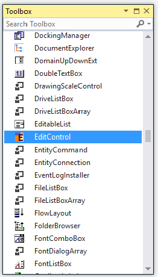
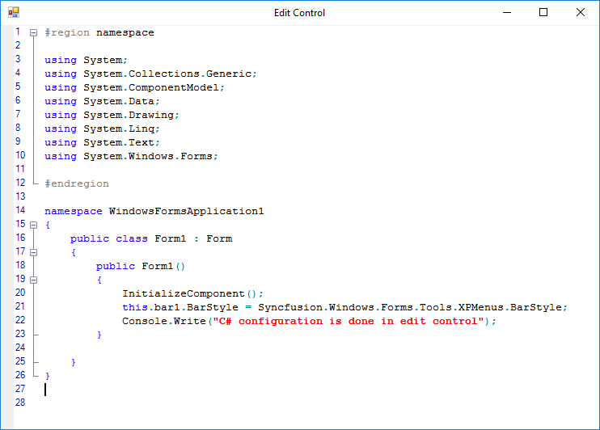

# Getting Started

This section explains how to create an interactive code editor application like Microsoft Visual Studio Editor by using the EditControl.

## Assembly deployment

The following list of assemblies should be added as reference to use the EditControl in any application:

<table>
<tr>
<th>
{{'**Required assemblies**'| markdownify }}
</th>
<th>
{{'**Description**'| markdownify }}
</th>
</tr>
<tr>
<td>
Syncfusion.Shared.Base.dll
</td>
<td>
Syncfusion.Shared.Base contains style related properties of Edit Control and various editor controls.
</td>
</tr>
<tr>
<td>
Syncfusion.Tools.Windows.dll
</td>
<td>
Syncfusion.Tools.Windows contains classes that handles all UI operations, fundamentals and base classes of Tools control which are used in the Edit Control.
</td>
</tr>
<tr>
<td>
Syncfusion.Edit.Windows.dll
</td>
<td>
Syncfusion.Edit.Windows contains the class that handles all UI operations and contains helper class of Edit control.
</td>
</tr>
</table>

# Creating simple application with EditControl

You can create the Windows Forms application with EditControl as follows:

1. [Creating the project](#creating-the-project)
2. [Adding control via Designer](#adding-control-via-designer)
3. [Adding control manually in code](#adding-control-manually-in-code)
4. [Loading a file into Document](#loading-a-file-into-document)
5. [Syntax Highlighting](#syntax-highlighting)

### Creating the project

Create a new Windows Forms project in the Visual Studio to display the EditControl.

## Adding control via designer

The EditControl can be added to the application by dragging it from the toolbox and dropping it in a designer view. The following required assembly references will be added automatically:

   * Syncfusion.Shared.Base.dll
   * Syncfusion.Tools.Windows.dll
   * Syncfusion.Edit.Windows.dll

## Adding control manually in code

To add control manually in C#, follow the given steps:

1. Add the following required assembly references to the project:

   * Syncfusion.Shared.Base.dll
   * Syncfusion.Tools.Windows.dll
   * Syncfusion.Edit.Windows.dll

2. Create `EditControl` control instance and add it to the form.





// Create the EditControl instance.

private Syncfusion.Windows.Forms.Edit.EditControl editControl1;

editControl1 = new Syncfusion.Windows.Forms.Edit.EditControl();

// Set an appropriate size for the Edit Control.

editControl1.Size = new Size(50, 50);

// Set the Dock property to the appropriate DockStyle enumeration value if desired.

editControl1.Dock = DockStyle.Fill;

// Set an appropriate BorderStyle to the Edit Control instance.

editControl1.BorderStyle = BorderStyle.Fixed3D;

// Adding the edit control to the form.

this.Controls.Add(editControl1);





'Create the EditControl instance.

private editControl1 As Syncfusion.Windows.Forms.Edit.EditControl

editControl1 = New Syncfusion.Windows.Forms.Edit.EditControl()

'Set an appropriate size for the Edit Control.

editControl1.Size = new Size(50, 50)

' Set the Dock property to the appropriate DockStyle enumeration value if desired.

editControl1.Dock = DockStyle.Fill

'Set an appropriate BorderStyle to the Edit Control instance.

editControl1.BorderStyle = BorderStyle.Fixed3D

' Adding the edit control to the form.

Me.Controls.Add(editControl1)





The following illustration shows Edit Control was created.

## Loading a file into Document

`LoadFile` method of Edit Control helps to loads the content of any desired file into the Edit Control, instead of typing the code in it.





// Loading the files into edit control by passing the file name as parameter to the LoadFile method.

this.editControl1.LoadFile(Path.GetDirectoryName(Application.ExecutablePath) + @"\..\..\FileName.cs");





` Loading the files into edit control by passing the file name as parameter to the LoadFile method.

Me.editControl1.LoadFile(Path.GetDirectoryName(Application.ExecutablePath) + @"\..\..\FileName.cs")





## Syntax highlighting

The Edit Control provides built-in support for a procedural, markup and SQL languages and facilitates the users to provide custom language configurations. By using the `ApplyConfiguration` method, we can set the Edit Control to use any of the pre-defined configuration settings.

**Built-in syntax highlighting languages**

The EditControl has a built-in syntax highlighting support for the following languages.

  * C
  * CSharp
  * Delphi
  * XML
  * HTML
  * VB.NET
  * SQL
  * Java
  * VBScript
  * JScript
  * PowerShell
  * Text

The following code example illustrates the C# configuration settings in Edit Control.





// Considering configuration settings for C# as an example. Using the KnownLanguages enumerator.

this.editControl1.ApplyConfiguration(KnownLanguages.CSharp);





' Considering configuration settings for C# as an example. Using the KnownLanguages enumerator.

Me.editControl1.ApplyConfiguration(KnownLanguages.CSharp)





**Custom language configuration**

Edit Control provides supports for custom language configuration. You can plug-in an external configuration file that defines a custom language to the Edit Control by using the `Configurator.Open` and `ApplyConfiguration` methods, as shown in the below code snippet.

The following example illustrates the same as follows:

**Step 1** : Creating a Configuration file

The following code snippet illustrates a sample configuration file that can be used for syntax highlighting a LISP-like code.



<ConfigLanguage name="LISP">

        <formats>

                <format name="Text" Font="Courier New, 10pt" FontColor="Salmon" />

                <format name="KeyWord" Font="Courier New, 10pt" FontColor="Blue" />

                <format name="String" Font="Courier New, 10pt, style=Bold" FontColor="Red" />

                <format name="Operator" Font="Courier New, 10pt" FontColor="DarkCyan" />

        </formats>

        <extensions>

                <extension>lsp</extension>

        </extensions>

        <lexems>

                <lexem BeginBlock="(" Type="Operator" />

                <lexem BeginBlock=")" Type="Operator" />

                <lexem BeginBlock="'" Type="Operator" />

                <lexem BeginBlock="car" Type="KeyWord" />

                <lexem BeginBlock="cdr" Type="KeyWord" />

                <lexem BeginBlock="cons" Type="KeyWord" />

        </lexems>

        <splits>

                <split>#Region</split>

                <split>#End Region</split>

        </splits>

</ConfigLanguage>



**Step 2** : How to Configure the created configuration file in Edit Control





private string configFile = Path.GetDirectoryName(Application.ExecutablePath) + @"\..\..\config.xml";

// Plug-in an external configuration file.

this.editControl1.Configurator.Open(configFile);

// Apply the configuration defined in the configuration file.

this.editControl1.ApplyConfiguration("LISP");





private string configFile = Path.GetDirectoryName(Application.ExecutablePath) + @"\..\..\config.xml";

' Plug-in an external configuration file.

Me.editControl1.Configurator.Open(configFile)

' Apply the configuration defined in the configuration file.

Me.editControl1.ApplyConfiguration("LISP")





