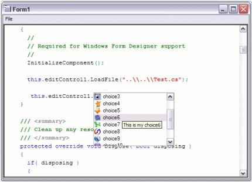

# Intellisense

EditControl provides Intellisense pop-up capabilities to add content easily, as like in Microsoft Visual Studio Code Editor. 

## Configure Intellisence 

In EditControl, `ContextChoice` support allows you to create pop-ups for displaying a list of options that are used to complete what the user is typing. This feature is modeled based on the List Members intellisense feature of Visual Studio, and is very convenient when editing programming languages. For example, in C# or VB.NET, when the . (period) character is typed after a class instance, a pop-up containing all the members of the class gets displayed. As you type in the editor, the list automatically changes selection to synchronize with the text that has been entered. You can also autocomplete the word by using the UP/DOWN ARROW keys to choose the Context Choice item and pressing the TAB key. The ContextChoice pop-up can be dismissed by pressing the ESC key.

The ContextChoice displaying characters are specified in the configuration file by using the `DropContextChoiceList` field in the lexem for the corresponding character. If you wish to display the ContextChoice dropdown in response to the period (".") or comma (",") being typed, use the following XML code.



<lexem BeginBlock="." Type="Operator" DropContextChoiceList="true"/>

<lexem BeginBlock="," Type="Operator" DropContextChoiceList="true"/>



The preceding code has to be placed within the <lexems> section of the configuration file.

The `AutoCompleteSingleLexem` property indicates whether the ContextChoice list gets auto completed when a single lexem remains in the list.





this.editControl1.AutoCompleteSingleLexem = true;





Me.editControl1.AutoCompleteSingleLexem = True





**Populating the ContextChoice list items**

The ContextChoice list is populated by handling the `ContextChoiceOpen` event of the EditControl, and adding items to the Items collection associated with the `IContextChoiceController` object.

<table>
<tr>
<th>
Event</th><th>
Description</th></tr>
<tr>
<td>
ContextChoiceOpen</td><td>
This event occurs when the ContextChoice window has been opened</td></tr>
</table>





private void editControl1_ContextChoiceOpen(Syncfusion.Windows.Forms.Edit.Interfaces.IContextChoiceController controller)
{

// Add items to the Items collection associated with the IContextChoiceController object.

controller.Items.Add("Method", "Method", this.editControl1.ContextChoiceController.Images["Image0"]);
controller.Items.Add("FindText", "FindText", this.editControl1.ContextChoiceController.Images["Image1"]);    
controller.Items.Add("GetTextAsHTML", "GetTextAsHTML", this.editControl1.ContextChoiceController.Images["Image2"]);
controller.Items.Add("LoadFile", "LoadFile", this.editControl1.ContextChoiceController.Images["Image3"]);
controller.Items.Add("ToString", "ToString", this.editControl1.ContextChoiceController.Images["Image4"]);
controller.Items.Add("Event", "Event", this.editControl1.ContextChoiceController.Images["Image5"]);                      

}





Private Sub editControl1_ContextChoiceOpen(ByVal controller As Syncfusion.Windows.Forms.Edit.Interfaces.IContextChoiceController) Handles EditControl1.ContextChoiceOpen

' Add items to the Items collection associated with the IContextChoiceController object.

controller.Items.Add("Method", "Method", Me.editControl1.ContextChoiceController.Images("Image0"))
controller.Items.Add("FindText", "FindText", Me.editControl1.ContextChoiceController.Images("Image1"))
controller.Items.Add("GetTextAsHTML", "GetTextAsHTML", Me.editControl1.ContextChoiceController.Images("Image2"))
controller.Items.Add("LoadFile", "LoadFile", Me.editControl1.ContextChoiceController.Images("Image3"))
controller.Items.Add("ToString", "ToString", Me.editControl1.ContextChoiceController.Images("Image4"))
controller.Items.Add("Event", "Event", Me.editControl1.ContextChoiceController.Images("Image5"))

End Sub





**Adding custom images to list items**

Custom images can also be added to the ContextChoice list items by indexing them into the Images collection of the `IContextChoiceController` object associated with the EditControl. The Images collection of the IContextChoiceController can be populated by using the code given below.





int index = 0;

foreach (Image img in this.imageList1.Images)
{

// Populating images using an external ImageList.

this.editControl1.ContextChoiceController.AddImage("Image" + index.ToString(), img);

index++;

}     





Dim index As Integer = 0

Dim img As Image

For Each img In  Me.imageList1.Images

' Populating images using an external ImageList.

Me.editControl1.ContextChoiceController.AddImage("Image" + index.ToString(), img)

index += 1

Next img





**List item tooltip**

ToolTip text is specified for each Context Choice list item while adding the items to the `IContextChoiceController`, as shown in the following code snippet.





// Specify tooltip text for each Context Choice list item.

controller.Items.Add("LoadFile", "Use this method to open a file in EditControl.", this.editControl1.ContextChoiceController.Images["Image3"]);





' Specify tooltip text for each Context Choice list item.

controller.Items.Add("LoadFile", "Use this method to open a file in EditControl.", Me.editControl1.ContextChoiceController.Images["Image3"])





**ContextChoice operations**

The EditControl provides the following set of events for performing Context Choice operations:

    * ContextChoiceBeforeOpen
    * ContextChoiceClose
    * ContextChoiceItemSelected
    * ContextChoiceSelectedTextInsert

<table>
<tr>
<th>
Event</th><th>
Description</th></tr>
<tr>
<td>
ContextChoiceBeforeOpen</td><td>
Occurs when the Context Choice window is about to open</td></tr>
</table>





private void editControl1_ContextChoiceBeforeOpen(object sender, System.ComponentModel.CancelEventArgs e)
{                        

// Display Context Choice popup if the lexem used to invoke ContextChoice is "this" or "me" only

int ind = GetContextChoiceCharIndex(lexemLine);

ILexem lex = lexemLine.LineLexems[ind-1] as ILexem;

if ((lex.Text == "this") || (lex.Text == "me"))

e.Cancel = false;

else

// Cancels the display of the ContextChoice list.

e.Cancel = true;

}





Private Sub editControl1_ContextChoiceBeforeOpen(ByVal sender As Object, ByVal e As System.ComponentModel.CancelEventArgs) Handles EditControl1.ContextChoiceBeforeOpen

' Display Context Choice popup if the lexem used to invoke the ContextChoice is "this" or "me" only

Dim ind As Integer = GetContextChoiceCharIndex(lexemLine)

 Dim lex As ILexem = lexemLine.LineLexems(ind - 1)

If lex.Text = "this" OrElse lex.Text = "me" Then

e.Cancel = False

Else

' Cancel the display of the ContextChoice list.

e.Cancel = True

End If

End Sub





<table>
<tr>
<th>
Event</th><th>
Description</th></tr>
<tr>
<td>
ContextChoiceClose</td><td>
Occurs when the ContextChoice window has been closed</td></tr>
</table>





private void editControl1_ContextChoiceClose(Syncfusion.Windows.Forms.Edit.Interfaces.IContextChoiceController controller, System.Windows.Forms.DialogResult result)
{
    // Clear the ContextChoice items. 
    this.editControl1.ContextChoiceController.Items.Clear();
}





Private Sub editControl1_ContextChoiceClose(ByVal controller As Syncfusion.Windows.Forms.Edit.Interfaces.IContextChoiceController, ByVal result As System.Windows.Forms.DialogResult) Handles EditControl1.ContextChoiceClose

    ' Clear the ContextChoice items.
    Me.editControl1.ContextChoiceController.Items.Clear()

End Sub





<table>
<tr>
<th>
Events</th><th>
Description</th></tr>
<tr>
<td>
ContextChoiceItemSelected</td><td>
Occurs when a ContextChoice list item is selected</td></tr>
<tr>
<td>
ContextChoiceSelectedTextInsert</td><td>
Occurs when the editor is about to insert selected ContextChoice item to the text. Action can be canceled</td></tr>
</table>





private void editControl1_ContextChoiceItemSelected(Syncfusion.Windows.Forms.Edit.Interfaces.IContextChoiceController sender, Syncfusion.Windows.Forms.Edit.ContextChoiceItemSelectedEventArgs e)
{
   // Gets the selected item.

   IContextChoiceController controller = sender as IContextChoiceController;

    string selectedItemText = e.SelectedItem.Text;
}





Private Sub editControl1_ContextChoiceItemSelected(ByVal sender As Syncfusion.Windows.Forms.Edit.Interfaces.IContextChoiceController, ByVal e As Syncfusion.Windows.Forms.Edit.ContextChoiceItemSelectedEventArgs) Handles EditControl1.ContextChoiceItemSelected

   ' Gets the selected item.

   Dim controller As IContextChoiceController = sender

   Dim selectedItemText As String = e.SelectedItem.Text

End Sub









private void editControl1_ContextChoiceSelectedTextInsert(Syncfusion.Windows.Forms.Edit.Interfaces.IContextChoiceController sender, Syncfusion.Windows.Forms.Edit.ContextChoiceTextInsertEventArgs e)
{
     IContextChoiceController controller = sender as IContextChoiceController;

     // Gets the displayed text.
     string displayText = e.DisplayText;

     // Gets the text to be inserted.
     string insertText = e.InsertText;

     // Gets the item selected.
     string selectedItemText = e.SelectedItem.Text;
}





Private Sub editControl1_ContextChoiceSelectedTextInsert(ByVal sender As Syncfusion.Windows.Forms.Edit.Interfaces.IContextChoiceController, ByVal e As Syncfusion.Windows.Forms.Edit.ContextChoiceTextInsertEventArgs) Handles EditControl1.ContextChoiceSelectedTextInsert

      Dim controller As IContextChoiceController = sender

      ' Gets the displayed text.
      Dim displayText As String = e.DisplayText

      ' Gets the text to be inserted.
      Dim insertText As String = e.InsertText

      ' Gets the item selected.
      Dim selectedItemText As String = e.SelectedItem.Text

End Sub 





**Filtering AutoComplete items**

EditControl provides options to filter items in AutoComplete. This can be done by using the `FilterAutoCompleteItems` property.

<table>
<tr>
<th>
Property</th><th>
Description</th></tr>
<tr>
<td>
FilterAutoCompleteItems</td><td>
Gets / sets value indicating whether Context Choice items should be filtered while typing</td></tr>
</table>

FilterAutoCompleteItems property when set to True, filters the item in the AutoComplete Context Choice, and the filtered item alone will be visible. When set to False, all the items will be visible, and the selection will be navigated to the item.

**Showing / Hiding ContextChoice pop-up**

You can also programmatically show / hide the Context Choice pop-up by calling the `ShowContextChoice` and `CloseContextChoice` methods.





// Shows the ContextChoice pop-up window.
this.editControl1.ShowContextChoice();

// Closes the ContextChoice pop-up window.
this.editControl1.CloseContextChoice();





' Shows the ContextChoice pop-up window.
Me.editControl1.ShowContextChoice()

' Closes the ContextChoice pop-up window.
Me.editControl1.CloseContextChoice()

End Sub





## Customization

The border color of the ContextChoice form is set by using the `ContextChoiceBorderColor` property.

<table>
<tr>
<th>
Property</th><th>
Description</th></tr>
<tr>
<td>
ContextChoiceBorderColor</td><td>
Specifies the color of the ContextChoice form border. Used when UseXPStyle property is set to 'False'. Otherwise 3D border is drawn</td></tr>
</table>





this.editControl1.ContextChoiceBorderColor = System.Drawing.Color.Red;





Me.editControl1.ContextChoiceBorderColor = System.Drawing.Color.Red





The size of the ContextChoice form can be set by using the `ContextChoiceSize` property.





this.editControl1.ContextChoiceSize = new System.Drawing.Size(100, 50);





Me.editControl1.ContextChoiceSize = New System.Drawing.Size(100, 50)





We can also customize the ContextChoice font, fore color and back color by using the following code snippet.





// To set the context choice font.

 this.editControl1.ContextChoiceFont = new Font("Monotype Corsiva", 12F, FontStyle.Bold);
 
 // To set the ContextChoice back color.
 
 this.editControl1.ContextChoiceBackColor = Color.DodgerBlue;
 
 // To set the Context Choice fore color.
 
 this.editControl1.ContextChoiceForeColor = Color.White;





' To set the context choice font.

 Me.editControl1.ContextChoiceFont = New Font("Monotype Corsiva", 12F, FontStyle.Bold)
 
 ' To set the ContextChoice back color.
 
 Me.editControl1.ContextChoiceBackColor = Color.DodgerBlue
 
 ' To set the ContextChoice fore color.
 
 Me.editControl1.ContextChoiceForeColor = Color.White





