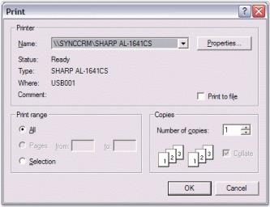

# Printing

EditControl provides complete support for printing its contents either by using the Print option from the print preview or programmatically. The print preview window lets users choose to print an entire document or the current page, and specify the number of copies to print.

In brief, the printing functionality of the EditControl supports the following features.

* Print Preview
* Custom Header and Footer Text
* Document Name
* Page Numbers
* Color Printing to preserve Syntax Highlighting
* Selected Text Printing
* Line Numbers
* Printing a Specific Page or Set of Pages
* Printing Entire Document
* Creating a Printer Document
* Current Page Printing
* Printer Dialog

## Print preview and printing contents

You can invoke the Print dialog box by using the `Print` method of the EditControl, as shown in the below code snippet.





// Invoke the print dialog.

this.editControl1.Print();





' Invoke the print dialog.

Me.editControl1.Print()





Use the `PrintPreview` method to view the contents of the EditControl before they are printed.





// View the contents of the EditControl before printing.

this.editControl1.PrintPreview();





' View the contents of the EditControl before printing.

Me.editControl1.PrintPreview()





**Specifying printing options**

EditControl provides various printing option as like Visual Studio Code Editor. By using the `PrintCurrentPage` method, we can print the current page in the EditControl. The following methods allow you to specify the options for printing.

<table>
<tr>
<th>
Methods</th><th>
Description</th></tr>
<tr>
<td>
PrintCurrentPage</td><td>
Prints current page on default printer</td></tr>
<tr>
<td>
PrintNoDialog</td><td>
Prints entire document on default printer</td></tr>
<tr>
<td>
PrintSelection</td><td>
Prints selected area on default printer</td></tr>
<tr>
<td>
PrintPages</td><td>
Prints the pages in the specified range</td></tr>
</table>





// Print the current page.

this.editControl1.PrintCurrentPage();

// Print the entire document.

this.editControl1.PrintNoDialog();

// Print the selected area.

this.editControl1.PrintPages(1, 10);

// Print the pages in the specified range.

this.editControl1.PrintSelection();





' Print the current page.

Me.editControl1.PrintCurrentPage()

' Print the entire document.

Me.editControl1.PrintNoDialog()

' Print the selected area.

Me.editControl1.PrintPages(1, 10)

' Print the pages in the specified range.

Me.editControl1.PrintSelection()





## Customize printing options

Header and Footer can be enabled while printing the document by using the `PageHeaderAndFooterVisible` property. Its default value is `true`, to hide the header and footer while printing turn on its value to `false`. `PrintDocumentName` and `PrintPageNumber` property is used to enable or disable the name of the document and page number while printing.

The following properties are used to print the contents of the editor, the document name as the header, and the page number as footer.

<table>
<tr>
<th>
Properties</th><th>
Description</th></tr>
<tr>
<td>
PrintDocument</td><td>
Helps to print the contents of the editor</td></tr>
<tr>
<td>
PrintDocumentName</td><td>
Specifies a value indicating whether the document name should be printed</td></tr>
<tr>
<td>
PrintPageNumber</td><td>
Specifies a value indicating whether the page number should be printed</td></tr>
</table>

Users can also specify their desired text in the header and footer by handling the `PrintHeader` and `PrintFooter` events. The default text in the header and footer is the fully qualified path of the file including the file name and page number respectively.

<table>
<tr>
<th>
Events</th><th>
Description</th></tr>
<tr>
<td>
PrintHeader</td><td>
Occurs when page header is printed</td></tr>
<tr>
<td>
PrintFooter</td><td>
Occurs when page footer is printed</td></tr>
</table>





private void editControl1_PrintHeader(object sender, Syncfusion.Windows.Forms.Edit.PrintHeadlineEventArgs e)
{

// Set the desired text in the header. The default text in the header is the full path and the name of the file.

e.Text = "This is the header";

}

private void editControl1_PrintFooter(object sender, Syncfusion.Windows.Forms.Edit.PrintHeadlineEventArgs e)
{

// Set desired text in the footer. The default text in the footer is the page number.

e.Text = "This is the footer";

}





Private Sub editControl1_PrintHeader(ByVal sender As Object, ByVal e As Syncfusion.Windows.Forms.Edit.PrintHeadlineEventArgs) Handles EditControl1.PrintHeader

' Set the desired text in the header. The default text in the header is the full path and the name of the file.

e.Text = "This is the header"

End Sub 

'editControl1_PrintHeader

Private Sub editControl1_PrintFooter(ByVal sender As Object, ByVal e As Syncfusion.Windows.Forms.Edit.PrintHeadlineEventArgs) Handles EditControl1.PrintFooter

' Set desired text in the footer. The default text in the footer is the page number.

e.Text = "This is the footer"

End Sub





The following image shows a typical page with a header and footer in Print Preview mode.

PageBorder can also be shown or removed while printing the document. `SetPageBorder` method is used to display page borders for the EditControl. And also we can remove the page borders by using `RemovePageBorder` of EditControl.

<table>
<tr>
<th>
Methods</th><th>
Description</th></tr>
<tr>
<td>
SetPageBorder</td><td>
Sets parameters of border that's drawn in page preview</td></tr>
<tr>
<td>
RemovePageBorder</td><td>
Removes border drawing in page preview</td></tr>
</table>





// Set the page border. 

this.editControl1.SetPageBorder(Syncfusion.Windows.Forms.Edit.Enums.FrameBorderStyle.DashDot, Color.Red, Syncfusion.Windows.Forms.Edit.Enums.BorderWeight.Bold);

// Remove the page border.

this.editControl1.RemovePageBorder();





' Set the page border. 

Me.editControl1.SetPageBorder(Syncfusion.Windows.Forms.Edit.Enums.FrameBorderStyle.DashDot, Color.Red, Syncfusion.Windows.Forms.Edit.Enums.BorderWeight.Bold)

' Remove the page border.

Me.editControl1.RemovePageBorder()





A sample which demonstrates the above features is available in the below sample installation path.

Installation Location\Syncfusion\Essential Studio\Version Number\Windows\Edit.Windows\Samples\Printing