# Syntax Highlighting 

Essential Edit supports Syntax Highlighting and Code Coloring of some of the commonly used languages with the help of configuration files. Essential Edit offers fully configurable syntax highlighting for general text editing purposes. Syntax highlighting greatly improves the readability of any text and has found its way into many commercial applications. It provides pre-defined configuration files for languages like SQL, Delphi or Pascal, HTML, VB.NET, XML, Java, VBScript, JScript and C#.

## Configure language

The EditControl provides built-in support for a procedural, markup, SQL languages and also facilitates the users to provide custom language configurations. These configuration settings are made available in the `EditControl.Configurator.KnownLanguages` collection. By using the `ApplyConfiguration` method, we can set the EditControl to use any of the pre-defined configuration settings.  The EditControl has a built-in syntax highlighting support for the following languages.

  * CSharp
  * Delphi
  * XML
  * HTML
  * VB.NET
  * SQL
  * Java
  * VBScript
  * JScript
  * PowerShell

**CSharp** 

The following code example illustrates the C# configuration settings in EditControl.





// Considering configuration settings for C# as an example. Using the KnownLanguages enumerator.

this.editControl1.ApplyConfiguration(Syncfusion.Windows.Forms.Edit.Enums.KnownLanguages.CSharp);





' Considering configuration settings for C# as an example. Using the KnownLanguages enumerator.

Me.editControl1.ApplyConfiguration(Syncfusion.Windows.Forms.Edit.Enums.KnownLanguages.CSharp)





`LoadFile` method of EditControl helps to loads the content of any desired file into the EditControl, instead of typing the code in it.





// Loading the files into EditControl by passing the file name as parameter to the LoadFile method.

this.editControl1.LoadFile(Path.GetDirectoryName(Application.ExecutablePath) + @"\..\..\FileName.cs");





` Loading the files into EditControl by passing the file name as parameter to the LoadFile method.

Me.editControl1.LoadFile(Path.GetDirectoryName(Application.ExecutablePath) + @"\..\..\FileName.cs")





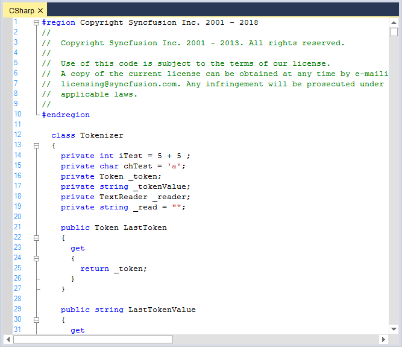

**Delphi** 

The following code example illustrates the Delphi configuration settings in EditControl.





// Considering configuration settings for Delphi as an example. Using the KnownLanguages enumerator.

this.editControl1.ApplyConfiguration(Syncfusion.Windows.Forms.Edit.Enums.KnownLanguages.Delphi);

// Loading the files into EditControl by passing the file name as parameter to the LoadFile method.

this.editControl1.LoadFile(Path.GetDirectoryName(Application.ExecutablePath) + @"\..\..\DelphiSource.pas");





' Considering configuration settings for Delphi as an example. Using the KnownLanguages enumerator.

Me.editControl1.ApplyConfiguration(Syncfusion.Windows.Forms.Edit.Enums.KnownLanguages.Delphi)

` Loading the files into EditControl by passing the file name as parameter to the LoadFile method.

Me.editControl1.LoadFile(Path.GetDirectoryName(Application.ExecutablePath) + @"\..\..\DelphiSource.pas")





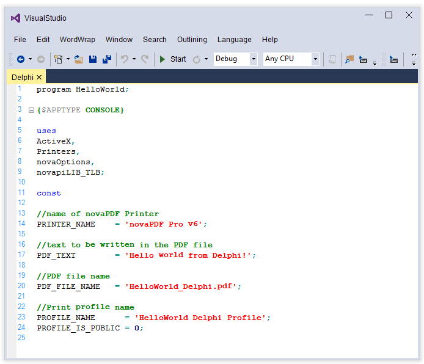

**XML** 

The following code example illustrates the XML configuration settings in EditControl.





// Considering configuration settings for XML as an example. Using the KnownLanguages enumerator.

this.editControl1.ApplyConfiguration(Syncfusion.Windows.Forms.Edit.Enums.KnownLanguages.XML);

// Loading the files into EditControl by passing the file name as parameter to the LoadFile method.

this.editControl1.LoadFile(Path.GetDirectoryName(Application.ExecutablePath) + @"\..\..\XMLSource.xml");





' Considering configuration settings for XML as an example. Using the KnownLanguages enumerator.

Me.editControl1.ApplyConfiguration(Syncfusion.Windows.Forms.Edit.Enums.KnownLanguages.XML)

` Loading the files into EditControl by passing the file name as parameter to the LoadFile method.

Me.editControl1.LoadFile(Path.GetDirectoryName(Application.ExecutablePath) + @"\..\..\XMLSource.xml")





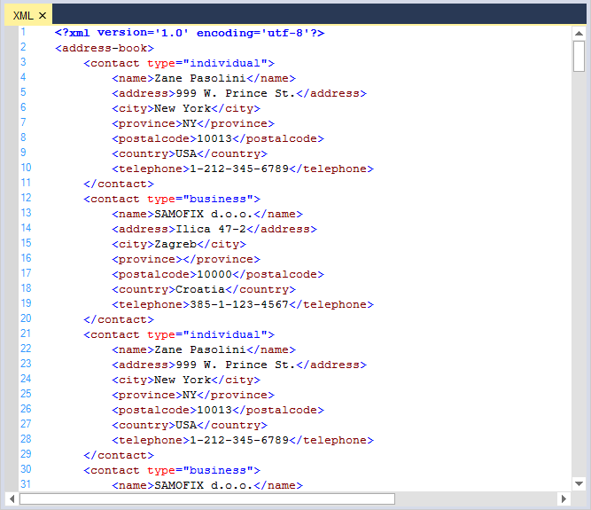

**HTML** 

The following code example illustrates the HTML configuration settings in EditControl.





// Considering configuration settings for HTML as an example. Using the KnownLanguages enumerator.

this.editControl1.ApplyConfiguration(Syncfusion.Windows.Forms.Edit.Enums.KnownLanguages.HTML);

// Loading the files into EditControl by passing the file name as parameter to the LoadFile method.

this.editControl1.LoadFile(Path.GetDirectoryName(Application.ExecutablePath) + @"\..\..\HTMLSource.html");





' Considering configuration settings for HTML as an example. Using the KnownLanguages enumerator.

Me.editControl1.ApplyConfiguration(Syncfusion.Windows.Forms.Edit.Enums.KnownLanguages.HTML)

` Loading the files into EditControl by passing the file name as parameter to the LoadFile method.

Me.editControl1.LoadFile(Path.GetDirectoryName(Application.ExecutablePath) + @"\..\..\HTMLSource.html")





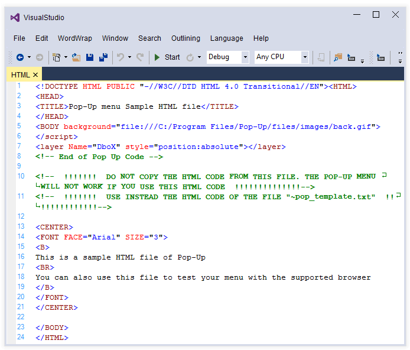

**VB.NET** 

The following code example illustrates the VB.NET configuration settings in EditControl.





// Considering configuration settings for VB.NET as an example. Using the KnownLanguages enumerator.

this.editControl1.ApplyConfiguration(Syncfusion.Windows.Forms.Edit.Enums.KnownLanguages.VBNET);

// Loading the files into EditControl by passing the file name as parameter to the LoadFile method.

this.editControl1.LoadFile(Path.GetDirectoryName(Application.ExecutablePath) + @"\..\..\VBSource.vb");





' Considering configuration settings for VB.NET as an example. Using the KnownLanguages enumerator.

Me.editControl1.ApplyConfiguration(Syncfusion.Windows.Forms.Edit.Enums.KnownLanguages.VBNET)

` Loading the files into EditControl by passing the file name as parameter to the LoadFile method.

Me.editControl1.LoadFile(Path.GetDirectoryName(Application.ExecutablePath) + @"\..\..\VBSource.vb")





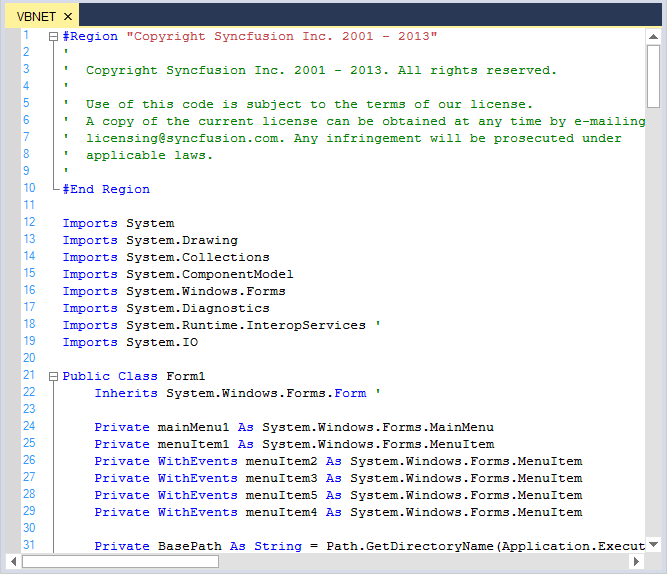

**SQL** 

The following code example illustrates the SQL configuration settings in EditControl.





// Considering configuration settings for SQL as an example. Using the KnownLanguages enumerator.

this.editControl1.ApplyConfiguration(Syncfusion.Windows.Forms.Edit.Enums.KnownLanguages.SQL);

// Loading the files into EditControl by passing the file name as parameter to the LoadFile method.

this.editControl1.LoadFile(Path.GetDirectoryName(Application.ExecutablePath) + @"\..\..\SQLSource.sql");





' Considering configuration settings for SQL as an example. Using the KnownLanguages enumerator.

Me.editControl1.ApplyConfiguration(Syncfusion.Windows.Forms.Edit.Enums.KnownLanguages.SQL)

` Loading the files into EditControl by passing the file name as parameter to the LoadFile method.

Me.editControl1.LoadFile(Path.GetDirectoryName(Application.ExecutablePath) + @"\..\..\SQLSource.sql")





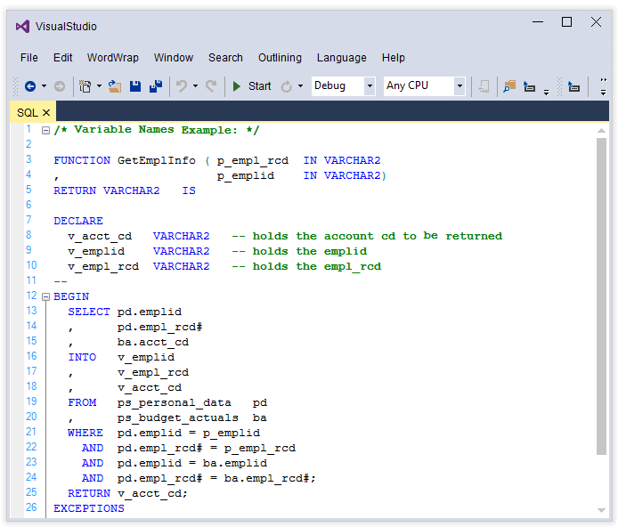

**Java** 

The following code example illustrates the Java configuration settings in EditControl.





// Considering configuration settings for Java as an example. Using the KnownLanguages enumerator.

this.editControl1.ApplyConfiguration(Syncfusion.Windows.Forms.Edit.Enums.KnownLanguages.Java);

// Loading the files into EditControl by passing the file name as parameter to the LoadFile method.

this.editControl1.LoadFile(Path.GetDirectoryName(Application.ExecutablePath) + @"\..\..\JavaSource.Java");





' Considering configuration settings for Java as an example. Using the KnownLanguages enumerator.

Me.editControl1.ApplyConfiguration(Syncfusion.Windows.Forms.Edit.Enums.KnownLanguages.Java)

` Loading the files into EditControl by passing the file name as parameter to the LoadFile method.

Me.editControl1.LoadFile(Path.GetDirectoryName(Application.ExecutablePath) + @"\..\..\JavaSource.Java")





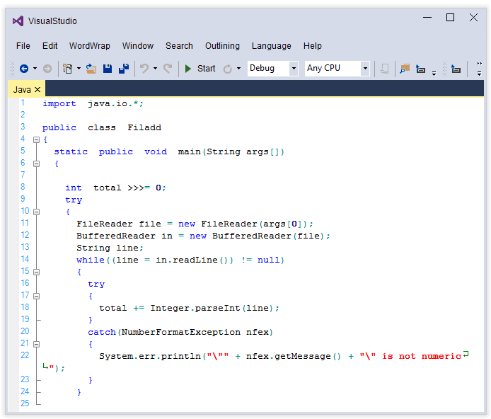

**VBScript** 

The following code example illustrates the VBScript configuration settings in EditControl.





// Considering configuration settings for VBScript as an example. Using the KnownLanguages enumerator.

this.editControl1.ApplyConfiguration(Syncfusion.Windows.Forms.Edit.Enums.KnownLanguages.VBScript);

// Loading the files into EditControl by passing the file name as parameter to the LoadFile method.

this.editControl1.LoadFile(Path.GetDirectoryName(Application.ExecutablePath) + @"\..\..\VBScriptSource.vb");





' Considering configuration settings for VBScript as an example. Using the KnownLanguages enumerator.

Me.editControl1.ApplyConfiguration(Syncfusion.Windows.Forms.Edit.Enums.KnownLanguages.VBScript)

` Loading the files into EditControl by passing the file name as parameter to the LoadFile method.

Me.editControl1.LoadFile(Path.GetDirectoryName(Application.ExecutablePath) + @"\..\..\VBScriptSource.vb")





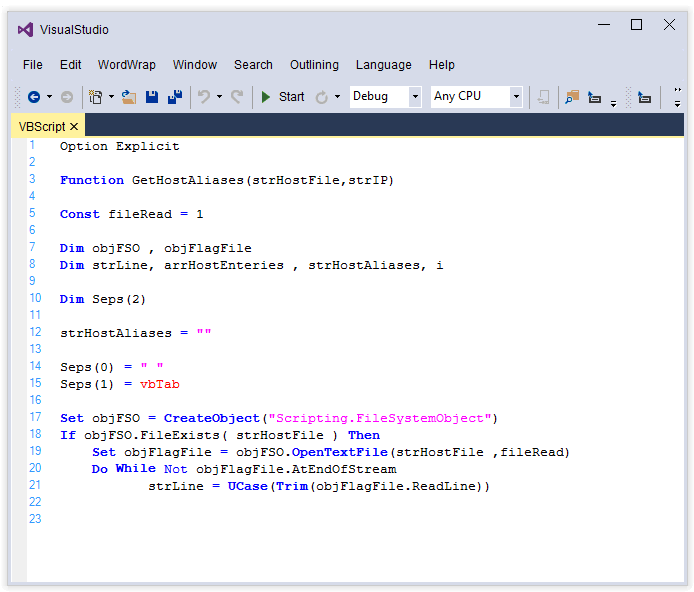

**JScript** 

The following code example illustrates the JScript configuration settings in EditControl.





// Considering configuration settings for JScript as an example. Using the KnownLanguages enumerator.

this.editControl1.ApplyConfiguration(Syncfusion.Windows.Forms.Edit.Enums.KnownLanguages.JScript);

// Loading the files into EditControl by passing the file name as parameter to the LoadFile method.

this.editControl1.LoadFile(Path.GetDirectoryName(Application.ExecutablePath) + @"\..\..\JScriptSource.js");





' Considering configuration settings for JScript as an example. Using the KnownLanguages enumerator.

Me.editControl1.ApplyConfiguration(Syncfusion.Windows.Forms.Edit.Enums.KnownLanguages.JScript)

` Loading the files into EditControl by passing the file name as parameter to the LoadFile method.

Me.editControl1.LoadFile(Path.GetDirectoryName(Application.ExecutablePath) + @"\..\..\JScriptSource.js")





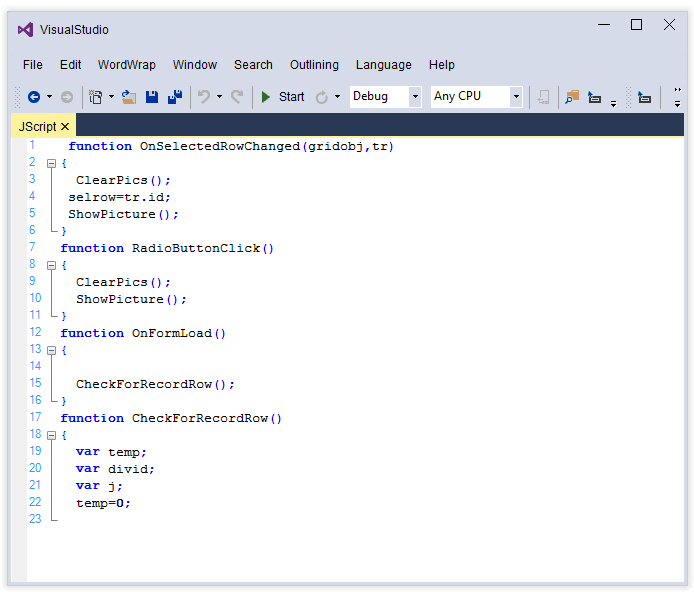

**JScript** 

The following code example illustrates the PowerShell configuration settings in EditControl.





// Considering configuration settings for PowerShell as an example. Using the KnownLanguages enumerator.

this.editControl1.ApplyConfiguration(Syncfusion.Windows.Forms.Edit.Enums.KnownLanguages.PowerShell);

// Loading the files into EditControl by passing the file name as parameter to the LoadFile method.

this.editControl1.LoadFile(Path.GetDirectoryName(Application.ExecutablePath) + @"\..\..\PowerShell.ps1");





' Considering configuration settings for PowerShell as an example. Using the KnownLanguages enumerator.

Me.editControl1.ApplyConfiguration(Syncfusion.Windows.Forms.Edit.Enums.KnownLanguages.PowerShell)

` Loading the files into EditControl by passing the file name as parameter to the LoadFile method.

Me.editControl1.LoadFile(Path.GetDirectoryName(Application.ExecutablePath) + @"\..\..\PowerShell.ps1")





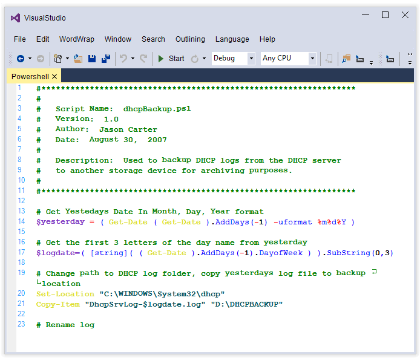

Syntax Highlighting and Code Coloring can also be implemented at run time by using the `Language Coloring Configuration Editor` and can be customized by using class named `ConfigurationDialog` and Interface named `IConfig`.

The Language Coloring Configuration Editor can be invoked programmatically as follows.





IConfigLanguage activeLang = this.editControl1.Parser.Formats as IConfigLanguage;

// Create an instance of ConfigurationDialog.

ConfigurationDialog editConfig = new ConfigurationDialog(this.editControl1.Configurator, activeLang);

if(editConfig.ShowDialog(this) == DialogResult.OK && activeLang != null)

{

    IConfigLanguage newLang = editConfig.Configurator.KnownLanguageNames.Contains(activeLang.Language) ? editConfig.Configurator[activeLang.Language] : editConfig.Configurator.DefaultLanguage;

    if(newLang != null)

    {

        // Set language configuration instance object.         

        this.editControl1.Configurator = editConfig.Configurator;

        // Applies coloring of the specified language to the text.

        this.editControl1.ApplyConfiguration(newLang);

    }

}





Dim activeLang As IConfigLanguage = Me.EditControl1.Parser.Formats

' Create an instance of ConfigurationDialog.

Dim editConfig As New frmConfigDialog(Me.editControl1.Configurator, activeLang)

If editConfig.ShowDialog(Me) = DialogResult.OK AndAlso Not (activeLang Is Nothing) Then

    Dim newLang As IConfigLanguage = If(editConfig.Configurator.KnownLanguageNames.Contains(activeLang.Language), editConfig.Configurator(activeLang.Language), editConfig.Configurator.DefaultLanguage) 

     If Not (newLang Is Nothing) Then

        ' Set language configuration instance object.

         Me.editControl1.Configurator = editConfig.Configurator

        ' Applies coloring of the specified language to the text.

         Me.editControl1.ApplyConfiguration(newLang)

     End If
     
End If





## Configure custom language

EditControl provides supports for custom language configuration. You can plug-in an external configuration file that defines a custom language to the EditControl by using the `Configurator.Open` and `ApplyConfiguration` methods of EditControl.

**Step 1** : Creating a Configuration file

Syntax Highlighting is accomplished in Essential Edit through the use of XML-based configuration files. The language-specific configuration is stored in XML files. Name of the language must be set using the name attribute of the `ConfigLanguage` tag. If language is case insensitive, you should set the CaseInsensitive attribute to 'True'.

Language configuration is divided into the following four sections:

* Extensions
* Splits
* Formats
* Lexems

* Extensions-Contains a list of extensions that are associated with this language. Every extension can be specified like the following:

<extension>cpp</extension>

* Splits-Contains a list of expressions that must be treated as one word. By default, "=" and "+" are splitters; So each of them will be returned by the token as a single char. But if you want to specify some configuration for "+=", you should specify "+=" in the Splits section. To do this, just add the below string to the Splits section:

<split>+=</split>

* Formats-Contains a list of definitions of the formats that can be used later in lexem configuration. Every format is specified by a tag <format>. Every format contains the attributes such as name, font, fore color, font color, back color, style, weight, underline and line color.

* Lexems-Contains rules for parsing text. In other words, rules for setting lexem format. There are two attributes to specify the format of the lexem: Type and FormatName. FormatName is used only if Type is 'Custom'. Type is used for standard predefined types of lexems, some of them have special meaning for controls (such as SelectedText). For a list of possible values. Refer to the definition of the FormatType enumeration.

The below given code snippet illustrates a sample configuration file that can be used for syntax highlighting a C++ code.



<ConfigLanguage name="C++">

    <formats>
      <format name="Text" Font="Courier New, 10pt style=Bold"   FontColor="#53ff54" />
      <format name="Whitespace" Font="Courier New, 10pt" FontColor="Black" />
      <format name="KeyWord" Font="Courier New, 10pt style=Bold" FontColor="#ffffff" />
      <format name="String" Font="Courier New, 10pt, style=Bold" FontColor="#b00000" BorderColor="#b00000" />
      <format name="Number" Font="Courier New, 10pt, style=Bold" FontColor="#b4b3b4" />
      <format name="Operator" Font="Courier New, 10pt style=Bold" FontColor="#ffff54" />
      <format name="CollapsedText" Font="Courier New, 10pt" FontColor="Black" BorderColor="DarkGray" BorderStyle="Solid" />
    </formats>
    
    <extensions>
      <extension>cpp</extension>
      <extension>C</extension>
    </extensions>
    
    <lexems>
      <lexem BeginBlock="(" EndBlock=")" Type="Operator" IsComplex="true" IsCollapsable="false" DropContextPrompt="true"
        CollapseName="(...)">
        <SubLexems>
          <lexem BeginBlock="\n" IsBeginRegex="true" />
        </SubLexems>
      </lexem>
      <lexem BeginBlock="&quot;" EndBlock="(&quot;)|(@&quot;)" Type="String" IsEndRegex="true" IsComplex="true" OnlyLocalSublexems="true">
        <SubLexems>
          <lexem BeginBlock="\" EndBlock="&quot;" Type="String" />
        </SubLexems>
      </lexem>
      <lexem BeginBlock="{" EndBlock="}" Type="KeyWord" IsComplex="true" IsCollapsable="true" Indent="true" DropContextPrompt="true" 
        CollapseName="{...}">
        <SubLexems>
          <lexem BeginBlock="\n" IsBeginRegex="true" />
        </SubLexems>
      </lexem>
    </lexems>
    
    <splits>
      <split>#region</split>
      <split>#endregion</split>
    </splits>
  
</ConfigLanguage>



**Step 2** : How to Configure the created configuration file in EditControl





private string configFile = Path.GetDirectoryName(Application.ExecutablePath) + @"\..\..\config.xml";

// Plug-in an external configuration file.

this.editControl1.Configurator.Open(configFile);

// Apply the configuration defined in the configuration file.

this.editControl1.ApplyConfiguration("C++");





private string configFile = Path.GetDirectoryName(Application.ExecutablePath) + @"\..\..\config.xml";

' Plug-in an external configuration file.

Me.editControl1.Configurator.Open(configFile)

' Apply the configuration defined in the configuration file.

Me.editControl1.ApplyConfiguration("C++")





N> We can customize the EditControl Back color according to the particular language UI Appearance. Customization of EditControl is discussed under Appearance topic.

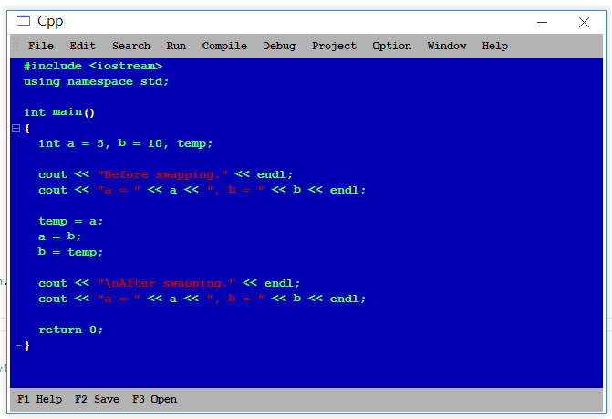

EditControl also offers extensive support to create configuration settings programmatically. This provides greater flexibility so that users can dynamically modify configuration settings of the currently loaded configuration as per their requirements. The following procedure will walk you through the entire process of creating configuration settings programmatically.

1. A new configuration language can be added to the EditControl by using the `CreateLanguageConfiguration` method. Once the new configuration language is created, apply it to the contents of the EditControl by using the ApplyConfiguration method.





// Create a new configuration language and apply the same to the contents of the EditControl.

IConfigLanguage currentConfigLanguage = this.editControl1.Configurator.CreateLanguageConfiguration(newConfigLanguage);

this.editControl1.ApplyConfiguration(currentConfigLanguage);





' Create a new configuration language and apply the same to the contents of the EditControl.

Dim currentConfigLanguage As IConfigLanguage = Me.editControl1.Configurator.CreateLanguageConfiguration(NewConfigLanguage)

Me.editControl1.ApplyConfiguration(currentConfigLanguage)





2. Create a custom format object by using the Language.Add method of the EditControl and define its attributes.





// Creating a custom format object.

ISnippetFormat formatMethod = this.editControl1.Language.Add("CodeBehind");

// Defining its attributes.

formatMethod.FontColor = Color.IndianRed;

formatMethod.Font = new Font("Garamond", 12);

formatMethod.BackColor = Color.Yellow;





' Creating a custom format object.

Dim formatMethod As ISnippetFormat = Me.EditControl1.Language.Add("CodeBehind")

' Defining its attributes.

formatMethod.FontColor = Color.IndianRed

formatMethod.Font = New Font("Garamond", 12)

formatMethod.BackColor = Color.Yellow





3. Create a `ConfigLexem` object that belongs to the above defined format and define its attributes.





// Creating a ConfigLexem object that belongs to the above defined format.

ConfigLexem configLex = new ConfigLexem("<%@", "%>", FormatType.Custom, false);

// Defining its attributes.

configLex.IsBeginRegex = false;

configLex.IsEndRegex = false;

configLex.ContinueBlock = ".+";

configLex.IsContinueRegex = true;

configLex.FormatName = "CodeBehind";





// Creating a ConfigLexem object that belongs to the above defined format.

Dim configLex As ConfigLexem = New ConfigLexem("<%", "%>", FormatType.Custom, False)

' Defining its attributes.

configLex.IsBeginRegex = False

configLex.IsEndRegex = False

configLex.ContinueBlock = ".+"

configLex.IsContinueRegex = True

configLex.FormatName = "CodeBehind"




   
4. Add the `ConfigLexem` object to the `Lexems` collection of the current language.





this.editControl1.Language.Lexems.Add(configLex);





Me.editControl1.Language.Lexems.Add(configLex)





5. Add the appropriate splits and extensions to the Language.Splits and Language.Extensions collections.





// Adding the necessary split definitions to the current language's Splits collection.

this.editControl1.Language.Splits.Add("<%@");

this.editControl1.Language.Splits.Add("%>");

// Adding the necessary extension definitions to the current language's Extensions collection.

this.editControl1.Language.Extensions.Add("aspx");





' Adding the necessary split definitions to the current language's Splits collection.

Me.EditControl1.Language.Splits.Add("<%")

Me.EditControl1.Language.Splits.Add("%>")

' Adding the necessary extension definitions to the current language's Extensions collection.

Me.EditControl1.Language.Extensions.Add("aspx")




  
6. Invoke the `ResetCaches` method to apply these newly added configuration settings.





// Reset the current configuration language cache to reflect these changes.

this.editControl1.Language.ResetCaches();





' Reset the current configuration language cache to reflect these changes.

Me.editControl1.Language.ResetCaches()




