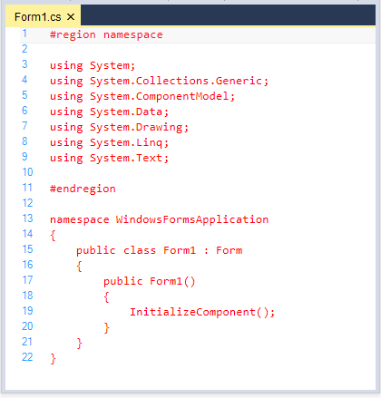
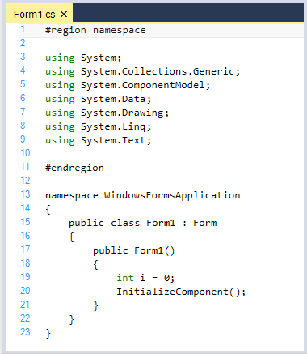
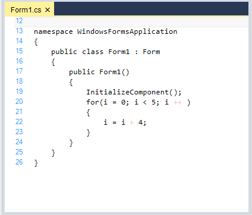
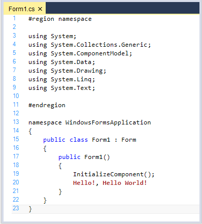
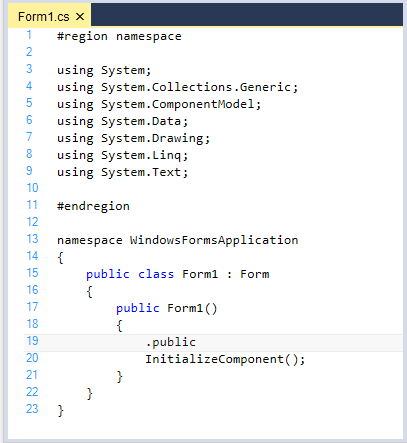
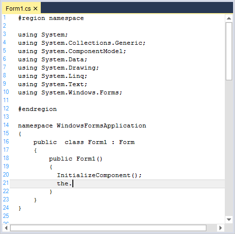
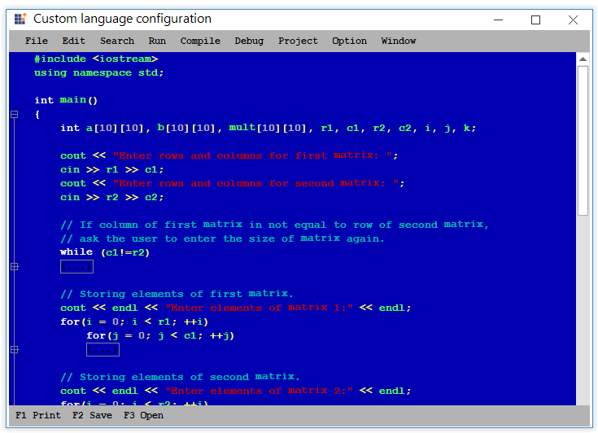
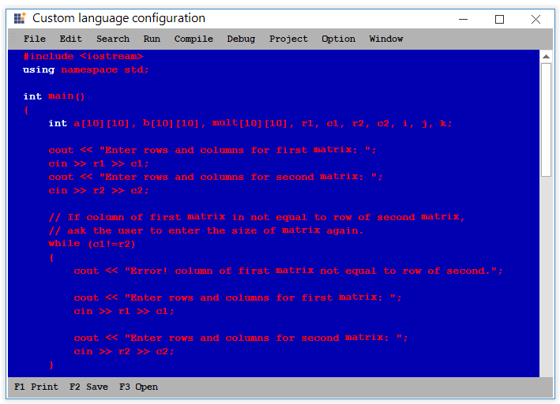
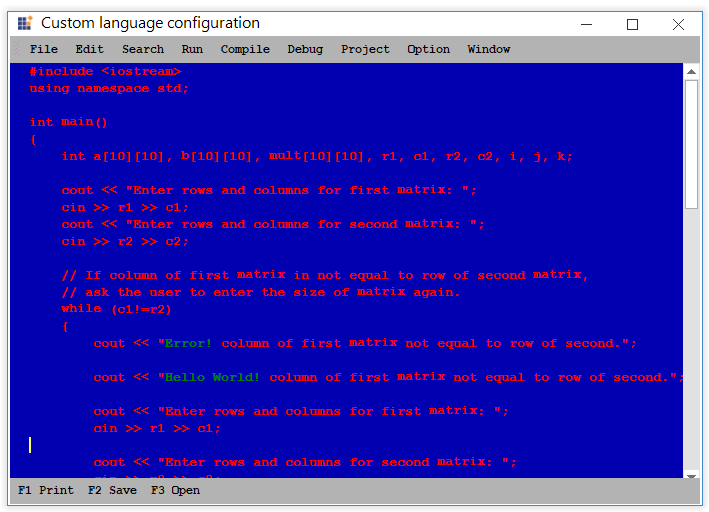

# Syntax Highlighting 

Provides syntax highlighting for programming, scripting, and markup languages. Syntax highlighting greatly improves the readability of any text and has found its way into many commercial applications. It provides pre-defined configuration files for languages like SQL, Delphi or Pascal, HTML, VB.NET, XML, Java, VBScript, JScript and C#.

## Configure built in language

EditControl provides built-in support for a procedural, markup, SQL languages and also facilitates the users to provide custom language configurations. These configuration settings are made available in the `EditControl.Configurator.KnownLanguages` collection. By using the `ApplyConfiguration` method, we can set the EditControl to use any of the pre-defined configuration settings.  The EditControl has a built-in syntax highlighting support for the following languages.

  * CSharp
  * Delphi
  * XML
  * HTML
  * VB.NET
  * SQL
  * Java
  * VBScript
  * JScript
  * PowerShell

**CSharp** 





// Considering configuration settings for C# as an example. Using the KnownLanguages enumerator.

this.editControl1.ApplyConfiguration(Syncfusion.Windows.Forms.Edit.Enums.KnownLanguages.CSharp);





' Considering configuration settings for C# as an example. Using the KnownLanguages enumerator.

Me.editControl1.ApplyConfiguration(Syncfusion.Windows.Forms.Edit.Enums.KnownLanguages.CSharp)





`LoadFile` method of EditControl helps to loads the content of any desired file into the EditControl, instead of typing the code in it.





// Loading the files into EditControl by passing the file name as parameter to the LoadFile method.

this.editControl1.LoadFile(Path.GetDirectoryName(Application.ExecutablePath) + @"\..\..\FileName.cs");





` Loading the files into EditControl by passing the file name as parameter to the LoadFile method.

Me.editControl1.LoadFile(Path.GetDirectoryName(Application.ExecutablePath) + @"\..\..\FileName.cs")





**Delphi** 





// Considering configuration settings for Delphi as an example. Using the KnownLanguages enumerator.

this.editControl1.ApplyConfiguration(Syncfusion.Windows.Forms.Edit.Enums.KnownLanguages.Delphi);

// Loading the files into EditControl by passing the file name as parameter to the LoadFile method.

this.editControl1.LoadFile(Path.GetDirectoryName(Application.ExecutablePath) + @"\..\..\DelphiSource.pas");





' Considering configuration settings for Delphi as an example. Using the KnownLanguages enumerator.

Me.editControl1.ApplyConfiguration(Syncfusion.Windows.Forms.Edit.Enums.KnownLanguages.Delphi)

` Loading the files into EditControl by passing the file name as parameter to the LoadFile method.

Me.editControl1.LoadFile(Path.GetDirectoryName(Application.ExecutablePath) + @"\..\..\DelphiSource.pas")





**XML** 





// Considering configuration settings for XML as an example. Using the KnownLanguages enumerator.

this.editControl1.ApplyConfiguration(Syncfusion.Windows.Forms.Edit.Enums.KnownLanguages.XML);

// Loading the files into EditControl by passing the file name as parameter to the LoadFile method.

this.editControl1.LoadFile(Path.GetDirectoryName(Application.ExecutablePath) + @"\..\..\XMLSource.xml");





' Considering configuration settings for XML as an example. Using the KnownLanguages enumerator.

Me.editControl1.ApplyConfiguration(Syncfusion.Windows.Forms.Edit.Enums.KnownLanguages.XML)

` Loading the files into EditControl by passing the file name as parameter to the LoadFile method.

Me.editControl1.LoadFile(Path.GetDirectoryName(Application.ExecutablePath) + @"\..\..\XMLSource.xml")





**HTML** 





// Considering configuration settings for HTML as an example. Using the KnownLanguages enumerator.

this.editControl1.ApplyConfiguration(Syncfusion.Windows.Forms.Edit.Enums.KnownLanguages.HTML);

// Loading the files into EditControl by passing the file name as parameter to the LoadFile method.

this.editControl1.LoadFile(Path.GetDirectoryName(Application.ExecutablePath) + @"\..\..\HTMLSource.html");





' Considering configuration settings for HTML as an example. Using the KnownLanguages enumerator.

Me.editControl1.ApplyConfiguration(Syncfusion.Windows.Forms.Edit.Enums.KnownLanguages.HTML)

` Loading the files into EditControl by passing the file name as parameter to the LoadFile method.

Me.editControl1.LoadFile(Path.GetDirectoryName(Application.ExecutablePath) + @"\..\..\HTMLSource.html")





**VB.NET** 





// Considering configuration settings for VB.NET as an example. Using the KnownLanguages enumerator.

this.editControl1.ApplyConfiguration(Syncfusion.Windows.Forms.Edit.Enums.KnownLanguages.VBNET);

// Loading the files into EditControl by passing the file name as parameter to the LoadFile method.

this.editControl1.LoadFile(Path.GetDirectoryName(Application.ExecutablePath) + @"\..\..\VBSource.vb");





' Considering configuration settings for VB.NET as an example. Using the KnownLanguages enumerator.

Me.editControl1.ApplyConfiguration(Syncfusion.Windows.Forms.Edit.Enums.KnownLanguages.VBNET)

` Loading the files into EditControl by passing the file name as parameter to the LoadFile method.

Me.editControl1.LoadFile(Path.GetDirectoryName(Application.ExecutablePath) + @"\..\..\VBSource.vb")





**SQL** 





// Considering configuration settings for SQL as an example. Using the KnownLanguages enumerator.

this.editControl1.ApplyConfiguration(Syncfusion.Windows.Forms.Edit.Enums.KnownLanguages.SQL);

// Loading the files into EditControl by passing the file name as parameter to the LoadFile method.

this.editControl1.LoadFile(Path.GetDirectoryName(Application.ExecutablePath) + @"\..\..\SQLSource.sql");





' Considering configuration settings for SQL as an example. Using the KnownLanguages enumerator.

Me.editControl1.ApplyConfiguration(Syncfusion.Windows.Forms.Edit.Enums.KnownLanguages.SQL)

` Loading the files into EditControl by passing the file name as parameter to the LoadFile method.

Me.editControl1.LoadFile(Path.GetDirectoryName(Application.ExecutablePath) + @"\..\..\SQLSource.sql")





**Java** 





// Considering configuration settings for Java as an example. Using the KnownLanguages enumerator.

this.editControl1.ApplyConfiguration(Syncfusion.Windows.Forms.Edit.Enums.KnownLanguages.Java);

// Loading the files into EditControl by passing the file name as parameter to the LoadFile method.

this.editControl1.LoadFile(Path.GetDirectoryName(Application.ExecutablePath) + @"\..\..\JavaSource.Java");





' Considering configuration settings for Java as an example. Using the KnownLanguages enumerator.

Me.editControl1.ApplyConfiguration(Syncfusion.Windows.Forms.Edit.Enums.KnownLanguages.Java)

` Loading the files into EditControl by passing the file name as parameter to the LoadFile method.

Me.editControl1.LoadFile(Path.GetDirectoryName(Application.ExecutablePath) + @"\..\..\JavaSource.Java")





**VBScript** 





// Considering configuration settings for VBScript as an example. Using the KnownLanguages enumerator.

this.editControl1.ApplyConfiguration(Syncfusion.Windows.Forms.Edit.Enums.KnownLanguages.VBScript);

// Loading the files into EditControl by passing the file name as parameter to the LoadFile method.

this.editControl1.LoadFile(Path.GetDirectoryName(Application.ExecutablePath) + @"\..\..\VBScriptSource.vb");





' Considering configuration settings for VBScript as an example. Using the KnownLanguages enumerator.

Me.editControl1.ApplyConfiguration(Syncfusion.Windows.Forms.Edit.Enums.KnownLanguages.VBScript)

` Loading the files into EditControl by passing the file name as parameter to the LoadFile method.

Me.editControl1.LoadFile(Path.GetDirectoryName(Application.ExecutablePath) + @"\..\..\VBScriptSource.vb")





**JScript** 





// Considering configuration settings for JScript as an example. Using the KnownLanguages enumerator.

this.editControl1.ApplyConfiguration(Syncfusion.Windows.Forms.Edit.Enums.KnownLanguages.JScript);

// Loading the files into EditControl by passing the file name as parameter to the LoadFile method.

this.editControl1.LoadFile(Path.GetDirectoryName(Application.ExecutablePath) + @"\..\..\JScriptSource.js");





' Considering configuration settings for JScript as an example. Using the KnownLanguages enumerator.

Me.editControl1.ApplyConfiguration(Syncfusion.Windows.Forms.Edit.Enums.KnownLanguages.JScript)

` Loading the files into EditControl by passing the file name as parameter to the LoadFile method.

Me.editControl1.LoadFile(Path.GetDirectoryName(Application.ExecutablePath) + @"\..\..\JScriptSource.js")





**JScript** 





// Considering configuration settings for PowerShell as an example. Using the KnownLanguages enumerator.

this.editControl1.ApplyConfiguration(Syncfusion.Windows.Forms.Edit.Enums.KnownLanguages.PowerShell);

// Loading the files into EditControl by passing the file name as parameter to the LoadFile method.

this.editControl1.LoadFile(Path.GetDirectoryName(Application.ExecutablePath) + @"\..\..\PowerShell.ps1");





' Considering configuration settings for PowerShell as an example. Using the KnownLanguages enumerator.

Me.editControl1.ApplyConfiguration(Syncfusion.Windows.Forms.Edit.Enums.KnownLanguages.PowerShell)

` Loading the files into EditControl by passing the file name as parameter to the LoadFile method.

Me.editControl1.LoadFile(Path.GetDirectoryName(Application.ExecutablePath) + @"\..\..\PowerShell.ps1")





A sample which demonstrates the above features is available in the below sample installation path.

Installation Location\Syncfusion\Essential Studio\Version Number\\Windows\Edit.Windows\Samples\Syntax Highlighting\Syntax Coloring

## Customize built in language settings

EditControl provides support to customize the built in language configuration settings. The following code example demonstrates C# language customization:

### Initialize the configuration language.

Syntax Highlighting is accomplished in Essential Edit through the use of XML-based configuration files. The language-specific configuration is stored in XML files. Name of the language must be set using the name attribute of the `ConfigLanguage` tag attribute. When the language is case insensitive, you should set the `CaseInsensitive` attribute to true.

The following code example demonstrates the same.



<ConfigLanguage name="C#">

    <formats>
    </formats>
    
    <extensions>
    </extensions>
    
    <lexems>
    </lexems>
    
    <splits>
    </splits>
  
</ConfigLanguage>



### Font Color

Font color of any format in the specified language can be customized using `FontColor` property of Format tag. The following code snippet explains how to customize the font color of the Text format for the defined language. 



  <ConfigLanguage name="C#">
    <formats>
      <format name="Text" Font="Consolas, 10pt" FontColor="Red" />
    </formats>
  </ConfigLanguage>



### Format 

It contains a list of definitions of the formats that can be used later in lexem configuration. Every format is specified by a format tag. Every format contains the attributes such as name, font,foreground color, font color, back color, style, weight, underline and line color.



  <formats>
      <format name="Comment" Font="Consolas, 20pt, style=Bold" FontColor="DeepPink" />
  </formats>



### lexem

Lexem contains rules for parsing the text. Lexem contains various attributes such as BeginBlock, EndBlock, Type, FormatName etc., Type and FormatName attributes of lexems helps to specify the format of the lexem. `Type` is used for standard predefined types of the lexems. `FormatName` is used only when the type is Custom.



   <lexem BeginBlock="public" Type="KeyWord" />
   <lexem BeginBlock="class" Type="KeyWord" />
   <lexem BeginBlock="+" Type="Operator" />
   <lexem BeginBlock="-" Type="Operator" />



#### SubLexems

Sublexems that must be skipped if they are found after BeginBlock string before EndBlock string. 



  <SubLexems>
     <lexem BeginBlock="\" EndBlock="&quot;" Type="String" />
  </SubLexems>



#### Collapsible region

Collapsible region can be customized by adding the desired lexem with attributes such as IsCollapsable and CollapseName, as given below. 



<lexems>

     <lexem BeginBlock="{" EndBlock="}" Type="KeyWord" IsComplex="true" IsCollapsable="true" Indent="true" DropContextPrompt="true" CollapseName="{...}">
        <SubLexems>
          <lexem BeginBlock="\n" IsBeginRegex="true" />
        </SubLexems>
      </lexem>

</lexems>



The above code example works only when `ShowOutliningCollapsers` property of EditControl is true.

### Keyword 

Custom keywords can be added or existing keywords can be customized in built-in languages. Here the below code gives the example for creating a format named keyword and assigning a lexem as keyword.


  <formats>
      <format name="KeyWord" Font="Consolas, 10pt" FontColor="Green" />
  </formats>
  <lexems>
    <lexem BeginBlock="int" Type="KeyWord" />
    <lexem BeginBlock="using" Type="KeyWord" />
  </lexems>
 


### Operator

Custom operators can be added or existing operators can be customized in built-in languages. The following code examples explains the same:



 <formats>
      <format name="Operator" Font="Consolas, 10pt" FontColor="Brown" />
  </formats>
 <lexems>
   <lexem BeginBlock="++" Type="Operator" />
   <lexem BeginBlock="+" Type="Operator" />
 </lexem>



 
### Regex

A regular expression is a pattern that could be matched against any input text. For example, if you like to customize the particular string that ends with !, this can be achieved by using the regex property of `IsBeginRegex` and `IsEndRegex` as true based on the expression given in the lexem.



  <formats>
     <format name="String" Font="Courier New, 13pt, style=Bold" FontColor="Brown" />
  </formats>   

  <lexems>
     <lexem BeginBlock="[A-z\s]+\!" IsBeginRegex="true"  Type="String"/> 
  </lexems>     
 
  // we have to mention the same Regex expression in the Split tag.  
  <splits>
      <split IsRegex="true">[A-z\s]+\!</split>	 
  </splits> 



#### Error words highlighting

Error lexems can be added to the language by declaring a format names Error and it can be highlighted using underlines. Below code is an example of declaring "#endregion" as error if #region is not BeginBlock, priority values assigned to order the interrupt.



<formats>
  <format name="Error" Font="Courier New, 10pt" FontColor="Black" underline="Wave" LineColor="Red" />
</formats>

<lexems>
<lexem BeginBlock="#endregion" Type="Error" Priority="-10" />
<lexem BeginBlock="#endif" Type="Error" Priority="-10" />
<lexem BeginBlock="#else" Type="Error" Priority="-10" />
</lexems>



### Splits

Splits contain a list of expressions that must be treated as one word. “=” and “+” are splitters, by default. So, each of them are returned by the tokenizer as a single char. For example, when you want to specify a configuration for “+=”, you should specify “+=” in the splits section.

You can combine multiple keywords as a single keyword. To configure the splits, specify the required word in the split section.

For example: `Class` and `public` are keywords in the EditControl. By using the Splits concept in the EditControl, you can ignore this keyword when it is preceded with a Dot. When .public is loaded in the EditControl, public is not highlighted as keyword. 



<splits>
  <split>.public</split>
  <split>.class</split>
</splits>



### Auto replace triggers

Auto Replace Trigger which helps in autocorrect the incorrect spelling of lexems, this can be customized using a `AutoReplaceTriggers` attribute, below code is an example for autocorrect int and the, if they misspelled as itn and teh respectively.



<ConfigLanguage name="C#" TriggersActivators=".">

 <AutoReplaceTriggers>

			<AutoReplaceTrigger From="teh" To="the" />
			<AutoReplaceTrigger From="itn" To="int" />

 </AutoReplaceTriggers>

 </ConfigLanguage>



N> To enable this feature, we must set the `TriggersActivators` property of ConfigLanguage tag attribute.

### File extension

Extensions contain a list of extensions that are associated with that particular language. The following code example demonstrates the CSharp language extension.


<extensions>
	<extension>csi</extension>
</extensions>


### How to Configure the created configuration file in EditControl

The following code examples help you to configure the configuration file in the EditControl.





private string configFile = Path.GetDirectoryName(Application.ExecutablePath) + @"\..\..\config.xml";

// Plug-in an external configuration file.

this.editControl1.Configurator.Open(configFile);

// Apply the configuration defined in the configuration file.

this.editControl1.ApplyConfiguration("C#");





private string configFile = Path.GetDirectoryName(Application.ExecutablePath) + @"\..\..\config.xml";

' Plug-in an external configuration file.

Me.editControl1.Configurator.Open(configFile)

' Apply the configuration defined in the configuration file.

Me.editControl1.ApplyConfiguration("C#")





A sample which demonstrates the above features is available in the below sample installation path.

Installation Location\Syncfusion\Essential Studio\Version Number\\Windows\Edit.Windows\Samples\Product Showcase\VisualStudioDemo

## Custom language using XML

EditControl provides supports for custom language configuration. You can plug-in an external configuration file that defines a custom language to the EditControl by using the `Configurator.Open` and `ApplyConfiguration` methods of EditControl.

### Initialize the configuration language.

Syntax Highlighting is accomplished in Essential Edit through the use of XML-based configuration files. The language-specific configuration is stored in XML files. Name of the language must be set using the name attribute of the `ConfigLanguage` tag attribute. When the language is case insensitive, you should set the `CaseInsensitive` attribute to true.

The following code example demonstrates the same.



<ConfigLanguage name="C++">

    <formats>
    </formats>
    
    <extensions>
    </extensions>
    
    <lexems>
    </lexems>
    
    <splits>
    </splits>
  
</ConfigLanguage>



### Font Color

Font color of any format in the specified language can be customized using `FontColor` property of Format tag. The following code snippet explains how to customize the font color of the Text format for the defined language. 



<formats>
  <format name="Text" Font="Courier New, 10pt style=Bold"   FontColor="Red" />
</formats>



### Format 

It contains a list of definitions of the formats that can be used later in lexem configuration. Every format is specified by a tag <format>. Every format contains the attributes such as name, font, fore color, font color, back color, style, weight, underline and line color.



<formats>
  <format name="Text" Font="Courier New, 10pt style=Bold"   FontColor="Red" />
  <format name="KeyWord" Font="Courier New, 10pt style=Bold" FontColor="#ffffff" />
  <format name="Operator" Font="Courier New, 10pt style=Bold" FontColor="Yellow" />
</formats>



### Lexem

Lexem contains rules for parsing the text. Lexem contains various attributes such as BeginBlock, EndBlock, Type, FormatName etc., Type and FormatName attributes of lexems helps to specify the format of the lexem. `Type` is used for standard predefined types of the lexems. `FormatName` is used only when the type is Custom.



<lexems>
  <!--Adds the Keywords in the lexem-->.
  <lexem BeginBlock="int" Type="KeyWord" />
  <lexem BeginBlock="while" Type="KeyWord" />
  <!--Adds the operator in the Lexem-->.
   <lexem BeginBlock="&lt;" Type="Operator" />
   <lexem BeginBlock="&gt;" Type="Operator" />
</lexems>



#### SubLexems

Sublexems that must be skipped if they are found after BeginBlock string before EndBlock string. 



  <SubLexems>
     <lexem BeginBlock="\" EndBlock="&quot;" Type="String" />
  </SubLexems>



#### Collapsible region

Collapsible region can be customized by adding the desired lexem with attributes such as IsCollapsable and CollapseName, as given below.



<lexems>

     <lexem BeginBlock="{" EndBlock="}" Type="KeyWord" IsComplex="true" IsCollapsable="true" Indent="true" DropContextPrompt="true" CollapseName="{...}">
        <SubLexems>
          <lexem BeginBlock="\n" IsBeginRegex="true" />
        </SubLexems>
      </lexem>

</lexems>



The above code example works only when `ShowOutliningCollapsers` property of EditControl is true.

### Keyword 

Custom keywords can be added or existing keywords can be customized in built-in languages. Here the below code gives the example for creating a format named keyword and assigning a lexem as keyword.


  <formats>
      <format name="KeyWord" Font="Consolas, 10pt" FontColor="White" />
  </formats>
  <lexems>
    <lexem BeginBlock="int" Type="KeyWord" />
    <lexem BeginBlock="using" Type="KeyWord" />
  </lexems>
 


### Operator

Custom operators can be added or existing operators can be customized in built-in languages. The following code examples explains the same:



 <formats>
      <format name="Operator" Font="Consolas, 10pt" FontColor="Brown" />
  </formats>
 <lexems>
   <lexem BeginBlock="&lt;" Type="Operator" />
   <lexem BeginBlock="&gt;" Type="Operator" />
 </lexem>



 
### Regex

A regular expression is a pattern that could be matched against any input text. For example, if you like to customize the particular string that ends with !, this can be achieved by using the regex property of `IsBeginRegex` and `IsEndRegex` as true based on the expression given in the lexem.



  <formats>
     <format name="String" Font="Courier New, 13pt, style=Bold" FontColor="Brown" />
  </formats>   

  <lexems>
     <lexem BeginBlock="[A-z\s]+\!" IsBeginRegex="true"  Type="String"/> 
  </lexems>     
 
  // we have to mention the same Regex expression in the Split tag.  
  <splits>
      <split IsRegex="true">[A-z\s]+\!</split>	 
  </splits> 



#### Error words highlighting

Error lexems can be added to the language by declaring a format names Error and it can be highlighted using underlines. Below code is an example of declaring "#endregion" as error if #region is not BeginBlock, priority values assigned to order the interrupt.



<formats>
  <format name="Error" Font="Courier New, 10pt" FontColor="Black" underline="Wave" LineColor="Red" />
</formats>

<lexems>
<lexem BeginBlock="#endregion" Type="Error" Priority="-10" />
<lexem BeginBlock="#endif" Type="Error" Priority="-10" />
<lexem BeginBlock="#else" Type="Error" Priority="-10" />
</lexems>



### Splits

Splits contain a list of expressions that must be treated as one word. “=” and “+” are splitters, by default. So, each of them are returned by the tokenizer as a single char. For example, when you want to specify a configuration for “+=”, you should specify “+=” in the splits section.

You can combine multiple keywords as a single keyword. To configure the splits, specify the required word in the split section.

For example: `int` and `using` are keywords in the EditControl. By using the Splits concept in the EditControl, you can ignore this keyword when it is preceded with a Dot. When .public is loaded in the EditControl, public is not highlighted as keyword. 



<splits>
  <split>.int</split>
  <split>.using</split>
</splits>



### Auto replace triggers

Auto Replace Trigger which helps in autocorrect the incorrect spelling of lexems, this can be customized using a `AutoReplaceTriggers` attribute, below code is an example for autocorrect int and the, if they misspelled as itn and teh respectively.



<ConfigLanguage name="C#" TriggersActivators=".">

 <AutoReplaceTriggers>
			<AutoReplaceTrigger From="teh" To="the" />
			<AutoReplaceTrigger From="itn" To="int" />
 </AutoReplaceTriggers>

 </ConfigLanguage>



N> To enable this feature, we must set the `TriggersActivators` property of ConfigLanguage tag attribute.

## Multiple language configuration

Editcontrol supports multiple language configuration, which helps to configurate one or more language in single language configuration. Below code is an example for configurate HTML with embedded JScript.


 <ConfigLanguage name="HTML (Light)" CaseInsensitive="true" Known="HTML" StartComment="&lt;!--" EndComment="--&gt;">
  <formats>
   <format name="Text" Font="Courier New, 10pt" FontColor="Black" />
   <format name="TagName" Font="Courier New, 10pt" FontColor="DarkRed" />
   <format name="AttributeName" Font="Courier New, 10pt" FontColor="Red" />
  </formats>
	<!--JavaScript-->
  <lexem BeginBlock="if" Type="KeyWord" />
  <lexem BeginBlock="var" Type="KeyWord" />
  <lexem BeginBlock="escape" Type="KeyWord" />
  <lexem BeginBlock="script" EndBlock="(&gt;)|(/&gt;)" IsEndRegex="true" IsPseudoEnd="true" IsComplex="true" Type="Custom" FormatName="TagName">
</ConfigLanguage>


### File extension

 Extensions contain a list of extensions that are associated with that particular language. The following code example demonstrates the CSharp language extension.



 <extensions>
    <extension>cpp</extension>
  </extensions>



### How to Configure the created configuration file in EditControl





private string configFile = Path.GetDirectoryName(Application.ExecutablePath) + @"\..\..\config.xml";

// Plug-in an external configuration file.

this.editControl1.Configurator.Open(configFile);

// Apply the configuration defined in the configuration file.

this.editControl1.ApplyConfiguration("C++");





private string configFile = Path.GetDirectoryName(Application.ExecutablePath) + @"\..\..\config.xml";

' Plug-in an external configuration file.

Me.editControl1.Configurator.Open(configFile)

' Apply the configuration defined in the configuration file.

Me.editControl1.ApplyConfiguration("C++")





A sample which demonstrates the above features is available in the below sample installation path.

Installation Location\Syncfusion\Essential Studio\Version Number\\Windows\Edit.Windows\Samples\Syntax Highlighting\Custom Config

## Configure custom language using code

EditControl also offers extensive support to create configuration settings programmatically. This provides greater flexibility so that users can dynamically modify configuration settings of the currently loaded configuration as per their requirements. The following procedure will walk you through the entire process of creating configuration settings programmatically.

### How to add new configuration language to EditControl

A new configuration language can be added to the EditControl by using the `CreateLanguageConfiguration` method. Once the new configuration language is created, apply it to the contents of the EditControl by using the ApplyConfiguration method.





// Create a new configuration language and apply the same to the contents of the EditControl.

IConfigLanguage currentConfigLanguage = this.editControl1.Configurator.CreateLanguageConfiguration("New");

this.editControl1.ApplyConfiguration(currentConfigLanguage);





' Create a new configuration language and apply the same to the contents of the EditControl.

Dim currentConfigLanguage As IConfigLanguage = Me.editControl1.Configurator.CreateLanguageConfiguration("New")

Me.editControl1.ApplyConfiguration(currentConfigLanguage)





### Format configuration

Create a custom format object by using the `Language.Add` method of the Edit Control and define its attributes.





// Creating a custom format object.

ISnippetFormat formatMethod = this.editControl1.Language.Add("CodeBehind");

// Defining its attributes.

formatMethod.Font = new Font("Garamond", 12);

formatMethod.BackColor = Color.Yellow;





' Creating a custom format object.

Dim formatMethod As ISnippetFormat = Me.EditControl1.Language.Add("CodeBehind")

' Defining its attributes.

formatMethod.Font = New Font("Garamond", 12)

formatMethod.BackColor = Color.Yellow





### Font configuration

Font color of newly created format in the specified language can be customized using `FontColor` property of Format tag. The following code snippet explains how to customize the font color of the Text format for the defined language. 





 formatMethod.Font = new Font("Garamond", 14);

 formatMethod.FontColor = Color.Red;





formatMethod.Font = new Font("Garamond", 14)

 formatMethod.FontColor = Color.Red





### Color configuration

Color configuration for custom formats can be defined using built-in color properties such as FontColor, BackColor, ForeColor, LineColor and BorderColor.





 formatMethod.FontColor = Color.IndianRed;

formatMethod.BackColor = Color.Yellow;

formatMethod.LineColor = Color.Yellow;

formatMethod.BorderColor = Color.Red;





formatMethod.FontColor = Color.IndianRed

formatMethod.BackColor = Color.Yellow

formatMethod.LineColor = Color.Yellow

formatMethod.BorderColor = Color.Red





### Lexem configuration

Lexems for the custom language can be added by creating a lexem object using ConfigLexem class and its attributes can be declared using built-in properties such as IsBeginRegex, IsEndRegex, FormatName etc.

Below code is an example for creating a lexem and adding it to language of editcontrol.





ConfigLexem configLex = new ConfigLexem("<%", "%>", FormatType.Custom, false);

 // Defining lexem attributes.

 configLex.IsBeginRegex = false;

 configLex.IsEndRegex = false;

 configLex.ContinueBlock = ".+";

 configLex.IsContinueRegex = true;

 configLex.FormatName = "CodeBehind";

 this.editControl1.Language.Lexems.Add(configLex);





Dim configLex As ConfigLexem  = new ConfigLexem("<%", "%>", FormatType.Custom, false)

 // Defining lexem attributes.

 configLex.IsBeginRegex = false

 configLex.IsEndRegex = false

 configLex.ContinueBlock = ".+"

 configLex.IsContinueRegex = true

 configLex.FormatName = "CodeBehind"

 Me.editControl1.Language.Lexems.Add(configLex)





### Keywords configuration

Creating keywords for custom language can be achieved by adding a format named `keyword` and declare a lexem in format as keyword using `FormatName` property. Keyword format can be configurated by the built-in customization properties such as Font, FontColor etc. Below code is an example for define lexem "Class" as a keyword.





ISnippetFormat keyword = this.editControl1.Language.Add("keyword");

keyword.FontColor = Color.Blue;

keyword.Font = new Font("Garamond", 12);

ConfigLexem Class = new ConfigLexem("Class", "",FormatType.Custom,false);

Class.FormatName = "keyword";

this.editControl1.Language.Lexems.Add(Class);





Dim keyword As ISnippetFormat = Me.editControl1.Language.Add("keyword")

keyword.FontColor = Color.Blue

keyword.Font = new Font("Garamond", 12)

Dim Class As ConfigLexem  = new ConfigLexem("Class", "",FormatType.Custom,false)

Class.FormatName = "keyword"

Me.editControl1.Language.Lexems.Add(Class)





### Operators configuration

Creating operators for custom language is similar to that of keyword. Below code is an example for creating a new format object named Operators is created using ISnippetFormat Interface, as lexems "+" and "=" created with ConfigLexem class with formatName as Operators.





ISnippetFormat Operators = this.editControl1.Language.Add("Operators");

 Operators.FontColor = Color.Red;

 ConfigLexem equalTo = new ConfigLexem("=","",FormatType.Custom,false);

 equalTo.FormatName = "Operators";

 this.editControl1.Language.Lexems.Add(equalTo);

 ConfigLexem Add = new ConfigLexem("+", "", FormatType.Custom, false);

 Add.FormatName = "Operators";

 this.editControl1.Language.Lexems.Add(Add);





Dim Operators As ISnippetFormat  = this.editControl1.Language.Add("Operators");

Operators.FontColor = Color.Red

Dim equalTo As ConfigLexem  = new ConfigLexem("=","",FormatType.Custom,false)

equalTo.FormatName = "Operators"

Me.editControl1.Language.Lexems.Add(equalTo)

Dim Add As ConfigLexem  = new ConfigLexem("+", "", FormatType.Custom, false)

Add.FormatName = "Operators"

Me.editControl1.Language.Lexems.Add(Add)







 


### Error words highlighting

Error lexems can be added to the language by declaring a format names Error and it can be highlighted using underlines. Below code is an simple example for declaring a misspelled lexem as error and highlight them.





ISnippetFormat Error = this.editControl1.Language.Add("Error");

 Error.FontColor = Color.Black;

 Error.UnderlineStyle = UnderlineStyle.Wave;

 Error.UnderlineWeight = UnderlineWeight.Thin;

 Error.LineColor = Color.Red;

 ConfigLexem err = new ConfigLexem("pubblic", "", FormatType.Custom, false);

 misspell.FormatName = "Error";

 this.editControl1.Language.Lexems.Add(misspell);





Dim Error As ISnippetFormat = Me.editControl1.Language.Add("Error")

 Error.FontColor = Color.Black

 Error.UnderlineStyle = UnderlineStyle.Wave

 Error.UnderlineWeight = UnderlineWeight.Thin

 Error.LineColor = Color.Red

 Dim err As ConfigLexem = new ConfigLexem("pubblic", "", FormatType.Custom, false)

 misspell.FormatName = "Error"

 Me.editControl1.Language.Lexems.Add(misspell)





### Splits configuration

Splits contain a list of expressions that must be treated as one word. “=” and “+” are splitters, by default. So, each of them are returned by the tokenizer as a single char. For example, when you want to specify a configuration for “+=”, you should specify “+=” in the splits section.

You can combine multiple keywords as a single keyword. To configure the splits, specify the required word in the split section.

For example: `Class` is Keyword in the EditControl. By using the Splits concept in the EditControl, you can ignore this Keyword when it is preceded with a Dot. When .Class is loaded in the EditControl, Class is not highlighted as keyword. 





// Adding the necessary split definitions to the current language's Splits collection.

Split split = new Split();

split.Text = "Class";

this.editControl1.Language.Splits.Add(split);





' Adding the necessary split definitions to the current language's Splits collection.

Dim split As  Split  = new Split();

split.Text = "Class";

Me.editControl1.Language.Splits.Add(split)





### Auto replace triggers

Auto Replace Trigger can be added to custom language, create a AutoReplaceTrigger object using AutoReplaceTrigger class, where those "from" and "to" can be passed while initializing. Below code is an example for replace "the" if it is misspelled as "teh" in AutoReplaceTrigger.  





 AutoReplaceTrigger trigger1 = new AutoReplaceTrigger("teh","the");

 this.editControl1.Language.AutoReplaceTriggers.Add(trigger1);





 Dim trigger1 As AutoReplaceTrigger = new AutoReplaceTrigger("teh","the");

 Me.editControl1.Language.AutoReplaceTriggers.Add(trigger1)





## File extension

File extension associated with the custom language can be added with the help of Extensions.Add method in the language as given below.





// Adding the necessary extension definitions to the current language's Extensions collection.

this.editControl1.Language.Extensions.Add("aspx");





' Adding the necessary extension definitions to the current language's Extensions collection.

Me.editControl1.Language.Extensions.Add("aspx")





### Invoking newly added configuration language

Invoke the ResetCaches method to apply these newly added configuration settings.





// Reset the current configuration language cache to reflect these changes.

this.editControl1.Language.ResetCaches();





' Reset the current configuration language cache to reflect these changes.

Me.editControl1.Language.ResetCaches()





## Configure syntax highlighting through dialog box

Syntax Highlighting and Code Coloring can also be implemented at run time by using the `Language Coloring Configuration Editor` and can be customized by using class named `ConfigurationDialog` and Interface named `IConfig`.

The Language Coloring Configuration Editor can be invoked programmatically as follows.





IConfigLanguage activeLang = this.editControl1.Parser.Formats as IConfigLanguage;

// Create an instance of ConfigurationDialog.

ConfigurationDialog editConfig = new ConfigurationDialog(this.editControl1.Configurator, activeLang);

if(editConfig.ShowDialog(this) == DialogResult.OK && activeLang != null)

{

    IConfigLanguage newLang = editConfig.Configurator.KnownLanguageNames.Contains(activeLang.Language) ? editConfig.Configurator[activeLang.Language] : editConfig.Configurator.DefaultLanguage;

    if(newLang != null)

    {

        // Set language configuration instance object.         

        this.editControl1.Configurator = editConfig.Configurator;

        // Applies coloring of the specified language to the text.

        this.editControl1.ApplyConfiguration(newLang);

    }

}





Dim activeLang As IConfigLanguage = Me.EditControl1.Parser.Formats

' Create an instance of ConfigurationDialog.

Dim editConfig As New frmConfigDialog(Me.editControl1.Configurator, activeLang)

If editConfig.ShowDialog(Me) = DialogResult.OK AndAlso Not (activeLang Is Nothing) Then

    Dim newLang As IConfigLanguage = If(editConfig.Configurator.KnownLanguageNames.Contains(activeLang.Language), editConfig.Configurator(activeLang.Language), editConfig.Configurator.DefaultLanguage) 

     If Not (newLang Is Nothing) Then

        ' Set language configuration instance object.

         Me.editControl1.Configurator = editConfig.Configurator

        ' Applies coloring of the specified language to the text.

         Me.editControl1.ApplyConfiguration(newLang)

     End If
     
End If





