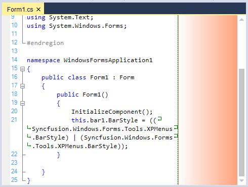
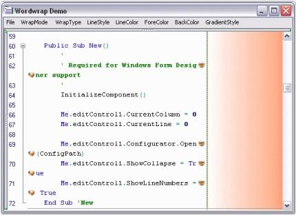
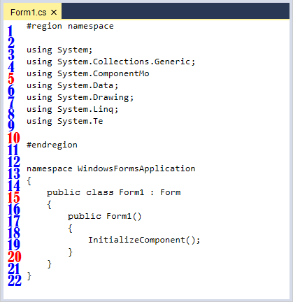
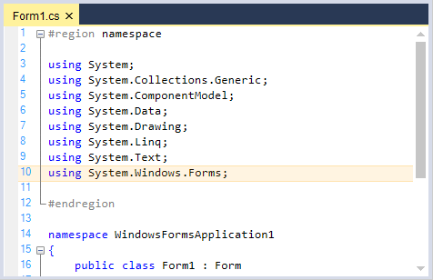
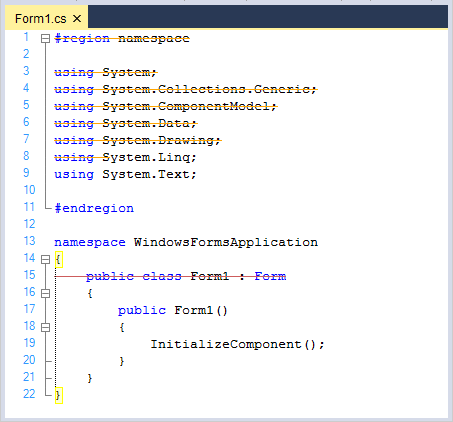
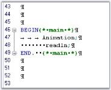
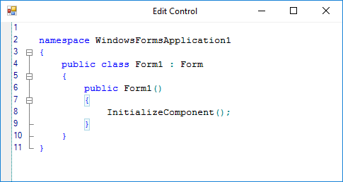

# Text Visualization

The various text visualization features of EditControl is elaborated under the following topics:

## Outlining

Sections of code which form the outlining blocks can be specified using the Configuration Settings. EditControl defines different brackets for highlighting different languages.

### Configure outline

The outlining blocks can be specified for code as well as for plain text. By Setting the `ShowOutliningCollapsers` property to `true`, we can enable or disable automatic outlining in EditControl. 





// Enabling Automatic Outlining.

this.editControl1.ShowOutliningCollapsers = true;





' Enabling Automatic Outlining.

Me.editControl1.ShowOutliningCollapsers = True





### Toggle outline visibility

We can toggle the outline visibility in EditControl by using the following methods.

<table>
<tr>
<th>
Methods</th><th>
Description</th></tr>
<tr>
<td>
SwitchCollapsingOn</td><td>
Turns on collapse and collapse all option</td></tr>
<tr>
<td>
SwitchCollapsingOff</td><td>
Turns off collapse option</td></tr>
<tr>
<td>
ToggleLineCollapsing</td><td>
Toggles collapse option for current line</td></tr>
</table>





// Turns on collapse and collapse all option.

this.editControl1.SwitchCollapsingOff();

// Turns off collapse option.

this.editControl1.SwitchCollapsingOn();

// Toggles collapse option for current line.

this.editControl1.ToggleLineCollapsing();





' Turns on collapse and collapse all option.

Me.editControl1.SwitchCollapsingOff()

' Turns off collapse option.

Me.editControl1.SwitchCollapsingOn()

' Toggles collapse option for current line.

Me.editControl1.ToggleLineCollapsing()





### Programmatically expand / collapse outline state 

Provides Visual Studio-like support for collapsing and expanding blocks of code can be done programmatically.

<table>
<tr>
<th>
Methods</th><th>
Description</th></tr>
<tr>
<td>
Collapse</td><td>
Collapses all regions in currently selected area or in the current line</td></tr>
<tr>
<td>
Expand</td><td>
Expands all collapsed regions in currently selected area or in the current line</td></tr>
<tr>
<td>
CollapseAll</td><td>
Collapses all regions</td></tr>
<tr>
<td>
ExpandAll</td><td>
Expands all collapsed regions</td></tr>
</table>





// Collapses all regions in currently selected area or in the current line.

this.editControl1.Collapse();

// Expands all collapsed regions in currently selected area or in the current line.

this.editControl1.Expand();

// Collapses all regions.

this.editControl1.CollapseAll();

// Expands all collapsed regions.

this.editControl1.ExpandAll();





' Collapses all regions in currently selected area or in the current line.

Me.editControl1.Collapse()

' Expands all collapsed regions in currently selected area or in the current line.

Me.editControl1.Expand()

' Collapses all regions.

Me.editControl1.CollapseAll()

' Expands all collapsed regions.

Me.editControl1.ExpandAll()





EditControl supports the following events to handle the various Outlining operations.

<table>
<tr>
<th>
Events</th><th>
Description</th></tr>
<tr>
<td>
OutliningBeforeCollapse</td><td>
Occurs before the region is about to collapse</td></tr>
<tr>
<td>
OutliningBeforeExpand</td><td>
Occurs before the region is about to expand</td></tr>
<tr>
<td>
OutliningCollapse</td><td>
Occurs when the region collapses</td></tr>
<tr>
<td>
OutliningExpand</td><td>
Occurs when the region expands</td></tr>
<tr>
<td>
CollapsedAll</td><td>
Occurs when CollapseAll method was called</td></tr>
<tr>
<td>
ExpandedAll</td><td>
Occurs when ExpandedAll method was called</td></tr>
<tr>
<td>
CollapsingAll</td><td>
Occurs when CollapseAll method is called</td></tr>
<tr>
<td>
ExpandingAll</td><td>
Occurs when ExpandAll method is called</td></tr>
</table>

The above events can be canceled, and can be used to optionally cancel the Outlining Collapse and Expand operations respectively. They are discussed in detail in the EditControl Events section.

**Outlining tooltip**

EditControl provides the `ToolTip` support for Outlining. Outlining Tooltip is displayed for each collapsed outlining block and it shows the contents of the collapsed block. The Outlining Tooltip can be optionally shown or hidden by using the `ShowOutliningTooltip` property in the EditControl. Its default value is `true`.





// Show the tooltip for outlining block.

this.editControl1.ShowOutliningTooltip = true;





` Show the tooltip for outlining block.

Me.editControl1.ShowOutliningTooltip = True





EditControl supports the following Outlining Tooltip events.

<table>
<tr>
<th>
Events</th><th>
Description</th></tr>
<tr>
<td>
OutliningTooltipBeforePopup</td><td>
Occurs when outlining tooltip is about to be shown</td></tr>
<tr>
<td>
OutliningTooltipPopup</td><td>
Occurs when outlining tooltip is shown</td></tr>
<tr>
<td>
OutliningTooltipClose</td><td>
Occurs when outlining tooltip is closed</td></tr>
</table>

`OutliningTooltipBeforePopup` event is used to control the visibility of the outlining tooltip. The ShowMode property of the OutliningTooltipBeforePopupEventArgs is used for this purpose. By default, the ShowMode property is set to On.





private void editControl1_OutliningTooltipBeforePopup(object sender, Syncfusion.Windows.Forms.Edit.OutliningTooltipBeforePopupEventArgs e)

{

   // To display the outlining tooltip

   e.ShowMode = OutliningTooltipShowMode.On;

   // To hide the outlining tooltip

   e.ShowMode = OutliningTooltipShowMode.Off;

}





Private Sub editControl1_OutliningTooltipBeforePopup(sender As Object, e As Syncfusion.Windows.Forms.Edit.OutliningTooltipBeforePopupEventArgs) Handles editControl1.OutliningTooltipBeforePopup

   ' To display the outlining tooltip

   e.ShowMode = OutliningTooltipShowMode.On

   ' To hide the outlining tooltip

   e.ShowMode = OutliningTooltipShowMode.Off

End Sub





## Word wrap

Supports text wrapping to next line, when it exceeds the control bounds. WordWrap functionality in EditControl can be enabled or disabled by using `WordWrap` property. Its default value is `false`, to enable the wrapping functionality in EditControl turn on its value to `true`.

### Word wrap by bounds

Provide extensive support for different modes of wrapping. The following are the types of wrapping modes which was available in EditControl:

* Control
* SpecifiedColumn
* WordWrapMargin

The options provided are wraps text at the boundary between text area and word wrap margin of the EditControl. The area beyond the text area in the EditControl is referred to as the `WordWrapMargin`. Hence, the width of the word wrap margin is the difference between EditControls width and the TextArea width. `Column` Mode wraps the text at the edge of the EditControl. SpecifiedColumn mode wraps the text at the specified column that is specified in WordWrapColumn property. The default WordWrapMode is `Control`. The following properties are associated with setting the mode of Word Wrapping.

<table>
<tr>
<th>
Properties</th><th>
Description</th></tr>
<tr>
<td>
WordWrapMode</td><td>
Specifies the state of the word wrapping mode</td></tr>
<tr>
<td>
WordWrapColumnMeasuringFont</td><td>
Specifies the font used while calculating the position of WordWrapColumn</td></tr>
<tr>
<td>
WordWrapColumn</td><td>
Specifies column for wrapping text. Used when WordWrapMode is set to SpecifiedColumn. The default value is 100</td></tr>
<tr>
<td>
TextAreaWidth</td><td>
Specifies the width of the text area of the EditControl. The default value is 600</td></tr>
<tr>
<td>
WrappedLinesOffset</td><td>
Specifies offset of wrapped lines.</td></tr>
</table>





// Sets the WordWrap mode.

this.editControl1.WordWrapMode = Syncfusion.Windows.Forms.Edit.Enums.WordWrapMode.WordWrapMargin;

// Sets font that is used while calculating the position of the WordWrap column.

this.editControl1.WordWrapColumnMeasuringFont = new System.Drawing.Font("Arial", 9.75F, System.Drawing.FontStyle.Regular, System.Drawing.GraphicsUnit.Point, ((byte)(0)));

// Specifies column for wrapping text.

this.editControl1.WordWrapColumn = 125;

// Set the width of the EditControl's text area.

this.editControl1.TextAreaWidth = 300;

// Specifies offset for the wrapped lines.

this.editControl1.WrappedLinesOffset = 10;





' Sets the WordWrap mode.

Me.editControl1.WordWrapMode = Syncfusion.Windows.Forms.Edit.Enums.WordWrapMode.WordWrapMargin

' Sets font that is used while calculating the position of the WordWrap column.

Me.editControl1.WordWrapColumnMeasuringFont = New System.Drawing.Font("Arial", 9.75F, System.Drawing.FontStyle.Regular, System.Drawing.GraphicsUnit.Point, (CType((0), Byte)))

' Specifies column for wrapping text.

Me.editControl1.WordWrapColumn = 125

' Set the width of the EditControl's text area.

Me.editControl1.TextAreaWidth = 300

' Specifies offset for the wrapped lines.

Me.editControl1.WrappedLinesOffset = 10





The following illustration shows the EditControl with the WordWrappingMode and WordWrapType properties set.

### Word wrap by content

By using the `WordWrapType` property we can set different types for wrapping the word in the EditControl. There are two types of Word wrapping in EditControl. 

* Wrapping by character
* Wrapping by word

Its default value is `WrapByWord`. The following table explains the same:

<table>
<tr>
<th>
Properties</th><th>
Description</th></tr>
<tr>
<td>
WordWrap</td><td>
Specifies the state of word wrapping mode</td></tr>
<tr>
<td>
WordWrapType</td><td>
Specifies the type of word wrapping. The options provided are * {{ '_WrapByChar_' | markdownify }} - wraps the text by individual characters* {{ '_WrapByWord_' | markdownify }} - wraps the text by individual words The default value is WrapByWord</td></tr>
</table>





// WordWrap property set.

this.editControl1.WordWrap = true;

// WordWrapType property set.

this.editControl1.WordWrapType = Syncfusion.Windows.Forms.Edit.Enums.WordWrapType.WrapByChar;





' WordWrap property set.

Me.editControl1.WordWrap = True

' WordWrapType property set.

Me.editControl1.WordWrapType = Syncfusion.Windows.Forms.Edit.Enums.WordWrapType.WrapByChar





**WordWrap margin customization**

WordWrap margin can be enabled or disabled using the `WordWrapMarginVisible` property of EditControl. Its default value is `false`. WordWrap margin of the EditControl can be set and customized by using the below given properties.

<table>
<tr>
<th>
Properties</th><th>
Description</th></tr>
<tr>
<td>
WordWrapMarginVisible</td><td>
Specifies a value indicating whether the word wrap margin should be visible</td></tr>
<tr>
<td>
WordWrapMarginLineStyle</td><td>
Specifies style of line that is drawn at the border of the word wrap margin. The options provided are* Solid* Dash* Dot* DashDot* DashDotDot* Custom The default value is {{ '_Solid_' | markdownify }}</td></tr>
<tr>
<td>
WordWrapMarginLineColor</td><td>
Sets custom color for the line that is drawn at the border of the word wrap margin</td></tr>
<tr>
<td>
WordWrapMarginBrush</td><td>
Specifies the BrushInfo object that is used when the area situated after the text area is drawn</td></tr>
</table>





// Specifies whether the word wrap margin should be visible.

this.editControl1.WordWrapMarginVisible = true;

// Specifies the line style of the word wrap margin.

this.editControl1.WordWrapMarginLineStyle = DashStyle.Dash;

// Specifies the line color of the word wrap margin.

this.editControl1.WordWrapMarginLineColor = Color.Green;

// Specifies the BrushInfo object that is used when the area situated after the text area is drawn.

this.editControl1.WordWrapMarginBrush = new Syncfusion.Drawing.BrushInfo(Syncfusion.Drawing.GradientStyle.Horizontal, System.Drawing.Color.White, System.Drawing.Color.LightSalmon);





' Specifies whether the word wrap margin should be visible.

Me.editControl1.WordWrapMarginVisible = True

// Specifies the line style of the word wrap margin.

Me.editControl1.WordWrapMarginLineStyle = System.Drawing.Drawing2D.DashStyle.Dash

// Specifies the line color of the word wrap margin.

Me.editControl1.WordWrapMarginLineColor = System.Drawing.Color.Green

// Specifies the BrushInfo object that is used when the area situated after the text area is drawn.

Me.editControl1.WordWrapMarginBrush = New Syncfusion.Drawing.BrushInfo(Syncfusion.Drawing.GradientStyle.Horizontal, System.Drawing.Color.White, System.Drawing.Color.LightSalmon)





**Line wrapping images**

In EditControl, it is possible to associate images to indicate line wrapping. This feature can be turned on by setting the `MarkLineWrapping` property to True. There are two types of image indicators:

* Images that indicate the line that is being wrapped. These are displayed at the beginning of the line being wrapped. This can be set by using the `CustomWrappedLinesMarkingImage` property.
* Images that indicate the point at which the line is being wrapped. This can be set by using the `CustomLineWrappingMarkingImage` property.

`MarkWrappedLines` property of EditControl is used to indicate whether wrapped lines should be marked.

<table>
<tr>
<th>
Properties</th><th>
Description</th></tr>
<tr>
<td>
MarkLineWrapping</td><td>
Specifies whether line wrapping should be marked</td></tr>
<tr>
<td>
MarkWrappedLines</td><td>
Specifies whether wrapped lines should be marked</td></tr>
<tr>
<td>
CustomWrappedLinesMarkingImage</td><td>
Specifies custom image that marks wrapped lines</td></tr>
<tr>
<td>
CustomLineWrappingMarkingImage</td><td>
Specifies custom image that marks wrapping lines</td></tr>
</table>





// Enable images to indicate line wrapping.

this.editControl1.MarkLineWrapping = true;

// Images that indicate the line that is being wrapped.

this.editControl1.CustomWrappedLinesMarkingImage = ((System.Drawing.Image)(resources.GetObject("$this.Sunset")));

// Images that indicate the point at which the line is being wrapped.

this.editControl1.CustomLineWrappingMarkingImage = ((System.Drawing.Image)(resources.GetObject("$this.Blue_hills")));

// Indicate wrapped lines.

this.editControl1.MarkWrappedLines = true;





' Enable images to indicate line wrapping.

Me.editControl1.MarkLineWrapping = True

' Images that indicate the line that is being wrapped.

Me.editControl1.CustomWrappedLinesMarkingImage = (CType((resources.GetObject("$this.Sunset")), System.Drawing.Image))

' Images that indicate the point at which the line is being wrapped.

Me.editControl1.CustomLineWrappingMarkingImage = (CType((resources.GetObject("$this.Blue_hills")), System.Drawing.Image))

' Indicate wrapped lines.

Me.editControl1.MarkWrappedLines = True





N> Refer to the following sample link that demonstrates the `WordWrap` functionalities in EditControl.
C:\Users\&lt;User&gt;\AppData\Syncfusion\Essential Studio\Version Number\Windows\Edit.Windows\Samples\Text Operations\Word Wrap

## Line number

Displays the line number at the start of a line. Line numbers can be automatically assigned to the contents of the EditControl by enabling the `ShowLineNumbers` property. Its default value is `true`. The number of lines in the EditControl can be obtained by using the `PhysicalLineCount` property.

<table>
<tr>
<th>
Properties</th><th>
Description</th></tr>
<tr>
<td>
ShowLineNumbers</td><td>
Specifies a value indicating whether line numbers should be shown</td></tr>
<tr>
<td>
PhysicalLineCount</td><td>
Specifies the count of lines in the files</td></tr>
</table>





// Assigning Line Numbers to the contents of the EditControl.

this.editControl1.ShowLineNumbers = true;

// Specifies the number of lines in the EditControl.

int actualLineCount = this.editControl1.PhysicalLineCount;





' Assigning Line Numbers to the contents of the EditControl.

Me.editControl1.ShowLineNumbers = True

' Specifies the number of lines in the EditControl.

Dim actualLineCount As Integer = Me.editControl1.PhysicalLineCount





### Customize line number appearance

Provides options to customize the foreground, background and font of line number. 

<table>
<tr>
<th>
Properties</th><th>
Description</th></tr>
<tr>
<td>
LineNumbersAlignment</td><td>
Specifies the alignment of line numbers</td></tr>
<tr>
<td>
LineNumbersColor</td><td>
Specifies the color of line numbers</td></tr>
<tr>
<td>
LineNumbersFont</td><td>
Specifies the font of line numbers</td></tr>
<tr>
<td>
SelectOnLineNumberClick </td><td>
Specifies a value indicating whether click on line numbers performs selection</td></tr>
</table>





// Specify the alignment of line numbers.

this.editControl1.LineNumbersAlignment = Syncfusion.Windows.Forms.Edit.Enums.LineNumberAlignment.Right;

// Assign any color to the line numbers.

this.editControl1.LineNumbersColor = Color.IndianRed;

// Assign any font to the line numbers.

this.editControl1.LineNumbersFont = new Font("Verdana", 9);

// Enabling SelectOnLineNumberClick property to perform selection on clicking the line numbers. 

this.editControl1.SelectOnLineNumberClick = true;





' Specify the alignment of line numbers.

Me.editControl1.LineNumbersAlignment = Syncfusion.Windows.Forms.Edit.Enums.LineNumberAlignment.Right

' Assign any color to the line numbers.

Me.editControl1.LineNumbersColor = Color.IndianRed

' Assign any font to the line numbers.

Me.editControl1.LineNumbersFont = new Font("Verdana", 9)

' Enabling SelectOnLineNumberClick property to perform selection on clicking the line numbers. 

Me.editControl1.SelectOnLineNumberClick = True





### Custom draw line number

Line number can be drawn using `BeforeLineNumberPaint` event. This event comprises with built-in properties to customize bounds, foreground color, graphics, line number, line numbers alignment and font.





// declare the event

this.editControl1.BeforeLineNumberPaint += EditControl1_BeforeLineNumberPaint;

// event definition

private void EditControl1_BeforeLineNumberPaint(object sender, LineNumberPaintEventArgs e)
{

   if (e.LineNumber % 5 == 0)
   {

      e.Graphics.DrawString(e.LineNumber.ToString(), new Font("Bernard MT Condensed", 15), new SolidBrush(Color.Red), new RectangleF(e.Bounds.Left + 3, e.Bounds.Top + 3, e.Bounds.Width + 20, e.Bounds.Height + 20));
   }
   else
   {
       e.Graphics.DrawString(e.LineNumber.ToString(), new Font("Bernard MT Condensed", 15), new SolidBrush(Color.Blue), new RectangleF(e.Bounds.Left + 3, e.Bounds.Top + 3, e.Bounds.Width + 20, e.Bounds.Height + 20));
   }
       e.Handled = true;
 } 





Me.editControl1.BeforeLineNumberPaint += EditControl1_BeforeLineNumberPaint

// event definition

private Sub EditControl1_BeforeLineNumberPaint(ByVal sender As Object, ByVal e As System.ComponentModel.CancelEventArgs) Handles editControl1.BeforeLineNumberPaint
{
   If e.LineNumber % 5 == 0 Then
   {

      e.Graphics.DrawString(e.LineNumber.ToString(), new Font("Bernard MT Condensed", 15), new SolidBrush(Color.Red), new RectangleF(e.Bounds.Left + 3, e.Bounds.Top + 3, e.Bounds.Width + 20, e.Bounds.Height + 20))
   }
   Else
   {
       e.Graphics.DrawString(e.LineNumber.ToString(), new Font("Bernard MT Condensed", 15), new SolidBrush(Color.Blue), new RectangleF(e.Bounds.Left + 3, e.Bounds.Top + 3, e.Bounds.Width + 20, e.Bounds.Height + 20))
   }
       e.Handled = True
 } 





#### Line backcolor

Background format of a line can be customized using `SetLineBackColor` method, where line number, fill complete line or text area and format can be specified. Below code is an simple example for setting backcolor and border color for a line.





// Register a backcolor format with EditControl.

IBackgroundFormat format = this.editControl1.RegisterBackColorFormat(Color.Aquamarine, Color.Beige, System.Drawing.Drawing2D.HatchStyle.Cross, true);

// Set the background for the entire line of text.

this.editControl1.SetLineBackColor(5, true, format);





' Register a backcolor format with EditControl.

Dim IBackgroundFormat As format = Me.editControl1.RegisterBackColorFormat(Color.Aquamarine, Color.Beige, System.Drawing.Drawing2D.HatchStyle.Cross, True)

' Set the background for the entire line of text. 

Me.editControl1.SetLineBackColor(5, True, format)





#### Background fill formats

Background formats for a line can be defined using `IBackgroundFormat` interface and RegisterBackColorFormat method where format attributes can be specified. 





// Register a backcolor format with EditControl.

IBackgroundFormat format = this.editControl1.RegisterBackColorFormat(Color.Aquamarine, Color.Beige, System.Drawing.Drawing2D.HatchStyle.Cross, true);





' Register a backcolor format with EditControl.

Dim IBackgroundFormat As format = Me.editControl1.RegisterBackColorFormat(Color.Aquamarine, Color.Beige, System.Drawing.Drawing2D.HatchStyle.Cross, True)





#### Set line background for current line

Background format can be customized for the current line using `SetSelectionBackColor` method, where format for the line can be specified.





// Register a backcolor format with EditControl.

IBackgroundFormat format = this.editControl1.RegisterBackColorFormat(Color.Aquamarine, Color.Beige, System.Drawing.Drawing2D.HatchStyle.Cross, true);

// Set the background for the entire line of text.

this.editControl1.SetLineBackColor(editControl1.CurrentLine, true, format);

// Set the background for the selected block of text.        

this.editControl1.SetSelectionBackColor(format);





' Register a backcolor format with EditControl.

Dim IBackgroundFormat As format = Me.editControl1.RegisterBackColorFormat(Color.Aquamarine, Color.Beige, System.Drawing.Drawing2D.HatchStyle.Cross, True)

' Set the background for the entire line of text. 

Me.editControl1.SetLineBackColor(editControl1.CurrentLine, True, format)

' Set the background for the selected block of text.        

Me.editControl1.SetSelectionBackColor(format)





## Remove applied line background color

Background format for a line can be removed using `RemoveLineBackColor` method, where the line, whose format need to be removed will be specified. 





this.editControl1.RemoveLineBackColor(5);





Me.editControl1.RemoveLineBackColor(5)





## Highlighting current line 

You can highlight the current line where the mouse pointer is present by setting the `HighlightCurrentLine` property of the EditControl to `true`. Its default value is `false`. By using the `CurrentLineHighlightColor` property, we can set the color for the highlighted line. 

<table>
<tr>
<th>
Properties</th><th>
Description</th></tr>
<tr>
<td>
HighlightCurrentLine</td><td>
Specifies a value indicating whether current line should be highlighted</td></tr>
<tr>
<td>
CurrentLineHighlightColor</td><td>
Specifies color of current line highlight</td></tr>
</table>





this.editControl1.HighlightCurrentLine = true;

this.editControl1.CurrentLineHighlightColor = Color.Orange;





Me.editControl1.HighlightCurrentLine = True

Me.editControl1.CurrentLineHighlightColor = Color.Orange





## Underline

EditControl allows you to underline any desired text in its contents. 

### Underline formats 

The underlines can be of different styles, colors and weights, with each of them being used to convey a different meaning. You can also specify the weight of the underlines to be Single or Double. EditControl supports underlines of the following styles: 

* Solid 
* Dot
* Dash
* Wave
* DashDot

Before the underlining can be applied to the selected text, a custom underlining format has to be defined. The RegisterUnderlineFormat method of ISnippetFormat, registers the custom underline format to be used while underlining a region. The following are the parameters which was passed in RegisterUnderlineFormat method:

The `SelectedColor` value can be set to any desired color. The `SelectedStyle` value is specified by using the UnderlineStyle enumerator. The `SelectedWeight` value is specified by using the UnderlineWeight enumerator.

<table>
<tr>
<th>
EditControl underline enumerator</th><th>
Description</th></tr>
<tr>
<td>
UnderlineStyle</td><td>
UnderlineStyle.Solid(default),UnderlineStyle.Dot, UnderlineStyle.Dash, UnderlineStyle.Wave, and UnderlineStyle.DashDot</td></tr>
<tr>
<td>
UnderlineWeight</td><td>
UnderlineWeight.Thick(default) and UnderlineWeight.Double</td></tr>
</table>





// Registers the custom underline format.

ISnippetFormat format = editControl1.RegisterUnderlineFormat (SelectedColor, SelectedStyle, SelectedWeight);





' Registers the custom underline format.

Dim format As ISnippetFormat = editControl1.RegisterUnderlineFormat(SelectedColor, SelectedStyle, SelectedWeight)





### Set up underline for current line

`SetUnderline` method is used to set underlining of the selected text region. 





// Sets underlining of the specified text region

this.editControl1.SetUnderline(this.editControl1.CurrentLine, this.editControl1.CurrentLine, format);





' Sets underlining of the specified text region

Me.editControl1.SetUnderline(this.editControl1.CurrentLine, this.editControl1.CurrentLine, format)





### Remove applied underline

We can remove the underlining which had been set by using the `RemoveUnderline` method of EditControl.





// Removes underlining in the specified region

this.editControl1.RemoveUnderline(this.editControl1.CurrentLine, this.editControl1.CurrentLine);





' Removes underlining in the specified region

Me.editControl1.RemoveUnderline(Me.editControl1.CurrentLine, Me.editControl1.CurrentLine)





### Underlining using configuration file

You can also set the underlining from the configuration file, as shown in the below example.



<format name="Comment" Font="Courier New, 10pt, style=Bold" FontColor="Green" LineColor="Red" Weight="Thick" Underline="DashDot" />



LineColor, Weight and Underline parameters are used to specify the type of underlining to be used.

### Strike out

`StrikeThrough` method allows you to perform strikethrough operation on the text contained in the EditControl. This is a very useful feature in denoting text that was deleted from the original document or highlighting offending code. You can also specify any custom color for the strikethrough line.





// Strikeout the current line.

this.editControl1.StrikeThrough(this.editControl1.CurrentLine, Color.IndianRed);

// Strikeout the selected text.

this.editControl1.StrikeThrough(this.editControl1.Selection.Top, this.editControl1.Selection.Bottom, Color.Navy);

// Strikeout the text in the specified text range.

this.editControl1.StrikeThrough(startCoordinatePoint, endCoordinatePoint, Color.Aqua);





' Strikeout the current line.

Me.editControl1.StrikeThrough(Me.editControl1.CurrentLine, Color.IndianRed)

' Strikeout the selected text.

Me.editControl1.StrikeThrough(Me.editControl1.Selection.Top, Me.editControl1.Selection.Bottom, Color.Navy)

' Strikeout the text in the specified text range.

Me.editControl1.StrikeThrough(startCoordinatePoint, endCoordinatePoint, Color.Aqua)





To remove the strikethrough line, just call one of the above mentioned methods and specify the Color parameter as Color.Empty.

## Bookmark indicators 

Essential Edit enables users to locate a section or a line of a document for quick access to any part of the contents. This can be enabled or disabled by using the `ShowIndicatorMargin` property. Its default value is `true`, to hide the indicator margin turn on its value to `false`. `MarkerAreaWidth` property of EditControl sets the width of marker area.

<table>
<tr>
<th>
Properties</th><th>
Description</th></tr>
<tr>
<td>
ShowIndicatorMargin</td><td>
Specifies a value indicating whether bookmarks and indicator margins should be visible</td></tr>
<tr>
<td>
MarkerAreaWidth</td><td>
Specifies width of marker area</td></tr>
</table>





// Displays the Indicator margin.

this.editControl1.ShowIndicatorMargin = true;

// Sets the width of the Indicator margin.

this.editControl1.MarkerAreaWidth = 20;





' Displays the Indicator margin.

Me.editControl1.ShowIndicatorMargin = True

' Sets the width of the Indicator margin.

Me.editControl1.MarkerAreaWidth = 20





### Custom bookmark indicator

`SetCustomBookmark` method is used to set Bookmarks and also it can removed by `RemoveCustomBookmark` method of EditControl.

<table>
<tr>
<th>
Methods</th><th>
Description</th></tr>
<tr>
<td>
SetCustomBookmark</td><td>
Sets custom bookmark for the desired line</td></tr>
<tr>
<td>
RemoveCustomBookmark</td><td>
Removes the custom bookmark from the desired line</td></tr>
</table>

Bookmarks can be set by using the `SetCustomBookmark` method, do not respond to the BookmarkNext and BookmarkPrevious methods automatically. In order to enable this, you have to set the `UseInBookmarkSearch` property of the custom bookmark to `true`.





Color borderColor;

 private void CustomBookmarkPainter(object sender, BookmarkPaintEventArgs e)
 {
      borderColor = ColorTranslator.FromHtml("#f6f6f6");
      SolidBrush brush = new SolidBrush(Color.Red); 
      e.Graphics.FillEllipse(brush, e.ClipRectangle.X,e.ClipRectangle.Y,e.ClipRectangle.Width-2,e.ClipRectangle.Height-2);
      e.Graphics.DrawEllipse(new Pen(borderColor,3), e.ClipRectangle.X, e.ClipRectangle.Y, e.ClipRectangle.Width - 2, e.ClipRectangle.Height - 2);
}

// Sets custom bookmarks and enables it to respond to BookmarkNext and BookmarkPrevious methods.

ICustomBookmark customBookmark = this.editControl1.SetCustomBookmark(this.editControl1.CurrentLine, new BookmarkPaintEventHandler(CustomBookmarkPainter));

customBookmark.UseInBookmarkSearch = true;

// Removes the bookmark of the current line.

ICustomBookmark customBookmark = this.editControl1.RemoveCustomBookmark(this.editControl1.CurrentLine, BookmarkPaintEventHandler(CustomBookmarkPainter));





Private Sub CustomBookmarkPainter(ByVal sender As Object, ByVal e As Syncfusion.Windows.Forms.Edit.BookmarkPaintEventArgs)

   borderColor = ColorTranslator.FromHtml("#f6f6f6")
   SolidBrush brush = new SolidBrush(Color.Red) 
   e.Graphics.FillEllipse(brush, e.ClipRectangle.X,e.ClipRectangle.Y,e.ClipRectangle.Width-2,e.ClipRectangle.Height-2)
   e.Graphics.DrawEllipse(new Pen(borderColor, 3), e.ClipRectangle.X, e.ClipRectangle.Y, e.ClipRectangle.Width - 2, e.ClipRectangle.Height - 2)

End Sub

' Sets custom bookmarks and enables it to respond to BookmarkNext and BookmarkPrevious methods.

Dim customBookmark As ICustomBookmark = Me.editControl1.SetCustomBookmark(Me.editControl1.CurrentLine, New BookmarkPaintEventHandler(CustomBookmarkPainter))

customBookmark.UseInBookmarkSearch = True

' Removes the bookmark of the current line.

Dim customBookmark As ICustomBookmark = Me.editControl1.RemoveCustomBookmark(Me.editControl1.CurrentLine, BookmarkPaintEventHandler(CustomBookmarkPainter))





Essential Edit allows you to set a pause at some specified location in the EditControl by using the Break Points feature. This is done by combining the Line Background and Custom Indicator features. IndicatorMarginClick event can be handled to insert a break point.





private void editControl1_IndicatorMarginClick(object sender, Syncfusion.Windows.Forms.Edit.IndicatorClickEventArgs e)

{

// Set breakpoint indicator.

this.editControl1.SetCustomBookmark(e.LineIndex, new BookmarkPaintEventHandler(CustomBookmarkPainter));

// Highlight the relevant line.

IBackgroundFormat format = this.editControl1.RegisterBackColorFormat(color, Color.Transparent);

this.editControl1.SetLineBackColor(e.LineIndex, true, format);

}





Private Sub editControl1_IndicatorMarginClick(sender As Object, e As Syncfusion.Windows.Forms.Edit.IndicatorClickEventArgs) Handles editControl1.IndicatorMarginClick

' Set breakpoint indicator.

Me.editControl1.SetCustomBookmark(e.LineIndex, New BookmarkPaintEventHandler(AddressOf CustomBookmarkPainter))

' Highlight the relevant line.

Dim format As IBackgroundFormat = Me.editControl1.RegisterBackColorFormat(color, Color.Transparent)

Me.editControl1.SetLineBackColor(e.LineIndex, True, format)

End Sub





**Setting tooltips for bookmarks**

Tooltips can be set for bookmarks and customized by using the below given properties. Tooltips of bookmarks can be enabled or disabled by using `ShowBookmarkTooltip` property.

<table>
<tr>
<th>
Properties</th><th>
Description</th></tr>
<tr>
<td>
ShowBookmarkTooltip</td><td>
Specifies whether the tooltip of the bookmark is shown</td></tr>
<tr>
<td>
BookmarkTooltipBackgroundBrush</td><td>
Specifies brush for bookmark tooltip background</td></tr>
<tr>
<td>
BookmarkTooltipBorderColor</td><td>
Specifies the color of the bookmark tooltip form border</td></tr>
</table>





// Shows the tooltip of the bookmark.

this.editControl1.ShowBookmarkTooltip = true;

// Specifies brush for bookmark tooltip background.

this.editControl1.BookmarkTooltipBackgroundBrush = new Syncfusion.Drawing.BrushInfo(Syncfusion.Drawing.PatternStyle.Percent05, System.Drawing.SystemColors.WindowText, System.Drawing.Color.Gold);

// Specify the color of the bookmark tooltip form border.

this.editControl1.BookmarkTooltipBorderColor = System.Drawing.Color.Crimson;





' Shows the tooltip of the bookmark.

Me.editControl1.ShowBookmarkTooltip = True

' Specifies brush for bookmark tooltip background.

Me.editControl1.BookmarkTooltipBackgroundBrush = New Syncfusion.Drawing.BrushInfo(Syncfusion.Drawing.PatternStyle.Percent05, System.Drawing.SystemColors.WindowText, System.Drawing.Color.Gold)

' Specify the color of the bookmark tooltip form border.

Me.editControl1.BookmarkTooltipBorderColor = System.Drawing.Color.Crimson





**Customizing bookmarks**

You can either display the default bookmark image (like in Visual Studio.NET) or display custom images as indicators. This can be done by making use of the following methods of the EditControl.

<table>
<tr>
<th>
Methods</th><th>
Description</th></tr>
<tr>
<td>
BookmarkToggle</td><td>
Sets bookmark to the current line</td></tr>
<tr>
<td>
BookmarkAdd</td><td>
Sets bookmark at the specified line</td></tr>
<tr>
<td>
BookmarkRemove</td><td>
Removes bookmark at the specified line</td></tr>
<tr>
<td>
BookmarkGet</td><td>
Specifies the bookmark at the specified line</td></tr>
<tr>
<td>
BookmarkNext</td><td>
Goes to the next bookmark</td></tr>
<tr>
<td>
BookmarkPrevious</td><td>
Goes to the previous bookmark</td></tr>
<tr>
<td>
BookmarkClear</td><td>
Clears all the bookmarks</td></tr>
</table>





// Sets bookmark at the specified line.

this.editControl1.BookmarkAdd(this.editControl1.CurrentLine);

// Removes bookmark at the specified line.

this.editControl1.BookmarkRemove(this.editControl1.CurrentLine);

// Draw the bookmark with custom look and feel specified in the BrushInfo object.

BrushInfo brushInfo = new BrushInfo(GradientStyle.ForwardDiagonal, Color.IndianRed, Color.Ivory);

this.editControl1.BookmarkAdd(this.editControl1.CurrentLine, brushInfo);

// Get the Bookmark object of the current line.

IBookmark bookmark = this.editControl1.BookmarkGet(this.editControl1.CurrentLine);





' Sets bookmark at the specified line.

Me.editControl1.BookmarkAdd(Me.editControl1.CurrentLine)

' Removes bookmark at the specified line.

Me.editControl1.BookmarkRemove(Me.editControl1.CurrentLine)

' Draw the bookmark with custom look and feel specified in the BrushInfo object.

Dim brushInfo As BrushInfo = new BrushInfo(GradientStyle.ForwardDiagonal, Color.IndianRed, Color.Ivory)

Me.editControl1.BookmarkAdd(Me.editControl1.CurrentLine, brushInfo)

' Get the Bookmark object of the current line.

Dim bookmark As IBookmark = Me.EditControl1.BookmarkGet(Me.EditControl1.CurrentLine)





N> Refer to the following sample link that demonstrates the bookmark functionalities in EditControl.
C:\Users\&lt;User&gt;\AppData\Syncfusion\Essential Studio\Version Number\Windows\Edit.Windows\Samples\Product Showcase\VisualStudioDemo

## Content dividers

Supports content dividers similar to Visual Studio code editor, that clearly distinguish content sections with line dividers, to improve code readability. Content Dividers can be enabled or disabled using `ShowContentDividers` property of EditControl. Its default value is `true`.

This feature can be enabled for sections of the EditControl contents, by setting the `ContentDivider` field to  `true`, within its lexem definition in the configuration file. 



// Enable content dividers within its lexem definition in the configuration file.

<lexem BeginBlock="Function" EndBlock="End Function" Type="KeyWord" IsComplex="true" IsCollapsable="true" Indent="true"

        CollapseName="{Function...End Function}" AutoNameExpression='.*Function.*\s+(?<text>\w+)\s*\(' AutoNameTemplate="Function [${text}]"

        IsCollapseAutoNamed="true" ContentDivider="true" >

        <References>

          <reference RefID="777"/>

        </References>

        <SubLexems>

          <lexem BeginBlock="\n" IsBeginRegex="true" />

        </SubLexems>  

</lexem>



N> Refer to the following sample link that demonstrates the Content dividers functionalities in EditControl.
C:\Users\&lt;User&gt;\AppData\Syncfusion\Essential Studio\Version Number\Windows\Edit.Windows\Samples\Text Operations\Interactive operations

## Column Guides

Column Guides are used to highlight columns with special meaning. Essential Edit supports unlimited number of column guides. Each column guide can be provided with a custom color and location. This can be done by setting the `ShowColumnGuides` property of the EditControl. Its default value is `true`, to hide the column guides turn on its value to `false`. By using `ColumnGuideItem` Collection Editor, specifies the color and the location of the Column Guides. The font used to calculate the column location is customized by `usingColumnGuidesMeasuringFont` property.

<table>
<tr>
<th>
Methods</th><th>
Description</th></tr>
<tr>
<td>
ShowColumnGuides</td><td>
Specifies a value that indicates whether column guides should be drawn</td></tr>
<tr>
<td>
ColumnGuideItems</td><td>
Specifies array of ColumnGuideItem objects</td></tr>
<tr>
<td>
ColumnGuidesMeasuringFont</td><td>
Specifies font that is used while measuring the position of the column guides</td></tr>
</table>





// Enable Column Guides.

this.editControl1.ShowColumnGuides = true;

// Specify the color and the location of the Column Guides.

ColumnGuideItem[] columnGuideItem = new ColumnGuideItem[5];

columnGuideItem[0] = new ColumnGuideItem(5, Color.Red);

columnGuideItem[1] = new ColumnGuideItem(10, Color.Red);

columnGuideItem[2] = new ColumnGuideItem(15, Color.Red);

columnGuideItem[3] = new ColumnGuideItem(20, Color.Red);

columnGuideItem[4] = new ColumnGuideItem(25, Color.Red);

this.editControl1.ColumnGuideItems = columnGuideItem;

// Font used to calculate the column location.

this.editControl1.ColumnGuidesMeasuringFont = new Font("Microsoft Sans Serif", 12);





' Enable Column Guides.

Me.editControl1.ShowColumnGuides = True

' Specify the color and the location of the Column Guides.

Dim columnGuideItem As ColumnGuideItem() = New ColumnGuideItem(5) {}

columnGuideItem(0) = New ColumnGuideItem(5, Color.Red)

columnGuideItem(1) = New ColumnGuideItem(10, Color.Red) 

columnGuideItem(2) = New ColumnGuideItem(15, Color.Red)

columnGuideItem(3) = New ColumnGuideItem(20, Color.Red) 

columnGuideItem(4) = New ColumnGuideItem(25, Color.Red)

Me.editControl1.ColumnGuideItems = columnGuideItem

' Font used to calculate the column location.

Me.editControl1.ColumnGuidesMeasuringFont = New Font("Microsoft Sans Serif",12)





## Bracket highlighting 

EditControl has one of the most powerful and intelligent Bracket Highlighting features. If the cursor is positioned on the end curly brace, most editors will match to the open curly brace in the string. On the contrary, EditControl matches to the open curly brace for the method. The bracket highlighting feature can be turned on by enabling the `ShowIndentationGuidelines` or `OnlyHighlightMatchingBraces` properties. Setting the OnlyHighlightMatchingBraces property to `true`, enables bracket highlighting whereas the indentation guidelines are not displayed.





this.editControl1.ShowIndentationGuidelines = true;
           
this.editControl1.OnlyHighlightMatchingBraces = true;





Me.editControl1.ShowIndentationGuidelines = True
           
Me.editControl1.OnlyHighlightMatchingBraces = True





