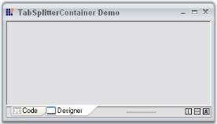

# How to collapse the splitter pane programmatically

This can be done programmatically using [Collapsed](https://help.syncfusion.com/cr/windowsforms/Syncfusion.Windows.Forms.Tools.TabSplitterContainer.html#Syncfusion_Windows_Forms_Tools_TabSplitterContainer_Collapsed) property.





this.tabSplitterContainer1.Collapsed = true;





Me.tabSplitterContainer1.Collapsed = True





