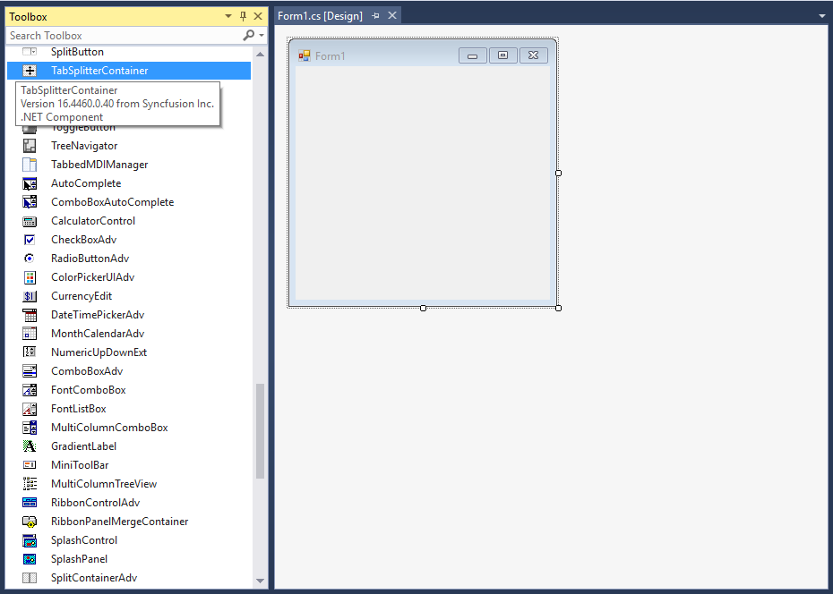
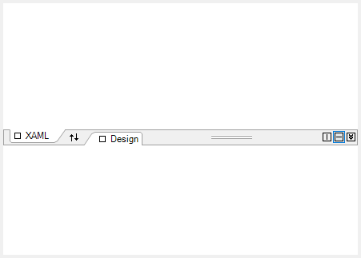
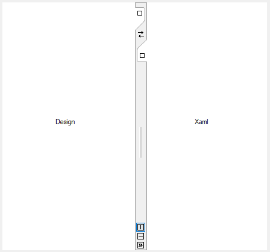
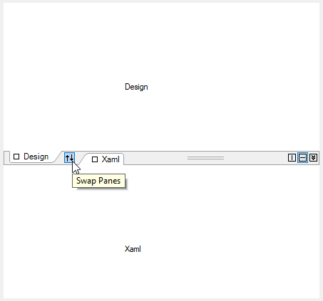
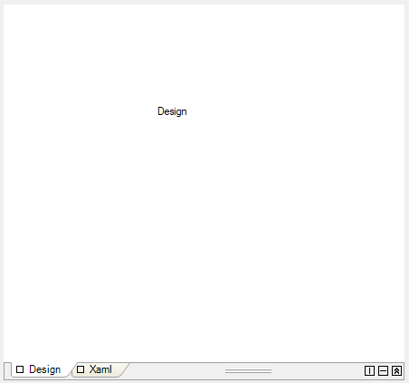

# Getting Started with Windows Forms Tab Splitter Container

## Assembly deployment

Refer to the [Control dependencies](https://help.syncfusion.com/windowsforms/control-dependencies#tabsplittercontainer) section to get the list of assemblies or details of NuGet package that needs to be added as a reference to use the control in any application.

Click [NuGet Packages](https://help.syncfusion.com/windowsforms/installation/install-nuget-packages) to learn how to install nuget packages in a Windows Forms application.

## Adding TabSplitterContainer control via designer

1) Create a new Windows Forms project in Visual Studio to display the TabSplitterContainer control.

2) The [TabSplitterContainer](https://help.syncfusion.com/cr/windowsforms/Syncfusion.Windows.Forms.Tools.TabSplitterContainer.html) control can be added to an application by dragging it from the toolbox to a designer view. The following dependent assemblies will be added automatically:

* Syncfusion.Grid.Base
* Syncfusion.Grid.Windows
* Syncfusion.Shared.Base
* Syncfusion.Shared.Windows
* Syncfusion.Tools.Base
* Syncfusion.Tools.Windows

### Add tab pages

Add pages to [TabSplitterContainer](https://help.syncfusion.com/cr/windowsforms/Syncfusion.Windows.Forms.Tools.TabSplitterContainer.html) by clicking the **Add primary page** and **Add secondary page** from Smart Tags of TabSplitterContainer.

## Adding TabSplitterContainer control via code

To add the control manually in C#, follow the given steps:

1) Create a C# or VB application using Visual Studio.

2) Add the following assembly references to the project:

* Syncfusion.Grid.Base
* Syncfusion.Grid.Windows
* Syncfusion.Shared.Base
* Syncfusion.Shared.Windows
* Syncfusion.Tools.Base
* Syncfusion.Tools.Windows

3) Include the required namespace.

​



using Syncfusion.Windows.Forms.Tools;




Imports Syncfusion.Windows.Forms.Tools


 

{{ codesnippet1 | OrderList_Indent_Level_1 }}

4) Create an instance of [TabSplitterContainer](https://help.syncfusion.com/cr/windowsforms/Syncfusion.Windows.Forms.Tools.TabSplitterContainer.html), and add it to the form.

​



TabSplitterContainer tabSplitterContainer1 = new TabSplitterContainer();
tabSplitterContainer1.Size = new System.Drawing.Size(248, 77);
this.Controls.Add(tabSplitterContainer1);




Dim tabSplitterContainer1 As TabSplitterContainer = New TabSplitterContainer()
tabSplitterContainer1.Size = New System.Drawing.Size(248, 77)
Me.Controls.Add(tabSplitterContainer1)




{{ codesnippet2 | OrderList_Indent_Level_1 }}

5) Add tab pages into the control. First, create an instance of the required pages, and add primary and secondary pages to TabSplitterContainer using the [PrimaryPages](https://help.syncfusion.com/cr/windowsforms/Syncfusion.Windows.Forms.Tools.TabSplitterContainer.html#Syncfusion_Windows_Forms_Tools_TabSplitterContainer_PrimaryPages) and [SecondaryPages](https://help.syncfusion.com/cr/windowsforms/Syncfusion.Windows.Forms.Tools.TabSplitterContainer.html#Syncfusion_Windows_Forms_Tools_TabSplitterContainer_SecondaryPages) collections, respectively.

​



// Create an instance of the Tab splitter page.
TabSplitterPage tabSplitterPage1 = new TabSplitterPage();
TabSplitterPage tabSplitterPage2 = new TabSplitterPage();

public Form1()
{
InitializeComponent();
tabSplitterPage1.Text = "XAML";
tabSplitterPage2.Text = "Design";

// Set back color.
tabSplitterPage1.BackColor = System.Drawing.SystemColors.ControlLightLight;
tabSplitterPage2.BackColor = System.Drawing.SystemColors.ControlLightLight;

//Set size to tabsplittercontainer
tabSplitterContainer1.Size = new System.Drawing.Size(443, 315);

// Add it to TabSplitterContainer.
tabSplitterContainer1.PrimaryPages.AddRange(new TabSplitterPage[] { tabSplitterPage1});
tabSplitterContainer1.SecondaryPages.AddRange(new TabSplitterPage[] { tabSplitterPage2 });

}




' Create an instance of Tab splitter page
Dim tabSplitterPage1 As New TabSplitterPage()
Dim tabSplitterPage2 As New TabSplitterPage()

Public Sub New()
InitializeComponent()
tabSplitterPage1.Text = "XAML"
tabSplitterPage2.Text = "Design"

' Set back color.
tabSplitterPage1.BackColor = System.Drawing.SystemColors.ControlLightLight
tabSplitterPage2.BackColor = System.Drawing.SystemColors.ControlLightLight

'Set size to tabsplittercontainer
tabSplitterContainer1.Size = New System.Drawing.Size(443, 315)

' Adding it to TabSplitterContainer
tabSplitterContainer1.PrimaryPages.AddRange(New TabSplitterPage() { tabSplitterPage1 })
tabSplitterContainer1.SecondaryPages.AddRange(New TabSplitterPage() { tabSplitterPage2 })
End Sub




{{ codesnippet3 | OrderList_Indent_Level_1 }}

6) Add any one of the controls to the tabSplitterPage (e.g., AutoLabel).

​



// Initialize the AutoLabel control.
AutoLabel autoLabel1 = new AutoLabel();
autoLabel1.Location = new System.Drawing.Point(167, 111);
autoLabel1.Size = new System.Drawing.Size(40, 13);
autoLabel1.Text = "Xaml";

AutoLabel autoLabel2 = new AutoLabel();
autoLabel2.Location = new System.Drawing.Point(167, 111);
autoLabel2.Size = new System.Drawing.Size(30, 13);
autoLabel2.Text = "Design";

// Add to tabSplitterPage.
this.tabSplitterPage1.Controls.Add(autoLabel1);
this.tabSplitterPage1.Controls.Add(autoLabel2);




' Initialize the AutoLabel control.
Dim autoLabel1 As New AutoLabel()
autoLabel1.Location = New System.Drawing.Point(167, 111)
autoLabel1.Size = New System.Drawing.Size(40, 13)
autoLabel1.Text = "Xaml"

Dim autoLabel2 As New AutoLabel()
autoLabel2.Location = New System.Drawing.Point(167, 111)
autoLabel2.Size = New System.Drawing.Size(30, 13)
autoLabel2.Text = "Design"

' Add to tabSplitterPage.
Me.tabSplitterPage1.Controls.Add(autoLabel1)
Me.tabSplitterPage1.Controls.Add(autoLabel2)




## Tab orientation

The TabSplitterContainer can be oriented horizontally or vertically using the [Orientation](https://help.syncfusion.com/cr/windowsforms/Syncfusion.Windows.Forms.Tools.TabSplitterContainer.html#Syncfusion_Windows_Forms_Tools_TabSplitterContainer_Orientation) property.




// Tab splitter control orientation.
tabSplitterContainer1.Orientation = System.Windows.Forms.Orientation.Vertical;




' Tab splitter control orientation.
tabSplitterContainer1.Orientation = System.Windows.Forms.Orientation.Vertical


 

{{ codesnippet4 | OrderList_Indent_Level_1 }}

**Vertical**

**Horizontal**

## Swap tab groups

You can easily swap the tab groups programmatically by enabling the [Swapped](https://help.syncfusion.com/cr/windowsforms/Syncfusion.Windows.Forms.Tools.TabSplitterContainer.html#Syncfusion_Windows_Forms_Tools_TabSplitterContainer_Swapped) property of TabSplitterContainer.



// Swapping tab groups
this.tabSplitterContainer1.Swapped = true;


' Swapping tab groups.
Me.tabSplitterContainer1. Swapped = True

 

## Collapse tab groups

You can collapse the tab groups programmatically by enabling the [Collapsed](https://help.syncfusion.com/cr/windowsforms/Syncfusion.Windows.Forms.Tools.TabSplitterContainer.html#Syncfusion_Windows_Forms_Tools_TabSplitterContainer_Collapsed) property of TabSplitterContainer.



// Collapsing tab groups.
this.tabSplitterContainer1.Collapsed = true;


' Collapsing tab groups.
Me.tabSplitterContainer1.Collapsed = True

 

