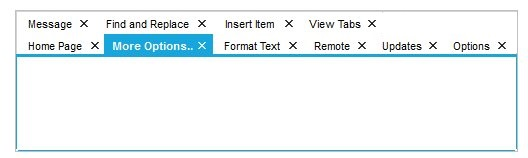
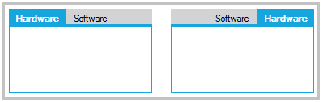
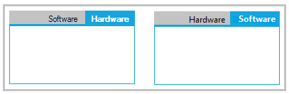

# Alignment in Windows Forms TabControl (TabControlAdv)

Alignment of the tabs can be set through the [Alignment](https://help.syncfusion.com/cr/windowsforms/Syncfusion.Windows.Forms.Tools.TabControlAdv.html#Syncfusion_Windows_Forms_Tools_TabControlAdv_Alignment) and [TabGap](https://help.syncfusion.com/cr/windowsforms/Syncfusion.Windows.Forms.Tools.TabControlAdv.html#Syncfusion_Windows_Forms_Tools_TabControlAdv_TabGap) properties.





this.tabControlAdv1.Alignment = System.Windows.Forms.TabAlignment.Left;

this.tabControlAdv1.TabGap = 2;





Me.tabControlAdv1.Alignment = System.Windows.Forms.TabAlignment.Left

Me.tabControlAdv1.TabGap = 2





## Text alignment

The below properties deals with alignment of the text in the [TabControlAdv](https://help.syncfusion.com/cr/windowsforms/Syncfusion.Windows.Forms.Tools.TabControlAdv.html):

* [TextAlignment](https://help.syncfusion.com/cr/windowsforms/Syncfusion.Windows.Forms.Tools.TabControlAdv.html#Syncfusion_Windows_Forms_Tools_TabControlAdv_TextAlignment)

* [TextLineAlignment](https://help.syncfusion.com/cr/windowsforms/Syncfusion.Windows.Forms.Tools.TabControlAdv.html#Syncfusion_Windows_Forms_Tools_TabControlAdv_TextLineAlignment)





this.tabControlAdv1.TextAlignment = System.Drawing.StringAlignment.Far;

this.tabControlAdv1.TextLineAlignment = System.Drawing.StringAlignment.Near;





Me.tabControlAdv1.TextAlignment = System.Drawing.StringAlignment.Far

Me.tabControlAdv1.TextLineAlignment = System.Drawing.StringAlignment.Near





## Multiline support

Multiple level of tabs can be created by setting the [Multiline](https://help.syncfusion.com/cr/windowsforms/Syncfusion.Windows.Forms.Tools.TabControlAdv.html#Syncfusion_Windows_Forms_Tools_TabControlAdv_Multiline) property of the [TabControlAdv](https://help.syncfusion.com/cr/windowsforms/Syncfusion.Windows.Forms.Tools.TabControlAdv.html) to `true`, which places the tabs in more than one line. This allows the tabs to be arranged in multiple lines when the tabs exceed the width of the control, with all the TabItems in view.

The TabItem's text can be placed in more than one line by setting the [MultilineText](https://help.syncfusion.com/cr/windowsforms/Syncfusion.Windows.Forms.Tools.TabControlAdv.html#Syncfusion_Windows_Forms_Tools_TabControlAdv_MultilineText) property.

The [KeepSelectedTabInFrontRow](https://help.syncfusion.com/cr/windowsforms/Syncfusion.Windows.Forms.Tools.TabControlAdv.html#Syncfusion_Windows_Forms_Tools_TabControlAdv_KeepSelectedTabInFrontRow) property will bring the selected tab to the front row (applicable only in the case of multiline tabs).





this.tabControlAdv1.Multiline = true;

this.tabControlAdv1.MultilineText = true;

this.tabControlAdv1.KeepSelectedTabInFrontRow = true;





Me.tabControlAdv1.Multiline = True

Me.tabControlAdv1.MultilineText = True

Me.tabControlAdv1.KeepSelectedTabInFrontRow = True





## RTL support

[TabControlAdv](https://help.syncfusion.com/cr/windowsforms/Syncfusion.Windows.Forms.Tools.TabControlAdv.html) allows the TabItems to be drawn from right to left. This can be done by setting the [RightToLeft](https://learn.microsoft.com/en-us/dotnet/api/system.windows.forms.control.righttoleft?redirectedfrom=MSDN&view=netframework-4.7.2#System_Windows_Forms_Control_RightToLeft) property to Yes.

This property aligns the tabs and the text from right to left which proves to be helpful for the Right-To-Left languages.

### Rotating tabs

The [RotateTabsWhenRTL](https://help.syncfusion.com/cr/windowsforms/Syncfusion.Windows.Forms.Tools.TabControlAdv.html#Syncfusion_Windows_Forms_Tools_TabControlAdv_RotateTabsWhenRTL) property can be used to rotate the tabs which are aligned to the left and right of the [TabPages](https://help.syncfusion.com/cr/windowsforms/Syncfusion.Windows.Forms.Tools.TabControlAdv.html#Syncfusion_Windows_Forms_Tools_TabControlAdv_TabPages). This specifies whether a tab should be drawn from left to right or from right to left. The default value is `false`.

When the [RightToLeft](https://learn.microsoft.com/en-us/dotnet/api/system.windows.forms.control.righttoleft?redirectedfrom=MSDN&view=netframework-4.7.2#System_Windows_Forms_Control_RightToLeft) mode is activated and [RotateTabsWhenRTL](https://help.syncfusion.com/cr/windowsforms/Syncfusion.Windows.Forms.Tools.TabControlAdv.html#Syncfusion_Windows_Forms_Tools_TabControlAdv_RotateTabsWhenRTL) property is enabled, tab rotation is allowed.





this.tabControlAdv1.RightToLeft = System.Windows.Forms.RightToLeft.Yes;

this.tabControlAdv1.RotateTabsWhenRTL = true;





Me.tabControlAdv1.RightToLeft = System.Windows.Forms.RightToLeft.Yes

Me.tabControlAdv1.RotateTabsWhenRTL = True





### Rotating text

The [RotateTextWhenVertical](https://help.syncfusion.com/cr/windowsforms/Syncfusion.Windows.Forms.Tools.TabControlAdv.html#Syncfusion_Windows_Forms_Tools_TabControlAdv_RotateTextWhenVertical) property can be used to rotate the text of the TabItems which are aligned to the left and right of the TabPages. This displays the tabs horizontally and provides better user readability.





this.tabControlAdv1.RotateTextWhenVertical = true;





Me.tabControlAdv1.RotateTextWhenVertical = True




