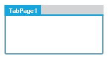

# Appearance Settings in Windows Forms TabControl (TabControlAdv)

The various appearance settings for [TabControlAdv](https://help.syncfusion.com/cr/windowsforms/Syncfusion.Windows.Forms.Tools.TabControlAdv.html) are discussed in this section. 

## Background settings

This section discusses the various Background Settings available in [TabControlAdv](https://help.syncfusion.com/cr/windowsforms/Syncfusion.Windows.Forms.Tools.TabControlAdv.html).

### BackgroundImage settings

The Essential® [TabControlAdv](https://help.syncfusion.com/cr/windowsforms/Syncfusion.Windows.Forms.Tools.TabControlAdv.html) provides the following options to customize the images:

* Images inside the TabItems.
* Images outside the TabBounds.
* Image as Background for the TabPage.

#### Images in TabItems

To set images to the TabItems, add an [ImageListControl](https://help.syncfusion.com/cr/windowsforms/Syncfusion.Windows.Forms.Tools.TabControlAdv.html#Syncfusion_Windows_Forms_Tools_TabControlAdv_ImageList) and populate it with the required images. Then, set the [ImageIndex](https://help.syncfusion.com/cr/windowsforms/Syncfusion.Windows.Forms.Tools.TabPageAdv.html#Syncfusion_Windows_Forms_Tools_TabPageAdv_ImageIndex) property of the TabPage to one of the indices, to display the corresponding image to the left of the text, by default.

The [ImageAlignmentR](https://help.syncfusion.com/cr/windowsforms/Syncfusion.Windows.Forms.Tools.TabControlAdv.html#Syncfusion_Windows_Forms_Tools_TabControlAdv_ImageAlignmentR) property allows you to set the Tab's text and image relation. By default, the image appears to the left and the text appears to the right. This setting can be changed using one of the below given options.

Code snippets showing the Image Settings

 



this.tabControlAdv1.ImageAlignmentR = Syncfusion.Windows.Forms.Tools.RelativeImageAlignment.RightOfText;

this.tabPageAdv1.ImageIndex = 0;





Me.tabControlAdv1.ImageAlignmentR = Syncfusion.Windows.Forms.Tools.RelativeImageAlignment.RightOfText

Me.tabPageAdv1.ImageIndex = 0





#### Images outside the TabBounds

[TabControlAdv](https://help.syncfusion.com/cr/windowsforms/Syncfusion.Windows.Forms.Tools.TabControlAdv.html) has images that are set outside the TabBounds.

To move the image outside the TabBounds, set the [ImageOffset](https://help.syncfusion.com/cr/windowsforms/Syncfusion.Windows.Forms.Tools.TabControlAdv.html), [AdjustTopGap](https://help.syncfusion.com/cr/windowsforms/Syncfusion.Windows.Forms.Tools.TabControlAdv.html#Syncfusion_Windows_Forms_Tools_TabControlAdv_AdjustTopGap), [LevelTextAndImage](https://help.syncfusion.com/cr/windowsforms/Syncfusion.Windows.Forms.Tools.TabControlAdv.html#Syncfusion_Windows_Forms_Tools_TabControlAdv_LevelTextAndImage), [ItemSize](https://help.syncfusion.com/cr/windowsforms/Syncfusion.Windows.Forms.Tools.TabControlAdv.html#Syncfusion_Windows_Forms_Tools_TabControlAdv_ItemSize) properties of TabControlAdv.

#### Background image for TabPages

The [BackgroundImage](https://help.syncfusion.com/cr/windowsforms/Syncfusion.Windows.Forms.Tools.TabControlAdv.html#Syncfusion_Windows_Forms_Tools_TabControlAdv_BackgroundImage) and [BackgroundImageLayout](https://help.syncfusion.com/cr/windowsforms/Syncfusion.Windows.Forms.Tools.TabControlAdv.html#Syncfusion_Windows_Forms_Tools_TabControlAdv_BackgroundImageLayout) properties used to set the background image for the [TabPages](https://help.syncfusion.com/cr/windowsforms/Syncfusion.Windows.Forms.Tools.TabControlAdv.html#Syncfusion_Windows_Forms_Tools_TabControlAdv_TabPages).





this.tabPageAdv1.BackgroundImage = imageList1.Images[0];

this.tabPageAdv1.BackgroundImageLayout = System.Windows.Forms.ImageLayout.Right;





Private Me.tabPageAdv1.BackgroundImage = imageList1.Images(0)

Private Me.tabPageAdv1.BackgroundImageLayout = System.Windows.Forms.ImageLayout.Right





### DisableInActivePageImage

The [DisableInactivePageImage](https://help.syncfusion.com/cr/windowsforms/Syncfusion.Windows.Forms.Tools.TabControlAdv.html#Syncfusion_Windows_Forms_Tools_TabControlAdv_DisableInactivePageImage) property specifies the value which determines whether the image should be disabled when the TabPage is not selected. The default value is `true`.





this.tabPageAdv1.DisableInactivePageImage = imageList1.Images[0];





Private Me.tabPageAdv1.DisableInactivePageImage = imageList1.Images(0)





### Color customization

The look and feel of the TabControlAdv can be customized using the [ActiveTabColor](https://help.syncfusion.com/cr/windowsforms/Syncfusion.Windows.Forms.Tools.TabControlAdv.html#Syncfusion_Windows_Forms_Tools_TabControlAdv_ActiveTabColor), [InActiveTabColor](https://help.syncfusion.com/cr/windowsforms/Syncfusion.Windows.Forms.Tools.TabControlAdv.html#Syncfusion_Windows_Forms_Tools_TabControlAdv_InactiveTabColor) and [TabPanelBackColor](https://help.syncfusion.com/cr/windowsforms/Syncfusion.Windows.Forms.Tools.TabControlAdv.html#Syncfusion_Windows_Forms_Tools_TabControlAdv_TabPanelBackColor) properties.

**BackColor settings for the TabItems**

The BackColor of the individual tab items can be customized by setting the [TabBackColor](https://help.syncfusion.com/cr/windowsforms/Syncfusion.Windows.Forms.Tools.TabPageAdv.html#Syncfusion_Windows_Forms_Tools_TabPageAdv_TabBackColor) property of the corresponding tab pages.





this.tabControlAdv1.ActiveTabColor = System.Drawing.Color.Ivory;

this.tabControlAdv1.InactiveTabColor = System.Drawing.Color.Silver;

this.tabControlAdv1.TabPanelBackColor = System.Drawing.Color.White;

this.tabControlAdv1.BackColor = System.Drawing.Color.Yellow;

this.tabPageAdv1.TabBackColor = System.Drawing.Color.Pink;





Private Me.tabControlAdv1.ActiveTabColor = System.Drawing.Color.Ivory

Private Me.tabControlAdv1.InactiveTabColor = System.Drawing.Color.Silver

Private Me.tabControlAdv1.TabPanelBackColor = System.Drawing.Color.White

Private Me.tabControlAdv1.BackColor = System.Drawing.Color.Yellow

Private Me.tabPageAdv1.TabBackColor = System.Drawing.Color.Pink





 

 

## Foreground settings

This section discusses the various Foreground Settings available in [TabControlAdv](https://help.syncfusion.com/cr/windowsforms/Syncfusion.Windows.Forms.Tools.TabControlAdv.html).

### Font settings

The font settings for the [TabControlAdv](https://help.syncfusion.com/cr/windowsforms/Syncfusion.Windows.Forms.Tools.TabControlAdv.html) can be controlled through [Font](https://help.syncfusion.com/cr/windowsforms/Syncfusion.Windows.Forms.Tools.TabControlAdv.html#Syncfusion_Windows_Forms_Tools_TabControlAdv_Font) and [ActiveTabFont](https://help.syncfusion.com/cr/windowsforms/Syncfusion.Windows.Forms.Tools.TabControlAdv.html#Syncfusion_Windows_Forms_Tools_TabControlAdv_ActiveTabFont) properties.





this.tabControlAdv1.ActiveTabFont = new System.Drawing.Font("Verdana", 8.25F, System.Drawing.FontStyle.Bold, System.Drawing.GraphicsUnit.Point, ((byte)(0)));

this.tabControlAdv1.Font = new System.Drawing.Font("Verdana", 8.25F, System.Drawing.FontStyle.Regular, System.Drawing.GraphicsUnit.Point, ((byte)(0)));





Private Me.tabControlAdv1.ActiveTabFont = New System.Drawing.Font("Verdana", 8.25F, System.Drawing.FontStyle.Bold, System.Drawing.GraphicsUnit.Point, (CByte(0)))

Private Me.tabControlAdv1.Font = New System.Drawing.Font("Verdana", 8.25F, System.Drawing.FontStyle.Regular, System.Drawing.GraphicsUnit.Point, (CByte(0)))





<table>
<tr>
<th>
TabPageAdv property</th><th>
Description</th></tr>
<tr>
<td>
TabFont</td><td>
Specifies the Font for the tab item.</td></tr>
</table>





this.tabPageAdv1.TabFont = new System.Drawing.Font("Trebuchet MS", 8.25F, System.Drawing.FontStyle.Regular, System.Drawing.GraphicsUnit.Point, ((byte)(0)));





Me.tabPageAdv1.TabFont = New System.Drawing.Font("Trebuchet MS", 8.25F, System.Drawing.FontStyle.Regular, System.Drawing.GraphicsUnit.Point, CType((0), Byte))





To set image for tab items, see [BackgroundImage Settings](#backgroundimage-settings).

### ForeColor settings

The text color of the tab items can be customized by setting the [TabForeColor](https://help.syncfusion.com/cr/windowsforms/Syncfusion.Windows.Forms.Tools.TabPageAdv.html#Syncfusion_Windows_Forms_Tools_TabPageAdv_TabForeColor) property of the corresponding [TabPages](https://help.syncfusion.com/cr/windowsforms/Syncfusion.Windows.Forms.Tools.TabControlAdv.html#Syncfusion_Windows_Forms_Tools_TabControlAdv_TabPages).





this.tabPageAdv1.TabForeColor = System.Drawing.Color.Sienna;





Private Me.tabPageAdv1.TabForeColor = System.Drawing.Color.Sienna





## Border settings

This section discusses the border settings available for the TabControlAdv. Set the [BorderVisible](https://help.syncfusion.com/cr/windowsforms/Syncfusion.Windows.Forms.Tools.TabControlAdv.html#Syncfusion_Windows_Forms_Tools_TabControlAdv_BorderVisible) property to `true` to display the control border. Default value is `false`.





this.tabControlAdv1.BorderVisible = true;





Me.tabControlAdv1.BorderVisible = True





We can set width for the border using [BorderWidth](https://help.syncfusion.com/cr/windowsforms/Syncfusion.Windows.Forms.Tools.TabControlAdv.html#Syncfusion_Windows_Forms_Tools_TabControlAdv_BorderWidth) property. Default value is 5.





this.tabControlAdv1.BorderWidth = 10;





Me.tabControlAdv1.BorderWidth = 10





 

