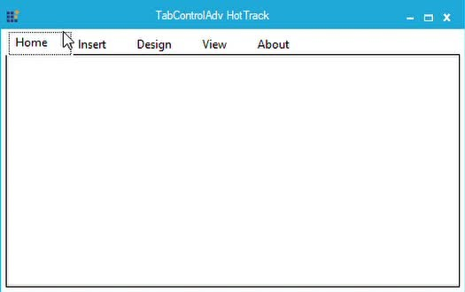
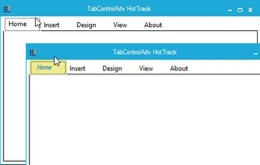
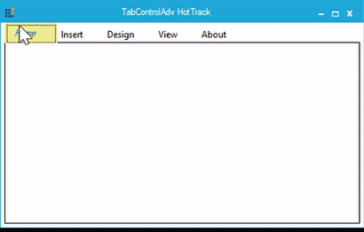

# Events in Windows Forms TabControl (TabControlAdv)

## AfterEdit event

This [AfterEdit](https://help.syncfusion.com/cr/windowsforms/Syncfusion.Windows.Forms.Tools.TabControlAdv.html) event occurs after text editing is completed. It is fired even if no changes are made.

### Event data

The Edit Event Handler receives an argument of type [EditEventArgs](https://help.syncfusion.com/cr/windowsforms/Syncfusion.Windows.Forms.Tools.EditEventArgs.html) containing data related to this event. The [EditEventArgs property](https://help.syncfusion.com/cr/windowsforms/Syncfusion.Windows.Forms.Tools.EditEventArgs.html) provides information specific to this event.





private void tabControlAdv1_AfterEdit(object sender, Syncfusion.Windows.Forms.Tools.EditEventArgs e)

{

//Below line will be displayed in the output window at run-time, when this event is fired.

Console.Write(" AfterEdit event is triggered");

//Gets the edited text in the output window.

Console.Write("Edit text :" + e.EditText.ToString());

}





Private Sub tabControlAdv1_AfterEditEvent(ByVal sender As Object, ByVal e As Syncfusion.Windows.Forms.Tools.EditEventArgs)

'Below line will be displayed in the output window at run-time, when this event is fired.

Console.Write(" AfterEdit event is triggered")

'Gets the edited text in the output window.

Console.Write("Edit text :" + e.EditText.ToString())

End Sub





## BeforeEdit event

This [BeforeEdit](https://help.syncfusion.com/cr/windowsforms/Syncfusion.Windows.Forms.Tools.TabControlAdv.html) event occurs when the text enters into Edit mode.

### Event data

This Event Handler receives an argument of type [EditEventArgs](https://help.syncfusion.com/cr/windowsforms/Syncfusion.Windows.Forms.Tools.EditEventArgs.html) containing data related to this event. The [EditEventArgs property](https://help.syncfusion.com/cr/windowsforms/Syncfusion.Windows.Forms.Tools.EditEventArgs.html) provides information specific to this event.

<table>
<tr>
<th>
Member</th><th>
Description</th></tr>
<tr>
<td>
EditText</td><td>
Gets the edited text.</td></tr>
</table>





private void tabControlAdv1_BeforeEditEvent(object sender, Syncfusion.Windows.Forms.Tools.EditEventArgs e)

{

//Below line will be displayed in the output window, when this event is fired.

Console.Write("BeforeEdit event is triggered");

//Gets the edited text in the output window.

Console.Write("Edit text :" + e.EditText.ToString());

}





Private Sub tabControlAdv1_BeforeEditEvent(ByVal sender As Object, ByVal e As Syncfusion.Windows.Forms.Tools.EditEventArgs)

'Below line will be displayed in the output window, when this event is fired.

Console.Write("BeforeEdit event is triggered")

'Gets the edited text in the output window.

Console.Write("Edit text :" + e.EditText.ToString())

End Sub





## BackgroundImageChanged event

This [BackgroundImageChanged](https://docs.microsoft.com/en-us/dotnet/api/system.windows.forms.control.backgroundimagechanged?view=netframework-4.7.2) event is fired when the value of the `BackgroundImage` property is changed in the [TabControlAdv](https://help.syncfusion.com/cr/windowsforms/Syncfusion.Windows.Forms.Tools.TabControlAdv.html).





private void tabControlAdv1_BackgroundImageChanged(object sender, System.Windows.Forms.EventArgs e)

{

//Below line will be displayed in the output window at run-time, when this event is fired.

Console.Write("Background Image event is raised");

}





Private Sub tabControlAdv1_BackgroundImageChanged(ByVal sender As Object, ByVal e As System.Windows.Forms.EventArgs)

'Below line will be displayed in the output window at run-time, when this event is fired.

Console.Write("Background Image event is raised")

End Sub





## BackgroundImageLayoutChanged event

This [BackgroundImageLayoutChanged](https://docs.microsoft.com/en-us/dotnet/api/system.windows.forms.control.backgroundimagelayoutchanged?view=netframework-4.7.2) event is fired when the value of the `BackgroundImageLayout` property is changed in the [TabControlAdv](https://help.syncfusion.com/cr/windowsforms/Syncfusion.Windows.Forms.Tools.TabControlAdv.html).





private void tabControlAdv1_BackgroundImageLayoutChanged(object sender, System.Windows.Forms.EventArgs e)

{

//Below line will be displayed in the output window at run-time, when this event is fired.

Console.Write("BackgroundImageLayoutChanged event is raised");

}





Private Sub tabControlAdv1_BackgroundImageLayout(ByVal sender As Object, ByVal e As System.Windows.Forms.EventArgs)

'Below line will be displayed in the output window at run-time, when this event is fired.

Console.Write("BackgroundImageLayoutChanged event is raised")

End Sub





## BackColorChanged event

This [BackColorChanged](https://docs.microsoft.com/en-us/dotnet/api/system.windows.forms.control.backcolorchanged?view=netframework-4.7.2) event is fired when the value of the `BackColor` property is changed in the [TabControlAdv](https://help.syncfusion.com/cr/windowsforms/Syncfusion.Windows.Forms.Tools.TabControlAdv.html).





// Set the new back color.

this.tabControlAdv1.BackColor = System.Drawing.Color.Aqua;

// Set the active tab color for the TabControlAdv to highlight the activated tab in the control.

this.tabControlAdv1.ActiveTabColor = System.Drawing.Color.Bisque;

// Handle the BackColorChanged event.

this.tabControlAdv1.BackColorChanged+=new EventHandler(tabControlAdv1_BackColorChanged);

private void tabControlAdv1_BackColorChanged(object sender, EventArgs e)

{

Console.Write("BackColorChanged event is raised");

}





' Set the new back color. 

Me.tabControlAdv1.BackColor = System.Drawing.Color.Aqua 

' Set the active tab color for the TabControlAdv to highlight the activated tab in the control. 

Me.tabControlAdv1.ActiveTabColor = System.Drawing.Color.Bisque 

' Handle the BackColorChanged event. 

AddHandler Me.tabControlAdv1.BackColorChanged, AddressOf tabControlAdv1_BackColorChanged 

Private Sub tabControlAdv1_BackColorChanged(ByVal sender As Object, ByVal e As EventArgs)

   Console.Write("BackColorChanged event is raised")

End Sub





## ControlAdded event

This [ControlAdded](https://docs.microsoft.com/en-us/dotnet/api/system.windows.forms.control.controladded?view=netframework-4.7.2) event occurs when a new control is added to the [TabControlAdv](https://help.syncfusion.com/cr/windowsforms/Syncfusion.Windows.Forms.Tools.TabControlAdv.html).

### Event data

This Event Handler receives an argument of type [ControlEventArgs](https://docs.microsoft.com/en-us/dotnet/api/system.windows.forms.controleventargs?view=netframework-4.7.2) containing data related to this event. The following [ControlEventArgs](https://docs.microsoft.com/en-us/dotnet/api/system.windows.forms.controleventargs?view=netframework-4.7.2) property provides information specific to this event.

<table>
<tr>
<th>
Member</th><th>
Description</th></tr>
<tr>
<td>
Control</td><td>
Gets the control object used by this event.</td></tr>
</table>





private void tabControlAdv1_ControlAdded(object sender, System.Windows.Forms.ControlEventArgs e)

{

//Below line will be displayed in the output window at run-time, when this event is fired.

Console.Write("Control Added event is raised");

//Gets the control object used by this event.

Console.Write("Control Name :" + e.Control.ToString());

}





Private Sub tabControlAdv1_ControlAdded(ByVal sender As Object, ByVal e As System.Windows.Forms.ControlEventArgs)

'Below line will be displayed in the output window at run-time, when this event is fired.

Console.Write("Control Added event is raised")

'Gets the control object used by this event.

Console.Write("Control Name :" + e.Control.ToString())

End Sub





## ControlRemoved event

This [ControlRemoved](https://docs.microsoft.com/en-us/dotnet/api/system.windows.forms.control.controlremoved?view=netframework-4.7.2) event occurs when a new control is removed from this [TabControlAdv](https://help.syncfusion.com/cr/windowsforms/Syncfusion.Windows.Forms.Tools.TabControlAdv.html).

### Event data

This Event Handler receives an argument of type [ControlEventArgs](https://docs.microsoft.com/en-us/dotnet/api/system.windows.forms.controleventargs?view=netframework-4.7.2) containing data related to this event. The following [ControlEventArgs](https://docs.microsoft.com/en-us/dotnet/api/system.windows.forms.controleventargs?view=netframework-4.7.2) property provides information specific to this event.

<table>
<tr>
<th>
Member</th><th>
Description</th></tr>
<tr>
<td>
Control</td><td>
Gets the control object used by this event.</td></tr>
</table>

N> The [TabControlAdv.RemoveAll](https://help.syncfusion.com/cr/windowsforms/Syncfusion.Windows.Forms.Tools.TabControlAdv.html#Syncfusion_Windows_Forms_Tools_TabControlAdv_RemoveAll) method removes all the [TabPages](https://help.syncfusion.com/cr/windowsforms/Syncfusion.Windows.Forms.Tools.TabControlAdv.html#Syncfusion_Windows_Forms_Tools_TabControlAdv_TabPages) and additional controls from the [TabControlAdv](https://help.syncfusion.com/cr/windowsforms/Syncfusion.Windows.Forms.Tools.TabControlAdv.html).





private void tabControlAdv1_ControlRemoved(object sender, System.Windows.Forms.ControlEventArgs e)

{

//Below line will be displayed in the output window at run-time, when this event is fired.

Console.Write("Control Removed event is raised");

//Gets the control object used by this event.

Console.Write("Control Name :" + e.Control.ToString());

}





Private Sub tabControlAdv1_ControlRemoved(ByVal sender As Object, ByVal e As System.Windows.Forms.ControlEventArgs)

'Below line will be displayed in the output window at run-time, when this event is fired.

Console.Write("Control Removed event is raised")

'Gets the control object used by this event.

Console.Write("Control Name :" + e.Control.ToString())

End Sub





## DrawItem event

This [DrawItem](https://help.syncfusion.com/cr/windowsforms/Syncfusion.Windows.Forms.Tools.TabControlAdv.html) event is triggered whenever a particular item or area needs to be painted. Below is an example which draws the background and the interior by handling this event.

### Event data

This Event Handler receives an argument of type [DrawTabEventArgs](https://help.syncfusion.com/cr/windowsforms/Syncfusion.Windows.Forms.Tools.DrawTabEventArgs.html) containing data related to this event. The [DrawTabEventArgs properties](https://help.syncfusion.com/cr/windowsforms/Syncfusion.Windows.Forms.Tools.DrawTabEventArgs.html) provide information specific to this event.

N> The [TabControlAdv.OnDrawItem](https://help.syncfusion.com/cr/windowsforms/Syncfusion.Windows.Forms.Tools.TabControlAdv.html#Syncfusion_Windows_Forms_Tools_TabControlAdv_OnDrawItem_Syncfusion_Windows_Forms_Tools_DrawTabEventArgs_) method raises the DrawItem event.





private void tabControlAdv1_DrawItem(object sender, Syncfusion.Windows.Forms.Tools.DrawTabEventArgs drawItemInfo)

{

drawItemInfo.DrawBackground();

drawItemInfo.DrawInterior();

switch(this.comboBox1.SelectedIndex)

{

case 0:this.Tab_DrawItemYahooMessengerLike(sender, drawItemInfo);

break;

case 1: this.Tab_DrawItemMSNMessengerLike(sender, drawItemInfo);

break;

}

}





Private Sub tabControlExt1_DrawItem(ByVal sender As System.Object, ByVal drawItemInfo As Syncfusion.Windows.Forms.Tools.DrawTabEventArgs) Handles tabControlExt1.DrawItem

drawItemInfo.DrawBackground()

drawItemInfo.DrawInterior()

Select Case Me.comboBox1.SelectedIndex

Case 0

Me.Tab_DrawItemYahooMessengerLike(sender, drawItemInfo)

'End Section

Case 1

Me.Tab_DrawItemMSNMessengerLike(sender, drawItemInfo)

'End Section

End Select

End Sub





### Customize the appearance of TabControlAdv Using HotTracking

HotTrack is used to change the appearance of the TabItem when the mouse pointer is over it. Set the HotTrack property to `True` to enable the HotTrack feature. The HotTrack property's default value is `false`. You can customize the appearance of the [TabControlAdv](https://help.syncfusion.com/cr/windowsforms/Syncfusion.Windows.Forms.Tools.TabControlAdv.html) while `HotTracking`. This can be achieved by handling the event, [DrawItem](https://help.syncfusion.com/windowsforms/tabcontrol/events#drawitem-event) in the TabControlAdv. 

<table>
<tr>
<th>
Properties</th><th>
Description</th></tr>
<tr>
<td>
ForeColor </td><td>
Gets or sets the forecolor of the specified tab item text.</td></tr>
<tr>
<td>
Font </td><td>
Gets or sets the font of the specified tab item.</td></tr>
<tr>
<td>
Bounds</td><td>
Gets or sets the bounds of the specified tab item. They include the space for the border.</td></tr>
<tr>
<td>
BoundsInterior </td><td>
Gets or sets the bounds of the specified tab item without having space for the borders.</td></tr>
<tr>
<td>
Graphics </td><td>
Returns the graphics surface to draw the tab item.</td></tr>
<tr>
<td>
Index </td><td>
Returns the index value of the tab item.</td></tr>
<tr>
<td>
DrawItemState </td><td>
Gets or sets the item state.</td></tr>
<tr>
<td>
TextBrush </td><td>
Gets or sets the brush to draw the text.</td></tr>
</table>

<table>
<tr>
<th>
Function</th><th>
Description</th></tr>
<tr>
<td>
DrawBackground </td><td>
Draws the background.</td></tr>
<tr>
<td>
DrawBorders  </td><td>
Draws the borders within the bounds specified.</td></tr>
<tr>
<td>
DrawInterior  </td><td>
Draws the text and image within the bounds specified.</td></tr>
</table>





//Enables the HotTrack. It helps to change the appearance of the TabControlAdv on mouse hover.

this.tabControlAdv1.HotTrack = true;

//Draws the Tab item.

this.tabControlAdv1.DrawItem += new DrawTabEventHandler(tabControlAdv1_DrawItem);
void tabControlAdv1_DrawItem(object sender, DrawTabEventArgs drawItemInfo)
{

    //Checks whether the HotTracking is in progress.

    if ((drawItemInfo.State & DrawItemState.HotLight) > 0)
    {
        drawItemInfo.ForeColor = Color.Red;
   ``   drawItemInfo.BackColor = Color.Khaki;
        drawItemInfo.Font = new Font("Segoe Marker", 12.0F, FontStyle.Italic);
    }

    //Draws the default background and interior.

    drawItemInfo.DrawBackground();
    drawItemInfo.DrawInterior();
}





'Enables the HotTrack. It helps to change the appearance of the TabControlAdv on mouse hover.
Me.tabControlAdv1.HotTrack = True
'Draws the Tab item.
AddHandler tabControlAdv1.DrawItem, AddressOf tabControlAdv1_DrawItem
Private Sub tabControlAdv1_DrawItem(ByVal sender As Object, ByVal drawItemInfo As DrawTabEventArgs)
   'Checks whether the HotTracking is in progress.
   If (drawItemInfo.State And DrawItemState.HotLight) > 0 Then
     drawItemInfo.ForeColor = Color.Red
     drawItemInfo.BackColor = Color.Khaki
     drawItemInfo.Font = New Font("Segoe Marker", 12.0F, FontStyle.Italic)
   End If
   'Draws the default background and interior.
   drawItemInfo.DrawBackground()
   drawItemInfo.DrawInterior()
End Sub





N> Download demo application from [GitHub]

## ForeColorChanged event

This [ForeColorChanged](https://docs.microsoft.com/en-us/dotnet/api/system.windows.forms.control.forecolorchanged?view=netframework-4.7.2) event is raised when the value of the [ForeColor](https://docs.microsoft.com/en-us/dotnet/api/system.windows.forms.control.forecolor?view=netframework-4.7.2) property is changed on the [TabControlAdv](https://help.syncfusion.com/cr/windowsforms/Syncfusion.Windows.Forms.Tools.TabControlAdv.html).





private void tabControlAdv1_ForeColorChanged(object sender, System.Windows.Forms.EventArgs e)

{

//Below line will be displayed in the output window at run-time, when this event is fired.

Console.Write("ForeColor Changed event is raised");

}





Private Sub tabControlAdv1_ForeColorChanged(ByVal sender As Object, ByVal e As System.Windows.Forms.EventArgs)

'Below line will be displayed in the output window at run-time, when this event is fired.

Console.Write("ForeColor Changed event is raised")

End Sub





## LabelEditChanged event

This [LabelEditChanged](https://help.syncfusion.com/cr/windowsforms/Syncfusion.Windows.Forms.Tools.TabControlAdv.html) event is triggered when the [LabelEdit](https://help.syncfusion.com/cr/windowsforms/Syncfusion.Windows.Forms.Tools.TabControlAdv.html#Syncfusion_Windows_Forms_Tools_TabControlAdv_LabelEdit) property is changed in the [TabControlAdv](https://help.syncfusion.com/cr/windowsforms/Syncfusion.Windows.Forms.Tools.TabControlAdv.html).





// Set the LabelEdit property.

this.tabControlAdv1.LabelEdit = true;

// Handle the LabelEditChanged event.

this.tabControlAdv1.LabelEditChanged+=new EventHandler(tabControlAdv1_LabelEditChanged);

private void tabControlAdv1_LabelEditChanged(object sender, EventArgs e)

{

// Below line will be displayed in the output window at runtime, when this event is fired.

Console.Write("LabelEditChanged event is raised");

}





' Set the LabelEdit property. 

Me.tabControlAdv1.LabelEdit = True 

' Handle the LabelEditChanged event. 

AddHandler Me.tabControlAdv1.LabelEditChanged, AddressOf tabControlAdv1_LabelEditChanged 

Private Sub tabControlAdv1_LabelEditChanged(ByVal sender As Object, ByVal e As EventArgs)

' Below line will be displayed in the output window at runtime, when this event is fired. 

Console.Write("LabelEditChanged event is raised")

End Sub





## LabelEditTextChanged event

This [LabelEditTextChanged](https://help.syncfusion.com/cr/windowsforms/Syncfusion.Windows.Forms.Tools.TabControlAdv.html) event is triggered when the original text of the Tab is changed.





// Set the LabelEdit property to True, to enable editing of the TabPage's captions.

this.tabControlAdv1.LabelEdit = true;

// Set the text for the TabPage.

this.tabPageAdv1.Text = "Tab1";

// Set the font of the text for the TabPage.

this.tabControlAdv1.Font = new System.Drawing.Font("Comic Sans MS", 8.25F, System.Drawing.FontStyle.Bold, System.Drawing.GraphicsUnit.Point, ((byte)(0)));

// Handle the LabelEditTextChanged event.

this.tabControlAdv1.LabelEditTextChanged+=new EventHandler(tabControlAdv1_LabelEditTextChanged);

private void tabControlAdv1_LabelEditTextChanged(object sender, EventArgs e)

{

// Below line will be displayed in the output window at runtime, when text is edited.

Console.Write("LabelEditTextChanged event is raised");

}





' Set the LabelEdit property to True, to enable editing of the TabPages' captions. 

Me.tabControlAdv1.LabelEdit = True 

' Set the text for the TabPage. 

Me.tabPageAdv1.Text = "Tab1" 

' Set the font of the text for the TabPage. 

Me.tabControlAdv1.Font = New System.Drawing.Font("Comic Sans MS", 8.25F, System.Drawing.FontStyle.Bold, System.Drawing.GraphicsUnit.Point, CByte((0))) 

' Handle the LabelEditTextChanged event. 

AddHandler Me.tabControlAdv1.LabelEditTextChanged, AddressOf tabControlAdv1_LabelEditTextChanged 

Private Sub tabControlAdv1_LabelEditTextChanged(ByVal sender As Object, ByVal e As EventArgs)

   'Below line will be displayed in the output window at runtime, when text is edited. 

   Console.Write("LabelEditTextChanged event is raised")

End Sub





## PaddingChanged event

This [PaddingChanged](https://docs.microsoft.com/en-us/dotnet/api/system.windows.forms.control.paddingchanged?view=netframework-4.7.2) event occurs when the [Padding](https://help.syncfusion.com/cr/windowsforms/Syncfusion.Windows.Forms.Tools.TabControlAdv.html#Syncfusion_Windows_Forms_Tools_TabControlAdv_Padding) property is changed in the [TabControlAdv](https://help.syncfusion.com/cr/windowsforms/Syncfusion.Windows.Forms.Tools.TabControlAdv.html).





private void tabControlAdv1_PaddingChanged(object sender, System.Windows.Forms.EventArgs e)

{

//Below line will be displayed in the output window at run-time, when this event is fired.

Console.Write("Padding Changed event is raised");

}





Private Sub tabControlAdv1_PaddingChanged(ByVal sender As Object, ByVal e As System.Windows.Forms.EventArgs)

'Below line will be displayed in the output window at run-time, when this event is fired.

Console.Write("Padding Changed event is raised")

End Sub





## Paint event

This [Paint](https://docs.microsoft.com/en-us/dotnet/api/system.windows.forms.control.paint?view=netframework-4.7.2) event occurs when a TabControlAdv needs re-painting.

### Event data

This Event Handler receives an argument of type [PaintEventArgs](https://docs.microsoft.com/en-us/dotnet/api/system.windows.forms.painteventargs?view=netframework-4.7.2) containing data related to this event. The [PaintEventArgs property](https://docs.microsoft.com/en-us/dotnet/api/system.windows.forms.painteventargs?view=netframework-4.7.2#properties) provides information specific to this event.





private void tabControlAdv1_Paint(object sender, System.Windows.Forms.PaintEventArgs e)

{

if(this.ClientRectangle.Width > 0 && this.ClientRectangle.Height > 0)

{

LinearGradientBrush linearBrush = new LinearGradientBrush(this.ClientRectangle, SystemColors.Control, SystemColors.ControlDark, LinearGradientMode.Horizontal);

e.Graphics.FillRectangle(linearBrush, this.ClientRectangle);

}

}





Private Sub tabControlAdv1_Paint(ByVal sender As Object, ByVal e As System.Windows.Forms.PaintEventArgs)

If Me.ClientRectangle.Width > 0 AndAlso Me.ClientRectangle.Height > 0 Then

Dim linearBrush As LinearGradientBrush = New LinearGradientBrush(Me.ClientRectangle, SystemColors.Control, SystemColors.ControlDark, LinearGradientMode.Horizontal)

e.Graphics.FillRectangle(linearBrush, Me.ClientRectangle)

End If

End Sub





## PreviewKeyDown event

This [PreviewKeyDown](https://docs.microsoft.com/en-us/dotnet/api/system.windows.forms.control.previewkeydown?view=netframework-4.7.2) event occurs before the [KeyDown](https://docs.microsoft.com/en-us/dotnet/api/system.windows.forms.control.keydown?view=netframework-4.7.2) event when a key is pressed, while focus is on the [TabControlAdv](https://help.syncfusion.com/cr/windowsforms/Syncfusion.Windows.Forms.Tools.TabControlAdv.html).

### Event data

This Event Handler receives an argument of type [PreviewKeyDownEventArgs](https://docs.microsoft.com/en-us/dotnet/api/system.windows.forms.previewkeydowneventargs?view=netframework-4.7.2) containing data related to this event. The following [PreviewKeyDownEventArgs properties](https://docs.microsoft.com/en-us/dotnet/api/system.windows.forms.previewkeydowneventargs?view=netframework-4.7.2#properties) provide information specific to this event.





private void tabControlAdv1_PreviewKeyDown(object sender, System.Windows.Forms.PreviewKeyDownEventArgs e)

{

//Below line will be displayed in the output window at run-time, when this event is fired.

Console.Write("PreviewKeyDown event is raised");

//The below code prints the KeyCode, KeyValue, KeyData and Modifiers in the output window at run-time.

Console.Write("Key code :" + e.KeyCode.ToString() + "\n" + "Key Value :" + e.KeyValue.ToString() + "\n" + "Key Data:" + e.KeyData.ToString() + "\n" + "Modifiers:" + e.Modifiers.ToString());

}





Private Sub tabControlAdv1_PreviewKeyDown(ByVal sender As Object, ByVal e As System.Windows.Forms.PreviewKeyDownEventArgs)

//Below line will be displayed in the output window at run-time, when this event is fired.

Console.Write("PreviewKeyDown event is raised")

'The below code prints the KeyCode, KeyValue, KeyData and Modifiers in the output window at run-time.

Console.Write("Key code :" + e.KeyCode.ToString() + "\n" + "Key Value :" + e.KeyValue.ToString() + "\n" + "Key Data:" + e.KeyData.ToString() + "\n" + "Modifiers:" + e.Modifiers.ToString())

End Sub





## RegionChanged event

This [RegionChanged](https://docs.microsoft.com/en-us/dotnet/api/system.windows.forms.control.regionchanged?view=netframework-4.7.2) event is raised when the value of the [Region](https://docs.microsoft.com/en-us/dotnet/api/system.windows.forms.control.region?view=netframework-4.7.2#System_Windows_Forms_Control_Region) property is changed in the [TabControlAdv](https://help.syncfusion.com/cr/windowsforms/Syncfusion.Windows.Forms.Tools.TabControlAdv.html).





private void tabControlAdv1_RegionChanged(object sender, System.Windows.Forms.EventArgs e)

{

//Below line will be displayed in the output window at run-time, when this event is fired.

Console.Write("Region Changed event is raised");

}





Private Sub tabControlAdv1_RegionChanged(ByVal sender As Object, ByVal e As System.Windows.Forms.EventArgs)

'Below line will be displayed in the output window at run-time, when this event is fired.

Console.Write("Region Changed event is raised")

End Sub





## TabPrimitiveClick event

This [TabPrimitiveClick](https://help.syncfusion.com/cr/windowsforms/Syncfusion.Windows.Forms.Tools.TabControlAdv.html) event occurs before the `NavigationButton` click.

### Event data

This Event Handler receives an argument of type [TabPrimitiveClickEventArgs](https://help.syncfusion.com/cr/windowsforms/Syncfusion.Windows.Forms.Tools.TabPrimitiveClickEventArgs.html) containing data related to this event. The following [TabPrimitiveClickEventArgs properties](https://help.syncfusion.com/cr/windowsforms/Syncfusion.Windows.Forms.Tools.TabPrimitiveClickEventArgs.html) provide information specific to this event.





private void tabControlAdv4_TabPrimitiveClick(object sender, Syncfusion.Windows.Forms.Tools.TabPrimitiveClickEventArgs e)

{

if(e.TabPrimitive.Name == "CustomAbout")

{

DemoCommon.AboutForm ab=new DemoCommon.AboutForm( AppDomain.CurrentDomain.GetAssemblies());

ab.ShowDialog();

}

//This event can be canceled using the code given below.

e.Cancel = true;

//This code displays the primitive that gets clicked during this event.

Console.Write("TabPrimitiveClick:" + e.TabPrimitive.ToString());

}





Private Sub tabControlAdv4_TabPrimitiveClick(ByVal sender As Object, ByVal e As Syncfusion.Windows.Forms.Tools.TabPrimitiveClickEventArgs)

If e.TabPrimitive.Name = "CustomAbout" Then

Dim ab As DemoCommon.AboutForm = New DemoCommon.AboutForm(AppDomain.CurrentDomain.GetAssemblies)

ab.ShowDialog()

End If

'this event can be canceled using the code given below.

e.Cancel = True

'This code displays the primitive that gets clicked during this event.

Console.Write("TabPrimitiveClick:" + e.TabPrimitive.ToString())

End Sub





## SelectedIndexChanging event

[SelectedIndexChanging](https://help.syncfusion.com/cr/windowsforms/Syncfusion.Windows.Forms.Tools.TabControlAdv.html) event occurs while changing the [SelectedIndex](https://help.syncfusion.com/cr/windowsforms/Syncfusion.Windows.Forms.Tools.TabControlAdv.html#Syncfusion_Windows_Forms_Tools_TabControlAdv_SelectedIndex) or [SelectedTab](https://help.syncfusion.com/cr/windowsforms/Syncfusion.Windows.Forms.Tools.TabControlAdv.html#Syncfusion_Windows_Forms_Tools_TabControlAdv_SelectedTab) of the [TabControlAdv](https://help.syncfusion.com/cr/windowsforms/Syncfusion.Windows.Forms.Tools.TabControlAdv.html). Tab Selection can be restricted by setting args.Cancel to `true`.





private void TabControlAdv1_SelectedIndexChanging(object sender, SelectedIndexChangingEventArgs args)

{

if(this.tabControlAdv1.TabPages[args.NewSelectedIndex].Text == "TabPageAdv 2")

{

args.Cancel = true;

}

}





Private Sub TabControlAdv1_SelectedIndexChanging(ByVal sender As Object, ByVal args As SelectedIndexChangingEventArgs)

If Me.tabControlAdv1.TabPages(args.NewSelectedIndex).Text = "TabPageAdv 2" Then

args.Cancel = True

End If

End Sub





## SelectedIndexChanged event

[SelectedIndexChanged](https://help.syncfusion.com/cr/windowsforms/Syncfusion.Windows.Forms.Tools.TabControlAdv.html) event occurs when the [SelectedIndex](https://help.syncfusion.com/cr/windowsforms/Syncfusion.Windows.Forms.Tools.TabControlAdv.html#Syncfusion_Windows_Forms_Tools_TabControlAdv_SelectedIndex) or [SelectedTab](https://help.syncfusion.com/cr/windowsforms/Syncfusion.Windows.Forms.Tools.TabControlAdv.html#Syncfusion_Windows_Forms_Tools_TabControlAdv_SelectedTab) of the [TabControlAdv](https://help.syncfusion.com/cr/windowsforms/Syncfusion.Windows.Forms.Tools.TabControlAdv.html) is changed. 





private void TabControlAdv1_SelectedIndexChanged(object sender, EventArgs e)

{

foreach (TabPageAdv item in this.tabControlAdv1.TabPages)

{

if (this.tabControlAdv1.SelectedTab == item)

{ 

Console.WriteLine("Selected Tab:" + item.Text);                    

}               

}

}





Private Sub TabControlAdv1_SelectedIndexChanged(ByVal sender As Object, ByVal e As EventArgs)

For Each item As TabPageAdv In Me.tabControlAdv1.TabPages

If Me.tabControlAdv1.SelectedTab = item Then

Console.WriteLine("Selected Tab:" & item.Text)

End If

Next

End Sub





## TabsOrderChanged event

This [TabsOrderChanged](https://help.syncfusion.com/cr/windowsforms/Syncfusion.Windows.Forms.Tools.TabControlAdv.html) event occurs when the order of the tabs are changed in the [TabControlAdv](https://help.syncfusion.com/cr/windowsforms/Syncfusion.Windows.Forms.Tools.TabControlAdv.html).





// Set the UserMoveTabs property to True, to drag and drop tabs during runtime.

this.tabControlAdv1.UserMoveTabs = true;

// Handle the TabsOrderChanged event.

this.tabControlAdv1.TabsOrderChanged+=new EventHandler(tabControlAdv1_TabsOrderChanged);

}

private void tabControlAdv1_TabsOrderChanged(object sender, EventArgs e)

{

// Below line will be displayed in the output window at run-time, when a tab is dragged and dropped at another location.

Console.Write("TabsOrderChanged event is raised");

}





' Set the UserMoveTabs property to True, to drag and drop tabs during runtime. 

Me.tabControlAdv1.UserMoveTabs = True 

' Handle the TabsOrderChanged event. 

AddHandler Me.tabControlAdv1.TabsOrderChanged, AddressOf tabControlAdv1_TabsOrderChanged 

Private Sub tabControlAdv1_TabsOrderChanged(ByVal sender As Object, ByVal e As EventArgs)

   ' Below line will be displayed in the output window at run-time, when a tab is dragged and dropped at another location. 

   Console.Write("TabsOrderChanged event is raised")

End Sub





N> The [TabControlAdv.OnTabsOrderChanged](https://help.syncfusion.com/cr/windowsforms/Syncfusion.Windows.Forms.Tools.TabControlAdv.html#Syncfusion_Windows_Forms_Tools_TabControlAdv_OnTabsOrderChanged) method raises the OnTabsOrderChanged event.

## TextChanged event

This [TextChanged](https://docs.microsoft.com/en-us/dotnet/api/system.windows.forms.control.textchanged?view=netframework-4.7.2) event occurs when the value of the [Text](https://help.syncfusion.com/cr/windowsforms/Syncfusion.Windows.Forms.Tools.TabControlAdv.html#Syncfusion_Windows_Forms_Tools_TabControlAdv_Text) property is changed.





private void tabControlAdv1_TextChanged(object sender, System.Windows.Forms.EventArgs e)

{

//Below line will be displayed in the output window at run-time, when this event is fired.

Console.Write("TextChanged event is raised");

}





Private Sub tabControlAdv1_TextChanged(ByVal sender As Object, ByVal e As System.Windows.Forms.EventArgs)

'Below line will be displayed in the output window at run-time, when this event is fired.

Console.Write("TextChanged event is raised")

End Sub





The TabPageAdv.Closed event is raised when a TapPage is closed using close button.





private void tabPageAdv1_Closed(object sender, EventArgs e)

{

   this.tabPageAdv5 = new Syncfusion.Windows.Forms.Tools.TabPageAdv();

   this.tabPageAdv5.Text = "New Tab";

   this.tabControlAdv1.TabPages.Add(this.tabPageAdv5);

}





Private Sub tabPageAdv1_Closed(ByVal sender As Object, ByVal e As EventArgs)

Me.tabPageAdv5 = New Syncfusion.Windows.Forms.Tools.TabPageAdv() 

Me.tabPageAdv5.Text = "New Tab" 

Me.tabControlAdv1.TabPages.Add(Me.tabPageAdv5)

End Sub





## Closing event

The [Closing](https://docs.microsoft.com/en-us/dotnet/api/system.windows.forms.form.closing?view=netframework-4.7.2) event is raised when a Tab page is closed.





private void tabPageAdv1_Closing(object sender, TabPageAdvClosingEventArgs args)

{

   tabControlAdv1.BorderStyle = BorderStyle.FixedSingle;

   tabControlAdv1.BorderColor = Color.Red;

   //Cancels the tab page closing

   args.Cancel = true;

}





Private Sub tabPageAdv1_Closing(ByVal sender As Object, ByVal args As TabPageAdvClosingEventArgs)

   tabControlAdv1.BorderStyle = BorderStyle.FixedSingle

   tabControlAdv1.BorderColor = Color.Red

   'Cancels the tab page closing 

   args.Cancel = True

End Sub





