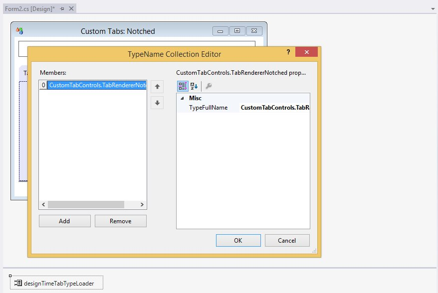

# How to create custom tab renderer class?

'ITabRenderer' interface (or derive from TabRendererBase, a base implementation of ITabRenderer), could be implemented to gain more control over the display of Tabs.

The Renderer property returns the current 'Syncfusion.Windows.Forms.Tools.ITabRenderer' used by the TabControlAdv to render the TabPanel.

Once you have a Custom ITabRenderer implementation, you can, if necessary, make it available to the TabControlAdv at design-time. To do so, 

1. First select the Add Custom Tabs entry in the drop-down list that pops-up from the TabStyle property editor. This will insert a new `DesignTimeTabTypeLoader` component into your forms designer.

   

2. Insert the fully qualified type name of your Custom TabRenderer class (for example: Syncfusion.Samples.Tools.TabRendererNotched) to the DesignTimeTabTypeLoader's TypesToLoadList. This will try to load your class into the DesignTimeTabTypeLoader's TypesToLoadList, assuming the type is in the same project as the designer or the assembly in which this type resides is referenced. You will now find an entry in the `TabStyle` editor list corresponding to your Custom TabRenderer.

   
