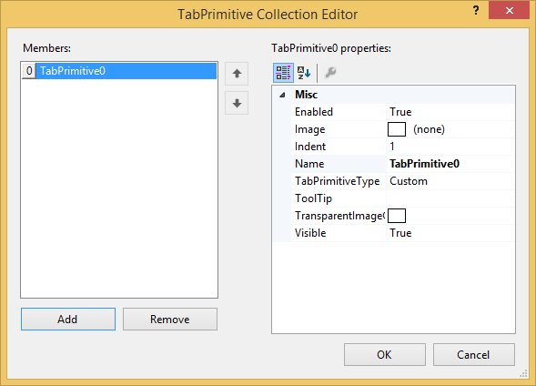
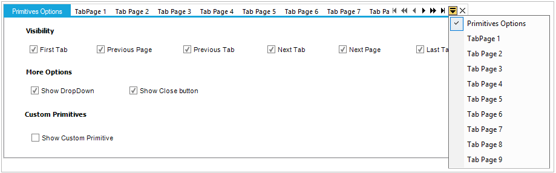

# Tab Navigation in Windows Forms TabControl (TabControlAdv)

[TabPrimitives](https://help.syncfusion.com/cr/windowsforms/Syncfusion.Windows.Forms.Tools.TabPrimitivesCollection.html) is a collection of NavigationControls used to navigate through the [TabPages](https://help.syncfusion.com/cr/windowsforms/Syncfusion.Windows.Forms.Tools.TabControlAdv.html#Syncfusion_Windows_Forms_Tools_TabControlAdv_TabPages) of the [TabControlAdv](https://help.syncfusion.com/cr/windowsforms/Syncfusion.Windows.Forms.Tools.TabControlAdv.html). 

The various TabPrimitives are,

* FirstTab - Goes to the first tab among the pages.
* LastTab - Goes to the last tab among the pages.
* PreviousTab - Goes to the previous tab of the active tab.
* NextTab - Goes to the next tab of the active tab.
* PreviousPage - Goes to the previous page of the active page.
* NextPage - Goes to the next page of the active page.
* DropDown - This pops-up a list of the available tab pages in the control from which the user can select the page to be traversed.
* Close - This button is used to close the TabControlAdv. It can be set to appear for the whole control or individual tab pages. 
* Custom - User can add more buttons through Custom TabPrimitive. This helps the user to create/add more buttons and handle their own click events.

N> The [TabControlAdv.HitTestTabs](https://help.syncfusion.com/cr/windowsforms/Syncfusion.Windows.Forms.Tools.TabControlAdv.html#Syncfusion_Windows_Forms_Tools_TabControlAdv_HitTestTabs_System_Drawing_Point_) method can be used to return the tab at the specified location.

## TabPrimitives features

Apart from doing the defined task of Navigation, [TabPrimitivesHost](https://help.syncfusion.com/cr/windowsforms/Syncfusion.Windows.Forms.Tools.TabControlAdv.html#Syncfusion_Windows_Forms_Tools_TabControlAdv_TabPrimitivesHost) provides options to add Images, ToolTips, and to enable the Visible property for each [TabPrimitive](https://help.syncfusion.com/cr/windowsforms/Syncfusion.Windows.Forms.Tools.TabPrimitive.html).

N> You can set the other properties for adding Images and ToolTips for the TabPrimitives using the [TabPrimitives Collection](https://help.syncfusion.com/cr/windowsforms/Syncfusion.Windows.Forms.Tools.TabPrimitivesCollection.html) Editor.

## Creating TabPrimitives

The [TabPrimitives](https://help.syncfusion.com/cr/windowsforms/Syncfusion.Windows.Forms.Tools.TabPrimitivesCollection.html) can be added to the [TabControlAdv](https://help.syncfusion.com/cr/windowsforms/Syncfusion.Windows.Forms.Tools.TabControlAdv.html) by using either of the following ways,

* Through designer
* Through code-behind

### Through designer

To create [TabPrimitives](https://help.syncfusion.com/cr/windowsforms/Syncfusion.Windows.Forms.Tools.TabPrimitivesCollection.html) through designer, follow the given steps:

1. After adding a TabControlAdv with a set of [TabPages](https://help.syncfusion.com/cr/windowsforms/Syncfusion.Windows.Forms.Tools.TabControlAdv.html#Syncfusion_Windows_Forms_Tools_TabControlAdv_TabPages) in it, select the [TabPrimitivesHost.TabPrimitives](https://help.syncfusion.com/cr/windowsforms/Syncfusion.Windows.Forms.Tools.TabPrimitivesHost.html#Syncfusion_Windows_Forms_Tools_TabPrimitivesHost_TabPrimitives) property in the Properties window.

   

2. A TabPrimitives Collection Editor will be opened. Click the Add option in the Editor to add a TabPrimitive.

   

3. Set the TabPrimitiveType as required and click OK.

   

### Through code





//Adds a TabPrimitive of type DropDown.

this.tabControlAdv4.TabPrimitivesHost.TabPrimitives.Add(new Syncfusion.Windows.Forms.Tools.TabPrimitive(Syncfusion.Windows.Forms.Tools.TabPrimitiveType.DropDown, null, System.Drawing.Color.Empty, true, 1, "TabPrimitive0"));

//Adds a TabPrimitive of type Close.

this.tabControlAdv1.TabPrimitivesHost.TabPrimitives.Add(new Syncfusion.Windows.Forms.Tools.TabPrimitive(Syncfusion.Windows.Forms.Tools.TabPrimitiveType.Close, null, System.Drawing.Color.Empty, true, 1, "TabPrimitive1"));

//Similarly other TabPrimitive types are added.

//Makes the TabPrimitive visible in the control.

this.tabControlAdv1.TabPrimitivesHost.Visible = true;





'Adds a TabPrimitive of type DropDown.

Me.tabControlAdv4.TabPrimitivesHost.TabPrimitives.Add(New Syncfusion.Windows.Forms.Tools.TabPrimitive(Syncfusion.Windows.Forms.Tools.TabPrimitiveType.DropDown, Nothing, System.Drawing.Color.Empty, True, 1, "TabPrimitive0"))

'Adds a TabPrimitive of type Close.

Me.tabControlAdv1.TabPrimitivesHost.TabPrimitives.Add(New Syncfusion.Windows.Forms.Tools.TabPrimitive(Syncfusion.Windows.Forms.Tools.TabPrimitiveType.Close, Nothing, System.Drawing.Color.Empty, True, 1, "TabPrimitive1"))

'Similarly other TabPrimitive types are added.

'Makes the TabPrimitive visible in the control.

Private Me.tabControlAdv1.TabPrimitivesHost.Visible = True





N> After adding [TabPrimitives](https://help.syncfusion.com/cr/windowsforms/Syncfusion.Windows.Forms.Tools.TabPrimitivesCollection.html), set the [TabPrimitiveHost.Visible](https://help.syncfusion.com/cr/windowsforms/Syncfusion.Windows.Forms.Tools.TabPrimitive.html#Syncfusion_Windows_Forms_Tools_TabPrimitive_Visible) property to `true`. Now the added [TabPrimitives](https://help.syncfusion.com/cr/windowsforms/Syncfusion.Windows.Forms.Tools.TabPrimitivesCollection.html) will be visible in the [TabControlAdv](https://help.syncfusion.com/cr/windowsforms/Syncfusion.Windows.Forms.Tools.TabControlAdv.html).

[SwitchPagesForDialogKeys](https://help.syncfusion.com/cr/windowsforms/Syncfusion.Windows.Forms.Tools.TabControlAdv.html#Syncfusion_Windows_Forms_Tools_TabControlAdv_SwitchPagesForDialogKeys) property available for the [TabControlAdv](https://help.syncfusion.com/cr/windowsforms/Syncfusion.Windows.Forms.Tools.TabControlAdv.html) specifies if the control should switch [TabPages](https://help.syncfusion.com/cr/windowsforms/Syncfusion.Windows.Forms.Tools.TabControlAdv.html#Syncfusion_Windows_Forms_Tools_TabControlAdv_TabPages) on pressing <kbd>Ctrl+Tab</kbd> or <kbd>Ctrl+Shift+Tab</kbd>.

The [TabPrimitivesHost](https://help.syncfusion.com/cr/windowsforms/Syncfusion.Windows.Forms.Tools.TabControlAdv.html#Syncfusion_Windows_Forms_Tools_TabControlAdv_TabPrimitivesHost) property allows to customize the navigation and close buttons by defining it through the [TabPrimitives](https://help.syncfusion.com/cr/windowsforms/Syncfusion.Windows.Forms.Tools.TabPrimitivesCollection.html) property Collection. The [TabPrimitives](https://help.syncfusion.com/cr/windowsforms/Syncfusion.Windows.Forms.Tools.TabPrimitivesCollection.html) can be added and each primitive can be assigned with the type to be used, which includes primitives to traverse to the First/Previous/Next/LastTab, Next/PreviousPage, and Close/DropDown options.

