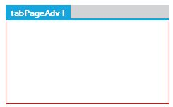

# Customization

The look and feel of the TabControlAdv can be customized through various properties of the control. These properties are discussed in below topics.

## Renaming TabItems

TabControlAdv comes with the renaming functionality similar to MS Excel. Users can edit TabControlAdv's text at run-time using the `LabelEdit` property which has to be set to True. 

<table>
<tr>
<th>
TabControlAdv Property</th><th>
Description</th></tr>
<tr>
<td>
LabelEdit</td><td>
Specifies whether the text of the tabitem is editable. Default value is False.</td></tr>
</table>

To bring the text of the TabItem to the edit mode, the following can be done.

1. Select the text of the TabItem to be edited and right-click on the tab to bring the text to edit mode. The text can now be edited and it can be saved by pressing the Enter key.
2. Also, double-clicking on a tab makes the text change to edit mode.

   

   After editing the text, to come out of the edit mode, press the Enter key or click the Left Mouse button.

3. Programmatically the `LabelEdit` property can be set as follows.




// Renaming TabControlAdv’s Text.

this.tabControlAdv.LabelEdit = true;





' Renaming TabControlAdv’s Text.

Me.tabControlAdv.LabelEdit = True





## Moving TabItems

The order of the tabs within the TabControlAdv can be changed at design-time and also at run-time by simply dragging-and-dropping the tabs in the required places. This can be enabled using the `UserMoveTabs` property.





this.tabControlAdv1.UserMoveTabs = true;





Me.tabControlAdv1.UserMoveTabs = True





## Padding

Using the `Padding` property, the space around the text / image of the TabItems can be changed by setting the X-axis and Y-axis values.

Code snippets to set the Padding





// Setting the Padding for TabControlAdv through Coding. 

this.tabControlAdv1.Padding = new Point(12, 12); 





'Setting the Padding for TabControlAdv through Coding. 

Me.tabControlAdv1.Padding = New Point(12, 12)





## UseMnemonic

This property specifies whether the TabControlAdv interprets the Ampersand character (&) as an Access key prefix character or not. The default value is set to False.

<table>
<tr>
<th>
TabControlAdv Property</th><th>
Description</th></tr>
<tr>
<td>
UseMnemonic</td><td>
Gets / sets the value which determines whether the TabControlAdv should interpret the Ampersand character (&) as an Access key prefix character or not.</td></tr>
</table>

## TabPages

### Border Settings

The `BorderStyle` property of TabControlAdv can be used to set the border styles for the TabPages.

The three types of border styles are given below.

* FixedSingle
* Fixed 3D
* None

<table>
<tr>
<th>
TabControlAdv Property</th><th>
Description</th></tr>
<tr>
<td>
BorderStyle</td><td>
Gets / sets the border styles for the tabpages. It includes the following styles:FixedSingleFixed3DNone</td></tr>
</table>

#### FixedSingleBorderColor

The `FixedSingleBorderColor` property is used to set the border color of the TabPage in the TabControlAdv when the BorderStyle is set to FixedSingle.

<table>
<tr>
<th>
TabControlAdv Property</th><th>
Description</th></tr>
<tr>
<td>
FixedSingleBorderColor</td><td>
Gets / sets border color of the TabPage in the TabControlAdv when the BorderStyle is set to FixedSingle.</td></tr>
</table>

N> The TabControlAdv.ResetFixedSingleBorderColor() method resets the border color of the TabPage to the default value.

 
### Image Settings

TabControlAdv now supports animation on TabPages. Animated image in GIF can be inserted in a TabPage. The format supports up to 8 bits per pixel with a palette of up to 256 distinct colors chosen from the 24-bit RGB color space. Both 3D and 2D formats are supported.

Users can insert graphics or logos with solid areas of color, small animations, low-resolution film clips etc. to make the TabPage more interactive and lively. The size of the image can also be adjusted. 

There are two major properties which come into picture:

* Image
* Image size

The following table lists the properties of the GIF image:

<table>
<tr>
<td>
 Property</td><td>
Description</td><td>
Type of Property</td></tr>
<tr>
<td>
Image</td><td>
Allows the user to insert the required image using the location where the image is saved.</td><td>
Image</td></tr>
<tr>
<td>
ImageSize</td><td>
Allows the users to modify the size of the image.</td><td>
Size</td></tr>
</table>

#### Inserting GIF Image

The code should be in the following format:



this.tabPageAdv.Image = Image.FromFile(imagepath);

this.tabPageAdv.ImageSize = new System.Drawing.Size(height,width);



The following code illustrates insertion of the required GIF image.



this.tabPageAdv.Image = Image.FromFile(“sample.gif”);

this.tabPageAdv.ImageSize = new System.Drawing.Size(16,16);



N> Only when the ImageIndex property is -1, Image from the Image property will be displayed or else Image from ImageList will be displayed.

### Prevent moving a specific Tab in TabControlAdv 

TabControlAdv now allows to prevent a specific Tab from being moved on TabControlAdv. This is achieved by using the property named **TabMoving**.




//Prevents moving the tab.

this this.tabControlAdv1.TabMoving += new Syncfusion.Windows.Forms.Tools.TabMovingEventHandler(tabControlAdv1_TabMoving);

void tabControlAdv1_TabMoving(object sender, Syncfusion.Windows.Forms.Tools.TabMovingEventArgs e)
        {

            if(e.From == 1 || e.Target == 1)

            {

                e.Cancel = true;

            }

        }     





‘Prevents moving the tab.

Private Me.tabControlAdv1.TabMoving += New Syncfusion.Windows.Forms.Tools.TabMovingEventHandler(AddressOf tabControlAdv1_TabMoving)

Private Sub tabControlAdv1_TabMoving(ByVal sender As Object, ByVal e As Syncfusion.Windows.Forms.Tools.TabMovingEventArgs)

If e.From = 1 OrElse e.Target = 1 Then

e.Cancel = True

End If

End Sub



