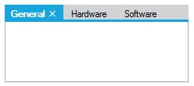

# How to enable themes in TabControlAdv?
The TabControlAdv can be themed by enabling the `ThemesEnabled` property.

N> On setting this property, all the TabPages will be themed. This can be disabled or enabled for individual pages using the TabPageAdv.ThemesEnabled property.





this.tabControlAdv1.ThemesEnabled = true;





Me.tabControlAdv1.ThemesEnabled = True





