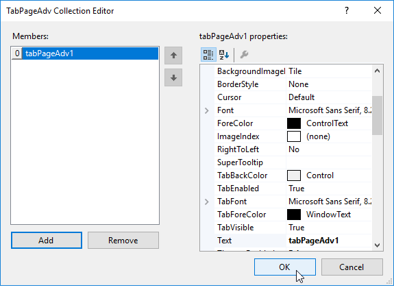

# Getting started

This section explains how to design a `TabControlAdv` control in a Windows Forms application and overview of its basic functionalities.

## Assembly deployment

The following list of assemblies should be added as reference to use the TabControlAdv in any application:

<table>
<tr>
<td>
{{'**Required assemblies**'| markdownify }}
</td>
<td>
{{'**Description**'| markdownify }}
</td>
</tr>
<tr>
<td>
Syncfusion.Grid.Base.dll
</td>
<td>
Syncfusion.Grid.Base contains classes that contains fundamentals and base classes of GridControl
</td>
</tr>
<tr>
<td>
Syncfusion.Grid.Windows.dll
</td>
<td>
Syncfusion.Grid.Windows contains classes that handles all UI operations, fundamentals and base classes of GridControl which are used in the TabControlAdv control
</td>
</tr>
<tr>
<td>
Syncfusion.Shared.Base.dll
</td>
<td>
Syncfusion.Shared.Base contains style related properties of TabControlAdv and various editor controls
</td>
</tr>
<tr>
<td>
Syncfusion.Shared.Windows.dll
</td>
<td>
Syncfusion.Shared.Windows contains style related properties of TabControlAdv and various editor controls
</td>
</tr>
<tr>
<td>
Syncfusion.Tools.Base.dll
</td>
<td>
Syncfusion.Tools.Base contains base class which used for TabControlAdv control
</td>
</tr>
<tr>
<td>
Syncfusion.Tools.Windows.dll
</td>
<td>
Syncfusion.Tools.Windows contains the class that handles all UI operations and contains helper class of TabControlAdv control
</td>
</tr>
</table>

## Installing NuGet Packages

To create the Windows Forms application with TabControlAdv, the following nuget packages should be installed.

<table>
<tr>
<td>{{'**S.no**'| markdownify }}
</td>
<td>{{'**Framework version**'| markdownify }}
</td>
<td>{{'**NuGet Packages**'| markdownify }}
</td>
</tr>
<tr>
<td> 1
</td>
<td> 2.0
</td>
<td> Syncfusion.Tools.Windows20
</td>
</tr>
<tr>
<td> 2
</td>
<td> 3.5
</td>
<td> Syncfusion.Tools.Windows35
</td>
</tr>
<tr>
<td> 3
</td>
<td> 4.0
</td>
<td> Syncfusion.Tools.Windows40
</td>
</tr>
<tr>
<td> 4
</td>
<td> 4.5
</td>
<td> Syncfusion.Tools.Windows45
</td>
</tr>
<tr>
<td> 5
</td>
<td> 4.5.1
</td>
<td> Syncfusion.Tools.Windows451
</td>
</tr>
<tr>
<td> 6
</td>
<td> 4.6
</td>
<td> Syncfusion.Tools.Windows46
</td>
</tr>
</table>

Please find more details regarding how to install the nuget packages in windows form application in the below link:

[How to install nuget packages](https://help.syncfusion.com/windowsforms/nuget-packages)

# Creating simple application with TabControlAdv

You can create the Windows Forms application with TabControlAdv control as follows:

1. [Creating the project](#creating-the-project)
2. [Adding control via designer](#adding-control-via-designer)
3. [Adding control manually in code](#adding-control-manually-in-code)
4. [Add TabPages](#add-tabpages)

### Creating the project

Create a new Windows Forms project in the Visual Studio to display the TabControlAdv.

## Adding control via designer

The TabControlAdv control can be added to the application by dragging it from the toolbox and dropping it in a designer view. The following required assembly references will be added automatically:

   * Syncfusion.Grid.Base.dll
   * Syncfusion.Grid.Windows.dll
   * Syncfusion.Shared.Base.dll
   * Syncfusion.Shared.Windows.dll
   * Syncfusion.Tools.Base.dll
   * Syncfusion.Tools.Windows.dll

 

 The following screenshot illustrates after drag and dropping the TabControlAdv from the ToolBox:

 

## Adding control manually in code

To add control manually in C#, follow the given steps:

**Step1:** Add the following required assembly references to the project:

   * Syncfusion.Grid.Base.dll
   * Syncfusion.Grid.Windows.dll
   * Syncfusion.Shared.Base.dll
   * Syncfusion.Shared.Windows.dll
   * Syncfusion.Tools.Base.dll
   * Syncfusion.Tools.Windows.dll

**Step2:** Include the namespaces **Syncfusion.Windows.Forms.Tools**.





using Syncfusion.Windows.Forms.Tools;





Imports Syncfusion.Windows.Forms.Tools





**Step3:** Create an instance of `TabControlAdv` and add it to the form.





TabControlAdv tabControlAdv1 = new TabControlAdv();

this.Controls.Add(tabControlAdv1);





Dim tabControlAdv1 As TabControlAdv  = New TabControlAdv()

Me.Controls.Add(tabControlAdv1)





## Add TabPages

TabPages can be added to TabControlAdv through designer by right clicking on the `TabControlAdv` and select the Add Tab option.

 
We can also add tabs with the help of TabPageAdv Collection Editor. In the TabPageAdv Collection Editor, we can add the tabs by clicking `Add` button.

This can also be done programmatically by using the following code examples.





this.tabControlAdv1.TabStyle = typeof(Syncfusion.Windows.Forms.Tools.TabRendererOffice2016Colorful);

TabPageAdv tabPageAdv1 = new TabPageAdv();

this.tabPageAdv1.Text = "tabPageAdv1";

this.tabControlAdv1.Controls.Add(this.tabPageAdv1);





Me.tabControlAdv1.TabStyle = GetType(Syncfusion.Windows.Forms.Tools.TabRendererOffice2016Colorful)

Dim tabPageAdv1 As TabPageAdv  = New TabPageAdv()

Me.tabControlAdv1.Controls.Add(Me.tabPageAdv1)

Me.tabPageAdv1.Text = "tabPageAdv1"





 
