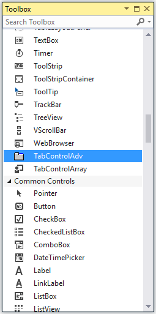
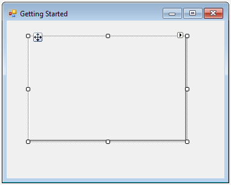
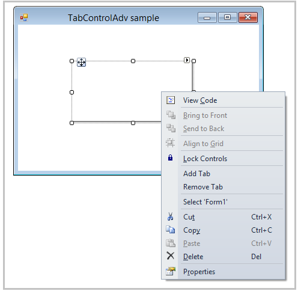
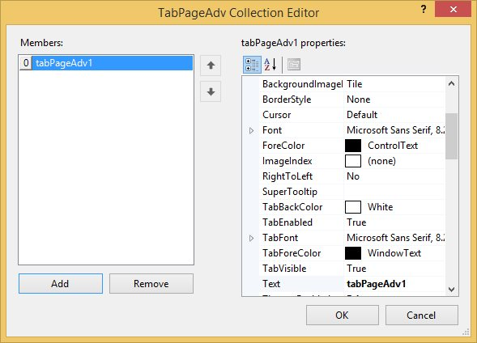
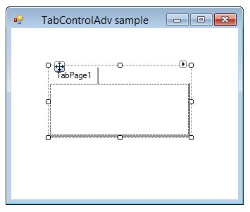

# Getting Started

The TabControlAdv can be added to Windows Forms application by using either of the following ways,

* Through Designer
* Through Code-Behind

## Through Designer

Syncfusion UI for Windows Forms are added automatically to the Visual Studio Toolbox during installation. The following steps helps to add TabControlAdv through drag and drop from Toolbox.

1. Create a Windows Forms project in Visual Studio.

2. Find TabControlAdv by typing the name of the TabControlAdv in the search box.

   

3. Drag TabControlAdv and drop it in the designer.

   
   
4. Add TabPages to the control in the designer in the following ways.

5. Right click on the TabControlAdv and select the Add Tab option. This adds a TabPage to the TabControlAdv.

   

6. In the properties window, select the TabPages property. The TabPageAdv Collection Editor will be opened. Click Add, a TabPage will be added to the TabControlAdv.

  

  

  

## Through Code

The following steps helps to add TabControlAdv through code. 

1. Create a Windows Forms project in Visual Studio and include following assemblies.

   * Syncfusion.Grid.Windows.dll
   * Syncfusion.Grid.Base.dll
   * Syncfusion.Shared.Base.dll
   * Syncfusion.Shared.Windows.dll
   * Syncfusion.Tools.Base.dll
   * Syncfusion.Tools.Windows.dll

2. Create an instance of TabControlAdv and TabPageAdv using it namespace.





Syncfusion.Windows.Forms.Tools.TabControlAdv tabControlAdv1 = new Syncfusion.Windows.Forms.Tools.TabControlAdv();

Syncfusion.Windows.Forms.Tools.TabPageAdv tabPageAdv1 = new Syncfusion.Windows.Forms.Tools.TabPageAdv();





Dim tabControlAdv1 As New Syncfusion.Windows.Forms.Tools.TabControlAdv()

Dim tabPageAdv1 As New Syncfusion.Windows.Forms.Tools.TabPageAdv()





3. The following code creates a TabControlAdv with TabPageAdv.





private void Form1_Load(object sender, System.EventArgs e)
{

//Initialize the tabControlAdv and tabPageAdv

this.tabControlAdv1 = new TabControlAdv();

this.tabPageAdv1 = new TabPageAdv();

//Add the TabPageAdv to the TabControlAdv.

this.tabControlAdv1.Controls.Add(this.tabPageAdv1);

//Set the location of the TabControlAdv

this.tabControlAdv1.Location = new Point(16, 24);

//Set the text of the TabPageAdv

this.tabPageAdv1.Text = "TabPage1";

//Add the TabControlAdv to your form                

this.Controls.AddRange(new Control[] { this.tabControlAdv1});

}





Private Sub Form1_Load(ByVal sender As Object, ByVal e As System.EventArgs) Handles MyBase.Load

'Initialize the tabControlAdv and tabPageAdv

Me.tabControlAdv1 = New TabControlAdv()

Me.tabPageAdv1 = New TabPageAdv()

'Add the TabPageAdv to the TabControlAdv.

Me.tabControlAdv1.Controls.Add(Me.tabPageAdv1)

'Set the location of the TabControlAdv

Me.tabControlAdv1.Location = New Point(16, 24)

'Set the text of the TabPageAdv

Me.tabPageAdv1.Text = "TabPage1"

'Add the TabControlAdv to your form                

Me.Controls.AddRange(New Control() {Me.tabControlAdv1})

End Sub
		




	

