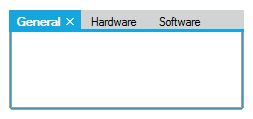
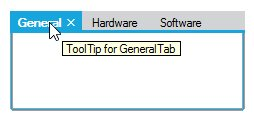
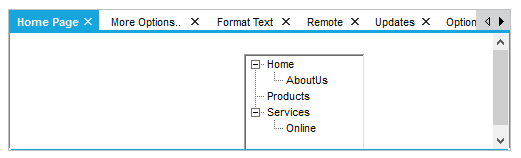

# Interactive Features

## CloseButton Settings

TabControlAdv can have CloseButtons for all the TabPages to close the corresponding TabPages irrespective of the Style set.

Close Button on all the TabItems can be made visible by setting the `ShowTabCloseButton` property to True.





this.tabControlAdv1.ShowTabCloseButton = true;





Me.tabControlAdv1.ShowTabCloseButton = True





Also the Tab Close Button can be restricted to be shown only for ActiveTabPage. This can be done by setting the `ShowCloseButtonForActiveTabOnly` property to True.





this.tabControlAdv1.ShowCloseButtonForActiveTabOnly = true;





Me.tabControlAdv1.ShowCloseButtonForActiveTabOnly = True





N> Close Button can be set for the whole TabControlAdv by using [Tab Navigation](/windowsforms/tabcontroladv/tab-navigation).

## ToolTip Support

ToolTip for the TabControlAdv can be enabled using the `ShowToolTip` property and the tooltip text for the TabPages can be specified using the `ToolTipText` property of individual pages which allows to provide a unique ToolTip for each page.





this.tabControlAdv1.ShowToolTips = true;

this.tabPageAdv1.ToolTipText = "Tooltips for tab page 1";





Me.tabControlAdv1.ShowToolTips = True

Me.tabPageAdv1.ToolTipText = "Tooltips for tab page 1"





## SuperTooltip Support

TabControlAdv can now display `SuperToolTip` on the Tabs when mouse hovered.





this.tabControlAdv1.ShowSuperToolTips  = true;

this.tabPageAdv1.SuperToolTips  = true;





Me.tabControlAdv1.ShowSuperToolTips  = True

Me.tabPageAdv1.SuperToolTips  = True





## Scroll Settings

This section discusses about the Scrolling properties available in the TabControlAdv.

### ScrollButton

TabControlAdv has the ability to add ScrollButtons on the TabPanel when the number of tab items increase. These ScrollButtons allows the user to navigate through the TabPages in the front and back. For this, the `ShowScroll` property of the TabControlAdv must be set.

<table>
<tr>
<th>
TabControlAdv Property</th><th>
Description</th></tr>
<tr>
<td>
ShowScroll</td><td>
Specifies whether to show the scrollbutton.</td></tr>
</table>

ScrollButtons can have a VS like scrollbutton-look and normal button look.

For VS like scrollbutton-look, the `VSLikeScrollButton` property has to be set to true.





this.tabControlAdv1.ShowScroll = true;

this.tabControlAdv1.VSLikeScrollButton = true;





Me.tabControlAdv1.ShowScroll = True

Me.tabControlAdv1.VSLikeScrollButton = True





### ScrollBars

ScrollBars can be set for the TabPages for which the `AutoScroll` property has to be set to true. The `AutoScrollMinSize` is set to a value, which if exceeded, enables the TabControlAdv to automatically add a scrollbar to the TabPage. Setting `AutoScrollMargin`, allows to maintain a minimum distance between the end margin of any control that is placed inside the TabPage and the margin of the TabPage.

`ScrollIncrement` property is used to specify whether to scroll through Tabs or Pages.

<table>
<tr>
<th>
TabPageAdv Property</th><th>
Description</th></tr>
<tr>
<td>
AutoScroll</td><td>
Specifies to add a scrollbar to the tabpage. Default value is False.</td></tr>
<tr>
<td>
AutoScrollMargin</td><td>
Specifies the distance to be maintained between any control that is placed inside the page and the tab margin.</td></tr>
<tr>
<td>
AutoScrollMinSize</td><td>
Specifies the size of the tabpage, which if exceeded, would  enable scrollbars to be added.</td></tr>
</table>

N> The TabControlAdv.BringSelectedTabToView() method is used to bring the selected Tab to view, if scrolled out of view.





this.tabPageAdv1.AutoScroll = true;

this.tabPageAdv1.AutoScrollMargin = new System.Drawing.Size(20, 20);

this.tabPageAdv1.AutoScrollMinSize = new System.Drawing.Size(50, 50);

this.tabControlAdv1.ScrollIncrement = Syncfusion.Windows.Forms.Tools.ScrollIncrement.Page;

this.tabControlAdv1.BringSelectedTabToView();





Private Me.tabPageAdv1.AutoScroll = True

Private Me.tabPageAdv1.AutoScrollMargin = New System.Drawing.Size(20, 20)

Private Me.tabPageAdv1.AutoScrollMinSize = New System.Drawing.Size(50, 50)

Private Me.tabControlAdv1.ScrollIncrement = Syncfusion.Windows.Forms.Tools.ScrollIncrement.Page

Private Me.tabPageAdv1.BringSelectedTabToView()





