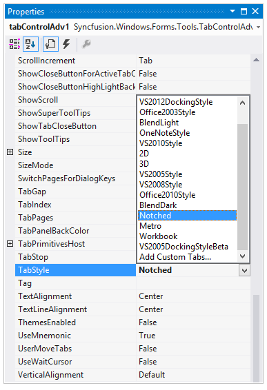
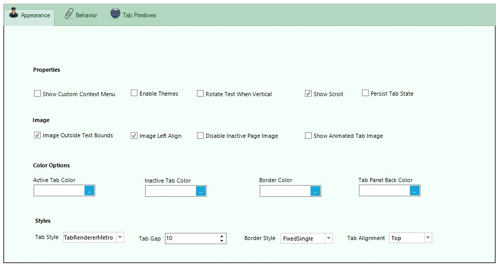

---
layout: post
title: Styles-Settings | WindowsForms | Syncfusion
description: styles settings
platform: WindowsForms
control: TabControlAdv
documentation: ug
---

# Styles Settings

This section discusses the various Style Settings available in TabControlAdv.

## ITabRenderer

'ITabRenderer' interface (or derive from TabRendererBase, a base implementation of ITabRenderer), could be implemented to gain more control over the display of Tabs. 

The Renderer property returns the current 'Syncfusion.Windows.Forms.Tools.ITabRenderer' used by the TabControlAdv to render the TabPanel.

Once you have a Custom ITabRenderer implementation, you can, if necessary, make it available to the TabControlAdv at design-time. To do so, 

1. First select the Add Custom Tabs entry in the drop-down list that pops-up from the TabStyle property editor. This will insert a new DesignTimeTabTypeLoader component into your forms designer. 

   

2. Insert the fully qualified type name of your Custom TabRenderer class (for example: Syncfusion.Samples.Tools.TabRendererNotched) to the DesignTimeTabTypeLoader's TypesToLoadList. This will try to load your class into the DesignTimeTabTypeLoader's TypesToLoadList, assuming the type is in the same project as the designer or the assembly in which this type resides is referenced. You will now find an entry in the TabControlAdv.TabStyle editor list corresponding to your Custom TabRenderer. 

   



[TabStyles](/windowsforms/tabs/styles-settings#tabstyles)



## Tab Alignment

Alignment of the Tabs can be set through the below properties.

<table>
<tr>
<th>
TabControlAdv Property</th><th>
Description</th></tr>
<tr>
<td>
Alignment</td><td>
Specifies the alignment of tabitems with respect to the tab pages. The options include:TopBottomLeftRight</td></tr>
<tr>
<td>
VerticalAlignment</td><td>
Specifies whether the tabs are aligned to the Top, Bottom or based on the RightToLeft property when aligned vertically.</td></tr>
<tr>
<td>
TabGap</td><td>
Specifies the space between the tabitems.</td></tr>
<tr>
<td>
Top</td><td>
Gets / sets the distance, in pixels, between the top edge of the control and the top edge of the container's client area.</td></tr>
<tr>
<td>
Right</td><td>
Gets / sets the distance, in pixels, between the right edge of the control and the left edge of the container's client area.</td></tr>
</table>





this.tabControlAdv1.Alignment = System.Windows.Forms.TabAlignment.Left;

this.tabControlAdv1.TabGap = 2;





Me.tabControlAdv1.Alignment = System.Windows.Forms.TabAlignment.Left

Me.tabControlAdv1.TabGap = 2







[TabStyles](/windowsforms/tabs/styles-settings#tabstyles)



## Text Alignment

The below properties deals with alignment of the text in the TabControlAdv.

<table>
<tr>
<th>
TabPageAdv Property</th><th>
Description</th></tr>
<tr>
<td>
TextAlignment</td><td>
Specifies horizontal alignment for the text of the tabitem.</td></tr>
<tr>
<td>
TextLineAlignment</td><td>
Specifies vertical alignment for the text of the tabitem.</td></tr>
</table>





this.tabControlAdv1.TextAlignment = System.Drawing.StringAlignment.Far;

this.tabControlAdv1.TextLineAlignment = System.Drawing.StringAlignment.Near;





Me.tabControlAdv1.TextAlignment = System.Drawing.StringAlignment.Far

Me.tabControlAdv1.TextLineAlignment = System.Drawing.StringAlignment.Near





## SizeMode

The SizeMode of the TabStrip allows to position the TabItems according to the selected options.

<table>
<tr>
<th>
TabControlAdv property</th><th>
Description</th></tr>
<tr>
<td>
SizeMode</td><td>
Specifies how the tabs should be sized and aligned. The options include:Normal,Fixed,FillToRight,ShrinkToFit.</td></tr>
</table>

* In Normal mode, the size of each tab depends on the text and image settings of the tab.
* In Fixed mode, the size of each tab is the same as the value specified in the ItemSize property.
* In ShrinkToFit mode, the width of each tab is shrunk so that all the tabs are visible (this is only applicable to the TabControlAdv in single-line mode). 
* In FillToRight mode, the width of each tab is sized so that each row of tabs occupies the entire width of the ContainerControl (this is only applicable to TabControlAdv with more than one row).





this.tabControlAdv1.SizeMode = Syncfusion.Windows.Forms.Tools.TabSizeMode.Normal;

this.tabControlAdv1.SizeMode = Syncfusion.Windows.Forms.Tools.TabSizeMode.Fixed;

this.tabControlAdv1.SizeMode = Syncfusion.Windows.Forms.Tools.TabSizeMode.ShrinkToFit;

this.tabControlAdv1.SizeMode = Syncfusion.Windows.Forms.Tools.TabSizeMode.FillToRight;





Me.tabControlAdv1.SizeMode = Syncfusion.Windows.Forms.Tools.TabSizeMode.Normal

Me.tabControlAdv1.SizeMode = Syncfusion.Windows.Forms.Tools.TabSizeMode.Fixed

Me.tabControlAdv1.SizeMode = Syncfusion.Windows.Forms.Tools.TabSizeMode.ShrinkToFit

Me.tabControlAdv1.SizeMode = Syncfusion.Windows.Forms.Tools.TabSizeMode.FillToRight





The below methods are raised when the TabControlAdv is resized.

<table>
<tr>
<th>
Methods</th><th>
Description</th></tr>
<tr>
<td>
AutoSize</td><td>
Specifies whether a control should automatically resize itself to fit it's contents. The default value is set to False.</td></tr>
<tr>
<td>
AutoSizeMode</td><td>
Specifies the mode by which the user interface element automatically resizes itself. The options include:**GrowOnly** - This is used only when the controls have to be expanded.**GrowAndShrink** - This is used when the controls have to be expanded and shrunk. </td></tr>
</table>

## TabStyles

TabControlAdv provides options to customize the TabStyle settings. Styles can be set through **TabStyle** property.

<table>
<tr>
<th>
TabControlAdv Property</th><th>
Description</th></tr>
<tr>
<td>
TabStyle</td><td>
Specifies the look and feel of the Tabcontrol. The options include,2D,3D,Workbook,InternetExplorer7Style,OneNoteStyle,VS2005DockingStyle,Office2007Style,VS2005Style,VS2005DockingStyleBeta,Office2003Style and VS2008Style.</td></tr>
</table>




this.tabControlAdv1.TabStyle = typeof(Syncfusion.Windows.Forms.Tools.TabRendererWorkbookMode);





Me.tabControlAdv1.TabStyle = GetType(Syncfusion.Windows.Forms.Tools.TabRendererWorkbookMode)





Given below are the various TabStyles along with the Metro, Office 2007 Style supporting all the three color schemes (Blue, Silver and Black).

## Custom Color Schemes

Custom colors can also be applied to the TabControlAdv. Use the below code snippet.





//Set the below code for applying the managed color scheme.

this.FormTabControl.TabStyle = typeof(TabRendererOffice2007);

this.FormTabControl.Office2007ColorScheme = Office2007Theme.Managed;

Office2007Colors.ApplyManagedColors(this, Color.Green);





'Set the below code for applying the managed color scheme.

Me.FormTabControl.TabStyle = GetType(TabRendererOffice2007)

Me.FormTabControl.Office2007ColorScheme = Office2007Theme.Managed

Office2007Colors.ApplyManagedColors(Me, Color.Green)





