# Style settings

This section discusses the various Style Settings available in TabControlAdv.

## TabStyles

TabControlAdv provides options to customize the TabStyle settings. Styles can be set through `TabStyle` property.

<table>
<tr>
<th>
TabControlAdv property</th><th>
Description</th></tr>
<tr>
<td>
TabStyle</td><td>
Specifies the look and feel of the TabControlAdv. The options include,2D,3D,Workbook,InternetExplorer7Style,OneNoteStyle,VS2005DockingStyle,Office2007Style,VS2005Style,VS2005DockingStyleBeta,Office2003Style, VS2008Style Metro, Office2016Colorful, Office2016White, Office2016DarkGray and Office2016Black.</td></tr>
</table>

#### 2D

This option helps to set the 2D theme.

#####  Code sample





// 2D

this.tabControlAdv1.TabStyle = typeof(Syncfusion.Windows.Forms.Tools.TabRenderer2D);





'2D

Me.tabControlAdv1.TabStyle = typeof(Syncfusion.Windows.Forms.Tools.TabRenderer2D)





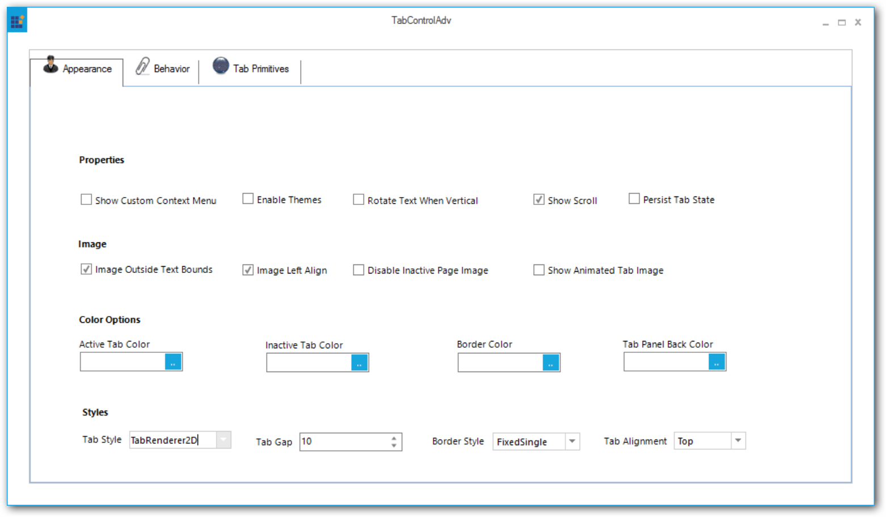

#### 3D

This option helps to set the 3D theme.

#####  Code sample





// 3D

this.tabControlAdv1.TabStyle = typeof(Syncfusion.Windows.Forms.Tools.TabRenderer3D);





'3D

Me.tabControlAdv1.TabStyle = typeof(Syncfusion.Windows.Forms.Tools.TabRenderer3D)





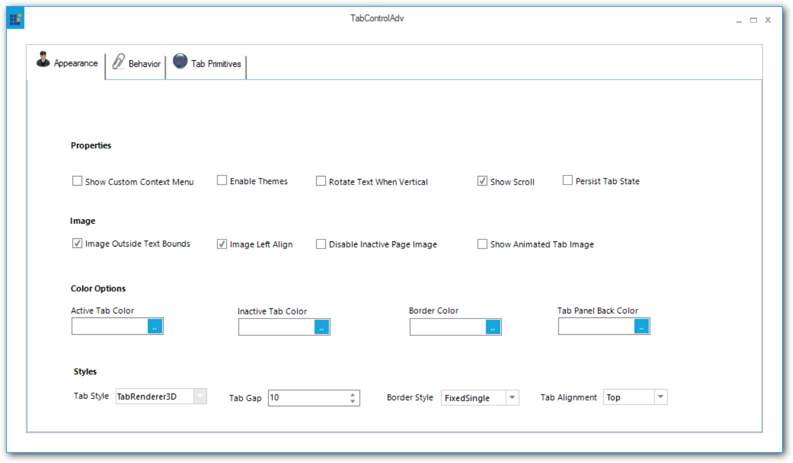

#### Workbook

This option helps to set the Workbook theme.

#####  Code sample





// Workbook

this.tabControlAdv1.TabStyle = typeof(Syncfusion.Windows.Forms.Tools.TabRendererWorkbookMode);





'Workbook

Me.tabControlAdv1.TabStyle = typeof(Syncfusion.Windows.Forms.Tools.TabRendererWorkbookMode)





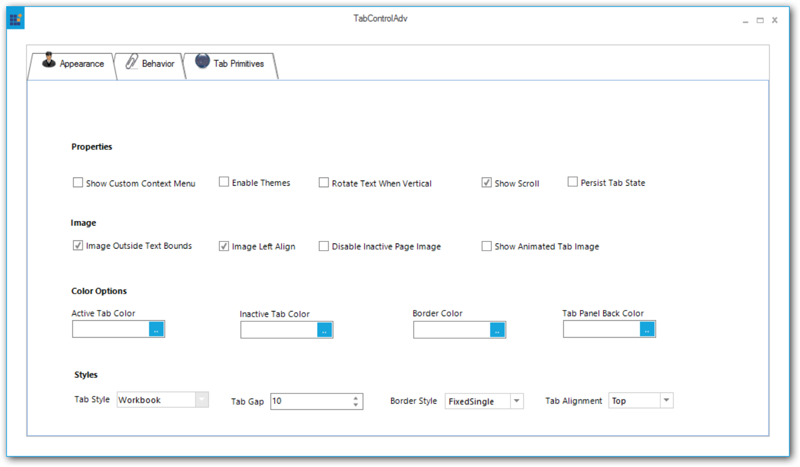

#### InternetExplorer7

This option helps to set the InternetExplorer7 theme.

##### Code sample





// InternetExplorer7

this.tabControlAdv1.TabStyle = typeof(Syncfusion.Windows.Forms.Tools.TabRendererIE7);





'InternetExplorer7

Me.tabControlAdv1.TabStyle = typeof(Syncfusion.Windows.Forms.Tools.TabRendererIE7)





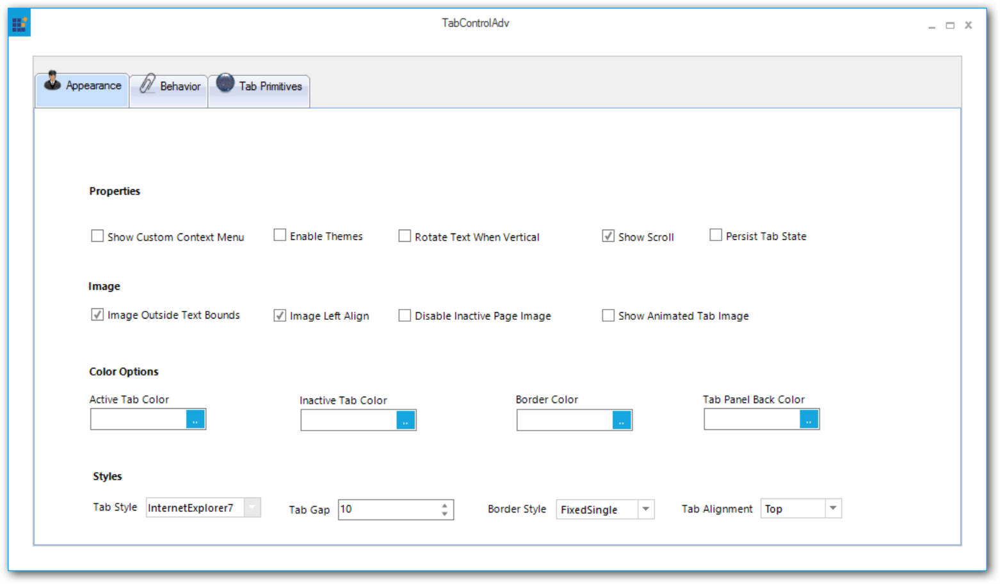

#### OneNoteStyle

This option helps to set the OneNoteStyle theme.

##### Code sample





// OneNoteStyle

this.tabControlAdv1.TabStyle = typeof(Syncfusion.Windows.Forms.Tools.OneNoteStyleRenderer);





'OneNoteStyle

Me.tabControlAdv1.TabStyle = typeof(Syncfusion.Windows.Forms.Tools.OneNoteStyleRenderer)





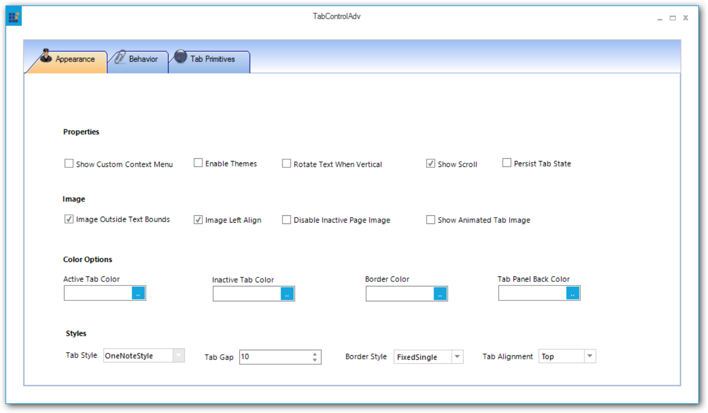

#### VS2005DockingStyle

This option helps to set the VS2005DockingStyle.

##### Code sample





// VS2005DockingStyle

this.tabControlAdv1.TabStyle = typeof(Syncfusion.Windows.Forms.Tools.TabRendererDockingWhidbey);





'VS2005DockingStyle

Me.tabControlAdv1.TabStyle = typeof(Syncfusion.Windows.Forms.Tools.TabRendererDockingWhidbey)





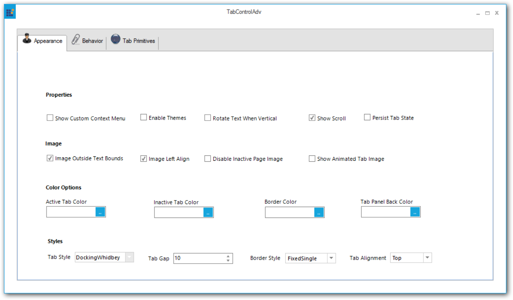

#### Office2007Blue

This option helps to set the Office2007Blue theme.

##### Code sample





// Office2007Blue

this.tabControlAdv1.TabStyle = typeof(Syncfusion.Windows.Forms.Tools.TabRendererOffice2007);
this.tabControlAdv1.Office2007ColorScheme = Office2007Theme.Blue;





'Office2007Blue

Me.tabControlAdv1.TabStyle = typeof(Syncfusion.Windows.Forms.Tools.TabRendererOffice2007)
Me.tabControlAdv1.Office2007ColorScheme = Office2007Theme.Blue





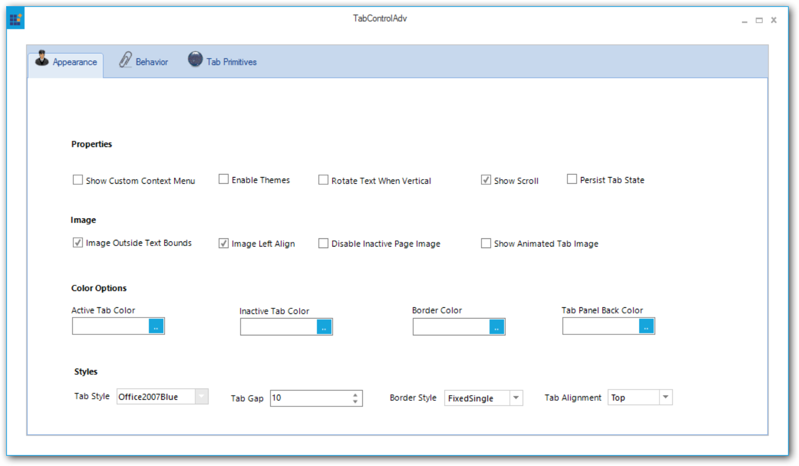

#### Office2007Black

This option helps to set the Office2007Black theme.

##### Code sample





// Office2007Black

this.tabControlAdv1.TabStyle = typeof(Syncfusion.Windows.Forms.Tools.TabRendererOffice2007);
this.tabControlAdv1.Office2007ColorScheme = Office2007Theme.Black;





'Office2007Black

Me.tabControlAdv1.TabStyle = typeof(Syncfusion.Windows.Forms.Tools.TabRendererOffice2007)
Me.tabControlAdv1.Office2007ColorScheme = Office2007Theme.Black





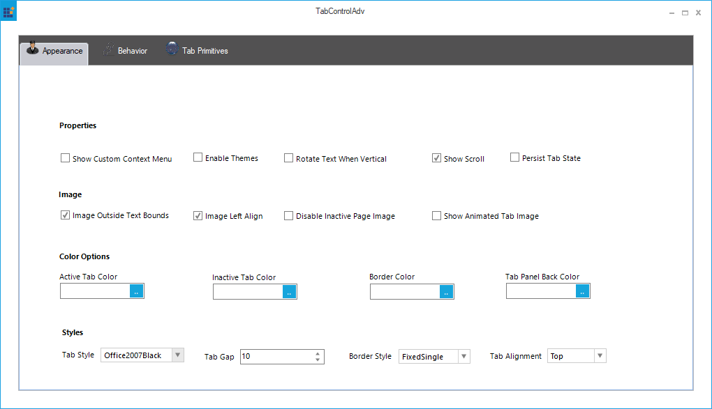

#### Office2007Silver

This option helps to set the Office2007Silver theme.

##### Code sample





// Office2007Silver

this.tabControlAdv1.TabStyle = typeof(Syncfusion.Windows.Forms.Tools.TabRendererOffice2007);
this.tabControlAdv1.Office2007ColorScheme = Office2007Theme.Silver;





'Office2007Silver

Me.tabControlAdv1.TabStyle = typeof(Syncfusion.Windows.Forms.Tools.TabRendererOffice2007)
Me.tabControlAdv1.Office2007ColorScheme = Office2007Theme.Silver





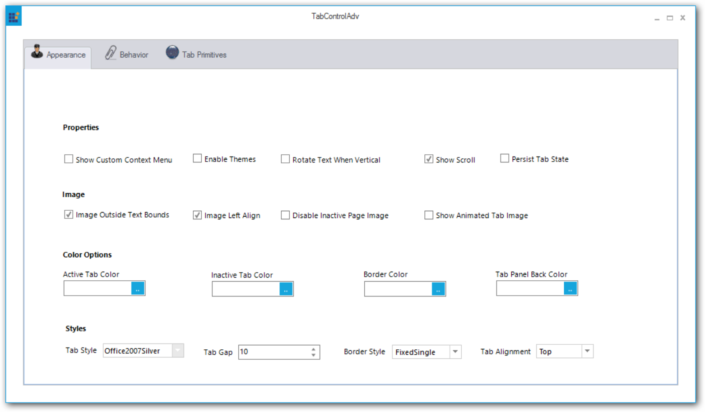

#### VS2005Style

This option helps to set the VS2005Style.

##### Code sample





// VS2005Style

this.tabControlAdv1.TabStyle = typeof(Syncfusion.Windows.Forms.Tools.TabRendererWhidbey);





'VS2005Style

Me.tabControlAdv1.TabStyle = typeof(Syncfusion.Windows.Forms.Tools.TabRendererWhidbey)





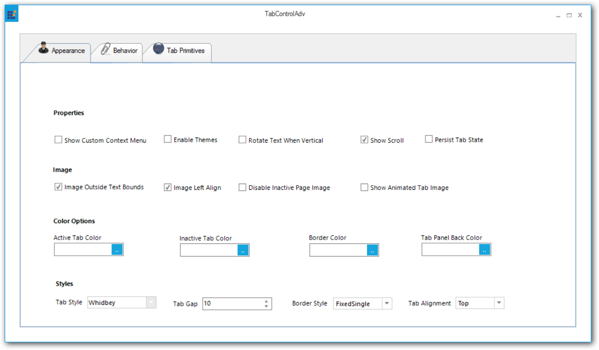

#### VS2005DockingBetaStyle

This option helps to set the VS2005DockingBetaStyle.

##### Code sample





// VS2005DockingBetaStyle

this.tabControlAdv1.TabStyle = typeof(Syncfusion.Windows.Forms.Tools.TabRendererDockingWhidbeyBeta);





'VS2005DockingBetaStyle

Me.tabControlAdv1.TabStyle = typeof(Syncfusion.Windows.Forms.Tools.TabRendererDockingWhidbeyBeta)





#### Office2003

This option helps to set the Office2003 theme.

##### Code sample





// Office2003

this.tabControlAdv1.TabStyle = typeof(Syncfusion.Windows.Forms.Tools.TabRendererOffice2003);





'Office2003

Me.tabControlAdv1.TabStyle = typeof(Syncfusion.Windows.Forms.Tools.TabRendererOffice2003)





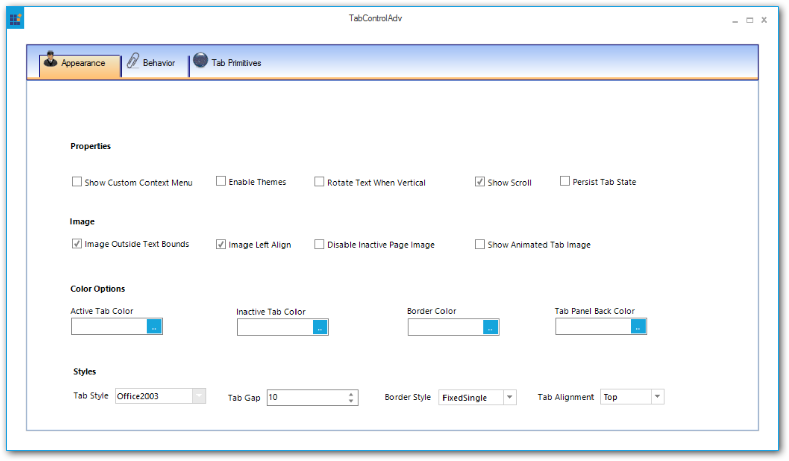

#### VS2008

This option helps to set the VS2008 theme.

##### Code sample





// VS2008

this.tabControlAdv1.TabStyle = typeof(Syncfusion.Windows.Forms.Tools.TabRendererVS2008);





'VS2008

Me.tabControlAdv1.TabStyle = typeof(Syncfusion.Windows.Forms.Tools.TabRendererVS2008)





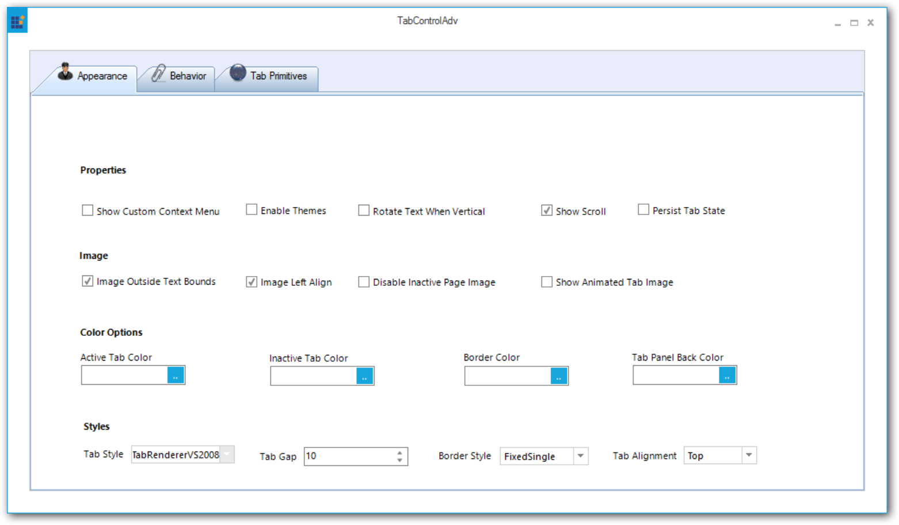

#### VS2010

This option helps to set the VS2010 theme.

##### Code sample





// VS2010

this.tabControlAdv1.TabStyle = typeof(Syncfusion.Windows.Forms.Tools.TabRendererVS2010);





'VS2010

Me.tabControlAdv1.TabStyle = typeof(Syncfusion.Windows.Forms.Tools.TabRendererVS2010)





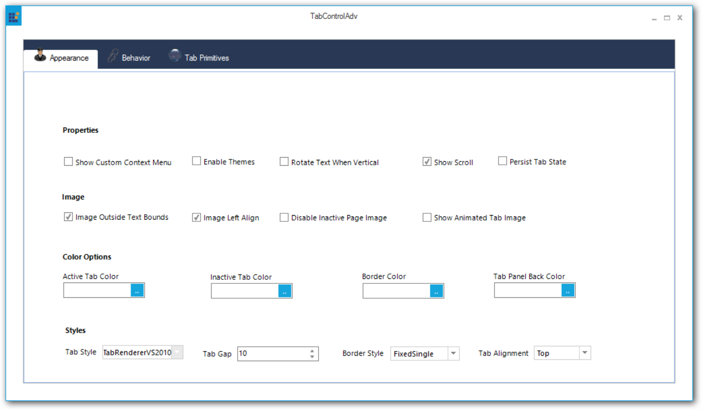

#### Metro

This option helps to set the Metro theme.

##### Code sample





// Metro

this.tabControlAdv1.TabStyle = typeof(Syncfusion.Windows.Forms.Tools.TabRendererMetro);





'Metro

Me.tabControlAdv1.TabStyle = typeof(Syncfusion.Windows.Forms.Tools.TabRendererMetro)





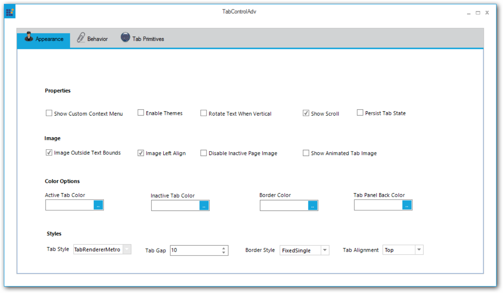

#### Office2016Colorful

This option helps to set the Office2016Colorful theme.

##### Code sample





// Office2016Colorful

this.tabControlAdv1.TabStyle = typeof(Syncfusion.Windows.Forms.Tools.TabRendererOffice2016Colorful);





'Office2016Colorful

Me.tabControlAdv1.TabStyle = typeof(Syncfusion.Windows.Forms.Tools.TabRendererOffice2016Colorful)





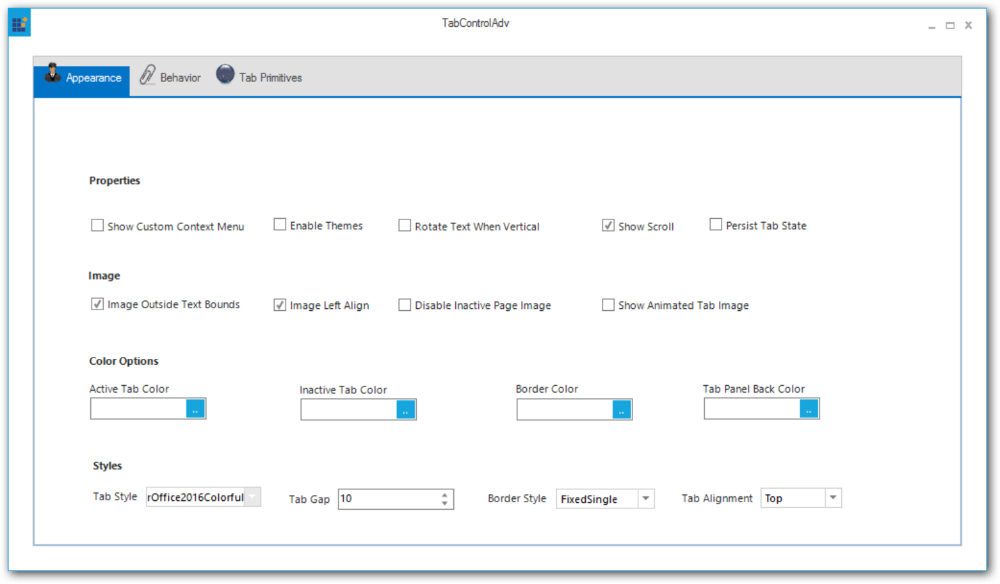

#### Office2016White

This option helps to set the Office2016White theme.

##### Code sample





// Office2016White

this.tabControlAdv1.TabStyle = typeof(Syncfusion.Windows.Forms.Tools.TabRendererOffice2016White);





'Office2016White

Me.tabControlAdv1.TabStyle = typeof(Syncfusion.Windows.Forms.Tools.TabRendererOffice2016White)





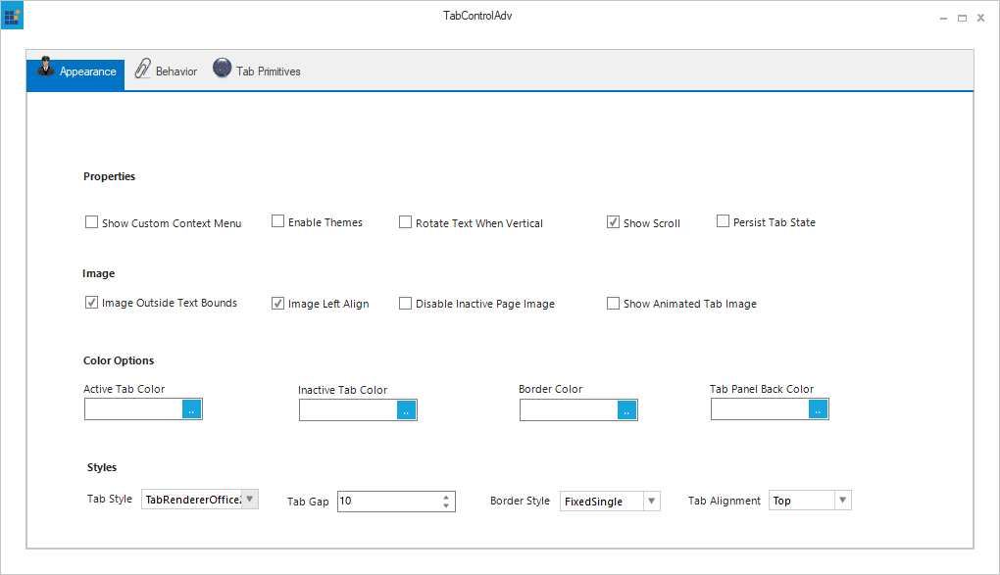

#### Office2016DarkGray

This option helps to set the Office2016DarkGray theme.

##### Code sample





// Office2016DarkGray

this.tabControlAdv1.TabStyle = typeof(Syncfusion.Windows.Forms.Tools.TabRendererOffice2016DarkGray);





'Office2016DarkGray

Me.tabControlAdv1.TabStyle = typeof(Syncfusion.Windows.Forms.Tools.TabRendererOffice2016DarkGray)





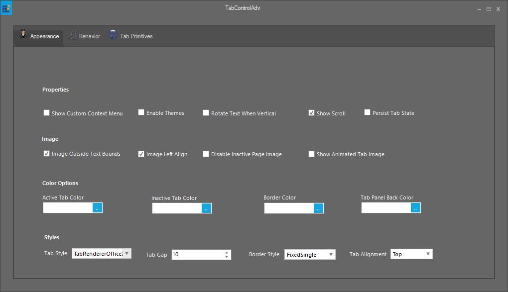

#### Office2016Black

This option helps to set the Office2016Black theme.

##### Code sample





// Office2016Black

this.tabControlAdv1.TabStyle = typeof(Syncfusion.Windows.Forms.Tools.TabRendererOffice2016Black);





'Office2016Black

Me.tabControlAdv1.TabStyle = typeof(Syncfusion.Windows.Forms.Tools.TabRendererOffice2016Black)





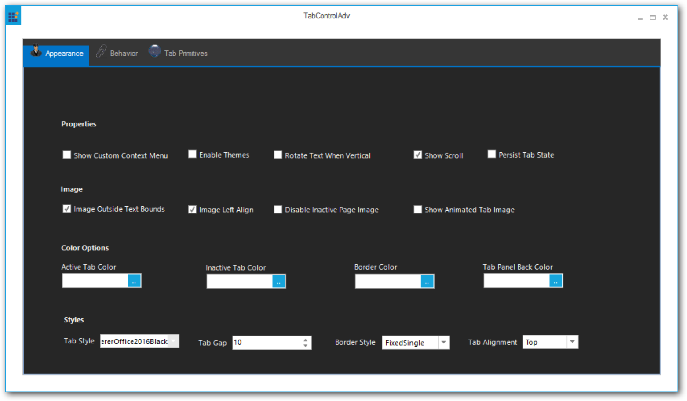

## Custom color schemes

Custom colors can also be applied to the TabControlAdv. 





//Set the below code for applying the managed color scheme.

this.FormTabControl.TabStyle = typeof(TabRendererOffice2007);

this.FormTabControl.Office2007ColorScheme = Office2007Theme.Managed;

Office2007Colors.ApplyManagedColors(this, Color.Green);





'Set the below code for applying the managed color scheme.

Me.FormTabControl.TabStyle = GetType(TabRendererOffice2007)

Me.FormTabControl.Office2007ColorScheme = Office2007Theme.Managed

Office2007Colors.ApplyManagedColors(Me, Color.Green)





## SizeMode

The `SizeMode` of the TabStrip allows to position the TabItems according to the selected options.

<table>
<tr>
<th>
TabControlAdv property</th><th>
Description</th></tr>
<tr>
<td>
SizeMode</td><td>
Specifies how the tabs should be sized and aligned. The options include:Normal,Fixed,FillToRight,ShrinkToFit.</td></tr>
</table>

* In Normal mode, the size of each tab depends on the text and image settings of the tab.
* In Fixed mode, the size of each tab is the same as the value specified in the ItemSize property.
* In ShrinkToFit mode, the width of each tab is shrunk so that all the tabs are visible (this is only applicable to the TabControlAdv in single-line mode). 
* In FillToRight mode, the width of each tab is sized so that each row of tabs occupies the entire width of the ContainerControl (this is only applicable to TabControlAdv with more than one row).





this.tabControlAdv1.SizeMode = Syncfusion.Windows.Forms.Tools.TabSizeMode.Normal;

this.tabControlAdv1.SizeMode = Syncfusion.Windows.Forms.Tools.TabSizeMode.Fixed;

this.tabControlAdv1.SizeMode = Syncfusion.Windows.Forms.Tools.TabSizeMode.ShrinkToFit;

this.tabControlAdv1.SizeMode = Syncfusion.Windows.Forms.Tools.TabSizeMode.FillToRight;





Me.tabControlAdv1.SizeMode = Syncfusion.Windows.Forms.Tools.TabSizeMode.Normal

Me.tabControlAdv1.SizeMode = Syncfusion.Windows.Forms.Tools.TabSizeMode.Fixed

Me.tabControlAdv1.SizeMode = Syncfusion.Windows.Forms.Tools.TabSizeMode.ShrinkToFit

Me.tabControlAdv1.SizeMode = Syncfusion.Windows.Forms.Tools.TabSizeMode.FillToRight





