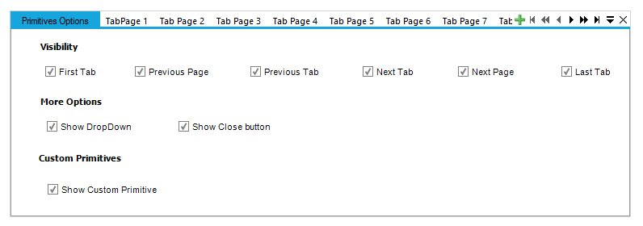
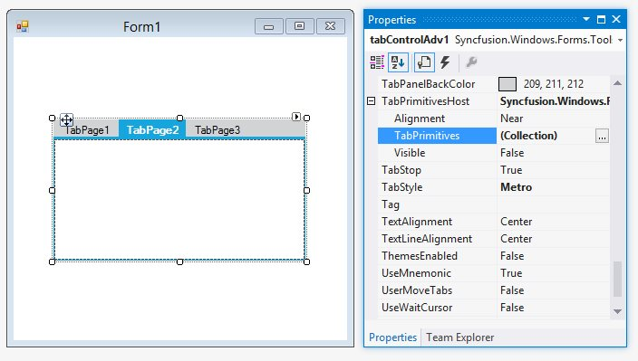

# Tab Primitives

TabPrimitives is a collection of NavigationControls used to navigate through the TabPages of the TabControlAdv. 

The various TabPrimitives are,

* FirstTab - Goes to the first tab among the pages.
* LastTab - Goes to the last tab among the pages.
* PreviousTab - Goes to the previous tab of the active tab.
* NextTab - Goes to the next tab of the active tab.
* PreviousPage - Goes to the previous page of the active page.
* NextPage - Goes to the next page of the active page.
* DropDown - This pops-up a list of the available tabpages in the control from which the user can select the page to be traversed.
* Close - This button is used to close the TabControlAdv. It can be set to appear for the whole control or individual tabpages. 
* Custom - User can add more buttons through Custom TabPrimitive. This helps the user to create / add more buttons and handle their own click events.

N> The TabControlAdv.HitTestTabs() method can be used to return the tab at the specified location.

### TabPrimitives Features

Apart from doing the defined task of Navigation, TabPrimitivesHost comes with options for adding Images, ToolTips and enabling the Visible property for each TabPrimitive.

N> You can set the other properties for adding Images and ToolTips for the TabPrimitives using the TabPrimitives Collection Editor.

### Creating TabPrimitives

The TabPrimitives can be added to the TabControlAdv by using either of the following ways,

* Through Designer
* Through Code-Behind

#### Through Designer

To create TabPrimitives through designer, follow the steps given below.

1. After adding a TabControlAdv with a set of TabPages in it, select the TabPrimitivesHost.TabPrimitives property in the Properties window.

   

2. A TabPrimitives Collection Editor will be opened. Click the Add option in the Editor to add a TabPrimitive.

   

3. Set the TabPrimitiveType as required and click Ok.

   

#### Through Code-Behind





//Adds a TabPrimitive of type DropDown.

this.tabControlAdv4.TabPrimitivesHost.TabPrimitives.Add(new Syncfusion.Windows.Forms.Tools.TabPrimitive(Syncfusion.Windows.Forms.Tools.TabPrimitiveType.DropDown, null, System.Drawing.Color.Empty, true, 1, "TabPrimitive0"));

//Adds a TabPrimitive of type Close.

this.tabControlAdv1.TabPrimitivesHost.TabPrimitives.Add(new Syncfusion.Windows.Forms.Tools.TabPrimitive(Syncfusion.Windows.Forms.Tools.TabPrimitiveType.Close, null, System.Drawing.Color.Empty, true, 1, "TabPrimitive1"));

//Similarly other TabPrimitive types are added.

//Makes the TabPrimitive visible in the control.

this.tabControlAdv1.TabPrimitivesHost.Visible = true;





'Adds a TabPrimitive of type DropDown.

Me.tabControlAdv4.TabPrimitivesHost.TabPrimitives.Add(New Syncfusion.Windows.Forms.Tools.TabPrimitive(Syncfusion.Windows.Forms.Tools.TabPrimitiveType.DropDown, Nothing, System.Drawing.Color.Empty, True, 1, "TabPrimitive0"))

'Adds a TabPrimitive of type Close.

Me.tabControlAdv1.TabPrimitivesHost.TabPrimitives.Add(New Syncfusion.Windows.Forms.Tools.TabPrimitive(Syncfusion.Windows.Forms.Tools.TabPrimitiveType.Close, Nothing, System.Drawing.Color.Empty, True, 1, "TabPrimitive1"))

'Similarly other TabPrimitive types are added.

'Makes the TabPrimitive visible in the control.

Private Me.tabControlAdv1.TabPrimitivesHost.Visible = True





N> After adding TabPrimitives, set the TabPrimitiveHost.Visible property to True. Now the TabPrimitives added will be visible in the TabControlAdv.

**SwitchPagesForDialogKeys** property available for the TabControlAdv specifies if the control should switch TabPages on pressing Ctrl+Tab or Ctrl+Shift+Tab.

The TabPrimitiveHost property allows to customize the navigation and close buttons by defining it through the TabPrimitives Property Collection. The TabPrimitives can be added and each primitive can be assigned with the type to be used, which includes primitives to traverse to the First / Previous / Next / LastTab, Next / PreviousPage and Close / DropDown options.

