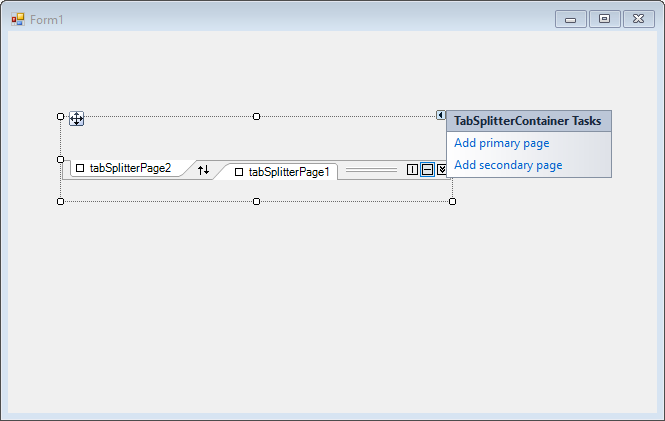

# Getting started

This section describes how to add `TabSplitterContainer` control in a Windows Forms application and overview of its basic functionalities.

## Assembly deployment

The following list of assemblies should be added as reference to use the TabSplitterContainer in any application:

<table>
<tr>
<td>
{{'**Required assemblies**'| markdownify }}
</td>
<td>
{{'**Description**'| markdownify }}
</td>
</tr>
<tr>
<td>
Syncfusion.Grid.Base.dll
</td>
<td>
Syncfusion.Grid.Base contains classes that contains fundamentals and base classes of GridControl.
</td>
</tr>
<tr>
<td>
Syncfusion.Grid.Windows.dll
</td>
<td>
Syncfusion.Grid.Windows contains classes that handles all UI operations, fundamentals and base classes of GridControl which are used in the TabSplitterContainer control.
</td>
</tr>
<tr>
<td>
Syncfusion.Shared.Base.dll
</td>
<td>
Syncfusion.Shared.Base contains style related properties of TabSplitterContainer and various editor controls.
</td>
</tr>
<tr>
<td>
Syncfusion.Shared.Windows.dll
</td>
<td>
Syncfusion.Shared.Windows contains style related properties of TabSplitterContainer and various editor controls.
</td>
</tr>
<tr>
<td>
Syncfusion.Tools.Base.dll
</td>
<td>
Syncfusion.Tools.Base contains base class which used for TabSplitterContainer control.
</td>
</tr>
<tr>
<td>
Syncfusion.Tools.Windows.dll
</td>
<td>
Syncfusion.Tools.Windows contains the class that handles all UI operations and contains helper class of TabSplitterContainer control.
</td>
</tr>
</table>

## Installing NuGet Packages

To use TabSplitterContainer control in Windows Forms application via nuget, the following packages should be installed.
 
<table>
<tr>
<td>{{'**S.No**'| markdownify }}
</td>
<td>{{'**Framework version**'| markdownify }}
</td>
<td>{{'**NuGet Packages**'| markdownify }}
</td>
</tr>
<tr>
<td> 1
</td>
<td> 2.0
</td>
<td> Syncfusion.Tools.Windows20
</td>
</tr>
<tr>
<td> 2
</td>
<td> 3.5
</td>
<td> Syncfusion.Tools.Windows35
</td>
</tr>
<tr>
<td> 3
</td>
<td> 4.0
</td>
<td> Syncfusion.Tools.Windows40
</td>
</tr>
<tr>
<td> 4
</td>
<td> 4.5
</td>
<td> Syncfusion.Tools.Windows45
</td>
</tr>
<tr>
<td> 5
</td>
<td> 4.5.1
</td>
<td>Syncfusion.Tools.Windows451
</td>
</tr>
<tr>
<td> 6
</td>
<td> 4.6
</td>
<td>Syncfusion.Tools.Windows46
</td>
</tr>
</table>
 
Please find more details regarding how to install the nuget packages in windows form application in the below link:
 
[How to install nuget packages](https://help.syncfusion.com/windowsforms/nuget-packages)

# Creating simple application with TabSplitterContainer

You can create the Windows Forms application with TabSplitterContainer control as follows:

1. [Creating project](#creating-the-project)
2. [Adding control via designer](#adding-control-via-designer)
3. [Adding control manually using code](#adding-control-manually-using-code)

### Creating the project

Create a new Windows Forms project in the Visual Studio to display the TabSplitterContainer with functionalities.

## Adding control via Form designer

The TabSplitterContainer control can be added to the application by dragging it from the toolbox and dropping it in a designer view. The following required assembly references will be added automatically:

* Syncfusion.Grid.Base.dll
* Syncfusion.Grid.Windows.dll
* Syncfusion.Shared.Base.dll
* Syncfusion.Shared.Windows.dll
* Syncfusion.Tools.Base.dll
* Syncfusion.Tools.Windows.dll

**Adding Pages into TabSplitterContainer**

Add pages into TabSplitterContainer by clicking `Add primary page` and `Add secondary page` from Smart Tags in TabSplitterContainer in DesignView.

## Adding control manually using code

To add control manually in C#, follow the given steps:

**Step 1** : Add the following required assembly references to the project:

* Syncfusion.Grid.Base.dll
* Syncfusion.Grid.Windows.dll
* Syncfusion.Shared.Base.dll
* Syncfusion.Shared.Windows.dll
* Syncfusion.Tools.Base.dll
* Syncfusion.Tools.Windows.dll

**Step 2** :  Include the namespaces **Syncfusion.Windows.Forms.Tools**.





using Syncfusion.Windows.Forms.Tools;





Imports Syncfusion.Windows.Forms.Tools



 

**Step 3** :  Create `TabSplitterContainer` control instance and add it to the form.





TabSplitterContainer tabSplitterContainer1 = new TabSplitterContainer();

this.tabSplitterContainer1.Style = TabSplitterContainerStyle.Office2016Colorful;

this.tabSplitterContainer1.Size = new System.Drawing.Size(248, 77);

this.Controls.Add(tabSplitterContainer1);





Dim tabSplitterContainer1 As TabSplitterContainer = New TabSplitterContainer()

me.tabSplitterContainer1.Style = TabSplitterContainerStyle.Office2016Colorful

Me.tabSplitterContainer1.Size = New System.Drawing.Size(248, 77)

Me.Controls.Add(tabSplitterContainer1)





**Adding Pages into TabSplitterContainer**

Create an instance of the required page and Primary and Secondary pages can be added into TabSplitterContainer using `PrimaryPages` and `SecondaryPages` collections respectively.





// Create an instance of TabSplitter

private TabSplitterPage tabSplitterPage1 = new TabSplitterPage();
private TabSplitterPage tabSplitterPage2 = new TabSplitterPage();

this.tabSplitterPage1.Text = "XAML";
this.tabSplitterPage2.Text = "Design";

// Adding it to TabSplitterContainer

this.tabSplitterContainer1.PrimaryPages.AddRange(new TabSplitterPage[] {this.tabSplitterPage1});
this.tabSplitterContainer1.SecondaryPages.AddRange(new TabSplitterPage[] {this.tabSplitterPage2});
this.tabSplitterContainer1.Size = new System.Drawing.Size(443, 115);





'' Create an instance of TabSplitter

Private tabSplitterPage1 As New TabSplitterPage()
Private tabSplitterPage2 As New TabSplitterPage()

Me.tabSplitterPage1.Text = "XAML"
Me.tabSplitterPage2.Text = "Design"

'' Adding it to TabSplitterContainer

Me.tabSplitterContainer1.PrimaryPages.AddRange(New TabSplitterPage() {Me.tabSplitterPage1})
Me.tabSplitterContainer1.SecondaryPages.AddRange(New TabSplitterPage() {Me.tabSplitterPage2})
Me.tabSplitterContainer1.Size = New System.Drawing.Size(443, 115)





