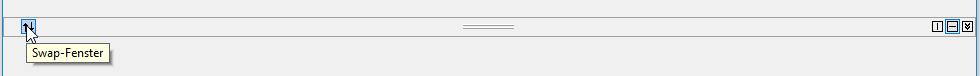
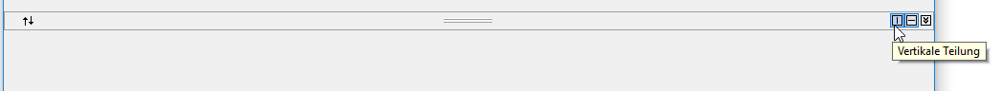
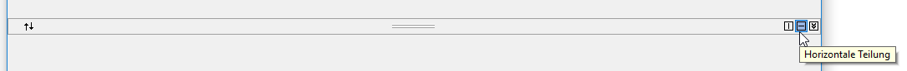
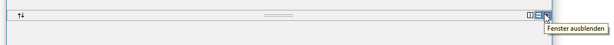

## Localization

Localization is the process of making application multilingual by formatting the content according to the cultures. TabSplitterContainer control can be localized in any Languages, based on application requirement by following below steps.

Step 1: Need to initialize the LocalizationProvider class, inherited from the ILocalizationProvider interface, before the initializeComponent call in the constructor of an application.

Step 2: It will add the GetLocalizedString function in the LocalizationProvider class.It is needed to provide the Localization content, for the required components used in TabSplitterContainer control.

For example:
Here, TabSplitterContainer control is localized in German Language.





//Call the Localizer

LocalizationProvider.Provider = new Localizer();

 // localizer inherits the interface of ILocationProvider
    public class Localizer : ILocalizationProvider
    {
        #region ILocalizationProvider Members

        public string GetLocalizedString(System.Globalization.CultureInfo culture, string name,object obj)
        {
            switch (name)
            {
                #region TabSplitterControl
                ///
 
                ///
                ///

                case ToolsResourceIdentifiers.TabSplitterSwapPanes:
                    return "Swap-Fenster";
                ///
 
                ///
                ///

                case ToolsResourceIdentifiers.TabSplitterVerticalSplit:
                    return "Vertikale Teilung";
                ///
 
                ///
                ///

                case ToolsResourceIdentifiers.TabSplitterHorizontalSplit:
                    return "Horizontale Teilung";
                ///
 
                ///
                ///

                case ToolsResourceIdentifiers.TabSplitterExpandPane:
                    return "Erweitern Sie den Bereich";
                ///
 
                ///
                ///

                case ToolsResourceIdentifiers.TabSplitterCollapsePane:
                    return "Fenster ausblenden";

                ///

                /// default
                ///

                default:
                    return string.Empty;
             #endregion
            }
        }

        #endregion
    }




'Call the Localizer

LocalizationProvider.Provider = New Localizer

'' localizer inherits the interface of ILocationProvider
Public Class Localizer
    Implements ILocalizationProvider
    
    Public Function GetLocalizedString(ByVal culture As System.Globalization.CultureInfo, ByVal name As String, ByVal obj As Object) As String
        Select Case (name)
        End Select
        
        #
        Dim TabSplitterControl As region
        ToolsResourceIdentifiers.TabSplitterSwapPanes
        Return "Swap-Fenster"
        '''
 
        '''
        '''

        ToolsResourceIdentifiers.TabSplitterVerticalSplit
        Return "Vertikale Teilung"
        '''
 
        '''
        '''

        ToolsResourceIdentifiers.TabSplitterHorizontalSplit
        Return "Horizontale Teilung"
        '''
 
        '''
        '''

        ToolsResourceIdentifiers.TabSplitterExpandPane
        Return "Erweitern Sie den Bereich"
        '''
 
        '''
        '''

        ToolsResourceIdentifiers.TabSplitterCollapsePane
        Return "Fenster ausblenden"
        '''

        ''' default
        '''

        Return string.Empty
        #
        endregion
    End Function
End Class





