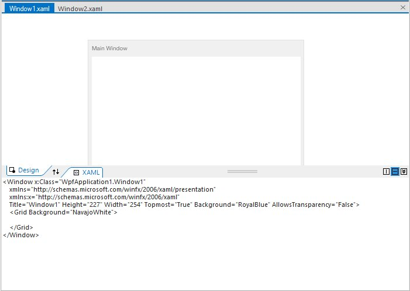

# Overview

The TabSplitterContainer control provides a VS 2008-style, tabbed, split view of tab groups to help easily render different views of the same document. The splitter comes with advanced options like swapping of splitter pages, adjustable splitter position, both at design time and run time, collapsing of the splitter panes and supports horizontal and vertical orientation of the splitter. This user guide will easily guide you with the features of TabSplitterContainer control.

## Key Features

* **Splitter Components** - Provides rich set of built-in components such as primary and secondary pages, swap button, collapse and expand buttons.

* **Swap Pages** - Provides option to swap between pages at design time as well as runtime.

* **Orientation** - Provides support for horizontal and vertical orientations.

* **VisualStyle** - Supports rich set of VisualStyle to customize the look and feel of TabSplitterContainer.