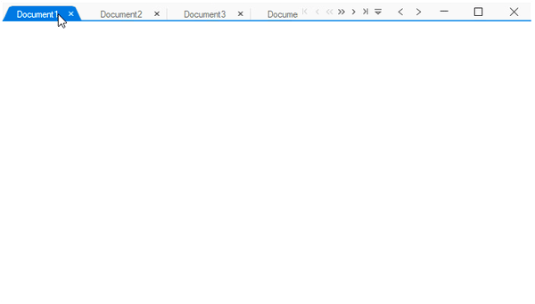

---
layout: post
title: Drag and drop tabs in Windows Forms Tabbed Form | Syncfusion®
description: Drag-and-drop support allows tab reordering and provides events to control or cancel tab dragging operations.
platform: WindowsForms
control: SfTabbedForm
documentation: ug
---

# Drag and drop tabs in Windows Forms Tabbed Form (SfTabbedForm)

The Tabbed Form allows moving tabs from one position to another by dragging the corresponding tab. This can be done by setting the [TabbedFormControl.AllowDraggingTabs](https://help.syncfusion.com/cr/windowsforms/Syncfusion.Windows.Forms.Tools.SfTabbedFormControl.html#Syncfusion_Windows_Forms_Tools_SfTabbedFormControl_AllowDraggingTabs) property to `true`.

Ensure the following namespaces are imported:

* C#: `using Syncfusion.Windows.Forms.Tools;`
* VB: `Imports Syncfusion.Windows.Forms.Tools`

## Table of contents

* [Enable drag and drop](#enable-drag-and-drop)
* [Cancel tab dragging](#cancel-tab-dragging)
* [Cancel tab reordering](#cancel-tab-reordering)
* [See also](#see-also)

## Enable drag and drop



tabbedFormControl.AllowDraggingTabs = true;


tabbedFormControl.AllowDraggingTabs = True



## Cancel tab dragging

Dragging a particular tab in `TabbedForm` can be canceled by handling the [TabDragging](https://help.syncfusion.com/cr/windowsforms/Syncfusion.Windows.Forms.Tools.SfTabbedFormControl.html#Syncfusion_Windows_Forms_Tools_SfTabbedFormControl_TabDragging) event by setting `e.Cancel` to `true` when [e.Action](https://help.syncfusion.com/cr/windowsforms/Syncfusion.Windows.Forms.Tools.TabDraggingEventArgs.html#Syncfusion_Windows_Forms_Tools_TabDraggingEventArgs_Action) is [TabDraggingAction.DragStarting](https://help.syncfusion.com/cr/windowsforms/Syncfusion.Windows.Forms.Tools.TabDraggingAction.html).



this.TabbedFormControl.TabDragging += OnTabDragging;

private void OnTabDragging(object sender, TabDraggingEventArgs e)
{
    if (e.From == 1 && e.Action == TabDraggingAction.DragStarting)
        e.Cancel = true;
}


AddHandler TabbedFormControl.TabDragging, AddressOf OnTabDragging

Private Sub OnTabDragging(ByVal sender As Object, ByVal e As TabDraggingEventArgs)
	If e.From = 1 AndAlso e.Action = TabDraggingAction.DragStarting Then
		e.Cancel = True
	End If
End Sub



## Cancel tab reordering

Re-ordering a tab to a particular position can be canceled by handling the [TabDragging](https://help.syncfusion.com/cr/windowsforms/Syncfusion.Windows.Forms.Tools.SfTabbedFormControl.html#Syncfusion_Windows_Forms_Tools_SfTabbedFormControl_TabDragging) event by setting `e.Cancel` to `true` when [e.Action](https://help.syncfusion.com/cr/windowsforms/Syncfusion.Windows.Forms.Tools.TabDraggingEventArgs.html#Syncfusion_Windows_Forms_Tools_TabDraggingEventArgs_Action) is [TabDraggingAction.DragDropping](https://help.syncfusion.com/cr/windowsforms/Syncfusion.Windows.Forms.Tools.TabDraggingAction.html).



this.TabbedFormControl.TabDragging += OnTabDragging;

private void OnTabDragging(object sender, TabDraggingEventArgs e)
{
    if (e.To == 1 && e.Action == TabDraggingAction.DragDropping)
        e.Cancel = true;
}


AddHandler Me.TabbedFormControl.TabDragging, AddressOf OnTabDragging

Private Sub OnTabDragging(ByVal sender As Object, ByVal e As TabDraggingEventArgs)
	If e.To = 1 AndAlso e.Action = TabDraggingAction.DragDropping Then
		e.Cancel = True
	End If
End Sub



## See also

* [About the SfTabbedForm control](Overview.md)
* [Getting Started with Windows Forms TabbedForm](Getting-Started.md)
* [Tab Selection in Windows Forms TabbedForm](TabSelection.md)
* [Context Menu in Windows Forms TabbedForm](ContextMenu.md)
* [Tab Navigation in Windows Forms TabbedForm](TabNavigation.md)
