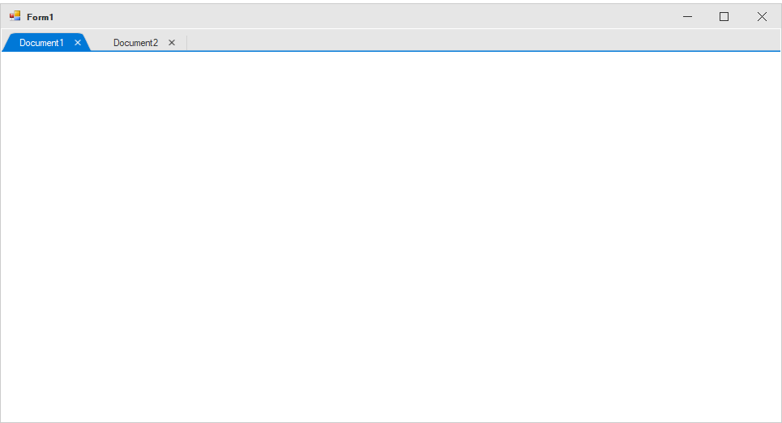

# Getting Started with Windows Forms Tabbed Form (SfTabbedForm)

## Assembly deployment

Refer to the [control dependencies](https://help.syncfusion.com/windowsforms/control-dependencies#sftabbedform) section to get the list of assemblies or NuGet package needs to be added as reference to use the control in any application.

## Converting standard form into SfTabbedForm

The default form can be changed into `SfTabbedForm` by following the given steps:

1. Create a new Windows Forms application in Visual Studio and refer to the `Syncfusion.Tools.WinForms` assembly.

2. Include the following namespaces to the directives list.

​


using Syncfusion.Windows.Forms.Tools;


Imports Syncfusion.Windows.Forms.Tools



{{ codesnippet1 | OrderList_Indent_Level_1 }}

3. Change the base class of your form from `System.Windows.Forms.Form` to `SfTabbedForm`.

​


public partial class Form1 : SfTabbedForm
{
    public Form1()
    {
        InitializeComponent();
    }
}


Partial Public Class Form1
	Inherits SfTabbedForm
	Public Sub New()
		InitializeComponent()
	End Sub
End Class



{{ codesnippet2 | OrderList_Indent_Level_1 }}

## Loading TabbedFormControl to TabbedForm

The `TabbedFormControl` provides the tabbed user interface to the `TabbedForm`. The `TabbedFormControl` should be added to the form to have the tabbed user interface. The control can be loaded to form using the following code.



SfTabbedFormControl tabbedFormControl = new SfTabbedFormControl();
this.Controls.Add(tabbedFormControl);
this.TabbedFormControl = tabbedFormControl;


Dim tabbedFormControl As New SfTabbedFormControl()
Me.Controls.Add(tabbedFormControl)
Me.TabbedFormControl = tabbedFormControl



## Adding tabs to TabbedForm

To add tabs to form, create an instance of [TabPageAdv](https://help.syncfusion.com/cr/windowsforms/Syncfusion.Windows.Forms.Tools.TabPageAdv.html) and add it to the tabs collection of the `TabbedFormControl`.



TabPageAdv tabPageAdv1 = new TabPageAdv();
TabPageAdv tabPageAdv2 = new TabPageAdv();
SfTabbedFormControl tabbedFormControl = new SfTabbedFormControl();
this.tabPageAdv1.Text = "Document1";
this.tabPageAdv2.Text = "Document2";
tabbedFormControl.Tabs.Add(tabPageAdv1);
tabbedFormControl.Tabs.Add(tabPageAdv2);
this.Controls.Add(tabbedFormControl);
this.TabbedFormControl = tabbedFormControl;


Dim tabPageAdv1 As New TabPageAdv()
Dim tabPageAdv2 As New TabPageAdv()
Dim tabbedFormControl As New SfTabbedFormControl()
Me.tabPageAdv1.Text = "Document1"
Me.tabPageAdv2.Text = "Document2"
tabbedFormControl.Tabs.Add(tabPageAdv1)
tabbedFormControl.Tabs.Add(tabPageAdv2)
Me.Controls.Add(tabbedFormControl)
Me.TabbedFormControl = tabbedFormControl



## Show tabs below the title bar

By default, the tabs will be extended to title bar. To avoid extending the tabs into title bar, disable the `SfTabbedForm.ExtendTabsToTitleBar` property.



this.ExtendTabsToTitleBar = false;


Me.ExtendTabsToTitleBar = False



