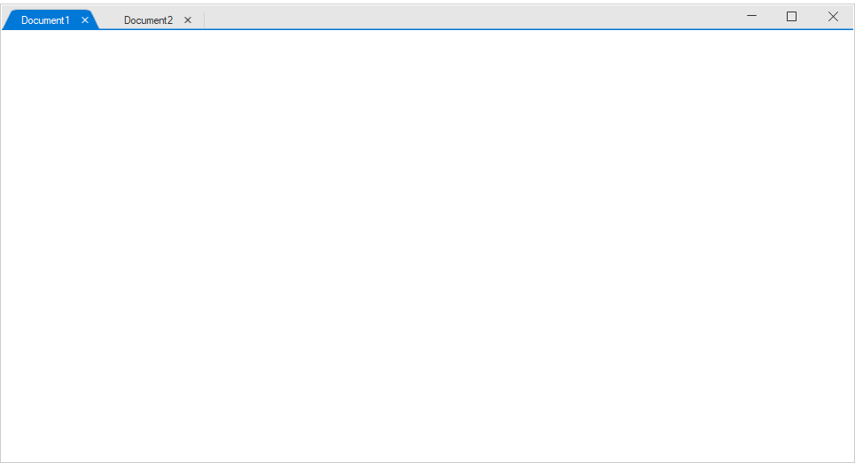
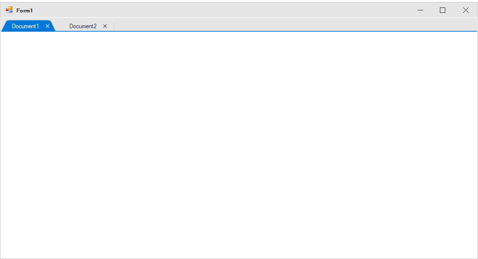

# Getting Started with Windows Forms Tabbed Form (SfTabbedForm)

This section explains how to convert a standard Windows Form into `SfTabbedForm` and add tabs to it.

## Prerequisites

Before using the TabbedForm control, ensure the following are available:

* Visual Studio 2015 or later with the Windows Forms development workload.
* A Windows Forms application targeting .NET Framework 4.5+ or .NET 6.0+ (Windows).
* A valid [Syncfusion license](https://www.syncfusion.com/sales/communitylicense) registered in your project.

## Table of contents

* [Assembly deployment](#assembly-deployment)
* [Converting standard form into SfTabbedForm](#converting-standard-form-into-sftabbedform)
* [Loading TabbedFormControl to TabbedForm](#loading-tabbedformcontrol-to-tabbedform)
* [Adding tabs to TabbedForm](#adding-tabs-to-tabbedform)
* [Show tabs below the title bar](#show-tabs-below-the-title-bar)
* [Troubleshooting](#troubleshooting)

## Assembly deployment

Refer to the [control dependencies](https://help.syncfusion.com/windowsforms/control-dependencies#sftabbedform) section to get the list of assemblies or NuGet packages that must be added as references to use the control in any application. Install the corresponding NuGet package:

```
PM> Install-Package Syncfusion.Tools.Windows
```

## Converting standard form into SfTabbedForm

The default form can be changed into `SfTabbedForm` by following the given steps:

1. Create a new Windows Forms application in Visual Studio and refer to the [Syncfusion.Tools.Windows](https://help.syncfusion.com/windowsforms/control-dependencies#sftabbedform) assembly.

2. Include the following namespaces in the directives list.

​


using Syncfusion.Windows.Forms.Tools;


Imports Syncfusion.Windows.Forms.Tools



{{ codesnippet1 | OrderList_Indent_Level_1 }}

3. Change the base class of your form from `System.Windows.Forms.Form` to `SfTabbedForm`.

​


public partial class Form1 : SfTabbedForm
{
    public Form1()
    {
        InitializeComponent();
    }
}


Partial Public Class Form1
	Inherits SfTabbedForm
	Public Sub New()
		InitializeComponent()
	End Sub
End Class



{{ codesnippet2 | OrderList_Indent_Level_1 }}

## Loading TabbedFormControl to TabbedForm

The `TabbedFormControl` provides the tabbed user interface to the `TabbedForm`. The `TabbedFormControl` should be added to the form to have the tabbed user interface. The control can be loaded to form using the following code.



SfTabbedFormControl tabbedFormControl = new SfTabbedFormControl();
this.Controls.Add(tabbedFormControl);
this.TabbedFormControl = tabbedFormControl;


Dim tabbedFormControl As New SfTabbedFormControl()
Me.Controls.Add(tabbedFormControl)
Me.TabbedFormControl = tabbedFormControl




## Adding tabs to TabbedForm

To add tabs to form, create an instance of [TabPageAdv](https://help.syncfusion.com/cr/windowsforms/Syncfusion.Windows.Forms.Tools.TabPageAdv.html) and add it to the tabs collection of the `TabbedFormControl`.



TabPageAdv tabPageAdv1 = new TabPageAdv();
TabPageAdv tabPageAdv2 = new TabPageAdv();
SfTabbedFormControl tabbedFormControl = new SfTabbedFormControl();
this.tabPageAdv1.Text = "Document1";
this.tabPageAdv2.Text = "Document2";
tabbedFormControl.Tabs.Add(tabPageAdv1);
tabbedFormControl.Tabs.Add(tabPageAdv2);
this.Controls.Add(tabbedFormControl);
this.TabbedFormControl = tabbedFormControl;


Dim tabPageAdv1 As New TabPageAdv()
Dim tabPageAdv2 As New TabPageAdv()
Dim tabbedFormControl As New SfTabbedFormControl()
Me.tabPageAdv1.Text = "Document1"
Me.tabPageAdv2.Text = "Document2"
tabbedFormControl.Tabs.Add(tabPageAdv1)
tabbedFormControl.Tabs.Add(tabPageAdv2)
Me.Controls.Add(tabbedFormControl)
Me.TabbedFormControl = tabbedFormControl






## Show tabs below the title bar

By default, the tabs will be extended to title bar. To avoid extending the tabs into title bar, disable the `SfTabbedForm.ExtendTabsToTitleBar` property.



this.ExtendTabsToTitleBar = false;


Me.ExtendTabsToTitleBar = False






## Troubleshooting

| Issue | Possible cause | Resolution |
|---|---|---|
| Form is displayed but the tabs do not appear. | `TabbedFormControl` was not created or assigned to the form's `TabbedFormControl` property. | Create an `SfTabbedFormControl`, add it to the form's `Controls` collection, and assign it to the `TabbedFormControl` property of the form. |
| Tabs are created but not visible at runtime. | The tab `Text` is empty, or the `TabPageAdv` is not added to the `Tabs` collection of the `TabbedFormControl`. | Set the `Text` property of each `TabPageAdv` and add the page to `tabbedFormControl.Tabs` before assigning the control to the form. |
| The base form's designer fails to load. | The form class inherits from `SfTabbedForm` but the Syncfusion assemblies are not referenced or licensed. | Add the `Syncfusion.Tools.Windows` reference and ensure a valid Syncfusion license is registered. |
| Tabs extend into the title bar unexpectedly. | `ExtendTabsToTitleBar` defaults to `true`. | Set `this.ExtendTabsToTitleBar = false;` (C#) or `Me.ExtendTabsToTitleBar = False` (VB) to display the tabs below the title bar. |

## See also

* [About the SfTabbedForm control](Overview.md)
* [Tab Selection in Windows Forms TabbedForm](TabSelection.md)
* [Context Menu in Windows Forms TabbedForm](ContextMenu.md)
* [Drag and drop tabs in Windows Forms TabbedForm](Draganddroptabs.md)
* [Tab Navigation in Windows Forms TabbedForm](TabNavigation.md)
* [SfTabbedForm API reference](https://help.syncfusion.com/cr/windowsforms/Syncfusion.Windows.Forms.Tools.SfTabbedForm.html)
* [SfTabbedFormControl API reference](https://help.syncfusion.com/cr/windowsforms/Syncfusion.Windows.Forms.Tools.SfTabbedFormControl.html)

