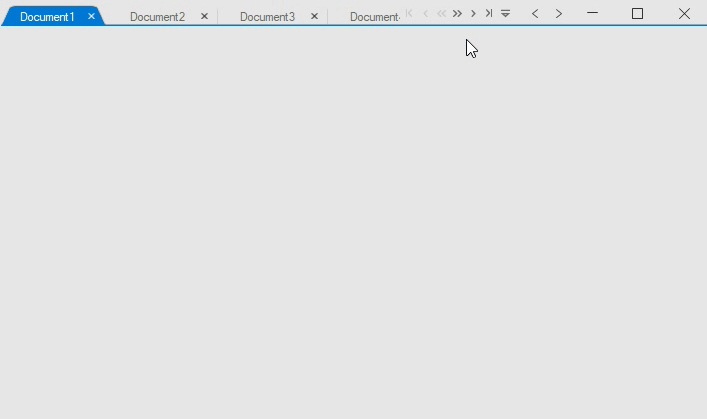

# Tab Navigation in Windows Forms Tabbed Form (SfTabbedForm)

Tabbed Form consists of a set of built-in navigation buttons such as first tab, last tab, and drop-down, which are used to navigate through the [TabPages](https://help.syncfusion.com/cr/windowsforms/Syncfusion.Windows.Forms.Tools.TabControlAdv.html#Syncfusion_Windows_Forms_Tools_TabControlAdv_TabPages). The navigation controls can be added to the tabbed form using the [TabbedFormControl.TabPrimitiveMode](https://help.syncfusion.com/cr/windowsforms/Syncfusion.Windows.Forms.Tools.TabPrimitiveMode.html) property.

Ensure the following namespaces are imported:

* C#: `using Syncfusion.Windows.Forms.Tools;`
* VB: `Imports Syncfusion.Windows.Forms.Tools`

## Table of contents

* [Enable tab navigation](#enable-tab-navigation)
* [TabPrimitiveClick event](#tabprimitiveclick-event)
* [See also](#see-also)

## Enable tab navigation



tabbedFormControl.TabPrimitiveMode = TabPrimitiveMode.DropDown | TabPrimitiveMode.FirstTab | TabPrimitiveMode.LastTab | TabPrimitiveMode.NextTab | TabPrimitiveMode.PreviousTab;


tabbedFormControl.TabPrimitiveMode = TabPrimitiveMode.DropDown Or TabPrimitiveMode.FirstTab Or TabPrimitiveMode.LastTab Or TabPrimitiveMode.NextTab Or TabPrimitiveMode.PreviousTab



## TabPrimitiveClick event

The [TabPrimitiveClick](https://help.syncfusion.com/cr/windowsforms/Syncfusion.Windows.Forms.Tools.SfTabbedFormControl.html#Syncfusion_Windows_Forms_Tools_SfTabbedFormControl_TabPrimitiveClick) event occurs when the user clicks a navigation button. The [TabPrimitiveClickEventArgs](https://help.syncfusion.com/cr/windowsforms/Syncfusion.Windows.Forms.Tools.TabPrimitiveClickEventArgs.html) properties provide information specific to this event.




this.tabbedFormControl.TabPrimitiveClick += TabbedFormControl_TabPrimitiveClick;

private void TabbedFormControl_TabPrimitiveClick(object sender, TabPrimitiveClickEventArgs e)
{
    Console.WriteLine("TabPrimitive Type: " + e.TabPrimitive.TabPrimitiveType);
}




AddHandler Me.tabbedFormControl.TabPrimitiveClick, AddressOf TabbedFormControl_TabPrimitiveClick

Private Sub TabbedFormControl_TabPrimitiveClick(ByVal sender As Object, ByVal e As TabPrimitiveClickEventArgs)
	Console.WriteLine("TabPrimitive Type: " & e.TabPrimitive.TabPrimitiveType)
End Sub




## See also

* [About the SfTabbedForm control](Overview.md)
* [Getting Started with Windows Forms TabbedForm](Getting-Started.md)
* [Tab Selection in Windows Forms TabbedForm](TabSelection.md)
* [Context Menu in Windows Forms TabbedForm](ContextMenu.md)
* [Drag and drop tabs in Windows Forms TabbedForm](Draganddroptabs.md)

