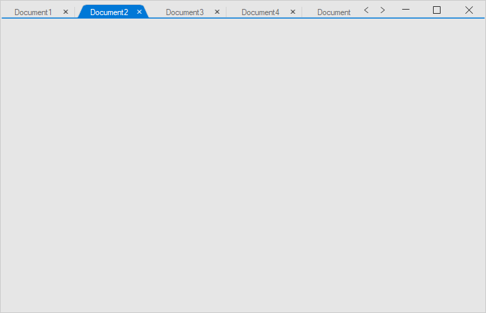

---
layout: post
title: Tab Selection in Windows Forms Tabbed Form | Syncfusion®
description: Tab selection supports programmatic tab activation and events for controlling and monitoring tab selection changes.
platform: WindowsForms
control: SfTabbedForm
documentation: ug
---

# Tab Selection in Windows Forms Tabbed Form (SfTabbedForm)

Tab selection can be done programmatically using the [TabbedFormControl.SelectedIndex](https://help.syncfusion.com/cr/windowsforms/Syncfusion.Windows.Forms.Tools.SfTabbedFormControl.html#Syncfusion_Windows_Forms_Tools_SfTabbedFormControl_SelectedIndex) or [TabbedFormControl.SelectedTab](https://help.syncfusion.com/cr/windowsforms/Syncfusion.Windows.Forms.Tools.SfTabbedFormControl.html#Syncfusion_Windows_Forms_Tools_SfTabbedFormControl_SelectedTab) properties.

Ensure the following namespaces are imported at the top of the file:

* C#: `using Syncfusion.Windows.Forms.Tools;`
* VB: `Imports Syncfusion.Windows.Forms.Tools`




this.tabbedFormControl.SelectedIndex = 1;

//or

this.tabbedFormControl.SelectedTab = tabPageAdv2;




Me.tabbedFormControl.SelectedIndex = 1

'or

Me.tabbedFormControl.SelectedTab = tabPageAdv2




## Events

### SelectedIndexChanging event

The [SelectedIndexChanging](https://help.syncfusion.com/cr/windowsforms/Syncfusion.Windows.Forms.Tools.SfTabbedFormControl.html#Syncfusion_Windows_Forms_Tools_SfTabbedFormControl_SelectedIndexChanging) event occurs when the [SelectedIndex](https://help.syncfusion.com/cr/windowsforms/Syncfusion.Windows.Forms.Tools.SfTabbedFormControl.html#Syncfusion_Windows_Forms_Tools_SfTabbedFormControl_SelectedIndex) or [SelectedTab](https://help.syncfusion.com/cr/windowsforms/Syncfusion.Windows.Forms.Tools.SfTabbedFormControl.html#Syncfusion_Windows_Forms_Tools_SfTabbedFormControl_SelectedTab) of the [TabbedFormControl](https://help.syncfusion.com/cr/windowsforms/Syncfusion.Windows.Forms.Tools.SfTabbedFormControl.html) is changing. The [SelectedIndexChangingEventArgs](https://help.syncfusion.com/cr/windowsforms/Syncfusion.Windows.Forms.Tools.SelectedIndexChangingEventArgs.html) properties provide information specific to this event. Tab selection can be restricted by setting `args.Cancel` to `true`.

Use `args.NewIndex` (or `args.NewSelectedTab`) to identify the tab the user is trying to switch to.




this.tabbedFormControl.SelectedIndexChanging += TabbedFormControl_SelectedIndexChanging;

private void TabbedFormControl_SelectedIndexChanging(object sender, SelectedIndexChangingEventArgs args)
{
    if (this.tabbedFormControl.SelectedIndex == 2)
    {
        args.Cancel = true;
    }
}




AddHandler Me.tabbedFormControl.SelectedIndexChanging, AddressOf TabbedFormControl_SelectedIndexChanging

Private Sub TabbedFormControl_SelectedIndexChanging(ByVal sender As Object, ByVal args As SelectedIndexChangingEventArgs)
	' Cancel the change when the user is trying to select index 2
	If args.NewIndex = 2 Then
		args.Cancel = True
	End If
End Sub




### SelectedIndexChanged event

The [SelectedIndexChanged](https://help.syncfusion.com/cr/windowsforms/Syncfusion.Windows.Forms.Tools.SfTabbedFormControl.html#Syncfusion_Windows_Forms_Tools_SfTabbedFormControl_SelectedIndexChanged) event occurs after the [SelectedIndex](https://help.syncfusion.com/cr/windowsforms/Syncfusion.Windows.Forms.Tools.SfTabbedFormControl.html#Syncfusion_Windows_Forms_Tools_SfTabbedFormControl_SelectedIndex) or [SelectedTab](https://help.syncfusion.com/cr/windowsforms/Syncfusion.Windows.Forms.Tools.SfTabbedFormControl.html#Syncfusion_Windows_Forms_Tools_SfTabbedFormControl_SelectedTab) of the [TabbedFormControl](https://help.syncfusion.com/cr/windowsforms/Syncfusion.Windows.Forms.Tools.SfTabbedFormControl.html) has been changed.




this.tabbedFormControl.SelectedIndexChanged += TabbedFormControl_SelectedIndexChanged;

private void TabbedFormControl_SelectedIndexChanged(object sender, EventArgs e)
{
    var tabs = tabbedFormControl.Tabs.OfType<TabPageAdv>();
    foreach (var tab in tabs)
    {
        if (this.tabbedFormControl.SelectedTab == tab)
            Console.WriteLine("Selected Tab: " + tab.Text);
    }
}




AddHandler Me.tabbedFormControl.SelectedIndexChanged, AddressOf TabbedFormControl_SelectedIndexChanged

Private Sub TabbedFormControl_SelectedIndexChanged(ByVal sender As Object, ByVal e As EventArgs)
	For Each tab As TabPageAdv In tabbedFormControl.Tabs
		If Me.tabbedFormControl.SelectedTab Is tab Then
			Console.WriteLine("Selected Tab: " & tab.Text)
		End If
	Next tab
End Sub




## See also

* [About the SfTabbedForm control](Overview.md)
* [Getting Started with Windows Forms TabbedForm](Getting-Started.md)
* [Context Menu in Windows Forms TabbedForm](ContextMenu.md)
* [Drag and drop tabs in Windows Forms TabbedForm](Draganddroptabs.md)
* [Tab Navigation in Windows Forms TabbedForm](TabNavigation.md)
