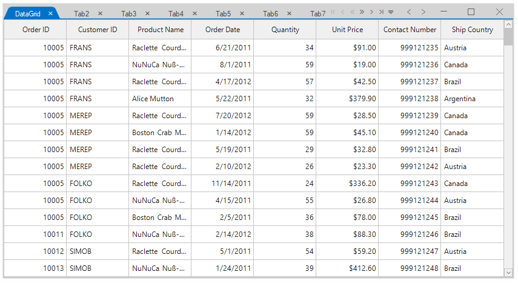
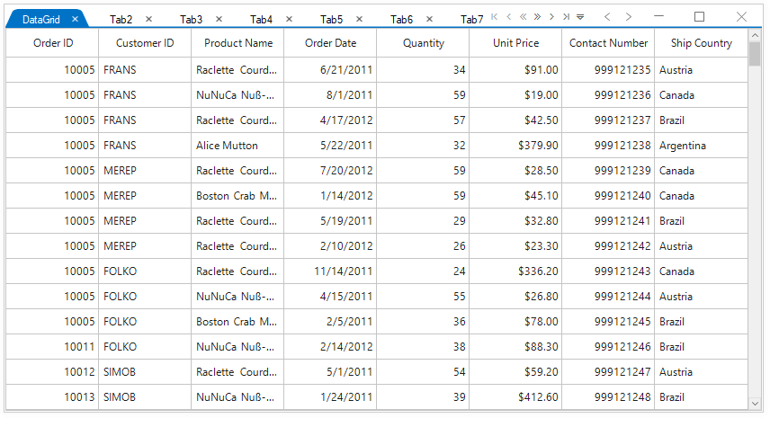
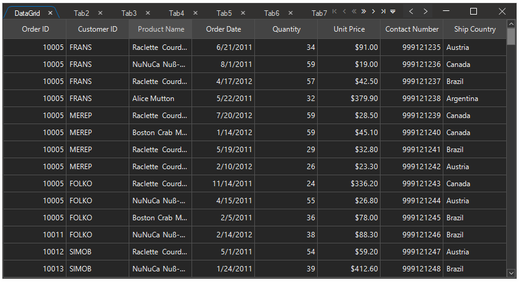
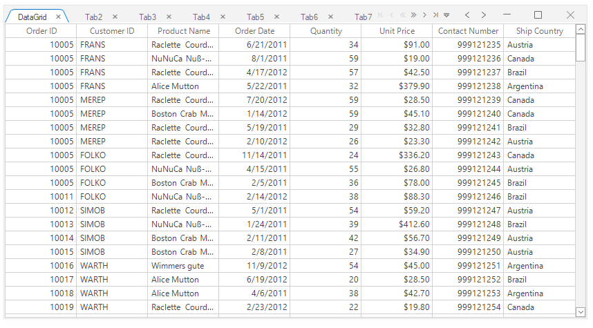
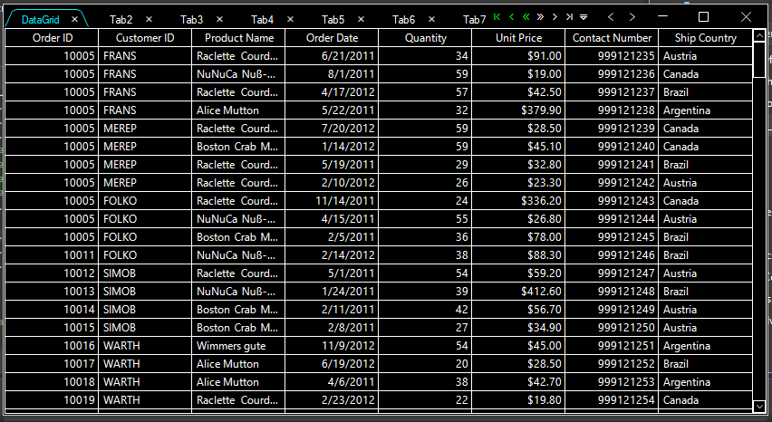

# Themes in Windows Forms Tabbed Form (SfTabbedForm)

[Windows Forms Tabbed Form](https://www.syncfusion.com/winforms-ui-controls/tabbed-form) (SfTabbedForm) offers the following built-in themes for professional representation:

* Office2016Colorful
* Office2016White
* Office2016DarkGray
* Office2016Black
* Office2019Colorful
* HighContrastBlack

Themes can be applied to `SfTabbedForm` by following these steps:

* `Load theme assembly`
* `Overriding theme style`
* `Apply theme`
* `Apply theme to entire application`

## Load theme assembly

To set theme to `SfTabbedForm`, the following assemblies should be added as reference in any application.

<table>
<tr>
<td>
{{'**Assemblies**'| markdownify }}
</td>
<td>
{{'        **Themes**'| markdownify }}
</td>
</tr>
<tr>
<td>
Syncfusion.Office2016Theme.WinForms       
</td>
<td>
Office2016Colorful 
Office2016White 
Office2016DarkGray 
Office2016Black
</td>
</tr>
<tr>
<td>
Syncfusion.Office2019Theme.WinForms
</td>
<td>
Office2019Colorful
</td>
</tr>
<tr>
<td>
Syncfusion.HighContrastTheme.WinForms
</td>
<td>
HighContrastBlack
</td>
</tr>
</table>

Before applying theme to `SfTabbedForm`, required theme assembly should be loaded.



using Syncfusion.WinForms.Controls;

static class Program
{
    /// 

    /// The main entry point for an application.
    /// 

    [STAThread]
    static void Main()
    {
        Syncfusion.Licensing.SyncfusionLicenseProvider.RegisterLicense(DemoCommon.FindLicenseKey());
        SfSkinManager.LoadAssembly(typeof(Syncfusion.WinForms.Themes.Office2016Theme).Assembly);
        SfSkinManager.LoadAssembly(typeof(Syncfusion.WinForms.Themes.Office2019Theme).Assembly);
        SfSkinManager.LoadAssembly(typeof(Syncfusion.HighContrastTheme.WinForms.HighContrastTheme).Assembly);
        Application.EnableVisualStyles();
        Application.SetCompatibleTextRenderingDefault(false);
        Application.Run(new Form1());
    }
}


Imports Syncfusion.WinForms.Controls

Friend NotInheritable Class Program
	''' 

	''' The main entry point for the application.
	''' 

	Private Sub New()
	End Sub
	<STAThread>
	Shared Sub Main()
		Syncfusion.Licensing.SyncfusionLicenseProvider.RegisterLicense(DemoCommon.FindLicenseKey())
		SfSkinManager.LoadAssembly(GetType(Syncfusion.WinForms.Themes.Office2016Theme).Assembly)
		SfSkinManager.LoadAssembly(GetType(Syncfusion.WinForms.Themes.Office2019Theme).Assembly)
		SfSkinManager.LoadAssembly(GetType(Syncfusion.HighContrastTheme.WinForms.HighContrastTheme).Assembly)
		Application.EnableVisualStyles()
		Application.SetCompatibleTextRenderingDefault(False)
		Application.Run(New Form1())
	End Sub
End Class



## Overriding theme style

By default, the appearance customization settings done at the control level will not be overridden by the theme. To allow the theme to override these customizations, set the [CanOverrideStyle](https://help.syncfusion.com/cr/windowsforms/Syncfusion.WinForms.Controls.SfTabbedForm.html#Syncfusion_WinForms_Controls_SfTabbedForm_CanOverrideStyle) property to `true`.



 CanOverrideStyle = true;
 this.ThemeName = "Office2019Colorful";


 CanOverrideStyle = True
 Me.ThemeName = "Office2019Colorful"



## Apply theme

The appearance of `SfTabbedForm` can be changed using [ThemeName](https://help.syncfusion.com/cr/windowsforms/Syncfusion.WinForms.Controls.SfTabbedForm.html#Syncfusion_WinForms_Controls_SfTabbedForm_ThemeName) of `SfTabbedForm`.

### Office2016Colorful

This option helps to set the Office2016Colorful theme.



 this.ThemeName = "Office2016Colorful";


 Me.ThemeName = "Office2016Colorful"



### Office2016White

This option helps to set the Office2016White theme.



 this.ThemeName = "Office2016White";


 Me.ThemeName = "Office2016White"



### Office2016DarkGray

This option helps to set the Office2016DarkGray theme.



 this.ThemeName = "Office2016DarkGray";


 Me.ThemeName = "Office2016DarkGray"



### Office2016Black

This option helps to set the Office2016Black theme.



 this.ThemeName = "Office2016Black";


 Me.ThemeName = "Office2016Black"



### Office2019Colorful

This option helps to set the Office2019Colorful theme.



 this.ThemeName = "Office2019Colorful";


 Me.ThemeName = "Office2019Colorful"



### HighContrastBlack

This option helps to set the HighContrastBlack theme.



 this.ThemeName = "HighContrastBlack";


 Me.ThemeName = "HighContrastBlack"



## Apply theme to entire application

Skin manager allows to apply theme for all the controls and forms in an application by setting the [ApplicationVisualTheme](https://help.syncfusion.com/cr/windowsforms/Syncfusion.Windows.Forms.SkinManager.html#Syncfusion_Windows_Forms_SkinManager_ApplicationVisualTheme) property. It allows you to theme entire application using single `ApplicationVisualTheme` property. 




static void Main() 
{ 
    SfSkinManager.ApplicationVisualTheme = "Office2019Colorful";
    Application.EnableVisualStyles(); 
    Application.SetCompatibleTextRenderingDefault(false); 
    Application.Run(new Form1()); 
} 




N> Set the `ApplicationVisualTheme` property before main form is initialized.
