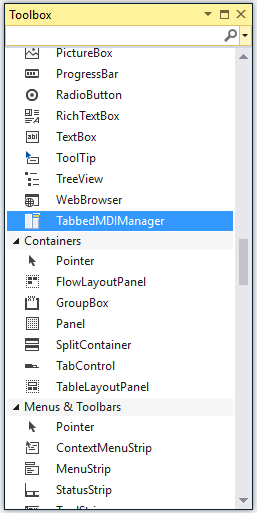

# Getting started

This section explains how to design a `TabbedMDIManager` control in a Windows Forms application and overview of its basic functionalities.

## Assembly deployment

The following list of assemblies should be added as reference to use the TabbedMDIManager in any application:

<table>
<tr>
<td>
{{'**Required assemblies**'| markdownify }}
</td>
<td>
{{'**Description**'| markdownify }}
</td>
</tr>
<tr>
<td>
Syncfusion.Grid.Base.dll
</td>
<td>
Syncfusion.Grid.Base contains classes that contains fundamentals and base classes of GridControl
</td>
</tr>
<tr>
<td>
Syncfusion.Grid.Windows.dll
</td>
<td>
Syncfusion.Grid.Windows contains classes that handles all UI operations, fundamentals and base classes of GridControl which are used in the TabbedMDIManager control
</td>
</tr>
<tr>
<td>
Syncfusion.Shared.Base.dll
</td>
<td>
Syncfusion.Shared.Base contains style related properties of TabbedMDIManager and various editor controls
</td>
</tr>
<tr>
<td>
Syncfusion.Shared.Windows.dll
</td>
<td>
Syncfusion.Shared.Windows contains style related properties of TabbedMDIManager and various editor controls
</td>
</tr>
<tr>
<td>
Syncfusion.Tools.Base.dll
</td>
<td>
Syncfusion.Tools.Base contains base class which used for TabbedMDIManager control
</td>
</tr>
<tr>
<td>
Syncfusion.Tools.Windows.dll
</td>
<td>
Syncfusion.Tools.Windows contains the class that handles all UI operations and contains helper class of TabbedMDIManager control
</td>
</tr>
</table>

## Installing NuGet Packages

To create the Windows Forms application with TabbedMDIManager, the following nuget packages should be installed.

<table>
<tr>
<td>{{'**S.no**'| markdownify }}
</td>
<td>{{'**Framework version**'| markdownify }}
</td>
<td>{{'**NuGet Packages**'| markdownify }}
</td>
</tr>
<tr>
<td> 1
</td>
<td> 2.0
</td>
<td> Syncfusion.Tools.Windows20
</td>
</tr>
<tr>
<td> 2
</td>
<td> 3.5
</td>
<td> Syncfusion.Tools.Windows35
</td>
</tr>
<tr>
<td> 3
</td>
<td> 4.0
</td>
<td> Syncfusion.Tools.Windows40
</td>
</tr>
<tr>
<td> 4
</td>
<td> 4.5
</td>
<td> Syncfusion.Tools.Windows45
</td>
</tr>
<tr>
<td> 5
</td>
<td> 4.5.1
</td>
<td> Syncfusion.Tools.Windows451
</td>
</tr>
<tr>
<td> 6
</td>
<td> 4.6
</td>
<td> Syncfusion.Tools.Windows46
</td>
</tr>
</table>

Please find more details regarding how to install the nuget packages in windows form application in the below link:

[How to install nuget packages](https://help.syncfusion.com/windowsforms/nuget-packages)

# Creating simple application with TabbedMDIManager

You can create the Windows Forms application with TabbedMDIManager control as follows:

1. [Creating the project](#creating-the-project)
2. [Adding control via designer](#adding-control-via-designer)
3. [Adding control manually in code](#adding-control-manually-in-code)
4. [Add Form as Tabbed MDI child](#add-form-as-tabbed-mdi-child)
5. [Create tab group](#create-tab-group)

### Creating the project

Create a new Windows Forms project in the Visual Studio to display the TabbedMDIManager.

## Adding control via designer

The TabbedMDIManager control can be added to the application by dragging it from the toolbox and dropping it in a designer view. The following required assembly references will be added automatically:

   * Syncfusion.Grid.Base.dll
   * Syncfusion.Grid.Windows.dll
   * Syncfusion.Shared.Base.dll
   * Syncfusion.Shared.Windows.dll
   * Syncfusion.Tools.Base.dll
   * Syncfusion.Tools.Windows.dll

As soon as the control is dropped, the Form1’s `IsMDIContainer` property will be set to `true` and it changes to an MDIContainer. Also, the `AttachedTo` property of the TabbedMDIManager will be set to Form1.

 
## Adding control manually in code

To add control manually in C#, follow the given steps:

**Step1:** Add the following required assembly references to the project:

   * Syncfusion.Grid.Base.dll
   * Syncfusion.Grid.Windows.dll
   * Syncfusion.Shared.Base.dll
   * Syncfusion.Shared.Windows.dll
   * Syncfusion.Tools.Base.dll
   * Syncfusion.Tools.Windows.dll

**Step2:** Include the namespaces **Syncfusion.Windows.Forms.Tools**.





using Syncfusion.Windows.Forms.Tools;





Imports Syncfusion.Windows.Forms.Tools





**Step3:** Create the TabbedMDIManager control instance. 





TabbedMDIManager tabbedMDIManager = new TabbedMDIManager();





Dim tabbedMDIManager As TabbedMDIManager = New TabbedMDIManager()





## Add Form as Tabbed MDI child

We can attach the `Form1` to TabbedMDIManager container by using its `AttachToMdiContainer` function. Make sure whether the `IsMdIContainer` property of Form1 is set to `true`. Now the TabbedMDI mode will be turned on and any new MDIChildren created will be grouped as Tabs. Then, create a new Form and displays it in Form1.





this.IsMdiContainer = true;

// Use `AttachToMdiContainer` function only when `AttachedTo` property of TabbedMDIManager is not set to Form1. 

this.tabbedMDIManager.AttachToMdiContainer(this);

this.tabbedMDIManager.TabStyle = typeof(Syncfusion.Windows.Forms.Tools.TabRendererOffice2016Colorful);

Form form = new Form();

form.MdiParent = this;

form.Text = "Tab1";

form.Show();





Me.IsMdiContainer = True

' Use `AttachToMdiContainer` function only when `AttachedTo` property of TabbedMDIManager is not set to Form1. 

Me.tabbedMDIManager.AttachToMdiContainer(Me)

Me.tabbedMDIManager.TabStyle = GetType(Syncfusion.Windows.Forms.Tools.TabRendererOffice2016Colorful)

Dim form As Form = New Form

form.MdiParent = Me

form.Text = "Tab1"

form.Show()





The following screenshot illustrates new form will be tabbed inside form1.

## Create tab group

The `TabbedMDIManager` provides support to create a tab group horizontally or vertically.

`CreateNewHorizontalGroup` function helps to create a new tab group horizontally in TabbedMDIManager. 





Form form = new Form();

form.MdiParent = this;

form.Text = "Tab1";

form.Show();

Form form1 = new Form();

form1.MdiParent = this;

form1.Text = "Tab2";

form1.Show();

this.tabbedMDIManager.CreateNewHorizontalGroup();





Dim form As Form = New Form

form.MdiParent = Me

form.Text = "Tab1"

form.Show()

Dim form1 As Form = New Form

form1.MdiParent = Me

form1.Text = "Tab2"

form1.Show()

Me.tabbedMDIManager.CreateNewHorizontalGroup()





`CreateNewVerticalGroup` function helps to create a new tab group vertically in TabbedMDIManager. 





Form form = new Form();

form.MdiParent = this;

form.Text = "Tab1";

form.Show();

Form form1 = new Form();

form1.MdiParent = this;

form1.Text = "Tab2";

form1.Show();

this.tabbedMDIManager.CreateNewVerticalGroup();





Dim form As Form = New Form

form.MdiParent = Me

form.Text = "Tab1"

form.Show()

Dim form1 As Form = New Form

form1.MdiParent = Me

form1.Text = "Tab2"

form1.Show()

Me.tabbedMDIManager.CreateNewVerticalGroup()





